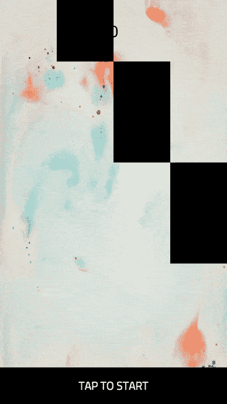
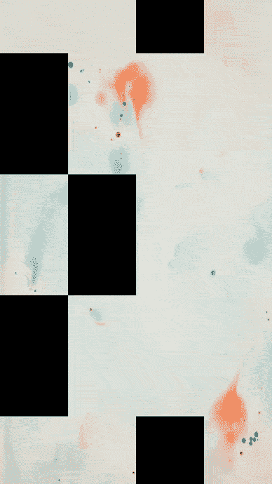
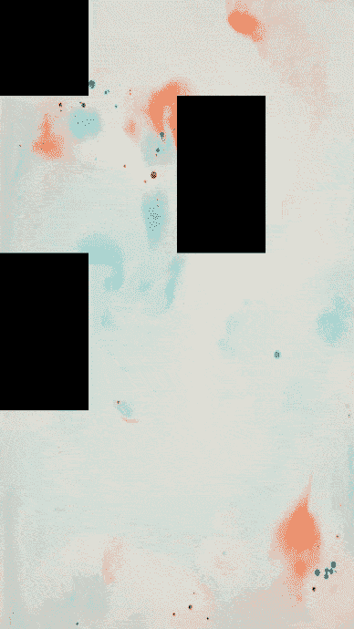
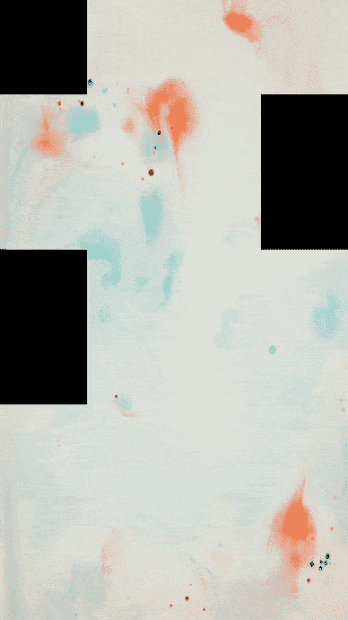

# 用 Unity 制作钢琴瓦

> 原文：<https://levelup.gitconnected.com/making-piano-tiles-with-unity-5d4dc720889c>

这些类型的游戏非常受欢迎:

玩家点击从屏幕顶部出现的方块，如上面的 GIF 所示。每次点击都会播放特定歌曲的一小段，并增加分数。当一个音符被允许到达屏幕底部，或者在屏幕上某个不是音符的地方被点击时，播放器就会失败。

# 用于此项目的包

*   [UniRx](https://github.com/neuecc/UniRx) —用于反应式编程以及游戏数据模型和表示层之间的清晰分离。

# 生成注释

我们用一个`GameController`脚本在场景中创建了一个`GameController`游戏对象(以实现 singleton game manager 模式)。

在`SetDataForNoteGeneration()`方法中，我们用创建注释的数据初始化了一些变量。纸币的高度是屏幕高度的四分之一(宽度也是如此)。我们还计算了注释在最左边一列的垂直位置(`noteSpawnStartPosX`)，因此我们可以操作这个值来为其他列创建注释。

`SpawnNotes()`方法是音符实际被创建的地方。我们创建一个变量(`noteSpawnStartPosY`)，用来为新行中产生的注释设置垂直位置。`lastSpawnedNote`是一个序列化字段，它被设置为我们在场景中创建的游戏对象。我们使用这个对象来直观地确定初始音符组的垂直位置。在`GetRandomIndex()`方法中，我们生成一个随机数来为每个可见的衍生注释设置列。`while`循环确保没有两个连续的音符在同一列。

正如您在`SpawnNotes()`的内部`for`循环中看到的，我们实际上为每行生成了四个音符。一组中的四个音符的垂直位置是相同的，但是水平位置根据音符的列而改变。基于我们从`GetRandomIndex()`获得的值，我们在每行中只显示一个音符。

我们在编辑器中分配给`notePrefab`的预设对象有一个附加的`Note`组件脚本，所以我们创建的每个注释也有这个脚本。为了使每行中只有一个注释可见，我们设置了一个在这个脚本中创建的`Visible`属性。我们来看看`Note.cs`:

我们在场景中创建了一个不可见的对象，并在将它放在摄像机上方之后，给它附加了一个`SpawnNotesTrigger`脚本。

我们一次产生一组 20 个音符。当最近产生的集合的第 20 个音符达到`SpawnNotesTrigger`时，我们产生另一个集合。

# 检测抽头

我们在`GameController.cs`使用 2D 射线检测笔记被敲击的时间。

当我们的玩家点击一个可见的音符时，我们播放一个彩色动画，以表明它已经被播放过了。如果纸条是看不见的，那么我们播放不同颜色的动画并结束游戏。游戏结束时音符停止移动。

# 检测未敲击的音符何时将要离开屏幕

当用户没有点击的笔记将要离开屏幕时，我们结束游戏:

为此，我们在场景中创建了另一个不可见的游戏对象(`OutOfScreenTrigger`)并放在摄像机的正下方，我们给它附加了一个脚本`OutOfScreenTrigger.cs`。

一个笔记只会在它即将离开屏幕时遇到这个对象，此时我们会检查它对玩家是否仍然可见，是否还没有被点击，如果是，我们就结束游戏。

# 确保音符的拍子顺序

我们还需要确保一个可见的音符只有在它之前的所有音符都被演奏过之后才能被演奏。我们通过在`GameController.cs`中根据演奏顺序给所有音符分配一个 ID 来实现这个目的。当一个音符被敲击时，我们使用 ID 的值来检查最近弹奏的音符是否出现在被敲击的音符之前。

# 播放音乐

现在是时候让一首歌曲在一个音符被轻敲时播放了。为此，首先，我们在场景中创建一个新的游戏对象，并为其附加一个`Audio Source`组件。我们将`AudioClip`设置为我们想要在每个音符被敲击时分段播放的歌曲。在这个项目中，使用了托弗·莫尔和亚历克斯·埃莱娜的*小时数*——从 YouTube 音频库中获得。

当一个音符被轻敲时，我们播放歌曲很短的时间(这里是 0.8 秒)，然后暂停播放，直到下一个音符被轻敲。

在`GameController.SpawnNotes()`中，我们使用当前的歌曲播放位置来决定接下来要产生多少音符。例如，如果歌曲长度为 300 秒，回放位置在 295 秒，那么我们将只有 5 秒的音符可以播放。

# 在 GitHub 上获得完整的源代码

本文展示了这类游戏背后的核心逻辑。你可以在 [GitHub](https://github.com/tariibaba/Piano-Tiles) 上获得该项目的完整源代码。

对这篇文章有什么想法吗？请在下面的评论中留下您的反馈。