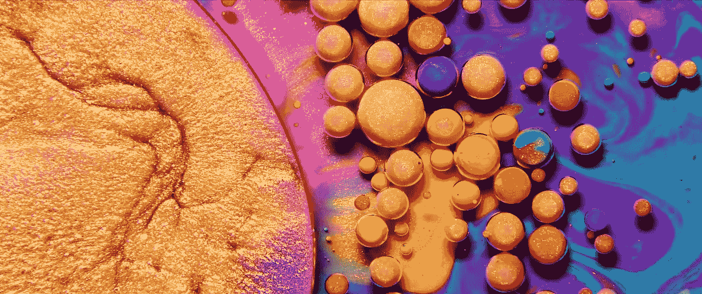

# 理解 React 内联样式

> 原文：<https://levelup.gitconnected.com/making-sense-of-react-inline-styles-f521d9c511b3>



托马斯·布兰查德的《色彩》

## React 内联样式通常不是在 react 项目中使用 CSS 的首选解决方案。有正当理由。但是在某些情况下，作为开发人员，我们只需要适应涉众的决定。

首先，明确声明:我是 SCSS 和 CSS 模块的忠实粉丝，这是比内嵌样式更快更强大的解决方案。在使用内联样式之前，您还应该尝试其他解决方案，比如 StyledComponents、CSS-in-JS。我决定写这篇文章给所有需要使用内联样式并且不能/不想使用其他提到的解决方案的人。如果你想回顾值得一提的 react 组件样式选项，你可以查看 Sitepoint 上的这篇文章和 Freecodecamp 上的这篇文章。

已经有很多有效的观点表明 react 内联风格不是一个好主意。不支持 CSS 选择器，例如“:悬停”、“活动”、“焦点”、“之前”和“之后”、媒体查询，也不支持 SCSS 语法。

有什么优势吗？其中几个:

*   这是一个快速的解决方案，
*   我们的项目中不需要安装额外的包，
*   不需要 CSS 文件存储样式，
*   我们可以自由地使用 react state 来从中派生样式，
*   不需要使用类。

React 内联样式的一个简单示例:

```
function Button() {    
 return (
  <div
    style={{
      borderRadius: '6px',
      border: '1px solid',
      borderColor: 'red',
      color: 'red,
      padding: '8px 16px', 
    }}
    onClick={(e) => handleClick(e)}>
    Click Me
  </div>
)
```

我们立刻发现大部分代码都是 css 样式的。我们很想使用`className`并将代码转移到 CSS/SCSS/Less 文件中。

```
export function Button() {    
 return (
  <div
    className="button"
    onClick={handleClick}>
    Click Me
  </div>
)
```

这确实要清楚得多，但这是我们的要求所禁止的。让我们做点别的吧。将样式提取为单独的对象:

```
const buttonStyle = {
  borderRadius: '6px',
  border: '1px solid',
  borderColor: 'red',
  color: 'red,
  padding: '8px 16px', 
};export function Button() {    
 return (
  <div
    style={buttonStyle}
    onClick={handleClick}>
    Click Me
  </div>
)
```

好了，我们去掉了组件的冗长性。我们如何在这样的对象中使用组件状态？一点用都没有。

我们可以将`buttonStyle`提升到一个返回对象的函数，并将相关的组件状态作为参数传递给它:

```
const buttonStyle = **({hover}) => (**{
  borderRadius: '6px',
  border: '1px solid',
  borderColor: **hover** ? 'black' : 'red',
  color: **hover** ? 'black': 'red',
  padding: '8px 16px', 
}**)**export function Button() {
 **const [hover, setHover] = useState(false);**    
 return (
  <div
    style={buttonStyle**({hover})**}
 **onPointerOver={()=> setHover(true)}
    onPointerOut={() => setHover(false)}**
    onClick={handleClick}
  >
    Click Me
  </div>
)
```

这里发生了什么？我们引入了按钮组件的一些与样式相关的状态— `hover`，并在`onPointerOver`和`onPointerOut`事件中改变了这个状态。这模拟 CSS `:hover`选择器。

我们可以用同样的方法来模拟`:focus`和`:active`选择器:

```
const buttonStyle = ({hover, **focus, active** }) => ({
  borderRadius: '6px',
  border: '1px solid',
  borderColor: hover ? 'black' : 'red',
  color: hover ? 'black': 'red',
  padding: '8px 16px', 
}**)**export function Button() {
 const [hover, setHover] = useState(false); **const [focus, setFocus] = useState(false);
 const [active, setActive] = useState(false);**  

 return (
  <div
    style={buttonStyle({hover, **focus, active**})}
    tabIndex="0"
    onPointerOver={()=> setHover(true)}
    onPointerOut={() => setHover(false)} **onFocus={()=> setFocus(true)}
    onBlur={() => setFocus(false)}
    onPointerDown={()=> setActive(true)}
    onPointerUp={() => setActive(false)}** onClick={handleClick}
  >
    Click Me
  </div>
)
```

这需要大量的新代码，更重要的是，组件的每次重新渲染都会调用`buttonStyle`函数。因为我们很可能会将更多的状态和其他属性传递给按钮，这是一个很大的禁忌。另外一个问题是如何用新的选择器设置 css 属性，我们需要很多嵌套的“if”来在样式函数中正确处理这个问题。

一旦我们开始添加其他不影响风格的按钮状态，我们会很快被我们所做的一切弄得发疯。

我们如何解决这个问题？

理想情况下，我们希望为组件保留一个样式函数，然后将它包含在组件的状态中。我们可以用定制的钩子来做。姑且称之为`useInlineStyle`。我们的钩子将接受样式函数和其他一些我们想在样式函数中使用的道具。

```
const initialState = {
  hover: false,
  focus: false,
  active: false
}function useInlineStyle(stylingFn, props) {
  const [styleState, dispatch] = useReducer(reducer, initialState); const style = useMemo(() => { 
    return stylingFn(styleState, props)
  }, [stylingFn, styleState, props); const setStyle = (type, value) => dispatch({type, value});

  return [style, setStyle];}function reducer(state, action) {
  switch(action.type) {
    case 'hover': return { ...state, hover: action.value }
    case 'focus': return { ...state, focus: action.value }
    case 'active': return { ...state, active: action.value }
    default: return state; }}
```

并在我们的按钮中使用它:

```
const buttonStyle = (state, props) => ({
  borderRadius: '6px',
  border: '1px solid',
  borderColor: state.hover ? 'black' : 'red',
  color: state.hover ? 'black': 'red',
  padding: '8px 16px', 
  width: props.isMobile ? '90%' : '200px'
}**)**export function Button({ busy, isMobile }) {
 const [style, setStyle] = useInlineStyle(
   buttonStyle, { busy, isMobile }
 );   return (
  <button
    style={style}
    onPointerOver={()=> setStyle('hover', true)}
    onPointerOut={() => setStyle('hover', false)}    onFocus={()=> setStyle('focus', true)}
    onBlur={() => setStyle('focus', false)}
    onPointerDown={()=> setStyle('active', true)}
    onPointerUp={() => setStyle('active', false)}onClick={handleClick}
  >
    Click Me
  </button>
)
```

钩子负责生成样式，但是我们仍然需要手动将`setStyle`附加到指针事件上。我们可以把它移到钩子上，为按钮提供一个`ref`，并在`useEffect`中处理事件监听器，这样会更好。

```
function useInlineStyle(styleFn, props) {
  **const ref = useRef(null);** 
  const [styleState, dispatch] = useReducer(
    styleReducer, initialState); const setStyle = (type, value) => dispatch({ type, value }) const style = useMemo(
    () => styleFn(styleState, props), 
    [styleFn, styleState, props]
  ); **useEffect(() => {
    let el;** **const pointerOver = () => setStyle("hover", true);
    const pointerOut = () => setStyle("hover", false);
    const focus = () => setStyle("focus", true);
    const blur = () => setStyle("focus", false);
    const pointerDown = () => setStyle("active", true);
    const pointerUp = () => setStyle("active", false);** **if(ref.current) {
      el = ref.current;
      el.addEventListener('pointerover', pointerOver)
      el.addEventListener('pointerout', pointerOut)
      el.addEventListener('focus', focus)
      el.addEventListener('blur', blur)
      el.addEventListener('pointerdown', pointerDown)
      el.addEventListener('pointerup', pointerUp)
    }** **return () => {
      el.removeEventListener('pointerover', pointerOver)
      el.removeEventListener('pointerout', pointerOut)
      el.removeEventListener('focus', focus) 
      el.removeEventListener('blur', blur) 
      el.removeEventListener('pointerdown', pointerDown)
      el.removeEventListener('pointerup', pointerUp)
    }
  }, [ref, setStyle])** **return [ref, style];**}
```

现在我们只需要将`ref`从钩子传递给我们的组件。不需要手动使用`setStyle`。

```
const buttonStyle = (state, props) => ({
  borderRadius: '6px',
  border: '1px solid',
  borderColor: state.hover ? 'black' : 'red',
  color: state.hover ? 'black': 'red',
  padding: '8px 16px', 
  width: props.isMobile ? '90%' : '200px'
}**)**export function Button({ isMobile }) {
 const **[buttonRef, style]** = useInlineStyle(
   buttonStyle, { isMobile }
 ); 

 return (
   <div
    **ref={buttonRef}**
    style={style}onClick={handleClick}
   >
    Click Me
   </div>
);
```

这个按钮看起来干净多了，我们可以像`onPointerUp`一样将自定义代码附加到事件监听器上，而不用担心样式。

到目前为止，为了简洁起见，我们对按钮使用了最少的样式。在真实情况下，当用户按压、聚焦或特定道具改变时，我们的`buttonStyle`将显著增长以处理样式。如前所述，这将使我们的造型功能变得丑陋。

为了减轻这种情况，我们可以添加一个`buttonTheme`对象，在其中存储按钮样式的所有变量和规则。我们将在样式功能中使用该主题。以下是主题和挂钩的示例:

```
const theme = {
  borderColor: {
    default: 'black',
    hover: 'red',
    active: 'blue',
    focus: 'blue',
  },
  color: {
    default: 'black',
    hover: 'white',
    active: 'white',
    focus: 'blue',
  },
  backgroundColor: {
   default: 'white',
   hover: 'red',
   active: 'navy',
   focus: 'white',
  },
  getColor(prop, { hover, focus, active }) {
    const v = this[prop];
    if (active) return v['active'];
    if (focus && !hover) return v['focus'];
    if (hover) return v['hover'];
    return v['default'];
  }};function getButtonStyle(state, props) {
  return {
    outline: "none",
    userSelect: "none",
    textAlign: "center",
    borderRadius: "8px",
    border: "1px solid",
    padding: "8px 12px",
    cursor: "pointer",
    transition: "0.3s all",
    borderColor: theme.getColor("borderColor", state),
    color: theme.getColor("color", state),
    backgroundColor: theme.getColor("backgroundColor", state),
    width: props.isMobile ? "90%" : "200px",
  };
} function Button({ children, isMobile, onClick }) {
  const [buttonRef, buttonStyle] = useInlineStyle(
    getButtonStyle, { isMobile }
  ); return (
    <div
      tabIndex="0"
      ref={buttonRef}
      style={buttonStyle}
      onPointerOver={() => console.log("over")}
      onClick={onClick}>{children}
    </div>
  );}
```

[code sandbox 上的完整代码和工作示例](https://codesandbox.io/s/wispy-leaf-khttu?file=/src/Button.js)

# 感谢阅读！

你认为解决方案怎么样？你在你的项目中使用内联样式吗？如果是，怎么做？如果不是，你喜欢的组件样式是什么？请在评论中告诉我！