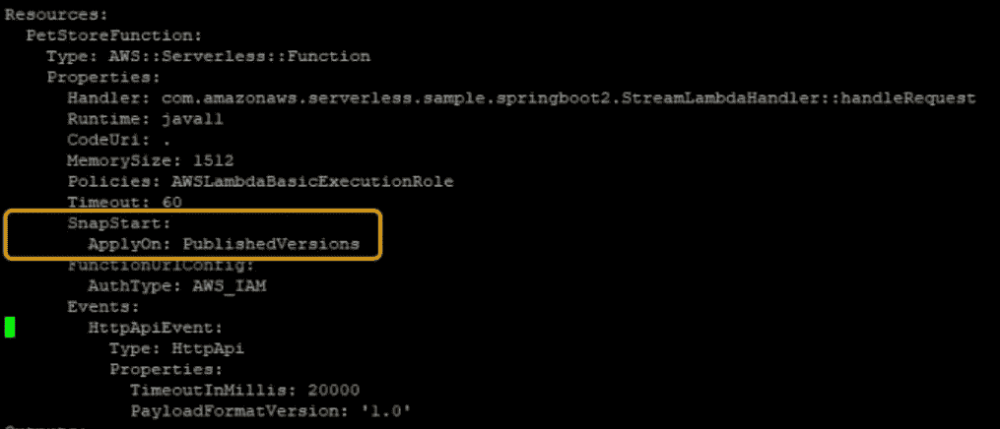
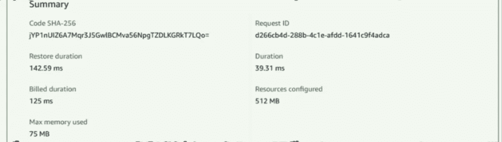

# 让位于 Spring Boot 夸尔库斯的兰姆达斯快了 10 倍

> 原文：<https://levelup.gitconnected.com/making-spring-boot-quarkus-based-lambdas-10-times-faster-876bdd06c869>

照片由 [Sammy Wong](https://unsplash.com/@vr2ysl?utm_source=medium&utm_medium=referral) 在 [Unsplash](https://unsplash.com?utm_source=medium&utm_medium=referral) 上拍摄

如果您正在使用 Lambdas，那么您已经知道您的函数运行在一个隔离的执行环境中。每个环境的[生命周期](https://docs.aws.amazon.com/lambda/latest/dg/lambda-runtime-environment.html#runtimes-lifecycle)由三个主要阶段组成:`Init`、`Invoke`和`Shutdown`。

除此之外，`Init`阶段引导函数的[运行时](https://docs.aws.amazon.com/lambda/latest/dg/lambda-runtimes.html)并运行函数的静态代码。在许多情况下，这些操作可以在几毫秒内完成，但有时却需要相当长的时间，原因有几个。首先，为某些语言初始化运行时可能会很昂贵。例如，一个 Lambda 函数的`Init`阶段结合使用了一个 Java 运行时和一个框架，比如 [Spring Boot](https://spring.io/projects/spring-boot) 、[夸尔库斯](https://quarkus.io/)或 [Micronaut](https://micronaut.io/) ，这个阶段有时会长达十秒钟。此外，静态代码可能会预先计算一些参考数据，或者建立到其他 AWS 服务的网络连接。

这现在可以通过“Lambda SnapStart”轻松解决

# **Lambda SnapStart**

启用 Lambda 后，SnapStart 将触发一个优化过程。该流程启动您的功能，并在整个`Init`阶段运行它。然后，它获取内存和磁盘状态的不可变的加密快照，并缓存它以供重用。当随后调用这个函数时，根据需要从缓存中以块的形式检索状态，并用于填充执行环境。这种优化使得调用时间更快、更可预测，因为创建新的执行环境不再需要专门的`Init`阶段。

为了利用这些特性，Java 函数运行时应该是 Corretto ( `java11`)，并且您可以看到 Lambda SnapStart 立即被应用于使用 Spring Boot、Quarkus、Micronaut 和其他 Java 框架的应用程序。启用 Java 函数的 **SnapStart** 可以使它们的启动速度**快 10 倍。**

**使用 Lambda 快照启动:**

使用来自[AWS 实验室](https://github.com/awslabs/aws-serverless-java-container/tree/main/samples/springboot2/pet-store)回购的简单示例[无服务器 Spring Boot 2 示例](https://github.com/awslabs/aws-serverless-java-container/tree/main/samples/springboot2/pet-store)作为起点。我们可以看到被调用的函数看到 Init 持续时间略多于 6 秒:

然后我在`template.yml`中添加了两行来配置`SnapStart`属性:

重新构建和重新部署，发布了一个新版本的函数来设置 SnapStart，结果如下

使用 SnapStart，初始化阶段发生在函数的新版本发布时。当启用了 SnapStart 的函数调用它时，Lambda 会在调用函数处理程序之前恢复快照。因此，冷启动持续时间从超过 6 秒减少到不到 200 毫秒。

**弹性:**

使用 Lambda SnapStart 对您的代码有一些影响:

**唯一性** —使用 SnapStart 时，任何在初始化期间生成的唯一内容现在都必须在初始化后生成，以保持唯一性。如果您使用伪随机数生成器，它不应该基于在 Init 阶段获得的种子。

**网络连接**-如果代码在`Init`阶段创建了与网络服务的长期连接，并在`Invoke`阶段使用它们，则有必要检查是否可以重新建立连接，并尝试重新建立连接。

**缓存** —缓存的快照在 14 天不活动后被删除。如果快照依赖于已经更新或修补的运行时，Lambda 将自动刷新缓存。