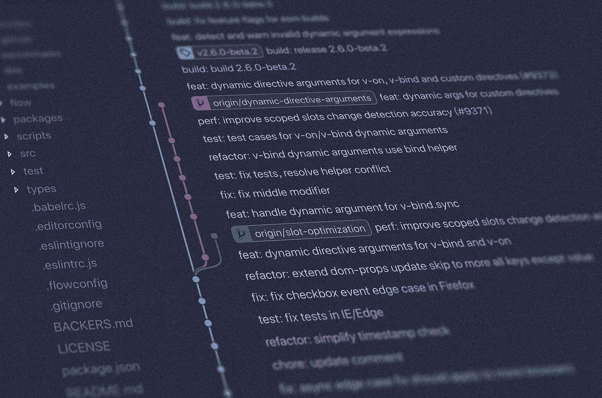

# 做出完美的承诺

> 原文：<https://levelup.gitconnected.com/making-the-perfect-commit-b2d98e82bf48>

进行完美提交时要记住的几点



照片由[扬西·敏](https://unsplash.com/ja/@yancymin?utm_source=medium&utm_medium=referral)在 [Unsplash](https://unsplash.com?utm_source=medium&utm_medium=referral) 上拍摄

作为一名开发人员，您可能有一天会思考“完美的提交看起来像什么？”

如果是，那么这篇文章就是给你的！

请记住，这些仅仅是我的观点。这些可能因开发者而异。这里的最终目标是能够提高生产力，使变更管理更加有效和容易。

说到这里，让我们开始吧！

# 完美提交的特征

根据我的观点，以下是完美提交的特征:

1.  一个单一的重点变化。
2.  添加/更新了必要时详细阐述实施的注释。
3.  增加/更新了解释变更的文档。
4.  确保引入的变更正常运行的相关测试。
5.  一个小而恰当的提交消息。提交消息必须链接到问题/票据。
6.  它必须是一个稳定的、可以部署的单位。

在本文接下来的部分，我将说明如何确保尽可能遵循所有的步骤。

# 1.单一焦点变化

这里所说的“改变”可以是任何东西，从一个 bug 的修复，到一个特性的实现或者一个打字错误的纠正。不管它是什么，你必须确保已经被改变/新添加/删除的东西都与那个改变直接一致。

与当前变更无关的额外变更不得添加到提交中。

这里的目标是能够实现一些可以实现的事情

1.  通过 [*git 责备*](https://git-scm.com/docs/git-blame) 或 [*git 平分*](https://git-scm.com/docs/git-blame) ，在 PRs 中轻松地进行原子式审查
2.  如果情况需要，可以使用 [*git 回复*](https://git-scm.com/docs/git-revert) 轻松回复
3.  轻易地将 [*樱桃摘下*](https://git-scm.com/docs/git-cherry-pick) 放到其他树枝上

一个人可以通过了解

1.  什么不能犯。项目必须有一个[。gitignore](https://www.atlassian.com/git/tutorials/saving-changes/gitignore) 文件。
2.  如何存放提交的特定文件
3.  如何为提交准备文件的特定行，而不是整个文件(是的，这是可能的！借助 [*git add -p*](https://git-scm.com/docs/git-add#Documentation/git-add.txt--p)

一个人必须避免落入利用的陷阱

```
git add .
```

# 2.相关评论

最好的代码是不需要额外注释的代码。然而，随着应用程序的复杂性和规模的增长，我们必须避免落入使用的陷阱。我们不是唯一在代码库上工作的人，添加注释是必要的。

在代码中编写适当的注释时，有几点必须牢记在心

1.  不重复代码。这种评论因其多余而变得毫无用处。
2.  不要含糊。它们必须只有一种解释，并且不应留下任何疑问。
3.  消除混乱而不是引起混乱。
4.  必须提供在编写代码时使用的参考/原始源代码的链接。
5.  必须用于标记未完成的实现。

```
// TODO : Add fallback values for unavailable keys
```

6.必要时提供文档注释、功能注释和逻辑注释。

7.在编写注释时，使用适当的代码注释或标记。例如 Javascript 使用 [*JSDoc*](https://jsdoc.app/about-getting-started.html) 而 JAVA 使用*[*JavaDoc*](https://www.oracle.com/be/technical-resources/articles/java/javadoc-tool.html)*。**

*8.使用适当的扩展来提高生产力，例如[步长](https://marketplace.visualstudio.com/items?itemName=Stepsize.stepsize)或[更好的评论](https://marketplace.visualstudio.com/items?itemName=aaron-bond.better-comments)来改进问题和评论管理。*

*有关良好评论实践的更多信息，请参考 [*本*](https://stackoverflow.blog/2021/12/23/best-practices-for-writing-code-comments/) *。**

# *3.相关文件*

*一个完整的、明确的和精确的文档是开发者的朋友。必须确保不仅是正在编写的代码，而且相关的文档也同时得到更新和版本控制。*

*这也包括更新团队使用的邮递员集合、SLA 协议等。*

# *4.同时测试*

*测试驱动开发或简称为 TDD 是众所周知的开发实践。然而，你不能坚持认为这是做事的唯一方式。*

*测试的最终目标是确保添加的新东西不会破坏已经工作的东西。当测试企业级应用程序时，人们可能会发现手动测试所有可能的工作流是一项非常艰巨的任务。*

*因此，建议确保建立适当的测试框架，并在代码库发生变化时不断添加/更新测试。*

# *5.适当的提交消息*

*我们开发人员可能会发现自己正在努力解决的一件事是提出一个漂亮而简短的提交消息。我们中的一些人甚至试图在提交消息中解释变更的整个实现。然而，我想提出以下建议*

1.  *始终在您的提交消息中包含问题/票据编号。这有助于将变化与相应的任务联系起来。该问题/票据将包含*

*   *变更的进一步描述。*
*   *验证和/或重现问题的步骤。*
*   *一个对话链，解释什么使这种改变成为必要，以及在实施改变时所有的发现是什么。*
*   *结论以及为什么决定采用这种方法。*
*   *最后，证明已实施的变更是有效的。*

*让这个讨论远离提交消息给了我们尽可能描述的自由。而不是编写冗长的提交消息。始终瞄准一个只是作为标题。*

*2.遵循编写提交消息的标准。例如，我更喜欢我的提交消息的格式*

```
*git commit -m "<Issue-number>; <Message>"*
```

*该消息通常包括一个动作动词，如 fixed、implemented、resolved 等，它表示首先要做的是什么，然后是什么。*

*例子*

*   *"#53;将节点版本从 13.14.0 升级到 16.16.0 "*
*   *"#47, #69;修复了 react@18 的冲突对等依赖关系*
*   *"#12;已实施 RBAC”*
*   *"#13;回复#12 RBAC 实施"*

*这是我所遵循的。你的团队可能会提出他们自己的书写信息的标准。必须使用[常规提交](https://www.conventionalcommits.org/en/v1.0.0/#summary)或类似的标准化概念。对于这个点的补充解读可能是 [*这个*](https://dev.to/visuellverstehen/new-git-guidelines-we-have-switched-to-conventional-commits-1p0c) *。**

# *6.可部署的代码单元*

*这是要记住的最重要的事情之一。您做出的每个承诺都必须值得部署。永远不要提交中断的代码。*

*提交必须通过构建、静态代码分析、漏洞评估、基于团队格式化风格指南的统一格式化，并且必须通过团队实施的任何其他相关检查。可以使用 [husky](https://typicode.github.io/husky/#/) 设置预提交挂钩，以确保在提交之前运行检查，从而避免任何不正确的提交。*

*这些检查也可以在拉请求上执行，在拉请求中，除非所有检查都通过，否则不允许合并更改。*

*这是我见过的新开发人员最常犯的错误之一。因为这样或那样的原因，他们提交了一个不完整的变更。*

*万一你发现自己正处于做出改变的过程中，但必须紧急转移到另一项任务，那么请 [*保存*](https://git-scm.com/docs/git-stash) 你的改变，而不是提交不完整的改变。人们总是可以回到隐藏的变化，并继续工作。*

*我希望我能给你提供至少一条你以前不知道的有用信息。如果你对此有任何好的建议，请留下评论解释。我很乐意将它们包含在上面的文章中。*

**都是乡亲们！直到下一次*👋*

# *分级编码*

*感谢您成为我们社区的一员！在你离开之前:*

*   *👏为故事鼓掌，跟着作者走👉*
*   *📰查看[升级编码出版物](https://levelup.gitconnected.com/?utm_source=pub&utm_medium=post)中的更多内容*
*   *🔔关注我们:[Twitter](https://twitter.com/gitconnected)|[LinkedIn](https://www.linkedin.com/company/gitconnected)|[时事通讯](https://newsletter.levelup.dev)*

*🚀👉 [**加入升级人才集体，找到一份神奇的工作**](https://jobs.levelup.dev/talent/welcome?referral=true)*