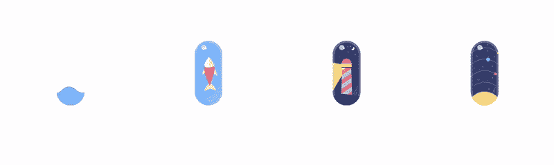
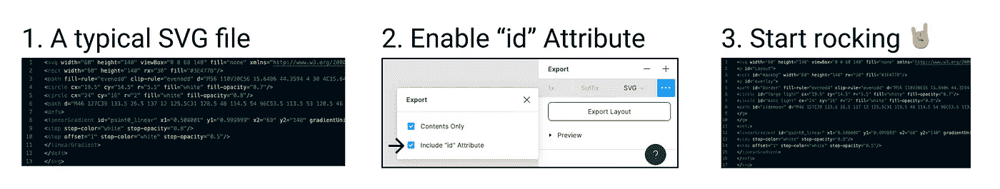
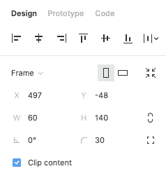
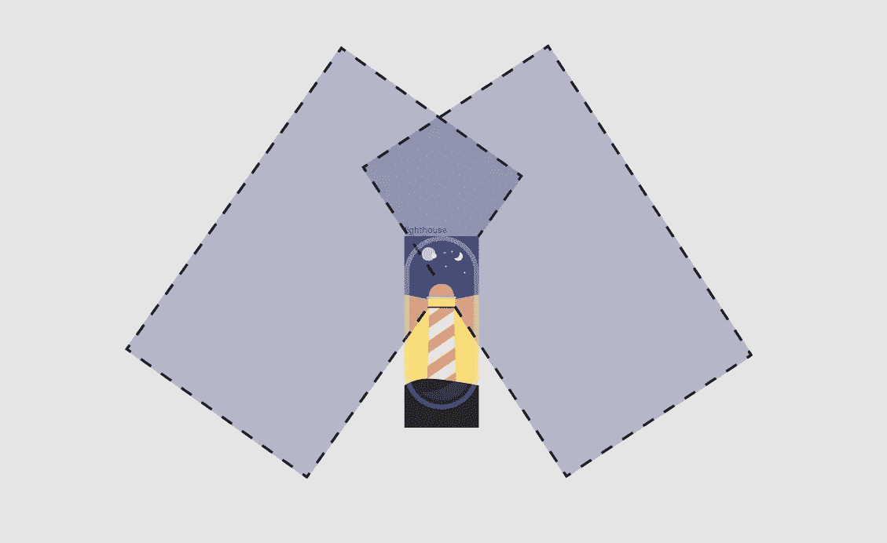

# 制作您的第一个 SVG 动画

> 原文：<https://levelup.gitconnected.com/making-your-first-svg-animations-d79aad48f014>

一个设计师试图编码动画而不是让开发人员来解决的故事。



# 编码动画是网页设计的未来

因为我们可以接触到像 Principle，After effect 等伟大的工具，我们倾向于想象和制作 gif 或视频形式的动画。它们之所以伟大，是因为我们可以用视觉控制它们。

web 设计和基于 web 的应用程序的挑战在于，我们需要轻量级的内容来获得更快的加载速度。

就像我们开始将静态插图转换成 SVG 代码一样，我们也可以将 gif 转换成 SVG 代码！这节省了大量的空间。

**如果你不想编码，它们已经是你的工具了**

如今一些最受欢迎的产品是 After effect 和 [Lottie](https://lottiefiles.com/) 或 [SVGator](https://www.svgator.com/) 的组合。这些真的很强大，如果你想做复杂的动画，我一定会推荐它们。

它们唯一的缺点是要花钱，而且可能有点难以理解。

但是不需要昂贵的软件也可以制作出动画，你只需要有解决问题的能力和决心。学习后端的代码将帮助你制作更好的动画，因为你将在更深的层次上理解正在发生的事情。

这里有两个免费的工具，你可以用来制作你的 SVG 动画:
_ [Figma](https://www.figma.com/) ，来制作插图。
_ [Visual Studio 代码](https://code.visualstudio.com/)，制作动画。

> 是的，我总是喜欢免费的东西；-)

# SVG 和动画介绍

SVG 是一个包含代码的文件，这些代码是如何在屏幕上显示内容的指令。因为 SVG 只由代码组成，你可以直接在你的 HTML 页面中完成，我们倾向于避免这样做，因为你的文件会很快变得混乱。

**这是 SVG 的一般结构:**

```
<svg><object1 "definition of this object" /><object2 "definition of this object" /></svg>
```

*需要注意的是，SVG 是通过从上到下读取来创建的，这意味着首先构建对象 1，然后在对象 1 之上构建对象 2。*

作为设计师，我们必须按照我们习惯看到的相反顺序来思考物体。

**这是我们将要做的:**

```
<svg><object "definition of this object" ><animate "do a bunch of cool stuff please" /></object></svg>
```

最简单的开始方式是打开对象，直接在里面编码我们想要的动画。

有经验的开发人员会将动画和对象分开，并使用引用链接来定位他们想要的东西。一种更现代的方式来思考 SVG 中的动画，即考虑所有在网站中行为相同的元素，直接在 CSS 电子表格中编码动画，并以多个 SVG 文件中的多个对象为目标。

> **今天我们只想开始**

## 充分利用 Figma 的技巧

在尝试了 sketch 和 Adobe illustrator 之后，我得出结论，Figma 是提取一个干净的 SVG 代码的最佳选择。

更好的是，他们还添加了一个额外的特性来提取您在 SVG 中定义为“id”的“name”。

**下面是怎么做的:**



启用 Figma 的 SVG“id”属性特性，以获得一个带有您所设计的元素名称的 SVG 文件

## **获取动画文档的最佳地点**

[](https://css-tricks.com/guide-svg-animations-smil/) [## SVG 动画指南(SMIL)| CSS-技巧

### 2015 年 12 月更新:在这次更新的时候，SMIL 似乎有点奄奄一息。莎拉·德拉斯纳有一个指导你如何…

css-tricks.com](https://css-tricks.com/guide-svg-animations-smil/) 

在本教程中，我将主要使用所谓的“SMIL”动画的基础，你可以随时找到更多关于 CSS 的信息。

有趣的一点是，你会发现语法可以改变，因为我直接在 HTML SVG 文件中编写 CSS 动画，并且可以使用 CSS 语法在 CSS 文件中编写动画。

## 最后一个技巧，你可能想用一个面具，并注意到它不起作用。

在 SVG 动画中，遮罩属性内的对象不能制作动画。
你将不得不使用一个叫做“剪辑路径”的功能



在 Figma 中，很简单，你可以为你创建的任何组使用“剪辑内容”功能，而不是使用蒙版功能。

Figma 将自动编写一个不错的 SVG 文件，你可以玩。

> **好了，现在我们已经完成了，让我们开始吧。；-)**

# 步骤 1:加载线性运动

由 [Jeremie](https://jeremie.roberrini.com/) 装载液体

让东西移动的诀窍是使用一个叫做“AnimateTransform”的框架和一个叫做“Translate”的指令。

" **translate** "将表示我们希望一个对象移动。

将为我们的对象分配一些**值**，以指示对象应该开始和到达的坐标。

**我们把数值写成:**
0，0 =上，左
；=分隔符到下一个坐标
-60，40 =向下移动 60 像素，向右移动 40 像素

我们还可以用“ **dur** ”来表示持续时间，用“**不定**”“**重复计数**”来控制我们的动画。

```
<object ><animateTransformattributeName="transform"attributeType="XML"type="translate"dur="1.5s"values="0,0;-60,0"repeatCount="indefinite"/></object>
```

你可以做出任何形状，然后像我一样在屏幕上移动它们。

# 第二步:旋转游动的鱼。

游泳鱼由[杰瑞米](https://jeremie.roberrini.com/)

它们是创建游泳的不同方法，但最快的是一个名为“旋转”的命令，它也受“动画转换”框架的支持。

在考虑旋转中心的角度和坐标的指令中，**旋转**。

**重要提示:**你需要指定物体旋转的中心，以获得正确的旋转。

**我们把值写成:** 0 0 0 =“0 度旋转”“从上角旋转”“从左角旋转”
；=分隔数值

```
<object ><animateTransformattributeName="transform"attributeType="XML"type="rotate"dur="2s"values="-1.5 30 -10;1.5 30 -10;-1.5 30 -10"repeatCount="indefinite"/></object>
```

*注意，这里我指定了 3 个坐标，因为我希望我的对象从-1.5 度角旋转到+1.5 度，然后回到-1.5 度。*

**绝招**:你可以旋转一个有某种属性的对象，然后旋转一个有不同属性的组。

通过本教程，您还可以了解有关旋转以及如何进行旋转加载的更多信息:

加载动画，教程由[设计课程](https://coursetro.com/)

# 第三步:灯塔背后的秘密

灯塔由[杰瑞米](https://jeremie.roberrini.com/)

灯塔后面有一个秘密。在这个例子中，不是光在移动(我们也可以改变路径)，而是天空在围绕光源旋转。

尝试一些不直截了当的事情确实提供了一个学习动画新技术的机会。

**场景是这样上演的:**



思考灯塔效果中的矩形的技巧

如果你的动画不完美也没关系，我的也在努力…
这就是我们看到直接在代码中制作动画的限制，我不得不慢慢移动旋转值来得到一些可以接受的东西。

> **我很好奇你是如何解决这个问题的；——)**

# 第四步:使用 SVG 路径进入太空

太阳系由[杰雷米](https://jeremie.roberrini.com/)

好了，现在我们知道了“AnimateTransform”框架的诀窍，是时候学习“AnimateMotion”这个新的很酷的东西了。

首先，我们将做一些简单的事情，沿着一条路径移动一个圆。

圆是由 x 和 y 轴的位置坐标“cx”和“cy”以及其人造线大小的“r”组成的对象。

```
<circle id="Venus" cx="10" cy="20" r="3" fill="#FC5FAB">
```

为了动画化这个元素，我们将指定一个“**开始**时间，声明“**填充**”应该是要保持的“**冻结**”，以及它应该移动的“**路径**。

```
<circle id="Venus" cx="0" cy="0" r="3" fill="#FC5FAB"><animateMotiondur="3s"begin="0"repeatCount="indefinite"fill="freeze"path="M-6 84.5C-6 84.5 7.5 65 30.5 65C53.5 65 66.5 84.5 66.5 84.5" /></circle>
```

*注意，因为我要求一个圆在动画中沿着一条路径移动，我需要将它的坐标(cx 和 cy)设置为“0 ”,因为它们将被附加到路径坐标上。*

“AnimateMotion”是一个不同于“AnimateTransform”的框架，不幸的是，如果你试图将两者结合起来，你将运行一个几乎无法控制的动画拼图。

幸运的是，你也可以用“AnimateMotion”做各种很酷的事情，你可以在这里了解它们:

[](https://codeburst.io/css-transitions-and-animations-motion-path-module-css-a4d62d6ee802) [## CSS 过渡和动画。运动路径模块 CSS

### 前端开发人员 Ruslan Khomiak

codeburst.io](https://codeburst.io/css-transitions-and-animations-motion-path-module-css-a4d62d6ee802) 

> **这是相当高级的东西**(我认为我甚至做不到) **所以你可能想慢慢来；-)**

# 你真棒！

你到了这里，希望尝试了这些练习，我打赌你的动画技巧已经到了顶点。我迫不及待地想看到你将如何把这项新技能整合到你的网站和解决方案中。

也许你会更进一步，用我在开始时提到的程序设计复杂的动画，但如果你这样做了，我希望你能学到一些有用的东西，了解它在后端是如何工作的。