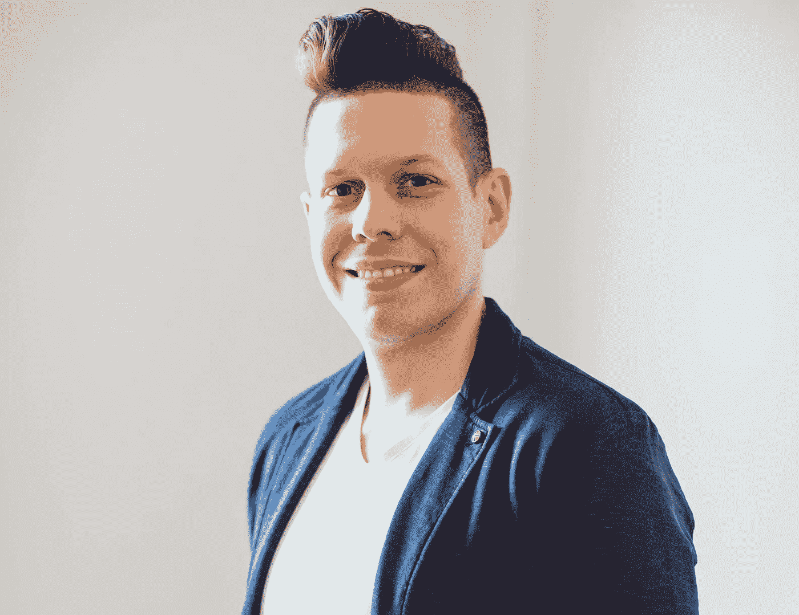
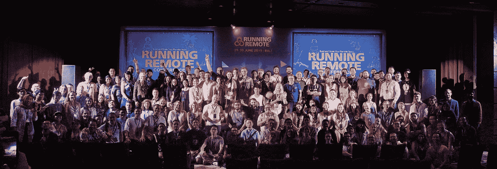

# Maksymilian Majer:远程工作人员超额完成工作，但是很难培养远程关系

> 原文：<https://levelup.gitconnected.com/maksymilian-majer-remote-workers-over-deliver-but-its-difficult-to-nurture-remote-relationships-3a8485c1e941>

马克西米连·马耶尔

## 我采访了经验丰富的技术领袖 Maksymilian Majer，他是现任首席执行官，也是 T2 it craftship 的首席招聘官。

*Maksymillian Majer 已经在软件开发行业工作了超过 14 年:他参与过各种规模的客户软件项目，经营过初创公司，还创办了自己的初创公司 ITCraftship。在这次采访中，马克斯分享了他对网页开发和设计的热情，谈论了技术招聘的现状，对远程工作的未来发表了意见，并就培养领导技能、保持工作与生活的平衡等问题给有抱负的专业人士提供了大量建议。*

***披露****:*[*Soshace*](http://soshace.com)*，一个面向 web 开发者的招聘平台，是* [*跑远程*](http://runningremote.com) *的媒体合作伙伴。*

***您好马克斯，欢迎来到《奔跑吧远程采访》*******！请分享你的故事。你是如何对 web 开发产生热情的？****

*我其实是误打误撞成了开发者。我在高中期间就已经用 Pascal 或 C/C++编写过代码，但我对 3D 建模和动画非常感兴趣。放学后，我会浏览 3Ds Max 教程，浏览 https://cgsociety.org/[的艺术家创作的鼓舞人心的作品。](https://cgsociety.org/)*

*你在波兰-日本学院注册、学习并完成学位的目的是什么？*

*波兰-日本 IT 学院是波兰为数不多的提供 3D 图形和动画专业的学院之一(我相信全国只有两所)。这就是我报名的原因。在我的学习中，我知道我是一个比设计师更好的程序员——画画，而绘画不是我的最高天赋。*

*这个名字的波兰-日本部分只是强调了两国之间的合作。除了一年学习日本文化(除此之外，我只记得在地震时你应该呆在门框里)之外，我对这种语言没有多少了解。*

****请带我看一下你的职业生涯。从最初的软件工程师到 ITCraftship 的首席执行官和首席招聘人员。****

*我在大学一年级后开始了我的软件开发生涯。一个同学邀请我去意大利进行暑期实习，我们在那里为北约研究一个跟踪和追踪解决方案🙀*

*雇主非常喜欢我们，以至于当我的暑假结束时，他决定给我们提供一个偏远的职位来帮助完成这个项目。那是大约 15 年前的事了，所以请相信我，那时的远程工作糟透了。互联网连接很差，Skype 上的视频通话质量也不是很好。在远程办公的同时，保持巨大的价值需要两倍于现在的纪律和毅力。*

*在这家意大利公司工作后，我通过开发软件工匠技能和获得越来越多的职位继续我的职业生涯，这使我在 2010 年建立了自己的 POS SaaS 创业公司。对于软件工程师来说，这是一个有趣的步骤，但并不容易。我们承担了资金、风险和责任。最终我们失败了，因为我们没有把足够的注意力放在让客户开心上。作为软件工程师，我们不断堆积我们认为人们想要的功能，而不是问他们。那时候那已经超出了我的舒适区。我不得不艰难地学会，产品开发就是和你的客户交谈。*

*在那次失败的创业尝试之后，我回到了企业软件的工作岗位上，后来又去了一家挪威的初创公司，在那里我被聘为 3 人的技术主管，在 3 年的时间里，我帮助团队发展到了 9 人。*

*2017 年，我决定和几个联合创始人推出 ITCraftship。这家初创公司仍然是我们最有价值的客户之一；但由于商业生活艰难，只有两位最初的创始人留在了 ITCraftship。它开始时是一个兼职项目，我和我的联合创始人 Maciej 仍然为公司做开发工作。然而，现在该团队有 9 名成员，采用混合远程/现场模式工作。我们部分在华沙的办公室工作，有大量在家工作的政策，我们有 2 个完全远程的团队成员。我只在我们的华沙办公室工作一天，除此之外，我喜欢在家里工作。*

*我们对技术人员招聘的关注来自于沮丧，因为 IT 部门的招聘和筛选过程有很大的缺陷。招聘人员对程序员的偏好知之甚少，招聘挑战不足以评估硬技能。当在 eVici 发展团队时，我意识到我们正在取得更好的结果，这就是我们想要达到的目标。*

*你已经作为技术主管工作了很长一段时间。成为一名技术领导者需要什么？你能给想要成为技术领导者的有抱负的开发者什么建议？*

*很难确定成为一名好领导所需要的确切技能。对我来说，最重要的是树立一个榜样。我组织工作的方式、沟通的方式和交付的内容都需要为团队设定正确的标准。然而，作为一名技术领导者，还有很多事情要做。我作为一名领导者的最佳经历之一是我在 Clevertech 的工作，在那里我也有机会与令人惊叹的 Nazar Aziz 一起接受领导力培训。该课程以 http://conversationsforaction.com/的《T4》为基础，我强烈推荐所有领导者阅读这本书。这让我成为了一个更好的领导者，也帮助我改善了个人生活。*

* [## 行动对话和文集:在工作中灌输承诺文化…

### 通过 Kindle 分享。描述:我们如何为自己和他人创造价值，同时参与…

read.amazon.com](https://read.amazon.com/kp/embed?asin=B00DERXZIA&preview=newtab&linkCode=kpe&ref_=cm_sw_r_kb_dp_YJViDb3FYTP1T) 

你在 ITCraftship 的日常职责是什么？你的专业领域是什么？你最热衷于什么？为什么你认为你的公司与竞争对手不同？

在 ITCraftship，我最重要的角色是为我们的发展制定方向和战略，但我还扮演另外两个角色:业务开发和技术评估。我有超过 14 年的经验，接触过很多技术、框架和编程语言。这就是我如何确保我们的技术团队能够保证最佳的评估流程。我也非常热衷于过程和持续改进，所以在 ITCraftship，我们努力为雇主和开发者提供最好的体验。我们知道与候选人保持良好的关系对于为我们的客户提供最佳质量是多么重要。与该领域的其他公司相比，我们引以为豪的是，我们提供了经过最全面测试的候选人，他们都有动力加入公司。为此，我们采用了许多工具和实践来强化客户的雇主品牌。我们感到自豪的是，我们的候选人认为我们的流程是他们经历过的最好的流程。

***贵公司有多少人远程办公？***

目前，我们公司有 2 名员工完全远程工作，我们正在寻找第 3 名远程员工。团队的其他成员在一个灵活的混合模式下工作，在家工作不受限制。我通常远程工作 3-4 天，另一位创始人 Maciej 也是如此。团队中的其他人更频繁地访问办公室，但这是因为他们非常喜欢它，而不是因为他们必须这样做；)

***你觉得就业的未来很遥远吗？***

我确实相信就业的未来是遥远的，我不是唯一的一个。当我们询问候选人新的机会时，我们喜欢跟踪他们的回答，50%的候选人不想听到一个不遥远的职位。这就是为什么目前是一家公司进行远程投资的最佳时机。那里没有太多的竞争，你会得到最好的人才。我的猜测是，几年后，远程就业市场将变得和本地就业市场一样竞争激烈。等到那时的公司将很难跟上。

***你在管理远程团队时遇到的最大挑战是什么？***

最大的挑战是作为一个远程团队建立公司文化。人们担心生产率或对员工的控制是最大的问题。我在实践中看到远程工作人员超额交货。然而，保持团队中所有人的联系并培养这些关系是非常困难的。

还有一些更小的挑战，会带来一些瓶颈。例如，我没有听说过白板会议有什么好的解决方案。在软件开发中，它经常被使用，但是在远程设置中，使用像 [draw.io](http://draw.io) 这样的工具很难有成效

***如果你在过去或现在的工作中有两件事可以改变，会是什么，你会怎么改变？***

现在我清单上最重要的事情是成为一家更加透明的公司。一个不仅由创始人领导，而且所有员工都有发言权的公司。目前，我想尝试一个绿松石(蓝绿色)组织的想法，对此我非常兴奋。然而，在我们介绍它之前，我们需要检查所有可能的好处和影响。这很有吸引力，我希望这将证明是我们未来的良好开端。

马克斯和他的同事

***你认为远程工作对你的工作生活平衡有何影响？你能给别人什么建议来保持家庭和工作的稳定平衡？***

我认为远程工作对我们的个人生活有积极和消极的影响。人们在退出和断开与工作场所的连接时遇到问题。无论是在 Slack、Twist 还是微软团队，如果你收到来自不同时区同事的信息，很容易就会去处理它。我的建议是保持一个规律的时间表，并与团队进行适当的沟通。每个人都应该意识到你的工作业主，并应尊重你的自由时间。但是你也需要尊重它。

你想去游泳池游泳。水有点冷，不太舒服。你是那种跳进去的人还是那种自己趟进去的人？为什么？

我总是跳进去。我想尽快摆脱这种不愉快的感觉。这是我对待生活中其他变化的方式。走出舒适区是成长和变得更好的一部分。这就是为什么我们做得越多、越快、越频繁，进步就越多。

***你有什么爱好？它们是什么？***

我是一个健身和营养狂。它始于五年前我决定减肥的时候，现在它已经成为我生活的一个主要部分。我喜欢健身和保持适当的饮食。它对我的健康和工作效率也有好处。

***你为什么认为组织活动很重要，比如*** [***远程跑步***](https://runningremote.com/) ***，这些都是远程工作的自由职业者、CEO、营销经理？你认为那些事件的最终目的是什么？***

从这种活动中最大的收获是人们互相学习，改善他们的远程业务。这将带来更好的结果，并促进与其他公司的远程工作。越多的人进入这个市场，对我们所有人来说，这个市场就会变得越好。

***你跟*** [***远程运行***](https://runningremote.com/) ***是什么关系？你有机会参观会议吗？***

运行远程 2019

我是社区合作伙伴，我没有亲自参加会议，但我有机会在活动之前、期间和之后与许多参与者互动。我参与了他们的讨论和通话，我被他们学习和分享知识的开放和热情所鼓舞。我也建立了许多有意义的联系和潜在的商业伙伴关系。期待几个月后看到发布会的效果。* 

**我是一名文案在***，一个招聘网站开发者的平台:* [*招聘*](https://soshace.com/for-clients) *一名开发者或者* [*应聘*](https://soshace.com/for-developers) *远程工作。如果你有一个有趣的故事要讲，请在 Twitter 上 ping 我@* [*玛丽沃龙佐夫*](https://twitter.com/MaryVorontsov) *我很乐意收到你的来信并分享你的故事。***