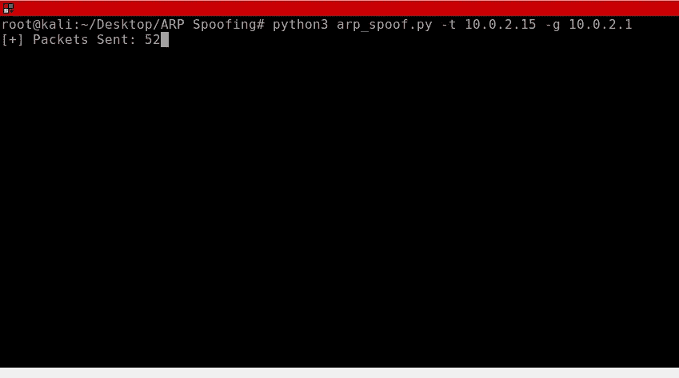
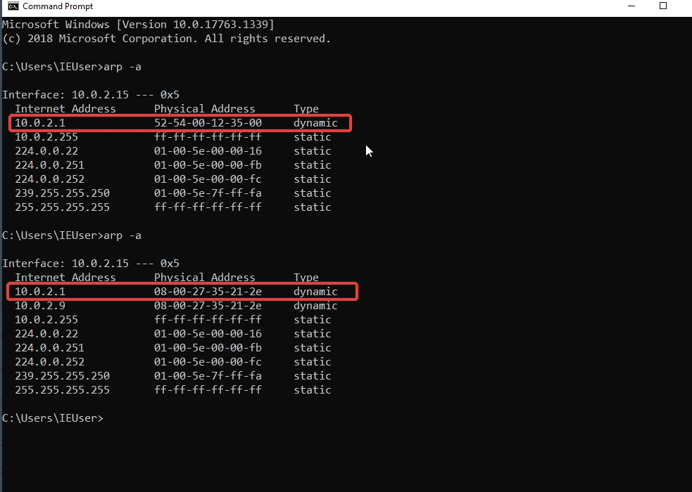
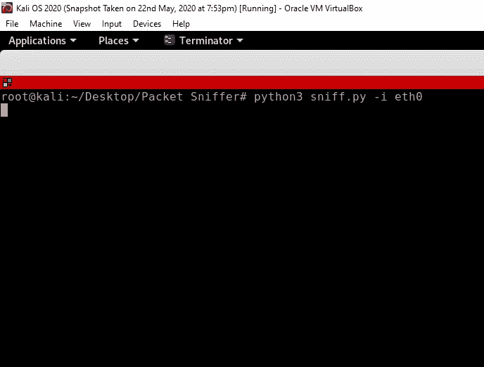
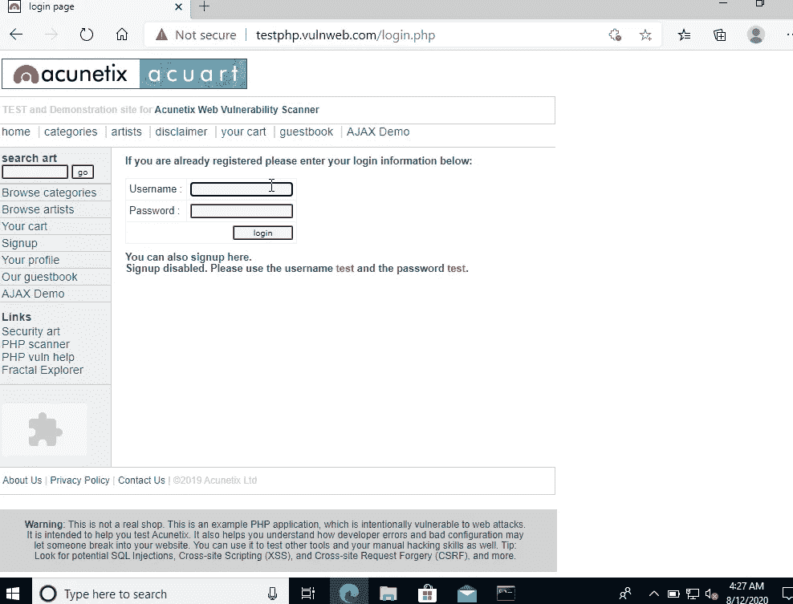
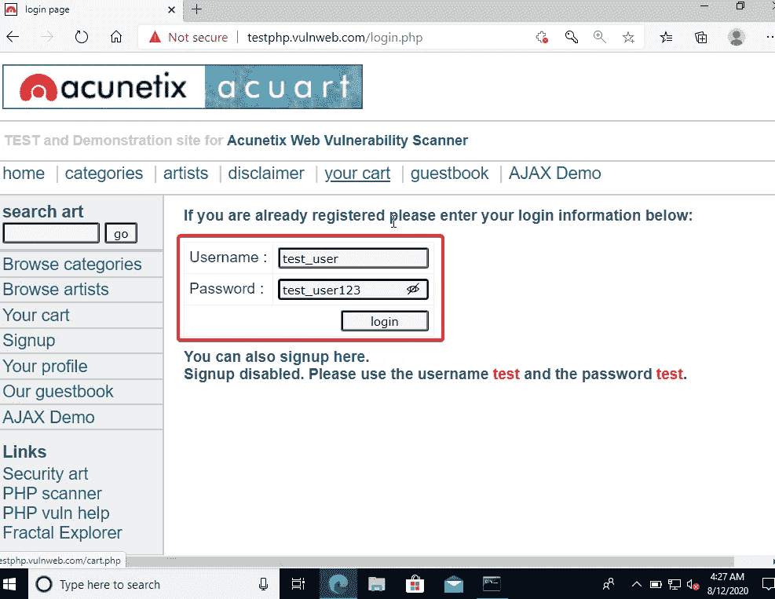
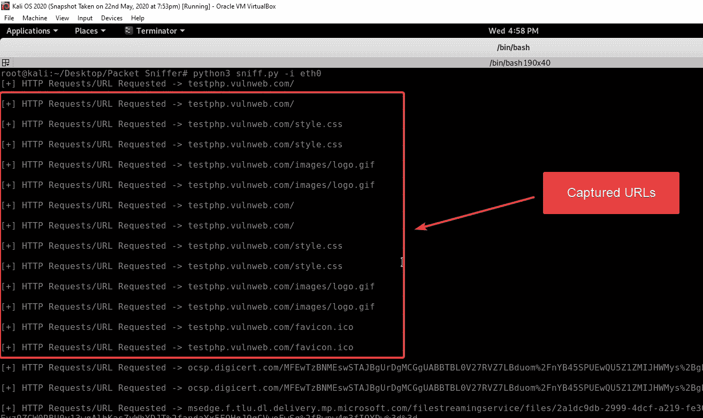
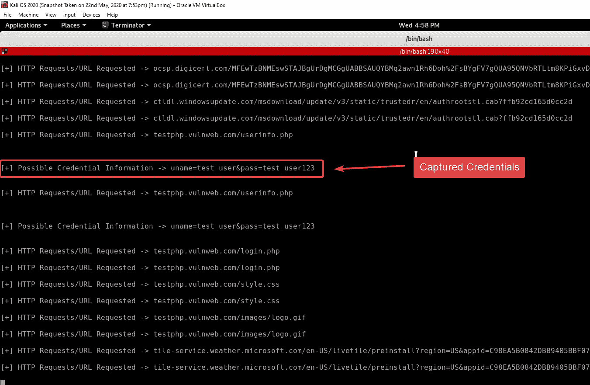

# 中间人攻击(MITM)第 2 部分—数据包嗅探器

> 原文：<https://levelup.gitconnected.com/man-in-the-middle-attack-mitm-part-2-packet-sniffer-82f0a121c58d>

使用 Python 构建数据包嗅探器🐍提取访问过的 URL 和用户凭证。


> 这是中间人(MITM)攻击的第二部分。如果你还没有阅读第 1 部分，那么我强烈建议你在阅读第 2 部分之前先阅读第 1 部分。您可以在下一节找到第 1 部分的链接。

# 什么是数据包嗅探器？

数据包嗅探器是一种用于监控网络和诊断任何网络问题的工具。网络技术人员常用。黑客经常利用这一点来窥探用户的网络流量和提取密码。

数据包嗅探器在他们可以访问的网络**接口**上记录网络流量。它可以看到流入和流出接口的每个[数据包](https://computer.howstuffworks.com/question525.htm#pt0)。

你可能想知道我们正在设计一个数据包嗅探器，但是标题说的是中间人攻击。这是因为在 [Part 1](/man-in-the-middle-attack-part-1-arp-spoofing-6f5b174dec59) 中我们写了一个 Python 脚本(ARP 欺骗)让我们成为中间人。数据包嗅探器的目的是捕获受害者(使用 ARP 欺骗攻击的用户)的网络流量，并提取访问过的 URL 和凭据。

[](/man-in-the-middle-attack-part-1-arp-spoofing-6f5b174dec59) [## 中间人攻击(MITM)第 1 部分— ARP 欺骗

### 学习构建一个工具来执行中间人(MITM)攻击——使用 Python 在目标机器上进行 ARP 欺骗。

levelup.gitconnected.com](/man-in-the-middle-attack-part-1-arp-spoofing-6f5b174dec59) 

# 使用的模块:

1.  [argparse](https://docs.python.org/3.4/library/subprocess.html) :要理解这是什么，请在这里阅读我的第一篇文章。
2.  [Scapy](https://scapy.readthedocs.io/en/latest/extending.html) :使用户能够发送、嗅探、解析和伪造网络数据包。这种能力允许开发能够探测、扫描或攻击网络的工具。它可以伪造或解码大量协议的数据包，通过网络发送它们，捕获它们，匹配请求和回复，等等。它可以轻松处理大多数任务，如扫描、跟踪路由、探测、单元测试、攻击或网络发现。
3.  [时间](https://docs.python.org/3/library/time.html):我们只使用时间模块产生 2 秒的延迟。要了解本模块的更多信息，请阅读文档。

# Python 有什么功能🐍剧本必须有？

*   `get_args()` —获取命令行参数的函数。在这种情况下，我们需要用户为接口**提供一个输入值，我们希望在这个接口上嗅探数据包。**
*   `sniffer(interface)` —一个将**接口**值作为输入并在该接口上嗅探数据包的函数。
*   `process_packet(packet)` —由`sniffer`函数为每个被嗅探的新数据包调用的函数。这将检查数据包是否属于`HTTP Request`类型。对于这个用例，我们只需要`HTTP Request`类型的数据包，因为我们想要的信息就是在这个数据包中发送的。然后使用`get_url(packet)`和`get_credentials(packet)`功能。
*   `get_url(packet)` —从传递给它的`packet`中提取 URL 的函数。
*   `get_credentials(packet)` —也以`packet`为输入并提取用户名和密码等凭证的函数。

事不宜迟，让我们开始用 Python 编写脚本。

# 用于数据包嗅探器的 Python 脚本

在本节中，我们将逐步构建脚本。我会解释每一步的所有内容，所以请仔细阅读。

**第一步:导入必要的模块**

**导入模块**

**第二步:编写** `get_args()` **函数**

**函数— get_args()**

上述函数增加了允许用户将用户输入值作为命令行参数传递的功能。添加上述代码后，用户将能够在用于运行脚本的同一条指令中传递`interface`的名称，数据包将在该名称上被嗅探。举个例子，

```
root@kali:~# python3 sniffer.py -i interface_name
```

运筹学

```
root@kali:~# python3 sniffer.py --interface interface_name
```

要了解这个函数是如何工作的，请阅读关于如何[更改设备的 MAC 地址](https://medium.com/@dharmilch18/changing-mac-address-using-python-8a16fc4a3563)的文章中的整个**步骤 2** 。

**第三步:编写** `sniffer(interface)` **函数**

**功能—嗅探器(接口)**

以上要点包含了`sniffer(interface)`函数的定义。它接受一个接口名称作为内部使用的输入。它使用由 scapy 模块提供的一个名为`sniff`的方法。方法`sniff` 需要一个接口名`iface`作为输入。下一个参数，`store`告诉 scapy 是否将数据包存储在内存中。`store = False`告诉 scapy 不要存储数据包。最后一个参数是`prn`，它告诉 scapy 每次嗅探一个新包时要调用哪个函数。在这种情况下，每个新的包都调用`process_packet`函数。

**第四步:编写** `process_packet(packet)` **函数**

在进入这个函数之前，让我们看一下 scapy 包是什么样子的。

```
###[ Ethernet ]###
dst       = 52:54:00:12:35:00
src       = 08:00:27:35:21:2e
type      = IPv4
###[ IP ]###
version   = 4
ihl       = 5
tos       = 0x0
len       = 441
id        = 22651
flags     = DF
frag      = 0
ttl       = 64
proto     = tcp
chksum    = 0xf1f9
src       = 10.0.2.9
dst       = 176.28.50.165
\options   \
###[ TCP ]###
sport     = 48556
dport     = http
seq       = 790303956
ack       = 327206
dataofs   = 5
reserved  = 0
flags     = PA
window    = 64240
chksum    = 0xf075
urgptr    = 0
options   = []
###[ HTTP 1 ]###
###[ HTTP Request ]###
Method    = 'GET'
Path      = '/login.php'
Http_Version= 'HTTP/1.1'
A_IM      = None
Accept    = 'text/html,application/xhtml+xml,application/xml;q=0.9,*/*;q=0.8'
Accept_Charset= None
Accept_Datetime= None
Accept_Encoding= 'gzip, deflate'
Accept_Language= 'en-US,en;q=0.5'
Access_Control_Request_Headers= None
Access_Control_Request_Method= None
Authorization= None
Cache_Control= 'max-age=0'
Connection= 'keep-alive'
Content_Length= None
Content_MD5= None
Content_Type= None
Cookie    = None
DNT       = None
Date      = None
Expect    = None
Forwarded = None
From      = Non
Front_End_Https= None
HTTP2_Settings= None
Host      = 'testphp.vulnweb.com'
If_Match  = None
If_Modified_Since= None
If_None_Match= None
If_Range  = None
If_Unmodified_Since= None
Keep_Alive= None
Max_Forwards= None
Origin    = None
Permanent = None
Pragma    = None
Proxy_Authorization= None
Proxy_Connection= None
Range     = None
Referer   = '[http://testphp.vulnweb.com/login.php](http://testphp.vulnweb.com/login.php')
```

上面的块显示了包的内容。以`###[text]###`开头的线称为`layer`。其后的行是该`layer`下的字段，直到遇到下一个`layer`。例如，在上面的块中，`###[ Ethernet ]###`是一个`layer`，下面的行是以太网下的字段。这些字段包含有关以太网的信息。同理，`###[ TCP ]###`，`###[ HTTP Request ]###`等。都是`layer`。现在，让我们跳到 **process_packet** 函数。

**功能—进程 _ 数据包(数据包)**

这个函数需要嗅探到的数据包作为输入。在这个函数中，我们首先检查数据包是否有一个`HTTP Request`层。这是通过使用 scapy 提供的名为`haslayer()`的方法来完成的。如果数据包没有该层，则不会对其进行处理。

如果它有`HTTP Request`层，那么我们执行两个操作:

1.  调用`get_url(packet)`函数从数据包中提取 URL。它将`packet`作为输入。这个函数返回一个 URL，我们将它存储在一个名为`url`的变量中，然后打印出`url`的值。
2.  然后我们调用另一个叫做`get_credentials(packet)`的函数。它也将`packet`作为输入。它检查数据包中可能的凭证，如果找到任何凭证，则返回这些凭证。我们将它存储在一个名为`cred`的变量中，然后打印它的值。

> 我将在后面的步骤中解释`get_url(packet)`和`get_credentials(packet)`功能。

**第五步:编写** `get_url(packet)` **函数**

**功能—获取 url(数据包)**

`get_url(packet)`函数也需要一个包作为输入来提取包中的 URL。该功能提取数据包`HTTPRequest`层的`Host`和`Path`子字段的内容。然后，我们将这两部分连接起来，并返回从数据包中提取的 URL。以下是出现在`Host`和`Path`子字段中的内容示例。

```
Path      = '/login.php'
Host      = 'testphp.vulnweb.com'
```

代码`packet[http.HTTPRequest]`允许我们访问这些层，由于 Scapy，这是可能的。

**第六步:编写** `get_credentials(packet)` **函数**

**功能—获取 _ 凭证(数据包)**

在上面的代码中，可以看到一个名为`keywords`的 Python 元组。在理解为什么需要它之前，让我们先理解函数本身。

这个函数也需要一个包来处理。现在，当我们在第 4 步开始时查看数据包的内容时，并没有称为`Raw`的层。这一层对于我们试图实现的目标至关重要，因为凭证等附加信息被添加到了`Raw`层。下面的代码块显示了`Raw`层。它还显示凭证存储在名为`load`的子字段中。

```
###[ Raw ]###
load = 'uname=hdhd&pass=hshs'
```

现在回到函数。首先，该函数检查数据包是否具有`Raw`层。如果数据包具有该层，则它提取`load`子字段的值，并将其存储在名为 **field_load** 的变量中。

下一步是使用 for 循环遍历我们前面讨论过的元组。元组包含关键字，这些关键字是在制作 HTML 表单时使用的表单字段的潜在名称。这些关键字是通过猜测用于设计 HTML 注册和登录表单的 HTML 表单元素的常用名称得到的。

for 循环遍历元组中的每个元素，并检查是否有任何关键字出现在 **field_load** 变量中。如果任何关键字匹配，那么 **field_load** 返回到`process_packet(packet)`函数以显示潜在的凭证。

**第 7 步:最后一步**

现在，剩下要做的就是调用`get_args()`和`sniffer(interface)`函数。

**调用嗅探函数**

这样，我们就完成了整个脚本，剩下要做的就是测试它。

# 整个脚本

**整个脚本**

# 工作演示

好了，在开始用 Python 写代码之前，我要告诉你我的设置:我目前在 Windows 10 上，我有两个虚拟机运行[Virtualbox](https://www.virtualbox.org/)( 1。Kali Linux 和 2。Windows 10)。我将在我的 Kali Linux 机器上执行我们在第 1 部分中制作的 python 脚本——ARP 欺骗，并攻击我的 Windows 10 虚拟机以成为中间人。然后，我将在我的 Kali Linux 机器上执行这一部分的数据包嗅探器脚本。之后，我将登录到一个网站，看看嗅探器脚本是否能够提取凭证。

注意:虚拟机在 Virtualbox 中被配置为使用 **NatNetwork** 。当虚拟机设置为使用 **NatNetwork 时，**虚拟机认为主机是路由器(接入点)。要了解更多关于 NatNetwork 以及如何配置 VM 来使用它，请阅读[这篇](https://www.techrepublic.com/article/how-to-create-multiple-nat-networks-in-virtualbox/)。

注意:数据包嗅探器仅适用于使用 HTTP 协议的网站。这在 HTTPS 行不通。要测试，使用这个网站— [测试 Vuln 登录](http://testphp.vulnweb.com/login.php)。

## Kali Linux 机器

*   IP 地址= **10.0.2.9**
*   MAC 地址= **08:00:27:35:21:2e**

## Windows 10

*   IP 地址= **10.0.2.15**
*   MAC 地址= **08:00:27:e6:e5:59**

## 接入点或默认网关

*   IP 地址= **10.0.2.1**
*   MAC 地址= **52:54:00:12:35:00**



**利用 ARP 欺骗成为中间人**



**证明我们是 MITM**

MITM——中间的人



**执行数据包嗅探器脚本**



**测试表格**



**凭证测试表**



**提取的网址**



**提取凭证**

在上图中，您可以看到我们已经从被嗅探的数据包中提取了捕获的用户名和密码。在测试表单中，我们输入了`username = test_user`和`password = test_user123`，在上图中，您可以看到我们在输出中获得了相同的用户名和密码值。

# 结论

我们成功地编写了一个 Python🐍捕获数据包的脚本。我们还测试了中间人攻击——ARP 欺骗。剧本如我们所愿完美地发挥了作用。

你可以在我的 [Github 库](https://github.com/dharmil18/Packet-Sniffer)上找到完整的脚本。谢谢你😃为了阅读。