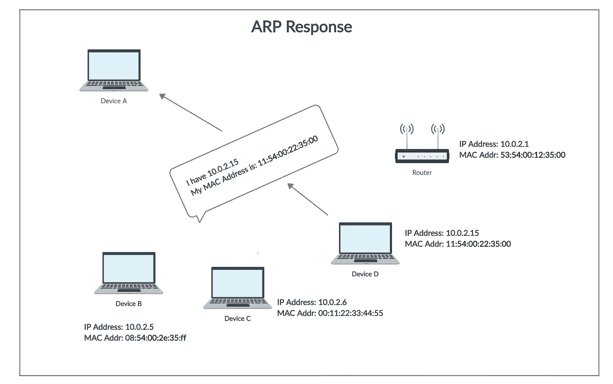

# 中间人攻击(MITM)第 1 部分— ARP 欺骗

> 原文：<https://levelup.gitconnected.com/man-in-the-middle-attack-part-1-arp-spoofing-6f5b174dec59>


由[像素](https://www.pexels.com)上的[像素](https://www.pexels.com/@pixabay)生成的图像

# 什么是地址解析协议(ARP)？

在网络中，计算机使用 **IP 地址**与其他设备通信，然而，实际上，通信是通过 **MAC 地址进行的。ARP 用于找出 IP 地址已知的特定设备的 MAC 地址。**例如，一台设备想要与网络上的另一台设备通信，然后发送设备使用 ARP 找到它想要与之通信的设备的 MAC 地址。ARP 包含两个步骤来查找 MAC 地址:

1.  发送设备发送一个 **ARP 请求**，其中包含它想要与之通信的设备的 IP 地址。该请求被广播，这意味着网络中的每个设备都将接收到该请求，但是只有具有预期 IP 地址的设备才会响应。
2.  收到广播消息后，IP 地址等于消息中 IP 地址的设备将向发送方发送一个包含其 MAC 地址的 **ARP 响应**。

如果仍然不清楚什么是 ARP 以及它是如何工作的，那么参考下面的图片。


**图 1。ARP 请求**



**图二。ARP 响应**

# 什么是 ARP 欺骗？

ARP 欺骗是一种**中间人(MITM)** 攻击，攻击者(黑客)发送伪造的 ARP 报文。这使得攻击者能够伪装成合法用户，将攻击者机器的 MAC 地址链接到合法的 IP 地址。一旦 MAC 地址被链接，攻击者现在就会收到发送给合法 IP 地址的消息。此外，ARP 欺骗允许攻击者拦截、修改和丢弃传入的消息。

ARP 欺骗只能在 32 位 IP 地址(IPv4)上进行，而不能在 IPv6 上进行。然而，它被广泛使用，因为大多数互联网仍然工作在 IPv4 上。

让我们借助图表更清楚地理解 ARP 欺骗😃。


**图 3。正常网络**

图三。演示正常网络的工作方式(无恶意活动)以及设备(黑客或受害者)如何在接入点的帮助下访问互联网。所有消息都要通过接入点。例如，一个设备(黑客或受害者)发送请求以访问互联网上的资源，并依次接收响应。这些**请求**和**响应**总是通过接入点，因此接入点被称为互联网的**网关**。

> 注:在本文中，**【网关】****【接入点】【路由器】****【默认网关】**等词语可以互换使用。同样，词语**【攻击者】**和**【黑客】**的用法类似。单词**【目标】**和**【受害者】**意思相同。


**图 4。ARP 欺骗概述**

图 4。说明了 ARP 欺骗如何影响网络中**请求**和**响应**的正常流动。在 ARP 欺骗中，黑客只需在**受害者**前面伪装成**接入点**，在**接入点**前面伪装成**受害者**，就可以欺骗**接入点**和**受害者**。现在，让我们看看黑客是如何设法伪装和欺骗接入点和受害者的。


**图 5。ARP 欺骗**

借助于图 5。我们可以理解攻击者是如何欺骗接入点和受害者的。图中显示了网络中每台设备的 IP 地址和 MAC 地址。要理解 ARP 欺骗的工作原理，您必须首先完全理解该图。为了实施 ARP 欺骗，攻击者/黑客向接入点和受害者发送 ARP 响应。

在我们深入研究图 5 之前。，我们先来了解一下 ARP 响应，它包含哪些不同的字段。我们已经讨论了什么是 ARP 响应以及何时使用它。现在，让我们看看 ARP 响应的内部，了解它包含什么样的信息。


**图六。ARP 响应示例**

图六。显示在 [Wireshark](https://www.wireshark.org/) 中捕获的 ARP 响应数据包。它内部有几个字段，用于与网络中的其他设备通信。在所有领域中，对我们来说最重要的是:

*   Opcode —当它的值为 **2** 时，表示它是一个 ARP 响应，当它的值为 **1** 时，表示它是一个 ARP 请求。在上图中，操作码的值是 **2** ，这意味着它是一个 ARP 响应。
*   发送者 MAC 地址
*   发件人 IP 地址
*   目标 MAC 地址
*   目标 IP 地址

现在，为了在接入点前伪装成受害者，攻击者/黑客使用 ARP 响应来获得优势。攻击者向接入点发送包含以下信息的 ARP 响应消息:

*   操作码= **2**
*   发送方 MAC 地址= **08:00:11:1a:25:ff** (攻击者的 MAC 地址)
*   发件人 IP 地址= **10.0.2.15**
*   目标 MAC 地址= **08:22:55:2a:ab:35**
*   目标 IP 地址= **10.0.2.1**

这表明攻击者正在通过将**受害者的 IP 地址设置为发送者的 IP 地址**来伪造 ARP 响应消息。这个**欺骗接入点，使其认为 ARP 响应是由受害者(合法设备)发送的，然而，实际上，它是由攻击者发送的。**攻击者还**将自己机器的 MAC 地址** **设置为发送者 MAC 地址**。因此，接入点在其 ARP 表中将 IP 地址 **10.0.2.15** 的 MAC 地址更新为攻击者的 MAC 地址，从而将攻击者的机器与合法的 IP 地址链接起来。这样，任何打算发送给 **10.0.2.15** 的消息都将被发送到攻击者的机器上。这就是图 5 中**“10 . 0 . 2 . 15 在 08:00:11:1a:25:ff”的含义。**

点击阅读 ARP 表[。](https://www.javatpoint.com/arp-table)

同样，为了在受害者面前伪装成接入点，攻击者再次使用 ARP 响应，并使用其中的以下信息将其发送到受害者机器:

*   操作码= 2
*   发送方 MAC 地址= **08:00:11:1a:25:ff** (攻击者的 MAC 地址)
*   发件人 IP 地址= **10.0.2.1**
*   目标 MAC 地址= **00:22:11:55:33:aa**
*   目标 IP 地址= **10.0.2.15**

受害者收到该 ARP 响应，并认为这是由接入点发送的，因此用 ARP 表中攻击者的 MAC 地址更新接入点 IP 地址的 MAC 地址。这愚弄了受害者，攻击者成功地伪装成接入点。这意味着任何发往接入点的消息现在都被发送给了攻击者。

现在，由于访问互联网上的资源的唯一方式是通过接入点本身，受害者的请求现在通过攻击者的机器，而不是实际的接入点。这给了攻击者拦截、修改或停止数据传输的机会。攻击者还可以在受害者和接入点之间传递请求和响应，而不做任何更改。

此后，受害者和接入点之间的通信通过攻击者的机器进行，如图 4 所示。

此时此刻，我假设你已经了解了 ARP 欺骗是如何进行的，那么让我们跳到编码部分。

# 为什么 ARP 欺骗是可能的？

ARP 是为了安全而设计的。ARP 欺骗之所以可能，有两个原因。

1.  网络中的机器接受 ARP 响应，即使它们没有发送 ARP 请求。
2.  机器信任这些 ARP 响应，无需任何验证。

# 使用的模块:

1.  [argparse](https://docs.python.org/3.4/library/subprocess.html) :要理解这是什么，请阅读我的第一篇文章[这里](https://medium.com/@dharmilch18/changing-mac-address-using-python-8a16fc4a3563)。
2.  [Scapy](https://scapy.readthedocs.io/en/latest/extending.html) :使用户能够发送、嗅探、解析和伪造网络数据包。这种能力允许开发能够探测、扫描或攻击网络的工具。它可以伪造或解码大量协议的数据包，通过网络发送它们，捕获它们，匹配请求和回复，等等。它可以轻松处理大多数任务，如扫描、跟踪路由、探测、单元测试、攻击或网络发现。
3.  [时间](https://docs.python.org/3/library/time.html):我们只使用时间模块产生 2 秒的延迟。要了解本模块的更多信息，请阅读文档。

> 好了，在开始用 Python 写代码之前，我要告诉你我的设置:我目前在 Windows 10 上，我有 [Virtualbox](https://www.virtualbox.org/) 在两个虚拟机(1。Kali Linux 和 2。Windows 10)。我将在我的 Kali Linux 机器上执行 python 脚本，并尝试攻击我的 Windows 10 VM。注意:虚拟机在 Virtualbox 中被配置为使用 **NatNetwork** 。当虚拟机设置为使用 **NatNetwork 时，**虚拟机将主机视为路由器(接入点)。要了解更多关于 NatNetwork 以及如何配置 VM 来使用它，请阅读[这个](https://www.techrepublic.com/article/how-to-create-multiple-nat-networks-in-virtualbox/)。

# 用于 ARP 欺骗的 Python 脚本

在本节中，我们将从头开始构建整个脚本，这将使我们能够执行 ARP 欺骗攻击。

## 步骤 1:导入上面讨论的模块。

**导入模块**

## 步骤 2:实现允许用户传递命令行参数的功能。

要将这个特性添加到我们的脚本中，我们需要利用我们在步骤 1 中导入的 **argparse** 模块。该脚本需要受害者(目标)的 IP 地址以及接入点(网关)。

**添加命令行参数功能**

要了解更多关于 argparse 如何工作，脚本的上面部分做什么，以及它给脚本增加了什么功能，请阅读我以前关于如何[更改设备的 MAC 地址](https://medium.com/@dharmilch18/changing-mac-address-using-python-8a16fc4a3563)的文章中的整个**步骤 2**

上述代码允许用户为脚本中使用的**目标**和**网关** IP 地址提供输入值，具体如下:

```
root@kali:~# python3 arp_spoofer.py -t target_ip -g gateway_ip
```

**或**

```
root@kali:~# python3 arp_spoofer.py --target target_ip --gateway gateway_ip
```

target_ip =受害者(目标)的 ip 地址。在我们上面的例子中，是 **10.0.2.15**

网关 ip =接入点(网关)的 ip 地址。在我们上面的例子中，它是 **10.0.2.1**

**target_ip** 和 **gateway_ip** 的这些值被另一个欺骗受害者和接入点的函数使用。我们将在后面的步骤中讨论该函数。

## 步骤 3:编写一个函数来获取当前的 MAC 地址

这个函数将 IP 地址作为输入，并返回它的 MAC 地址。我们需要这个函数来获取受害者的 MAC 地址和接入点。

**编写函数获取 MAC 地址**

尽管如此，现在我们没有在代码中的任何地方使用这个函数，但是我们将在另一个欺骗受害者和访问点的函数中使用它。要了解关于 **get_mac(IP)** 函数的技术细节，请阅读这篇[文章](https://medium.com/@dharmilch18/writing-a-network-scanner-using-python-a41273baf1e2#29e2)的整个步骤 3。唯一不同的是，链接文章中的函数名是 **scan(ip)** 而不是 **get_mac(ip)。**

## 步骤 4:编写欺骗接入点和受害者的欺骗函数。

**恶搞功能**

现在，这个函数中发生了很多事情，所以让我们一行一行地分解它，以便我们完全理解它。

**spoof(target_ip，spoof_ip)** 接受两个 ip 地址作为输入， **target_ip** 是我们想要欺骗的机器的 ip 地址， **spoof_ip** 是我们将使用其 ip 地址来欺骗其他(目标)机器的机器的 IP 地址。

第一行，在 **spoof(target_ip，spoof_ip)** 函数定义中，是我们使用在步骤 3 中编写的 **get_mac(ip)** 函数的地方。

```
target_mac = get_mac(target_ip)
```

这将返回 target_ip 的 MAC 地址，并将其存储在 **target_mac** 变量中。

在下一行中，我们使用 scapy 的 ARP 类创建一个 ARP 响应包。我们使用下面的代码行来实现这一点。

```
spoof_packet = scapy.ARP(op = 2, pdst = target_ip, hwdst = target_mac, psrc = spoof_ip)
```

上面的代码行创建了一个 ARP 响应，其字段值如下:

*   操作码(op) = 2 —这意味着它是一个 ARP 响应。我们已经在上面讨论过了。
*   目标 IP 地址(pdst) —目标的 IP 地址被设置为 **target_ip** ，该函数接受该地址作为输入。
*   目标硬件地址(hwdst) —目标的 MAC 地址设置为 target_mac 变量，该变量用于存储 get_mac(ip)函数在前一行中返回的值。
*   源 IP 地址(psrc) —发送者的 IP 地址设置为 **spoof_ip。**

我知道所有这些都没有意义，但如果我们考虑以下几点:

*   10.0.2.1
*   恶搞 _ip = **10.0.2.15**
*   目标 mac =获取 mac(目标 ip)

然后，我们在函数的第二行创建的 ARP 响应包含以下信息:

*   操作码= **2**
*   发送方 MAC 地址=未知
*   发件人 IP 地址= spoof_ip = **10.0.2.15**
*   目标 MAC 地址= target _ MAC =**08:22:55:2a:ab:35**
*   目标 IP 地址=目标 ip = **10.0.2.1**

现在，你可能想知道为什么我们不设置我们的 MAC 地址来欺骗接入点，并在这个 ARP 响应中伪装成受害者？这是因为 Scapy 模块添加了创建 ARP 响应包的机器的 MAC 地址。在我们的例子中，攻击者是我们，因此 scapy 数据包是在我们的机器上创建的，所以 Scapy 会自动在 ARP 响应消息中添加我们的 MAC 地址。

此外，请注意，发送者的 IP 地址设置为 **spoof_ip** ，因此在接收时，接入点认为 ARP 响应来自受害者，这就是攻击者假装受害者(合法机器)向接入点发送 ARP 响应的方式。

同样，我们也可以愚弄受害者，让他以为攻击者就是接入点。

现在，函数的第三行发送我们在第二行创建的 ARP 响应包。

```
scapy.send(spoof_packet, verbose = False)
```

scapy.send()函数要求将数据包作为强制参数发送。 **verbose = False** 参数告诉 scapy 不要打印它自己的任何输出。

这标志着欺骗功能的结束，剩下要做的就是调用该功能来开始欺骗两台(受害者和接入点)机器。

接下来，在**欺骗**函数之后，接下来的三行给出了在步骤 2 中使用命令行参数传递的 target_ip 和 gateway_ip 的输入值。

```
options = get_args()
target_ip = options.target_ip
gateway_ip = options.gateway_ip
```

在这几行之后，有一个**“try”**块，我们在那里放了一段我们认为会产生错误的代码。在这种情况下，当我们按下`Control + C`结束脚本的执行时，脚本会产生一个错误。我们这样做是因为当我们想要退出脚本执行时，我们仍然需要恢复我们在网络中所做的更改(愚弄)。

在 try 块中，我们启动了一个 while 循环，该循环将无限循环，因为我们希望继续欺骗两台机器，直到我们停止执行。

```
try:
    while True:
        spoof(target_ip, gateway_ip)
        spoof(gateway_ip, target_ip)
        packets_sent += 2
        print("\r[+] Packets Sent: {}".format(packets_sent), end = "")
        time.sleep(2)
```

在 while 循环内部，第一个 **spoof()** 函数调用将**愚弄****受害者**到**认为**攻击者是**接入点**而第二个 **spoof()** 函数调用将愚弄**接入点**到**认为**攻击者是**受害者**。

```
packets_sent += 2
```

上面一行简单地计算了每次迭代中发送的包的数量。因为我们为每次迭代调用两次 **spoof()** 函数，所以每次迭代我们发送两个数据包，因此我们将 packets_sent 递增 2。

```
time.sleep(2)
```

time.sleep(2)行在执行下一次迭代之前产生 2 秒的延迟。

## 步骤 5:编写恢复函数。

在这一步中，我们创建一个**恢复**功能，一旦我们在键盘中断`Control + C`上遇到错误，该功能将恢复 ARP 欺骗攻击之前的网络状态。

**恢复功能**

**什么是还原功能？**


**图 7。恢复**

在图 7 中。我们可以看到，攻击者向两台机器(受害者和接入点)发送 ARP 请求，以便将网络恢复到正常状态。攻击者发送含有真实信息的 ARP 请求。

**带恢复功能**

```
def restore(source_ip, destination_ip):
    source_mac = get_mac(source_ip)
    destination_mac = get_mac(destination_ip)
    restore_packet = scapy.ARP(op = 2, pdst = destination_ip, hwdst = destination_mac, psrc = source_ip, hwsrc = source_mac)
    scapy.send(restore_packet, count =1, verbose = False)
```

恢复功能接受两个 ip 地址，即源 ip 和目的 IP。与 **spoof()** 函数类似， **restore()** 函数也创建 ARP 响应，但它不是伪造信息，而是用真实信息创建请求。

您可以看到 pdst、hwdst、psrc 和 hwsrc 的值是合法值，因为我们想要恢复状态。还有，注意，在这个函数中，在线的 **spoof()** 函数中，我们明确设置了发送方的 MAC 地址。

在这个函数中，我们使用 **get_mac()** 函数来获取源 IP 地址和目的 IP 地址的 mac 地址。我们将这些值存储在两个变量中，以便以后访问它们。然后，我们用真正的 IP 和 MAC 地址创建一个 **restore_packet** 。之后，我们用 **scapy.send()** 发送 **restore_packet** 。

请记住，我们在 try 块中调用了 spoof()函数，在 except 中没有提到代码块。当我们遇到**键盘中断** `Control + C`错误时，我们将在 except 块中使用这个 **restore()** 函数。我们调用 **restore()** 两次，因为我们需要恢复两端的正常状态，即接入点和受害者，如图 7 所示。

```
except KeyboardInterrupt:
    print("\n[-] Detected Ctrl + C..... Restoring the ARP Tables..... Be Patient")
    restore(target_ip, gateway_ip)
    restore(gateway_ip, target_ip)
```

上面的代码一遇到 KeyboardInterrupt 就执行，并通过调用两次 **restore()** 函数恢复两边的状态。

这是 Python 脚本结束的地方，我们已经成功地实现了 ARP 欺骗攻击。现在，剩下要做的就是通过执行来测试脚本。

# 工作演示

好了，在开始用 Python 写代码之前，我要告诉你我的设置:我目前在 Windows 10 上，我有 [Virtualbox](https://www.virtualbox.org/) 在两个虚拟机上运行(1。Kali Linux 和 2。Windows 10)。我将在我的 Kali Linux 机器上执行 python 脚本，并尝试攻击我的 Windows 10 VM。注意:虚拟机在 Virtualbox 中被配置为使用 **NatNetwork** 。当虚拟机设置为使用 **NatNetwork 时，**虚拟机将主机视为路由器(接入点)。要了解更多关于 NatNetwork 以及如何配置 VM 来使用它，请阅读[这个](https://www.techrepublic.com/article/how-to-create-multiple-nat-networks-in-virtualbox/)。

## Kali Linux 机器

*   IP 地址= **10.0.2.9**
*   MAC 地址= **08:00:27:35:21:2e**

## Windows 10

*   IP 地址= **10.0.2.15**
*   MAC 地址= **08:00:27:e6:e5:59**

## 接入点或默认网关

*   IP 地址= **10.0.2.1**
*   MAC 地址= **52:54:00:12:35:00**

1.  使用网络扫描器获得目标和接入点的 IP 地址和 MAC 地址。如果你没有读过我写的关于如何构建网络扫描仪的文章，那就读读[使用 Python 编写网络扫描仪](https://medium.com/@dharmilch18/writing-a-network-scanner-using-python-a41273baf1e2)。


**图 8。使用网络扫描仪查找 IP 和 MAC 地址**

2.攻击前 Windows 10 的接入点或默认网关。


**图 9。攻击前**

你可以看到，在 ARP 欺骗攻击之前，IP 地址为 **10.0.2.1** 的接入点有一个 MAC 地址 **52:54:00:12:35:00，**这是正常的网络流量。

3.攻击 Windows 10。


**图十。ARP 数据包**

在本步骤中，我们通过将目标(受害者)和接入点(网关)的 IP 地址指定为命令行参数，开始了 ARP 欺骗攻击。

4.ARP 表。


**图 11。ARP 表**

在图 11 中。，可以看到实施攻击后，接入点或网关的 MAC 地址就是 Kali Linux 机器的 MAC 地址即 **08:00:27:35:21:2e。**一旦发生这种情况，所有从 Windows 10 发往接入点的消息都将传递给攻击者(Kali Linux)。

5.恢复到正常状态。


**图 12。恢复到正常状态**

6.恢复后的 ARP 表。


**图十三。恢复后的 ARP 表**

图 13。显示攻击停止且网络恢复正常状态后的 ARP 表。参见第二个表，其中接入点的 MAC 地址是原始 IP 地址。

**注意:Windows 10 机器被 ARP 欺骗时，无法使用互联网(如图 4。)除非你在你的 Kali Linux 机器上运行一个特殊的命令。**

```
**echo 1 > /proc/sys/net/ipv4/ip_forward**
```

**上述命令将确保互联网在 Windows 10 中完全正常工作。该命令在 Kali Linux 中启用 IP 转发，这实际上是说 Kali Linux 将数据包转发到接入点。**

这是中间人(MITM)攻击的第一部分的结尾。请继续关注本系列的更多部分，我们将在其中拦截凭证、修改网络流量、替换下载文件等。你可以在我的 [Github 库](https://github.com/dharmil18/ARP-Spoofer)上找到本教程的完整代码。

感谢您的阅读。对于任何疑问，你可以问我，任何建设性的反馈总是感谢。