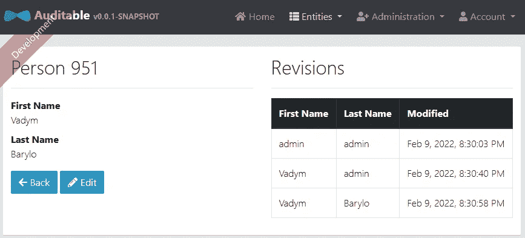
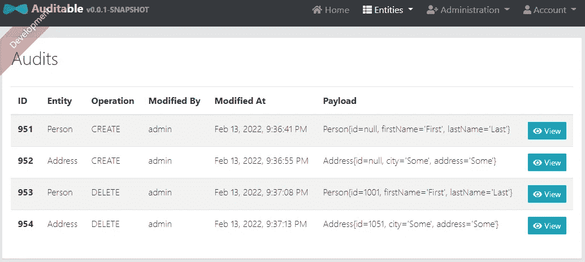
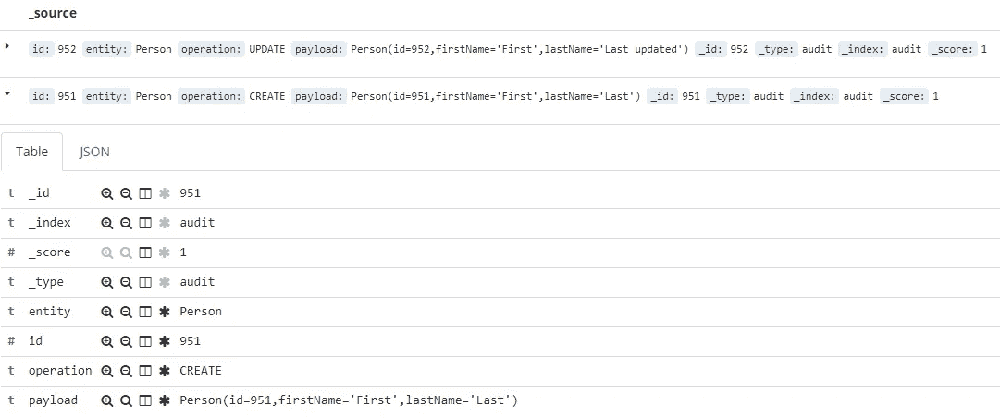
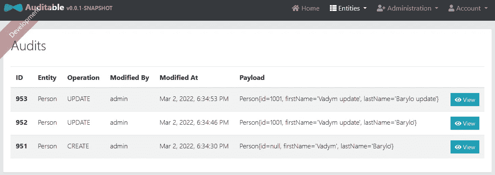
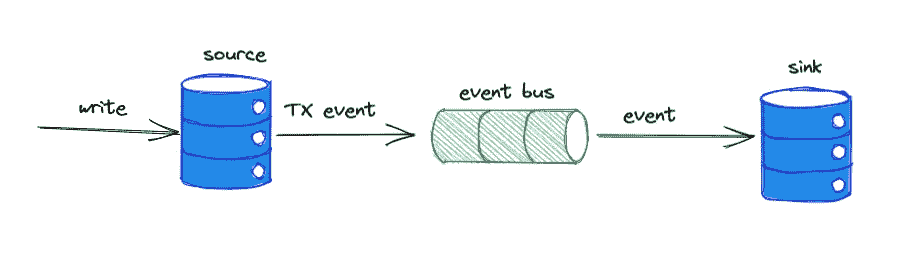

# 用 Spring 管理领域模型变更的历史

> 原文：<https://levelup.gitconnected.com/manage-a-history-of-domain-model-changes-with-spring-609d2613fc7d>

由 [Unsplash](https://unsplash.com?utm_source=medium&utm_medium=referral) 上的[Cup 先生/杨奇煜·巴拉](https://unsplash.com/@iammrcup?utm_source=medium&utm_medium=referral)拍摄的照片

您是否有在您的系统中跟踪所有域转换事件的实践:什么被改变了，什么时候被改变了，谁发起了这个改变？

可能在项目生命周期的开始，产品管理团队对它没什么兴趣，但是在事件调查期间，它变成了一个非常大的可观察性问题。

如果第一天不支持，最终可以添加支持。我调查了几个与 Spring Boot 生态系统相关的选项。

# Hibernate 审计支持

[Envers](https://hibernate.org/orm/envers/) 是 Hibernate 家族的一个库，为数据库实体提供审计和版本控制支持。Spring 通过为 Spring Data project "**org . Spring framework . Data:Spring-Data-en vers**"库提供额外的扩展来简化审计的采用。

## 步骤:

*   添加“**org . spring framework . data:spring-data-en vers**”库
*   用 *@Audited* 注释来修饰实体类(如果只需要一个子集，则注释特定的字段)。

*   扩展 JPA 配置以支持审计

*   使用附加接口扩展实体存储库

*   注册 Luquibase 启动脚本以创建附加表来存储修订

就是这样。

所以这个选项被选为最简单的一个。每次用户更新特定实体时，带有附加元数据的修订信息会自动存储在相应的表中。

另外，我们还扩展了实体存储库来管理修订，因此我们可以扩展 GET API 来包含对搜索到的实体的修订，然后在查看其详细信息时将其显示为附加信息。

查看人员时显示修订

这种方法的主要缺点(在我看来)是缺乏灵活性和配置选项来覆盖更复杂的情况。所有的魔法都发生在引擎盖下，暴露出足够低的扩展点来改变一些行为。

例如，在大多数情况下，我只需要在单个表中保存所有实体类型的所有变更的历史记录，包括该变更的发起者，以便使用单独的数据存储库轻松地操作这些数据。

## 监听 JPA 实体事件

第二种方法——引入一些简单的机制来监听我们感兴趣的所有 JPA 实体的所有变更事件。这就引入了一个拥有自己职责的域实体—跟踪、聚合、过滤域事件的历史。

这种方法的好处是添加了单独的独立垂直切片，因此我们可以控制这种跟踪的许多方面——要跟踪的实体列表、数据预处理、变更启动程序等。

**步骤:**

*   声明审计模型和围绕它的所有管理服务集(控制器、存储库等)。类定义可以类似于:

*   将所需的实体注释为可审计的，并在侦听器中捕获所需的事件，并存储为审计日志

因此，我们可以用额外元信息扩展审计日志，比如这个变更的发起者。这为保留足够用于事件调查的相关审核日志定义提供了更大的灵活性。

审计日志

这种方法的显著缺点:

*   侦听器被集成到实体生命周期中，因此会影响整体处理性能。一些减轻性能下降的异步模式需要更复杂的包装器
*   JPA 本身支持事件监听器，但不是通过 Spring，所以在这里不能轻易使用 Spring 依赖注入功能。这需要一些额外的工作来注入额外的模块和额外的支持成本。

## 听取 JPA 实体事件，修订解决方案

简单并不总是有效的。如果回顾以前的两种解决方案，我们可以争论是否有必要使用全部的 [ACID](https://en.wikipedia.org/wiki/ACID) 能力来存储实体事件。

不是审计日志更接近这里的[基](https://en.wikipedia.org/wiki/Eventual_consistency)范式吗？对于这种类型的实体，引用完整性和事务成本如何？保留策略呢？我们真的需要无限期地保存日志或者执行一些清理工作吗？如何使用全文搜索和更复杂的数据聚合来检查特定的数据窗口而不是事件本身？从性能角度以及额外的支持工作来看，成本太高？

下一个解决方案只是对现有事件侦听器解决方案的一个小升级。唯一的变化是——我们没有围绕这个特性引入任何额外的域实体，而是将事件作为日志发布，并将它们发送到集中的 Elasticsearch 服务器:

所以我们得到了许多有用的好处:

*   实体管理操作没有性能开销—发布单个日志条目是唯一需要的额外工作
*   非 Spring 侦听器中不再有 Spring DI 挑战
*   Kibana 查询语言 vs SQL 来操作文本数据——此处不再赘述
*   针对自制 SQL 作业的 Kibana 索引保留策略—此处不再赘述

因此，如果对数据一致性和数据丢失容忍度的要求不严格，这是一个很好的解决方案(万一服务中断，日志没有被发送到集中服务，一些实体事件可能会在“日志收集器间隔”时间窗口内丢失)。

为了将应用程序日志与审计日志完全分开，我们可以配置我们单独的日志回溯配置，然后直接写入另一个日志目的地，只需正确初始化日志记录器:`Logger log = LoggerFactory.getLogger("audit-logs")`

如果需要更强的一致性保证，我们可以实现自己的数据存储库，将 Elasticsearch 作为数据源。

首先，我们需要包含`spring-boot-starter-data-elasticsearch`，Spring starter 将完成所需的大部分功能。一些额外的附加步骤在这里很好的解释了[。](https://www.baeldung.com/spring-data-elasticsearch-tutorial)

然后我们可以使用`ElasticsearchRepository`来继承获得所有需要的 API 来管理 Elasticsearch 中的数据。

因此，每个事件都可以单独处理，并通过使用专门的数据存储库和预先配置的方案(搜索索引将自动创建)添加到 Elasticsearch 中。稍后，可以通过创建相应的索引模式在 Kibana 中检查这些数据。

审计索引

或者将数据从 Elasticsearch 加载到客户端，作为对添加的新域实体的完全支持(仅使用专用存储)

审计

请注意，这个解决方案仍然使用来自父执行器的事务上下文，所以会影响性能，因为需要完成两个操作。跳过这个上下文—这个流程可以通过实现发布/订阅模式进行一点扩展。更改不会立即持久化，而是作为 ApplicationContext 事件发布，然后由特定的使用者持久化它。因此，我们不仅可以跳过事务边界，还可以使用另一个线程进行更改处理。但是像往常一样，依赖于强烈的一致性要求。

## 疾病控制中心和事件流

CDC(变更数据捕获)可以被认为是将实际数据管理环境与历史事件管理分离的解决方案。CDC 建立在 RDS 发布/订阅本地支持之上，允许监听确切的表更改，并将这些更改作为事件流正确传输到另一个存储以供进一步处理。

这使得对跟踪历史数据的支持对于被观察系统来说是完全透明的，在业务和数据层面上没有变化。

正确配置后，sinkDB 将从 sourceDB 收集所有变更事件，以供进一步分析。这使我们可以根据我们需要的数据聚合工作的类型，自由选择分析存储的类型。

从我的角度来看，当需要关注点分离时，这个解决方案是最可靠的:数据管理和分析(报告)。这种方法不会因为复杂的分析处理而影响数据管理性能，因为数据和历史存储在不同的区域。