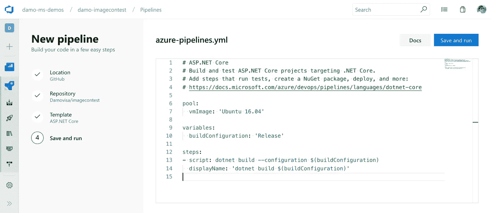

# 使用 Azure YAML 管道管理应用服务插槽

> 原文：<https://levelup.gitconnected.com/manage-appservice-slots-with-azure-yaml-pipelines-3fb2a2e5da9a>



YAML 管道是在 Azure DevOps 中构建 CI/CD 管道的新方式。虽然它们没有经典管道所拥有的漂亮的 GUI，但是这些 YAML 管道是你的源代码的一部分，可以很容易地被共享，这一事实完全补偿了这一点。

在本文中，我将使用 YAML 管道来演示如何基于分支名称动态创建 AppService 槽，以及如何为合并回主服务器的分支清理槽。

# 创建一个应用服务槽

第一步是创建插槽，但是为了能够做到这一点，我们需要知道插槽的名称应该是什么。所以第一步的第一步就是从分支名称中提取那个名称。在我的例子中，我使用下面的命名约定

```
<type>/<scope>-<keyword/description>
```

其中`scope`是唯一的数字，并且是命名槽的理想候选。幸运的是，Azure 通过向管道提供大量[信息](https://docs.microsoft.com/en-us/azure/devops/pipelines/process/variables?view=azure-devops&tabs=yaml%2Cbatch)，比如分支名称的最后一段:`[Build.SourceBranchName](https://docs.microsoft.com/en-us/azure/devops/pipelines/build/variables?view=azure-devops&tabs=yaml)`，让我们的生活变得简单。有了这些信息，使用一个 [bash 任务](https://docs.microsoft.com/en-us/azure/devops/pipelines/tasks/utility/bash?view=azure-devops)来提取名字并不困难。

从分支名称中提取插槽名称的模板

注意,`[##vso](https://docs.microsoft.com/en-us/azure/devops/pipelines/process/variables?view=azure-devops&tabs=yaml%2Cbatch)`标签用于将提取的槽名放入一个变量中，使其对我们的管道可用。在本文的后面，我们必须再次提取插槽的名称，不是从分支名称，而是从提交消息。所以在我们继续之前，我已经将这个片段重写为一个可重用的 Azure 模板

确定 Azure 模板中的插槽名称

该模板需要两个参数，`input`是包含插槽名称的字符串，`slotRegexp`是可以提取该名称的正则表达式。该模板可以按如下方式使用

使用提取插槽名称模板的管道代码段

最后，使用一个 [Azure CLI 任务](https://docs.microsoft.com/en-us/azure/devops/pipelines/tasks/deploy/azure-cli?view=azure-devops)，可以如下创建插槽

创建应用服务插槽

这里棘手的部分可能是我如何引用插槽名称。其工作方式是在提取插槽名称的作业上添加一个依赖项(`dependsOn: setup`)，并使插槽名称再次可用(`slotName`)。同样值得注意的是，在这些示例代码片段中变量引用方式的细微差别，比如`$(..) ${{..}} $[..]`，在这里[会有更详细的解释](https://docs.microsoft.com/en-us/azure/devops/pipelines/process/expressions?view=azure-devops)。

# 移除应用服务插槽

当您将分支合并回主服务器时，就会出现清理插槽的情况。但是，当您压缩所有提交并进行合并时，关于源分支的所有信息都会在管道中丢失。所以这一次我们需要关注合并提交消息。我遵循[语义提交消息](https://gist.github.com/joshbuchea/6f47e86d2510bce28f8e7f42ae84c716)的指导方针，所以当我合并时，我写消息如下

```
test(1234): improve test quality
```

这与我们在上一节中所做的或多或少是相同的，除了我们必须稍微改变正则表达式并使用`Build.SourceVersionMessage`来代替。

现在可以用一个 [Azure CLI 任务](https://docs.microsoft.com/en-us/azure/devops/pipelines/tasks/deploy/azure-cli?view=azure-devops)再次移除该插槽。下面我把这个任务写成一个模板，用槽名作为输入参数:

# 管道

到目前为止，我只写了一些东西，当然是一个更大的过程的一部分，整个管道。这个主题对于一篇文章来说太大了，但是对于那些对如何将所有东西结合在一起感兴趣的人，我还是会在这里添加我的两条管道:

**分支部署到槽管线**:

分支部署管道

**主部署和插槽清理管道**:

主部署管道