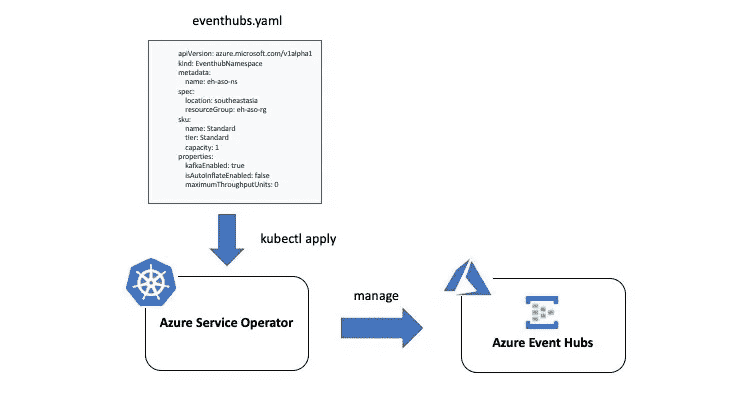

# 通过 Kubernetes 上的 Azure 服务运营商管理 Azure 活动中心

> 原文：<https://levelup.gitconnected.com/manage-azure-event-hubs-with-azure-service-operator-on-kubernetes-be61decb069>

[Azure Service Operator](https://github.com/Azure/azure-service-operator) 是一个开源项目，帮助你使用 Kubernetes 提供和管理 Azure 服务。开发人员可以使用它从任何环境中提供 Azure 服务，无论是 Azure、任何其他云提供商还是内部部署——Kubernetes 是唯一的共同点！

它也可以作为 CI/CD 管道的一部分，按需创建、使用和拆除 Azure 资源。在幕后，所有繁重的工作都由定义 Azure 资源的[自定义资源定义](https://kubernetes.io/docs/concepts/extend-kubernetes/api-extension/custom-resources/)和相应的 [Kubernetes 操作符](https://kubernetes.io/docs/concepts/extend-kubernetes/operator/)的组合来负责，后者确保自定义资源定义定义的状态也反映在 Azure 中。



Azure 服务运营商

> *在这里阅读更多最近的公告—*[*https://cloud blogs . Microsoft . com/open source/2020/06/25/announding-azure-service-operator-kubernetes/*](https://cloudblogs.microsoft.com/opensource/2020/06/25/announcing-azure-service-operator-kubernetes/)

在这篇博文中:

*   你将获得 Azure Service Operator 的高级概述(在本博客中有时被称为`ASO`)
*   如何设置并使用它来提供 [Azure 事件中心](https://docs.microsoft.com/azure/event-hubs/?WT.mc_id=medium-blog-abhishgu)
*   将应用部署到使用 Azure Event Hubs 集群的 Kubernetes

> *本 GitHub 回购*[*https://github.com/abhirockzz/eventhubs-using-aso-on-k8s*](https://github.com/abhirockzz/eventhubs-using-aso-on-k8s)中有该代码

# 开始使用…

Azure 服务运营商支持许多 Azure 服务，包括数据库( [Azure Cosmos DB](https://docs.microsoft.com/azure/cosmos-db/introduction?WT.mc_id=medium-blog-abhishgu) 、 [PostgreSQL](https://docs.microsoft.com/azure/postgresql/overview?WT.mc_id=medium-blog-abhishgu) 、 [MySQL](https://docs.microsoft.com/azure/mysql/overview?WT.mc_id=medium-blog-abhishgu) 、 [Azure SQL](https://docs.microsoft.com/azure/azure-sql/?WT.mc_id=medium-blog-abhishgu) 等。)、核心基础架构组件([虚拟机](https://docs.microsoft.com/azure/virtual-machines/linux/overview?WT.mc_id=medium-blog-abhishgu)、[虚拟机规模集](https://docs.microsoft.com/azure/virtual-machine-scale-sets/overview?WT.mc_id=medium-blog-abhishgu)、虚拟网络等。)和其他人也一样。

它还支持 Azure Event Hubs，这是一个完全托管的数据流平台和事件摄取服务[，支持 Apache Kafka](https://docs.microsoft.com/azure/event-hubs/event-hubs-for-kafka-ecosystem-overview?WT.mc_id=medium-blog-abhishgu) 和 Kafka 生态系统中的其他工具。使用 Azure Service Operator，您可以供应和管理 Azure 事件中心名称空间、事件中心和消费者组。

所以，让我们开始吧！在我们开始之前，请注意，您需要以下内容来试用本教程:

## 先决条件

如果你还没有 Azure 帐户，那就先注册吧——你可以[免费获得！](https://azure.microsoft.com/free/?WT.mc_id=medium-blog-abhishgu)请确认你已经安装了 [kubectl](https://kubernetes.io/docs/tasks/tools/install-kubectl/) 和 [Helm 3](https://helm.sh/docs/intro/install/) 。

尽管这篇博客中概述的步骤应该适用于任何 Kubernetes 集群(包括`minikube`等)。)，我用的是 [Azure Kubernetes 服务(AKS)](https://docs.microsoft.com/azure/aks/intro-kubernetes?WT.mc_id=medium-blog-abhishgu) 。你可以使用 [Azure CLI](https://docs.microsoft.com/azure/aks/kubernetes-walkthrough?WT.mc_id=medium-blog-abhishgu) 、 [Azure portal](https://docs.microsoft.com/azure/aks/kubernetes-walkthrough-portal?WT.mc_id=medium-blog-abhishgu) 甚至是 [ARM 模板](https://docs.microsoft.com/azure/aks/kubernetes-walkthrough-rm-template?WT.mc_id=medium-blog-abhishgu)来设置一个集群。一旦完成，只需[配置](https://docs.microsoft.com/azure/aks/kubernetes-walkthrough?WT.mc_id=medium-blog-abhishgu#connect-to-the-cluster) `[kubectl](https://docs.microsoft.com/azure/aks/kubernetes-walkthrough?WT.mc_id=medium-blog-abhishgu#connect-to-the-cluster)` [指向它](https://docs.microsoft.com/azure/aks/kubernetes-walkthrough?WT.mc_id=medium-blog-abhishgu#connect-to-the-cluster)

```
az aks get-credentials --resource-group <CLUSTER_RESOURCE_GROUP> --name <CLUSTER_NAME>
```

好了，你现在可以…

# …安装 Azure 服务运营商


没有什么太花哨的…只是按照步骤使用`Helm`安装它

首先安装[证书管理器](https://cert-manager.io/docs/installation/kubernetes/)

## 设置`cert-manager`

```
kubectl create namespace cert-managerkubectl label namespace cert-manager cert-manager.io/disable-validation=truekubectl apply --validate=false -f https://github.com/jetstack/cert-manager/releases/download/v0.12.0/cert-manager.yaml//make sure cert manager is up and running
kubectl rollout status -n cert-manager deploy/cert-manager-webhook
```

## 认证…

由于操作员将在 Azure 上创建资源，我们需要通过提供适当的凭证来授权它这样做。目前，您可以使用[托管身份](https://docs.microsoft.com/azure/active-directory/managed-identities-azure-resources/overview?WT.mc_id=medium-blog-abhishgu)或[服务主体](https://docs.microsoft.com/azure/active-directory/develop/app-objects-and-service-principals?WT.mc_id=medium-blog-abhishgu#service-principal-object)

我将使用一个服务主体，所以让我们从使用 [az ad sp create-for-rbac](https://docs.microsoft.com/cli/azure/ad/sp?view=azure-cli-latest&WT.mc_id=medium-blog-abhishgu#az-ad-sp-create-for-rbac) 命令创建一个服务主体开始(使用 [Azure CLI](https://docs.microsoft.com/cli/azure/install-azure-cli?view=azure-cli-latest&WT.mc_id=medium-blog-abhishgu)

```
az ad sp create-for-rbac -n "aso-rbac-sp"//JSON output
{
  "appId": "eb4280db-4242-4ed0-a7d2-42424242f0d0",
  "displayName": "aso-rbac-sp",
  "name": "http://aso-rbac-sp",
  "password": "7d69a422-428d-42d4-a242-cd1d425424b2",
  "tenant": "42f988bf-42f1-42af-42ab-2d7cd421db42"
}
```

## 安装

设置所需的环境变量:

```
export AZURE_SUBSCRIPTION_ID=<enter Azure subscription ID>
export AZURE_TENANT_ID=<enter value from the "tenant" attribute in the JSON payload above>
export AZURE_CLIENT_ID=<enter value from the "appId" attribute in the JSON payload above>
export AZURE_CLIENT_SECRET=<enter value from the "password" attribute in the JSON payload above>
export AZURE_SERVICE_OPERATOR_NAMESPACE=<name of the namespace into which ASO will be installed>
```

添加 repo，创建命名空间

```
helm repo add azureserviceoperator https://raw.githubusercontent.com/Azure/azure-service-operator/master/chartskubectl create namespace $AZURE_SERVICE_OPERATOR_NAMESPACE
```

使用`helm upgrade`启动设置:

```
helm upgrade --install aso azureserviceoperator/azure-service-operator \
-n $AZURE_SERVICE_OPERATOR_NAMESPACE \
--set azureSubscriptionID=$AZURE_SUBSCRIPTION_ID \
--set azureTenantID=$AZURE_TENANT_ID \
--set azureClientID=$AZURE_CLIENT_ID \
--set azureClientSecret=$AZURE_CLIENT_SECRET
```

在继续之前，请等待 Azure 服务操作器`Pod`启动

```
kubectl get pods -n $AZURE_SERVICE_OPERATOR_NAMESPACENAME                                              READY   STATUS    RESTARTS   AGE
azureoperator-controller-manager-68f44fd4-cm6wl   2/2     Running   0          6m
```

# 设置 Azure 事件中心组件…

从克隆回购开始:

```
git clone https://github.com/abhirockzz/eventhubs-using-aso-on-k8s
cd eventhubs-using-aso-on-k8s
```

创建一个 [Azure 资源组](https://docs.microsoft.com/azure/azure-resource-manager/management/overview?WT.mc_id=medium-blog-abhishgu#resource-groups)

> *我已经使用了* `*southeastasia*` *位置。如果需要使用不同的*，请更新 `*eh-resource-group.yaml*`

```
*kubectl apply -f deploy/eh-resource-group.yaml//confirm that its created
kubectl get resourcegroups/eh-aso-rg*
```

*创建[事件中心名称空间](https://docs.microsoft.com/azure/event-hubs/event-hubs-features?WT.mc_id=medium-blog-abhishgu#namespace)*

> **我已经用* `*southeastasia*` *定位了。如果您需要使用不同的*，请更新 `*eh-namespace.yaml*`*

```
**kubectl apply -f deploy/eh-namespace.yaml//wait for creation
kubectl get eventhubnamespaces -w**
```

**完成后，您应该会看到:**

```
**NAME        PROVISIONED   MESSAGE
eh-aso-ns   true          successfully provisioned**
```

**您可以使用`kubectl describe eventhubnamespaces`获得详细信息，也可以使用 [az eventhubs 名称空间 show](https://docs.microsoft.com/cli/azure/eventhubs/namespace?view=azure-cli-latest&WT.mc_id=medium-blog-abhishgu#az-eventhubs-namespace-show) 进行复查**

**名称空间已经准备好了，我们现在可以创建一个事件中心**

```
**kubectl apply -f deploy/eh-hub.yamlkubectl get eventhubs/eh-aso-hub//once done...
NAME        PROVISIONED   MESSAGE
eh-aso-hub  true          successfully provisioned**
```

**您可以使用`kubectl describe eventhub`获得详细信息，也可以使用[az event hubs event hub show](https://docs.microsoft.com/cli/azure/eventhubs/eventhub?view=azure-cli-latest&WT.mc_id=medium-blog-abhishgu#az-eventhubs-eventhub-show)进行复查**

**最后一步，创建消费者组**

> ***这是对默认消费群体的补充(适当命名为* `*$Default*` *)***

```
**kubectl apply -f deploy/eh-consumer-group.yamlkubectl get consumergroups/eh-aso-cgNAME        PROVISIONED   MESSAGE
eh-aso-cg  true          successfully provisioned**
```

**您可以使用`kubectl describe consumergroup`获得详细信息，也可以使用 [eazventhubs eventhub 消费者小组秀](https://docs.microsoft.com/cli/azure/eventhubs/eventhub/consumer-group?view=azure-cli-latest&WT.mc_id=medium-blog-abhishgu#az-eventhubs-eventhub-consumer-group-show)进行复查**

# **下一步是什么？**

**让我们利用我们刚刚设置的东西！我们将向 Kubernetes 部署一对生产者和消费者应用程序，它们将分别从事件中心发送和接收消息。这两个客户端应用程序都是用 [Go](https://golang.org/) 编写的，并使用[用于 Kafka](https://github.com/Shopify/sarama/) 的 Sarama 库。我不打算深究细节，因为它们相对简单**

**部署消费者应用程序:**

```
**kubectl apply -f deploy/consumer.yaml//wait for it to start
kubectl get pods -l=app=eh-consumer -w**
```

**跟踪消费者应用程序的日志:**

```
**kubectl logs -f $(kubectl get pods -l=app=eh-consumer --output=jsonpath={.items..metadata.name})**
```

**您应该会看到类似如下的内容:**

```
**Event Hubs broker [eh-aso-ns.servicebus.windows.net:9093]
Sarama client consumer group ID eh-aso-cg
new consumer group created
Event Hubs topic eh-aso-hub
Waiting for program to exit
Partition allocation - map[eh-aso-hub:[0 1 2]]**
```

**使用另一个终端，部署生成器应用程序:**

```
**kubectl apply -f deploy/producer.yaml**
```

**一旦生产者应用程序启动并运行，消费者就应该启动，开始消费消息，并将它们打印到控制台。因此，您将看到类似于以下内容的日志:**

```
**...
Message topic:"eh-aso-hub" partition:0 offset:6
Message content value-2020-07-06 15:37:06.116674866 +0000 UTC m=+67.450171692
Message topic:"eh-aso-hub" partition:0 offset:7
Message content value-2020-07-06 15:37:09.133115988 +0000 UTC m=+70.466612714
Message topic:"eh-aso-hub" partition:0 offset:8
Message content value-2020-07-06 15:37:12.149068005 +0000 UTC m=+73.482564831
...**
```

> ***如果你也想检查生产者日志:* `*kubectl logs -f $(kubectl get pods -l=app=eh-producer --output=jsonpath={.items..metadata.name})*`**

**好吧，成功了！**

*   **我们创建了一个事件中心名称空间、事件中心和一个消费者组..全部使用`kubectl`(当然还有 YAMLs)**
*   **部署一个简单的生产者和消费者进行测试**

# **但是，刚刚发生了什么…？**

**…消费者和生产者应用程序如何在没有连接信息、凭证等的情况下连接到事件中心？？**

****

**请注意事件中心清单的这一部分(`eh-hub.yaml`文件):**

```
**...
spec:
  secretName: eh-secret
  location: southeastasia
  resourceGroup: eh-aso-rg
...**
```

**`secretName: eh-secret`确保创建了一个 Kubernetes `Secret`，其中包含所需的连接细节，包括连接字符串(主要、次要)、密钥(主要、次要)，以及基本信息，如事件中心名称空间和中心名称。**

**生产者和消费者可以简单地参考这个。看看这个来自消费者应用`Deployment`的片段**

```
**...
      containers:
        - name: eh-consumer
          image: abhirockzz/eh-kafka-consumer
          env:
            - name: EVENTHUBS_CONNECTION_STRING
              valueFrom:
                secretKeyRef:
                  name: eh-secret
                  key: primaryConnectionString
            - name: EVENTHUBS_NAMESPACE
              valueFrom:
                secretKeyRef:
                  name: eh-secret
                  key: eventhubNamespace
            - name: EVENTHUBS_BROKER
              value: $(EVENTHUBS_NAMESPACE).servicebus.windows.net:9093
            - name: EVENTHUBS_TOPIC
              valueFrom:
                secretKeyRef:
                  name: eh-secret
                  key: eventhubName
            - name: EVENTHUBS_CONSUMER_GROUPID
              value: eh-aso-cg
...**
```

**该应用程序使用环境变量`EVENTHUBS_CONNECTION_STRING`、`EVENTHUBS_NAMESPACE`和`EVENTHUBS_TOPIC`，它们的值来源于秘密(`eh-secret`)。`EVENTHUBS_CONSUMER_GROUPID`的值被硬编码为`eh-aso-cg`，这是在`eh-consumer-group.yaml`中指定的消费群体的名称。**

## **打扫**

**要删除所有资源，包括事件中心和客户端应用程序，只需使用`kubectl delete -f deploy`**

# **结论**

**Azure Service Operator 在特定于 Azure 的原语之上提供了一个抽象层。它允许您管理 Azure 资源，还提供了使用部署在同一个 Kubernetes 集群中的其他应用程序连接到这些资源的方法。**

**我以 Azure Event Hubs 为例，但是正如我前面提到的，Azure Service Operator 也支持其他服务。前往[GitHub repo](https://github.com/Azure/azure-service-operator)并给他们一个尝试！**