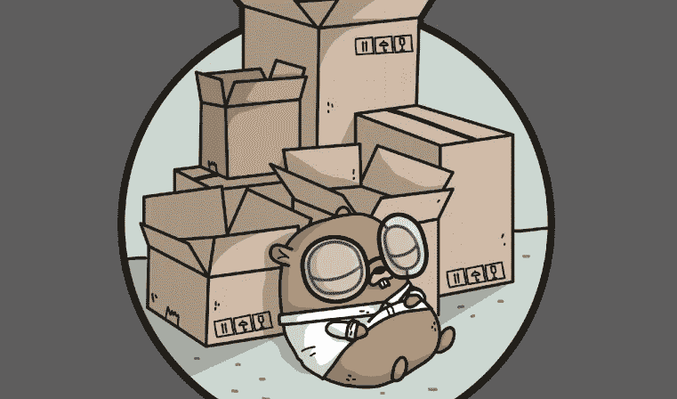

# 使用 Docker 和 VS 代码远程容器中的 Go Dep 管理 Go 依赖关系

> 原文：<https://levelup.gitconnected.com/manage-go-dependencies-with-dep-within-docker-and-vscode-remote-containers-cc0fedd627f2>



## [安息吧](/go-restful-series-a7addbfef5b1) — #4

有了一个全时本地质量的 VSCode 驱动的容器化开发环境，在本文中，我将建立一个 Go 依赖管理机制，它可以与现有技术、Docker 和 VS Code 远程容器很好地集成。

# 依赖性管理

使用开源或第三方组件可以节省数月或数年的开发时间。然而，由于依赖于外部包，您必须控制是否将一些包升级到较新的版本以修复安全问题，或者将它们锁定在某个版本以避免不兼容。第三方组件也有其依赖性，这确实会让您在管理它们时遇到麻烦。

因此，现代编程语言通常会有一个依赖管理工具来帮助解决上述问题，例如 Javascript 有`npm`或`yarn`。我在围棋中寻找类似的东西。

# go-dep —“官方实验”go 依赖管理

幸运的是，谷歌正在开发和试验`go-dep`作为他们官方的依赖管理工具。虽然是实验性的，`go-dep`很稳定。

简而言之，`go-dep`是在`Go`中实现的，所以您可以使用`go get`命令轻松安装它。作为依赖管理工具，`go-dep`帮助开发者解决典型的依赖管理用例:

*   自动检测依赖关系图并获取适当的依赖关系。
*   自动锁定依赖项的版本，以生成可重现的版本。
*   允许开发人员升级和降级依赖项的版本，并自动重新生成锁。

如何使用`go-dep`超出了本文的范围。更多详情请参考其[文档](https://golang.github.io/dep/)。

# 将 go-dep 安装到开发容器

决定使用`go-dep`，我将它预安装到开发映像中。很简单，我只是在当前的`Dockerfile`上加上`go get github.com/golang/dep/cmd/dep`。

# 用 go-dep 初始化项目

要开始使用`go-dep`，我必须用一些必需的文件预填充项目。幸运的是，`go-dep`实现了一个有助于做到这一点的命令。

```
dep init
```

在项目的根目录下运行上述命令将创建两个新文件`Gopkg.toml`和`Gopkg.lock`，其中包含一些初始内容。这已经足够好了，我正在将它们提交到存储库中。

# 更新 VS 代码. devcontainer.json

接下来，我将更新`.devcontainer.json`以便在开发容器启动后运行`dep ensure`，这样当我第一次打开它时，项目的所有依赖项都将被正确地预填充。我只是把`"postCreateCommand": "dep ensure"`加到`.devcontainer.json`上。

还有另外两个重要的更新字段，`workspaceMount`和`workspaceFolder`。默认情况下，VS 代码将在默认工作区目录`/root/workspaces/go-restful`中发出`postCreateCommand`，这不是一个带有`go-dep`的有效位置，它必须在`$GOPATH` ( `/go`)内。所以我也必须适当地更改这些字段。

# 更新。gitignore 和 VC 代码配置

添加`go-dep`引入了一些应该从 Git 或 VS 代码中忽略的新组件:

*   `Gopkg.lock`是自动生成的锁定文件，不得手动编辑。我从 VS 代码里忽略了。
*   `vendor`目录存储依赖关系。我从 VS 代码和`.gitignore`两方面都忽略了。

```
*# .vscode/settings.json*
{
   "files.exclude": {
      ... others,
     "Gopkg.lock": **true**,
     "vendor": **true**
} *# .gitignore*
... others
vendor/
```

# 我可以走了！

现在，与开发环境相关的一切看起来都足够好了。关于一些初始实现，下次再见。

本文的完整源代码发布在[这里](https://github.com/the-evengers/go-restful/tree/41b3172af912a36643f9b578bdcf242fccabccf6)。