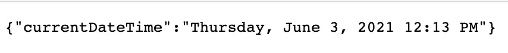

# 使用 IaC 管理您的 AWS Lambda 层

> 原文：<https://levelup.gitconnected.com/manage-your-aws-lambda-layers-with-iac-4094e75f5ae8>

## 拯救世界的无服务器框架和平台


在 [Unsplash](https://unsplash.com?utm_source=medium&utm_medium=referral) 上 [A Cruikshank](https://unsplash.com/@cruik?utm_source=medium&utm_medium=referral) 拍照

在构建应用程序时，我们努力实现运行速度更快的自动化，以便开发人员可以尽快看到他们的更改。使用 AWS Lambda 可以让开发人员更关注业务逻辑，而不是如何修补服务器。

AWS Lambda 的一个限制是部署包的大小，目前限制在 50MB。如果开发人员正在安装软件包以使他们的代码工作，这可能是一个问题，这正是 Lambda 层的救援之处。

> [Lambda 层是一个. zip 文件档案，可以包含额外的代码或数据。层可以包含库、自定义运行时、数据或配置文件。层促进代码共享和职责分离，以便您可以更快地迭代编写业务逻辑。](https://docs.aws.amazon.com/lambda/latest/dg/configuration-layers.html)

# 但是我们如何将 Lambda 层添加到我们的自动化过程中呢？

通过组合[无服务器框架](https://www.serverless.com/)和 [Terraform](https://www.terraform.io/) ，我们可以轻松管理我们的 Lambda 层，并在此过程中加快我们的部署过程，而不会影响我们开发人员的工作效率。

*以下假设你了解无服务器框架和 Terraform 的基础知识。*

要使用无服务器框架定义您的层，您需要在您的`serverless.yml`文件中添加以下内容:

```
layers:
  myCustomLayer:
    path: layers/my-custom-layer
    name: myCustomLayer
    compatibleRuntimes:
     - nodejs14.x
```

*你可以使用*[*AWS Lambda*](https://docs.aws.amazon.com/lambda/latest/dg/lambda-runtimes.html)*支持的任何运行时。*

以上意味着您的层代码或库应该位于路径`layers/my-custom-layer`中，并根据[选择的运行时](https://docs.aws.amazon.com/lambda/latest/dg/configuration-layers.html)遵循正确的文件结构。

现在你可能会问为什么我们要结合无服务器框架和 Terraform。答案是，我发现命令`sls package`对于创建我们的 Lambda 函数/层的包部署非常有用，然后使用 Terraform 进行部署。

要使用 Terraform 创建图层，您需要添加以下内容:

```
resource "aws_lambda_layer_version" "my_custom_layer" {
  filename   = "path/to/layer/zip/file"
  layer_name = myCustomLayer
  source_code_hash = filebase64sha256("path/to/layer/zip/file")
  compatible_runtimes = ["nodejs14.x"]
}
```

在 Lambda 函数中引用:

```
resource "aws_lambda_function" "my_custom_function" {
  filename = "path/to/lambda/zip/file"
  function_name = "myCustomFunction"
  role = aws_iam_role.role.arn
  handler = "handler"
  source_code_hash = filebase64sha256("path/to/lambda/zip/file")
  layers = [aws_lambda_layer_version.my_custom_layer.arn]
  runtime = "nodejs14.x"
  memory_size = 1024
  timeout = 30
}
```

# Lambda 层的自动化过程现在已经完成。

如果您进行了部署，但 Lambda 图层文件夹没有任何更改，Terraform 将不会为您的图层创建新版本。如果有变化，它将更新版本，您的 Lambda 函数将正确引用新版本。

如果层的运行时是 Node.js，这就是如何用 Bash 脚本部署您的解决方案:

```
echo -e "\n--- Install layers packages---\n"
cd layers/myCustomLayer/nodejs
npm install
cd ../../..echo -e "\n--- Packaging lambda ---\n"
sls packageecho -e "\n--- Applying terraform ---\n"
cd infrastructure
terraform init -input=false
terraform apply -input=false -auto-approve
cd ../
```

这里有一个[的完整例子](https://github.com/jagonzalr/manage-lambda-layers)。回购的代码创建了一个小 API，使用 [Moment.js](https://momentjs.com/) 返回当前日期和时间。基础设施构建了一个带有 API Gateway 的端点，一个包含 NPM 包`moment`的 Lambda 层和一个使用该层并返回日期和时间的 Lambda 函数。

部署解决方案后，您可以在浏览器中使用如下 URL 调用 API:

```
[https://[unique-id].execute-api.[aws-region].amazonaws.com/dev/getCurrentDateTime](https://nxdpqb3lcd.execute-api.us-east-1.amazonaws.com/dev/getCurrentDateTime)
```

响应应该类似于:



希望你喜欢这篇文章，并保持自动化和节省时间🎉

[](https://blog.jagonzalr.com/membership) [## 加入我的介绍链接媒体-何塞安东尼奥冈萨雷斯罗德里格斯

### 作为一个媒体会员，你的会员费的一部分会给你阅读的作家，你可以完全接触到每一个故事…

blog.jagonzalr.com](https://blog.jagonzalr.com/membership)