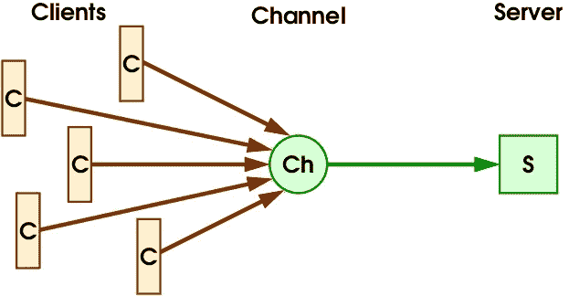
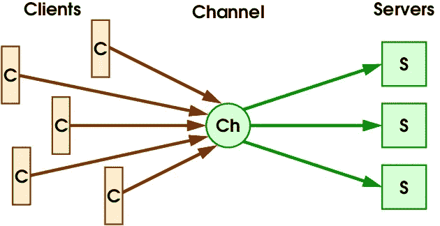
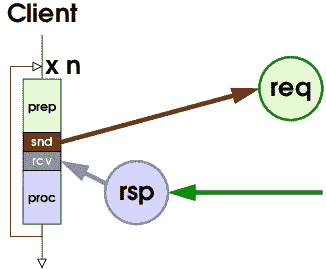
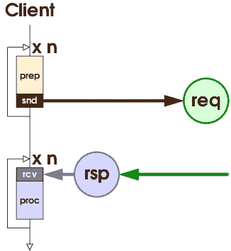
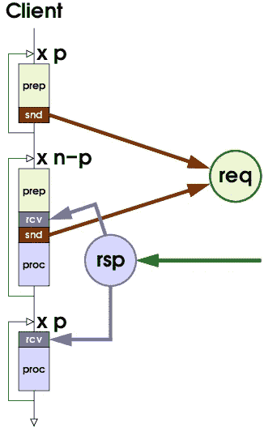
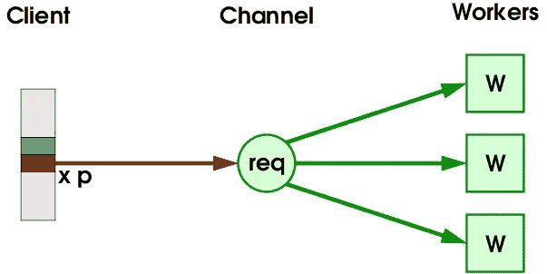
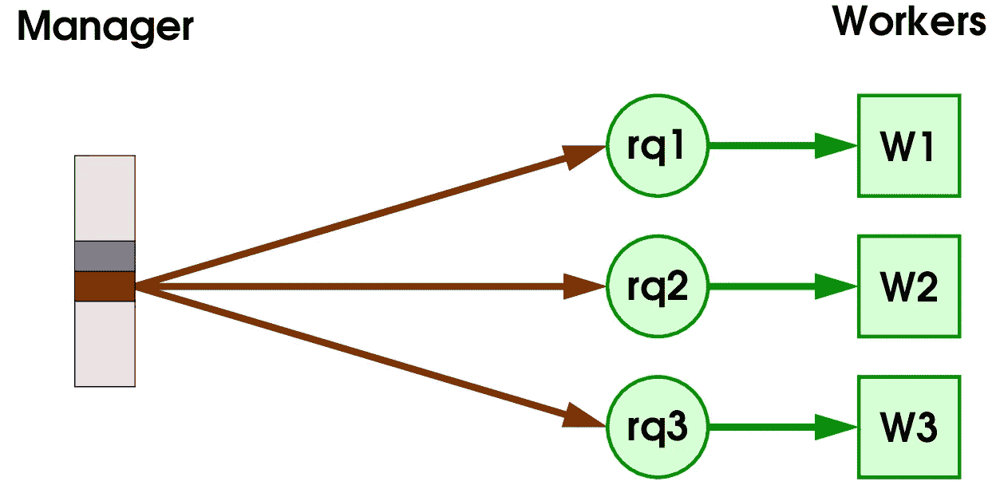
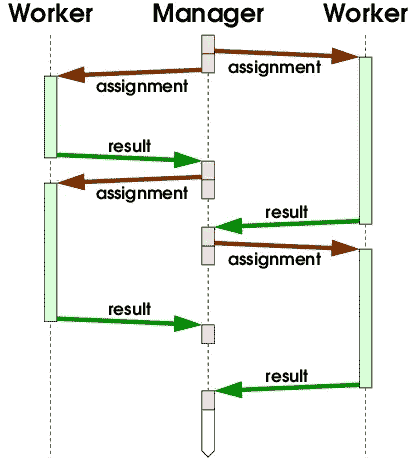
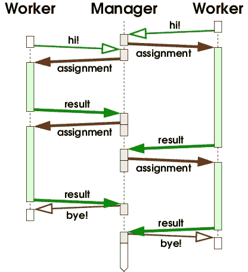

# 经理-员工沟通模式

> 原文：<https://levelup.gitconnected.com/manager-worker-communication-patterns-c3580b9db5db>

管理器-工作器是一种简单的在大量计算机上分配特定类型问题计算的方式。我在这里提出抽象的概念。这将使您能够采用和适应编程语言中的模式以及您选择的通信机制。

*术语注释:*您可能听说过这些模式的传统名称，主工人。同样的事情。我自己一直用这个名字，直到 2020 年。经过重新考虑，我发现经理不仅更准确，而且[更体贴](https://medium.com/better-marketing/are-you-using-racist-language-in-your-content-unknowingly-664df6fab443)。所以这就是我现在要做的。

这个故事的第一部分分三步把我们从客户机-服务器模式带到了经理-工人模式。第二部分介绍了经理-员工的两种基本模式，“推”和“拉”，以及针对不同场景调整这些模式的一些方法。第三部分简要讨论了如何运用不同的沟通方式来实现管理者与员工之间的沟通。这个故事以一个总结结束。

# 第 1 部分:实现目标

可以说，客户机-服务器是最普遍和最熟悉的通信模式。从这个模式开始，我将应用三个修改，以一个经理-工人模式结束。在这个过程中，你会了解到雇佣经理型员工的先决条件。

在客户机-服务器中，我们有两种类型的参与者。服务器实现供客户端使用的服务。客户端向服务器发送请求，服务器在执行服务后发回响应。通常有多个客户端。我们将从一台服务器开始。

客户端向一个服务器正在侦听的通道发送请求。(所有图表均由作者提供)

该图显示了客户端向通道发送请求，服务器从通道接收请求。信道代表到达服务器的任何种类的通信机制。把它想象成一个地址。它可以是主机名和要连接的端口，或者是消息队列，或者完全是其他东西。为了清楚起见，图中省略了响应。通信机制通常提供一种方式，通过双向连接将响应发送回回复队列或其他位置。

## 多个服务器实例

只运行一个服务器进程是一种边界情况，它有严格的限制。该过程只能处理有限的工作量。如果它崩溃，该服务将变得不可用，直到替换过程开始。因此，您应该始终计划运行多个服务器进程。如果您在阅读客户机-服务器时马上想到了这种情况，那很好。😀

客户端向多个服务器正在侦听的通道发送请求。

该图显示了从同一通道接收请求的多个服务器。客户端发送的每个请求都会准确地到达其中一个服务器。对于客户端来说，哪个服务器接收请求并不重要。所有服务器都实现相同的逻辑，运行相同的代码。它们是同一服务的不同实例。

为了获得最大的可靠性，您会希望在分散在世界各地的不同数据中心的独立机器上运行服务器实例，使用独立的电源。在这些设置中，图中的通道包含许多功能。将会有负载平衡器、代理或队列管理器，它们从一台机器上的客户机接收请求，并将它们转发到运行服务器的机器上。

然而，对于通信模式，不需要分布式服务器。如果您只运行一个多线程服务器进程，该进程通过 TCP 接收请求，并将请求传递给同一地址空间中的一个工作线程池，那么该模式也适用。那么信道可以像网络中单个机器上的服务器套接字一样简单。

## 来自一个客户端的多个请求

在上图中，每个客户端只发送一个请求。当然，一个客户端也可以发送多个请求。对于服务器来说，请求是来自同一个还是不同的客户机并不重要。为了让我们更接近经理-工人模式，我将讨论一个更具体的情况:一个客户机可以在一个循环中发送许多请求。

无并行性:发送请求和接收响应的循环。

该图将焦点放在带有循环的客户端上。它显示请求和响应。绿色通道“req”表示请求，绿色箭头表示向通道“rsp”发送响应。在循环体中，客户端准备并发送一个请求，然后等待收到并处理回复。在客户端继续前进之前，这重复了若干次( *n* )。在任何时间点，服务器端最多只有一个来自这个客户端的请求。尽管服务器可以并行处理多个请求，但是这个客户机没有利用这一点。

如果客户机需要来自响应的数据来准备下一个请求，我们对并行性无能为力。循环必须顺序执行，请求必须顺序服务。然而，存在这样的问题，其中循环迭代是彼此独立的，并且可以以任何顺序并行执行，具有大量的迭代。这种性质的问题被称为*令人尴尬的并行*，[意为](https://english.stackexchange.com/a/83683/409788)“过多的并行”。令人尴尬的并行问题的例子包括图形计算，如[光线跟踪](https://medium.com/iete-sf-mec/ray-tracing-a-step-closer-to-realism-9ff7db3ae3b9)或 [Mandelbrot 集合图像](https://medium.com/swlh/a-meditation-on-the-mandelbrot-set-45fcb52ab673)，其中视频序列中每一帧的每个像素都可以并行计算。或者强力加密挑战，比如基于[工作证明](https://medium.com/cryptronics/proof-of-work-is-not-a-consensus-protocol-understanding-the-basics-of-blockchain-consensus-30aac7e845c8)挖掘加密货币。或者在天文数据中搜索感兴趣的信号[。或者用](https://www.seti.org/breakthrough-listen-and-uc-berkeley-seti-research-center-announce-open-format-data-release)[超参数优化](https://medium.com/pytorch/accelerate-your-hyperparameter-optimization-with-pytorchs-ecosystem-tools-bc17001b9a49#274b)的机器学习，至少对某些算法是这样的。或者在大数据上的一个 [MapReduce](https://medium.com/edureka/mapreduce-tutorial-3d9535ddbe7c) 计算中的许多 map 和 reduce 任务。

*注意:*令人尴尬的并行问题，以及相关的[循环级并行](https://en.wikipedia.org/wiki/Loop-level_parallelism)，不一定是关于请求和响应，而是关于一般的循环迭代。但是，如果您在发送请求和处理响应的循环中发现了循环级并行性，或者如果您可以将计算从循环内部转移到服务器，那么您就可以使用管理器-工作器通信了。

无限并行:发送请求的循环，后面是接收响应的循环。

当循环中的所有请求都是独立的时，您可以简单地将它们全部发送出去，然后在第二个循环中收集响应，如图所示。这将最大限度地利用服务器端的并行性。如果请求的数量很少，比如最多十几个，您可能会侥幸成功。但是如果这个数字是几千或几百万，你会淹没在服务器端的请求中。在客户端，您也可能会遇到内存问题。最肯定的是，服务器运营商会认为您的客户端是一种需要阻止的拒绝服务攻击。因此，这种无界并行是一个坏主意。

有界并行性:发送请求、接收响应和发送后续请求以及接收剩余响应的循环。

一个明智的方法是用一个合理的边界来限制并行性。在图中，客户端使用了三个循环。在第一个循环中，它只发送了 *n* 个请求中的 *p* 。然后执行主循环，客户端等待接收响应，然后发出下一个请求。这一直持续到所有的 *n* 个请求都被发送完。最后，第三个循环收集剩余的 *p* 响应。在任何时候，服务器端最多有 *p* 个来自这个客户端的请求，不管 *n* 有多大。

*注意:*如果你仔细观察中间的循环，你会注意到我调整了步骤的顺序。在等待响应之前准备好下一个请求，然后在处理响应之前立即发送出去。这不是有限并行的要求。它试图最大化服务器端的 *p* 请求可以被并行处理的时间。但是，根据具体的问题、使用的通信机制以及准备和处理所需的时间，与更简单的订单相比，可能没有任何明显的优势。如果 rcv-proc-prep-snd 或 rcv-prep-snd-proc 使您的代码更具可读性，请在优化之前进行[度量。](https://hackernoon.com/the-rules-of-optimization-why-so-many-performance-efforts-fail-cf06aad89099)

 [## 优化的规则:为什么如此多的性能努力失败

### 程序优化第一法则:不做。程序优化第二法则(仅限专家！):不要……

hackernoon.com](https://hackernoon.com/the-rules-of-optimization-why-so-many-performance-efforts-fail-cf06aad89099) 

## 可寻址工人

让我们把前两步放在一起。不同于许多客户端发送一个或几个请求，我们有一个发送许多请求的客户端，但是在任何时候最多 *p* 。

单个客户端将 p 个(共 n 个)请求并行发送到多个工作线程正在侦听的通道。

在图中，我已经根据中间的循环样式化了客户端，并再次省略了响应。服务器专门为单个客户机工作，所以我将它们重新命名为 workers。这对于实现并不重要。但是术语服务器意味着多个客户机，至少对我来说是这样。客户端和工作者端之间仍然有一点不匹配，因为 *p* 应该根据工作者的数量进行调整。如果工作人员的数量发生变化，客户端必须进行相应的重新配置。

有人称这种沟通模式为经理-工人模式(T2 或者更糟的 T3)，但我不这么认为。对我来说，管理不仅仅是给一群自组织的工人分配任务。经理应该管理工人，而不仅仅是工作。因此，已经改变了服务器端和客户端，现在让我们看看通道。

如果你扩展工人来处理巨大的工作量，他们将不可避免地在不同的机器上运行，通过网络连接。我在上面提到过，对运行在不同机器上的实例使用单一通道会导致复杂的通道实现。即使可以处理这种复杂性，通过网络的数据流也可能是低效的。

因此，让我们为每个工作者的请求提供一个专用通道。然后，我们可以将通道移动到离工作人员更近的地方，移动到相同的机器上，并使用更简单的通道实现。请求将被直接路由到工作机，响应也可以直接从那里返回。缺点是客户机现在必须知道工人，并将每个请求发送给一个特定的工人。在我看来，这就是它成为经理的原因。

经理将请求并行发送给一群工人，分别处理每个工人。

在这个图中，不再有 *p* 。管理器向单个员工发送请求，因此自动调整员工数量。仍然可以向每个员工发送多个请求，这样他们就不必等待后续请求。我将在下面讨论这样的变化。

# 第 2 部分:经理-工人模式

经理-工人不是单一的模式。我将介绍两种基本模式，推和拉。然后，我将讨论针对不同的问题和设置调整基本模式的一些方法。在这一部分中，我避免使用“请求”和“响应”这两个术语，它们是客户机-服务器通信的典型术语。经理发送工作“任务”，工人反馈工作“结果”。使用不同术语的原因将在关于沟通风格的第 3 部分中变得显而易见。

# 基本模式

这两种基本模式之间的差异在序列图中有所体现。这些图表显示了参与者之间消息的顺序和类型。时间轴从上到下。我选择了非常小的例子:两个工人，每个人处理两个任务。那正好足以让大家明白这一点。

经理把任务推给工人。

经理-工人模式“推动”就是从上面派生出来的。最初，经理处于活动状态，并向每个员工发送任务。结果出来后，经理会发送后续任务。当没有更多的任务时，员工就不会收到进一步的信息。

推动模式的一个先决条件是，经理从一开始就知道如何接触员工。要么是管理器开始运行时工作线程已经在运行，要么是管理器本身导致工作线程被启动。序列图显示了已经在运行的工人，并且在管理器完成后继续运行。

工人从经理那里获得任务。

在经理-工人“拉动”模式中，主动权掌握在工人手中。最初，经理是被动的，等待工人。在序列图中，工人首先发送一个“hi！”给经理的信息。一旦经理知道了一个工人的情况，他就可以派一个任务去那里。结果出来后，经理会发送后续任务。这中间部分类似于推模式。当没有更多的任务时，经理会说“再见！”改为消息。这不是必须的，而是为了对称。虽然下面会派上用场。

拉模式的一个先决条件是工人知道如何找到经理。工人签到的时候经理应该已经在运行了。我想也可以构造一些案例，其中第一个工人导致管理器被启动，但我不会打扰。

在这两种基本模式及其变体中，经理都在告诉员工该做什么。区别在于哪一方发起通信。当经理对工人有充分的了解时，推动是更可取的。例如，当您构建了一个 MPI 集群时，使用 Push。当你要求别人为你的问题管理工人时，拉更可取。这种做法被称为“循环清理”，并因 [SETI@Home](https://setiathome.berkeley.edu/) 项目而变得流行，该项目从 1999 年到 2020 年 3 月分配工作任务。如果你想为科学计算贡献一些处理时间，看看其他的 [BOINC](https://boinc.berkeley.edu/) 项目。

*注意:*如果您不同意我的要求，即工作者应该是可单独寻址的，您可以定义进一步的基本模式:与长时间运行的工作者共享队列(或通道),与为每个任务启动一个新工作者的作业管理器共享队列。我将在下面关于启动工人的一节中简要地谈到后一种情况。除此之外，我将把共享队列模式的讨论留给其他作者。即便如此，这个故事的规模正在失控。😦

# 管理分配

管理器必须跟踪分配以及收到的结果，同时检查其内存需求。正在进行的任务尤其令人感兴趣，因为经理希望看到这些任务的结果。结果可能以任何顺序到达。此外，可能会有重复的结果，或者工作人员可能根本不会返回结果。我将在下面进一步讨论这种情况。现在，让我们假设经理需要将传入的结果与相应的分配关联起来。经理的另一个职责是确定计算何时完成。

正在进行的任务数量与员工数量成正比。任务和结果的总数取决于所计算的问题，并且对管理者有很大的影响。我们来看几个案例。

## 已知的小数字

例如，您想要以 [4K 分辨率](https://en.wikipedia.org/wiki/4K_resolution)计算 Mandelbrot 集合图像，每行像素一个赋值。所以你知道会有 2160 个作业。跟踪任务很容易，你所需要的只是一个行号计数器。将结果与任务关联起来很容易，只需将行号放入工作结果中。4K 图像很容易存储，因此您可以收集所有结果，将它们按顺序排列，并在完成所有工作后保存最终图像。

是的，这是一个简单的例子。你可能会在分布式计算的编程练习中遇到这种问题。学习经历的起点。一切都符合记忆。您不必担心管理器(或工人)崩溃，因为您将重新开始整个计算。它在几分钟内完成，如果不是几秒钟，无论如何。

## 已知的大数

大量的分配意味着经理无法将所有的分配和结果保存在内存中。其实那不一定是因为数字。如果管理器崩溃，计算时间太长以至于您不想从头开始，那么您也处于类似的情况。

我们先来看结果的大小。在上面的图像示例中，您需要完整的数据:每个结果的每个像素。如果这类问题的结果不适合内存，你就必须在计算还在进行的时候把它们写到持久存储器中，比如写到数据库中。这可以由经理在处理结果时完成。或者工人可以自己将结果写入数据库，然后只向经理发回确认信息。但是，如果其他人正在运行您的 workers，这就不是一个选项，因为您不想暴露写入数据库的凭证。

对于其他类型的问题，您不需要每个结果的完整数据。也许经理可以一路总结结果。或者它需要只保留最好的结果，例如当搜索一个[最优 Golomb 标尺](https://www.distributed.net/OGR)时。如果对结果的处理减少了内存消耗，以至于管理器可以将所有内容都保存在内存中，那么您又回到了小已知数的情况。

现在，作业。在上面的图像示例中，赋值基本上是一个行号，因此很小。当作业量更大时，比如说几千字节，你必须考虑要保留多少。对于一小部分人来说，你可以提前把它们全部生成。对于大多数人来说，在需要的时候即时生成任务更有意义。实际上，这就是图像示例对行号计数器的含义。将计数器的当前值转换成一个新的赋值是微不足道的，所以没有必要提前这么做。

如果任务大于几千字节，也许接近一兆字节，那么通过管理器来处理所有的数据就不再有意义了。相反，你应该建立一个服务器，工人可以从那里下载数据，并将数据链接到作业中。

当生成一个分配需要很大的努力时，您可以将该任务卸载到管理器中的一个单独的线程上。同样，如果结果的处理需要大量的工作，那么可以将它卸载给另一个线程。然后，管理器的主循环将接收结果，从由第一个线程填充的池中发送后续请求，并将结果移交给第二个线程进行处理。

我提到了经理崩溃的可能性。发生这种情况时，内存中的所有数据都会丢失。将结果写入持久存储会有所帮助，但这只是事情的一半。经理还需要保存其任务跟踪数据。重启时，经理必须确定哪些任务已经完成，以避免再次发送它们。如果崩溃不影响工作人员，它甚至可以从正在进行的任务中获取结果。

## 未知号码

这种情况的一个例子是穷举密钥搜索，例如[RC5–72](https://stats.distributed.net/projects.php?project_id=8)挑战。可能的赋值数量巨大，超过一万亿。有问题的钥匙会在其中一个里找到。但是一旦找到了，剩下的任务就没有意义了。所以需要处理的任务的实际数量是未知的。

另一个未知分配数的例子是最优化问题。当工人为问题计算不同的解决方案时，当其中一个解决方案足够好时，或者当优化的时间预算用完时，经理可以停止工作。此时找到的最佳解决方案可能不是最优的。但是为了找到最佳解决方案，必须考虑所有可能的解决方案。这就是已知数大于未知数的情况。

一个未知数必须被认为是大的，因为你不能假定它是小的。与大量已知数字的情况不同的是，当一些工人还在忙于分配任务时，计算可能已经完成。经理可以简单地继续前进，并停止接收进一步的结果。它可以关闭它的通道，这样工人们甚至不能发送他们的结果。它可以首先通知工人完成。无论哪种选择在经理那里得到实施，员工也必须能够处理它。

当计算预计不仅仅需要几个小时，而是几天、几周或几年的时间时，管理人员肯定必须持久化其跟踪数据。您必须考虑到，偶尔需要停止并重新启动管理器，可能是在不同的机器上。硬件可能会出现故障，或者在应用安全补丁后必须重启系统。

## 无限数

一些科学项目，例如[爱因斯坦@Home](https://einsteinathome.org/) ，正在使用循环扫描来分析来自射电望远镜或引力波探测器的数据。这些仪器以天文数字的速度收集新数据，比数据处理的速度还要快。理论上，这样的项目永远不会用完新的任务。然而，他们仍然必须为崩溃、维护停机和项目退役做准备。

循环清除的先驱 SETI@Home，[在 2020 年 3 月底停止分配](https://setiathome.berkeley.edu/forum_thread.php?id=85267)新任务，时隔 20 多年。给出的理由是努力保持管理器的可操作性，以及需要关注后端分析。工作人员的计算只是流水线的[部分，进一步的处理将在 SETI 服务器上完成。这意味着 SETI@Home 必须实际存储所有赋值的结果，以便在下一个处理步骤中使用它们。无限数量的赋值和存储所有结果的要求是一个麻烦的组合。](https://setiathome.berkeley.edu/nebula/web/)

# 管理工人

## 启动工人

工作人员如何开始取决于您可以利用的软件基础设施。让别人为你开始工作并不需要太多:只需要电脑和网络连接以及很多朋友。工人必须能联系到经理。但这并不意味着经理必须公开身份。循环清理已经在[公司](https://hbr.org/2001/03/harnessing-the-power-of-idle-computers)内部得到应用，在晚上利用空闲的员工工作站。那是在每个人都有一台不应该留在办公室无人看管的笔记本电脑之前的时代。

另一端是严格控制的集群基础设施，如 [MPI](https://www.mpi-forum.org/) 。专门的实现在 500 强超级计算机上运行，利用那里的高性能网络硬件。但是你也可以在家里或办公室的计算机上安装免费的实现，在那里通信将使用 TCP/IP 通过商用网络硬件。MPI 启动一个程序，其中有许多相互了解的实例。将经理和工人的代码放在同一个程序中，然后用一个命令运行几个或几千个实例。一个或几个实例承担经理的角色，其他的充当工人。或者，您可以为管理人员和工作人员创建单独的程序，只运行管理人员，让管理人员[为工作人员启动程序](https://linux.die.net/man/3/mpi_comm_spawn)。

MPI 允许程序运行的所有实例相互通信。对于经理-工人模式，这是矫枉过正。IBM 为其 BlueGene 超级计算机推出了[高吞吐量计算](https://www.ibm.com/downloads/cas/YWRKNZXQ) (HTC)，其明确意图是消除令人尴尬的并行问题的 MPI 开销。使用 HTC，管理人员可以在超级计算机的前端节点上运行，并在计算节点上启动许多单节点作业。每个作业都通过三个单向管道(stdin、stdout、stderr)连接到前端节点，这支持推模式。或者，可以用批处理模式调度作业，用文件作为输入和输出。使用批处理模式，经理将为每个任务创建一个新的作业。根据我上面的定义，单任务作业是否符合经理-工人的条件，或者这种模式是否应该被视为作业调度器的共享队列，这是有争议的。无论哪种情况，这都是处理令人尴尬的并行问题的常见方式。

当您为通用计算构建集群时，您可能会安装一个集群管理软件，如 [Kubernetes](https://www.youtube.com/watch?v=4ht22ReBjno) 或 [Apache Hadoop YARN](https://hadoop.apache.org/docs/current/hadoop-yarn/hadoop-yarn-site/YARN.html) 。集群管理软件允许在集群上启动程序，并负责调度哪个程序在哪个节点上运行。这可用于启动经理和/或工人。正如上一段所讨论的，工人可以是长期工作的，或者是单一任务的。对于长时间运行的工人，推模式和拉模式都是可能的。从直觉上来说，我倾向于拉模式。启动管理器，然后启动它的工作器，让工作器在运行时向管理器提交。

如果您为一个特定的应用程序构建一个集群，那么您可以让工作线程在所有节点上永久运行。这导致了推模式。您将需要一种方法，让经理们查找哪些员工目前是可用的。然后，您可以向群集中添加更多节点，或者关闭节点进行维护，而不必修改管理器。

## 利用工人

为了尽快完成计算，工人们应该保持忙碌。上述基本模式的序列图让工作人员在发回结果和接收下一个任务之间无所事事。这可以通过向每个工人发送多个任务来避免。分配可以在通道中缓冲到每个工作者，或者来自管理器的消息可以包含多个分配，或者两者都有。每个工人两项任务是避免停工的最低要求，更多任务可能会有用。处理一项任务的时间是不固定的，所以一个工人可以连续得到几项快速任务。经理发送后续任务所需的时间取决于员工有多少结果，以及生成新任务需要多长时间。最后但并非最不重要的一点是，网络延迟可能会导致工作人员闲置。

当向每个工人发送多个任务时，一个缺点在计算接近尾声时显现出来。当没有更多的任务剩下时，一些工人将变得空闲，而其他工人仍然在等待接收任务。这可以通过将相同的任务分配给多个员工来规避。然后，经理接受每个任务的第一个结果，并且必须忽略其他员工稍后发回的重复结果。同样的策略也有助于处理行动迟缓或情绪低落的员工，这将在下一节讨论。

到目前为止，我已经暗示了一个工人处理一个任务，然后立即发回结果。当员工获得多项任务时，其他策略就成为可能。工作人员可以收集多个结果，并将其成批发送回去。发送结果的触发因素可能是数据的大小、时间间隔、缺少进一步的任务处理或其他因素。当收集结果进行传输时，员工不需要与经理建立永久的网络连接。这有助于循环清除场景。

## 容忍故障

2004 年，Google 的一篇关于 MapReduce 实现的文章解释了他们的错误处理策略，包括监控工人，重新提交失败工人的任务，以及提交“备份任务”给多个工人。我用的是过去式，因为 Google 已经退役了他们最初的 MapReduce 实现。 [MapReduce](https://hadoop.apache.org/docs/stable/hadoop-mapreduce-client/hadoop-mapreduce-client-core/MapReduceTutorial.html) 是一种通过运行许多独立的“映射器”任务，然后运行许多独立的“缩减器”任务来处理大量数据的方法。这样的任务可以通过经理与员工之间的沟通来处理。

将一项任务分配给多个员工有助于处理故障和工作效率低下的员工。当然，您不希望通过冗余地处理每个任务来浪费员工的能力。在已知作业数量的情况下，当没有新的作业时，你可以重新发布它们。对于未知或无限数量的分配，您可以监控正在进行的分配的期限，并重新发布那些已经过期的分配。

正如上面“启动工作线程”一节中所讨论的，监视工作线程是否可行或有帮助取决于软件基础设施。如果已知某个工人失败了，发送到那里的待定分配可以在下一次重新发送给其他工人。谷歌还不得不重新发布失败员工已经完成的任务，因为结果保存在员工身上以供检索。这是特定于他们的 MapReduce 实现的，一般不需要。

您可能必须考虑的另一个挑战是故意发回错误结果的恶意工作者。这在循环换气的情况下尤其重要。当每个志愿者都可以参与时，[恶作剧者](http://www.abovetopsecret.com/forum/thread991338/pg1)可能会想在你寻找外星智能时报告外星信号。在一个公司里，你可能会面临[的破坏](https://www.hpcwire.com/2001/11/09/hp-claims-employee-sabotaged-important-server-tests/)。我在这里链接的两个例子都不是关于经理与员工沟通中的恶意员工。它们只是强调了为什么你不应该完全相信你不能完全控制的员工的结果。如果您碰巧正在处理一个搜索问题，您至少可以通过在一个可信任的工作人员那里仔细检查来防止错误的命中。但是对于如何处理恶意员工，T4 没有通用的解决方案。

# 第 3 部分:沟通风格

## 面向消息

在面向消息的通信中，每个消息都代表它自己。一个例子是 MPI 及其 [MPI_Send 和 MPI_Recv](https://pdc-support.github.io/introduction-to-mpi/03-mpi_send_recv/index.html) 操作。一方向特定的另一方发送消息。接收者知道是谁发送了消息。回复是可能的，但不是通信机制所要求的。

一般来说，面向消息的通信提供了最大的灵活性。它同样非常适合经理-员工的推拉风格。在 MPI 的情况下，推是更可取的，因为管理器在初始化之后已经知道了工人。发送和等待“嗨”是没有意义的消息。

面向消息的通信通常出现在系统或网络的较低层。例如，原始 IP 和 UDP/IP 是面向消息的协议，而 TCP/IP 是面向连接的协议。UDP 并不特别适合于实现管理器-工作器，因为该协议并不可靠。已经实现了几个“可靠的 UDP”协议，但是我所看到的似乎都是面向连接而不是面向消息的。90 年代研发的操作系统 [COSY](https://dl.acm.org/doi/10.1145/232302.232323) 基于分布式内核之间面向消息的通信。那是我第一次接触到经理和员工之间的交流。

面向消息通信的一个高级例子是具有点对点语义的消息排队(MQ)系统。然而，如果您使用的是 MQ 系统，您可能希望让所有的[工作器监听一个共享队列](https://www.rabbitmq.com/tutorials/tutorial-two-python.html)。MQ 系统恰恰提供了那种复杂的通道，我在上面的第 1 部分中通过引入可寻址的 workers 消除了这种通道。

总之，面向消息的通信对于可寻址的工作人员来说不是很实际，除非您碰巧使用 MPI 或类似的基础设施。

## 面向连接

在面向连接的通信中，双方建立双向连接，通过该连接交换消息或数据流。广泛使用的此类协议有 TCP/IP、TLS 和 WebSockets。面向连接的沟通非常灵活，因此适合经理-员工的推和拉两种风格。需要对这些问题进行一些思考:

*   哪一方发起连接？
*   在处理分配时保持连接活动？
*   如何处理断开的连接？

一旦建立了连接，双方就是平等的沟通伙伴。当打开一个连接时，有不同的角色。通常称为服务器的一端等待并接受连接。这边有地址。另一端，通常称为客户端，启动到该地址的连接。在应用程序级别，服务器不连接回客户机，它只是通过已建立的连接将数据发送回客户机。

对于推送模式，经理首先向员工发送任务。这意味着经理必须发起连接，工人必须接受它们。相反，在拉动模式下，工人发起第一次连接，经理必须接受它们。因此，在建立连接时，通信模式中的管理人员和工作人员角色与客户机和服务器角色之间没有唯一的映射。

建立连接会导致网络流量和时间延迟。如果您使用中等粒度分配的管理器-工作器，期望消息在几秒钟内来回流动，那么保持连接永久打开是有意义的。除非您有数千个工作人员，在这种情况下，同时连接的开销可能会让经理望而却步。如果您有粗粒度的任务，工作人员需要花费几分钟或几天来计算结果，那么在发送任务后应该关闭连接。如果您已经获得了响应时间小于秒的细粒度任务，[请仔细检查](https://www.youtube.com/watch/zN1Qc6M-z2w)并行计算的优势是否超过了通信开销。

只有工作人员知道何时可以传输结果。如果在发送任务后连接被关闭，工人应该启动后面的连接，经理必须接受它们。即使模式是推动式的，并且经理发起了与工人的第一次连接。在这种情况下，经理和工人都必须实现客户端和服务器端的连接。这意味着多线程或异步 IO 在两端。此外，双方都需要地址来连接。管理器可以将它的地址传送给分配了任务的工人。防火墙可能会碍事，所以要考虑网络拓扑。或者完全避免这种复杂的设置。

由于暂时的网络问题，连接可能会中断。显而易见的反应是在双方之间重新建立新的联系。如果工人希望通过接收分配的同一连接返回结果，那么就需要一些额外的逻辑。

## 请求-响应

在请求-响应通信中，消息总是成对出现。一方发送请求，另一方发回响应。例子包括 HTTP 和各种[远程过程调用](https://en.wikipedia.org/wiki/Remote_procedure_call) (RPC)。在许多情况下，通信是同步的。这意味着请求的发送方在收到响应之前会阻塞，什么也不做。通常，请求-响应通信依赖于连接，期望在发送请求的同一连接上得到响应。

查看上面第 2 部分的序列图，您会注意到在两种基本模式中消息都是成对出现的。对于推模式，配对是赋值+结果。乍一看，这似乎很适合请求-响应，但实际上不是。管理器在发送请求后不能阻塞，它必须向其他工作器发送更多的请求。在管理器中为每个工作线程运行一个单独的线程是一种选择，但是会带来很多开销。此外，正如上面几段所讨论的，在发送任务后保持连接开放并不总是可行的。

对于拉模式，消息对是 hi！+赋值，结果+赋值，结果+拜拜！。在所有这三个配对中，工人发送请求并阻塞，直到响应返回，而经理可以等待请求并快速提供响应。因此，拉式很自然地适合具有同步请求-响应通信的经理-员工。您会注意到结果是作为请求交付的，而任务是作为响应发送的。这就是为什么我不想在第 2 部分中使用术语请求和响应。模式和通信机制是不同的抽象层。

在某些情况下，请求-响应通信可以异步完成，例如使用异步 HTTP 客户端或 gRPC。当请求的发送者不必立即等待响应时，您将获得上面讨论的面向连接的通信的一些(但不是全部)灵活性。总是请求的发送方必须发起通信。以这种方式实现推送模式是可能的，但我仍然不推荐这样做。

# 总结

## 第一部分

所谓令人尴尬(过多)的并行问题的本质是它们可以被分成许多独立的任务。管理人员与工作人员之间的通信是一种简单的方法，可以将许多独立任务的计算进行分布和并行化。我称这些任务为“任务”。

在某些方面，经理-工人是客户-服务器的反义词。不是大量的客户机向服务器发送很少的请求，而是有一个经理向许多工人发送大量的任务。当我提到经理-员工时，我希望经理能单独提及员工。然而，这并不是普遍的共识。其他人使用相同的术语来描述所有分配都被发送到共享队列的情况。

## 第二部分

对于经理-工人和可寻址工人有两种基本模式。在推动模式中，主动权在经理手里。在拉动模式中，它与工人在一起。基本模式可以有所不同，以适应不同类型的问题和运行工人的不同基础设施。我在讨论如何管理作业，如何管理工人。

管理分配的各个方面在共享队列场景中是相同的。共享队列将分配管理(队列前)与工作人员管理(队列后)分开。我使用经理-员工这个术语是希望经理两者兼而有之。这条线是否真的应该划在那里是有争议的。

## 第三部分

不同的沟通方式可以用来实现经理-工人。大多数都适合这两种基本模式。一个特殊的例子是使用请求-响应机制的同步通信，比如远程过程调用。这种情况有利于拉动模式。结果作为请求发送，而任务作为响应发回。这与语义层的直觉相反，在语义层，人们会将分配与请求相关联，将结果与响应相关联。