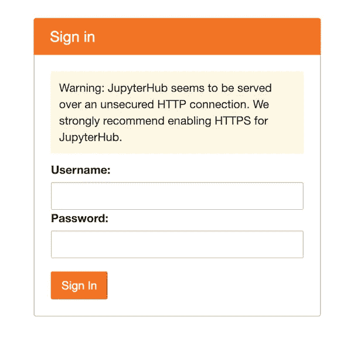
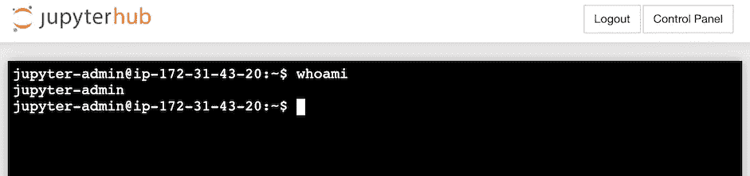

# 使用 Terraform 在代码中管理云基础设施:使用挂载的 S3 桶在 AWS 上生成您自己的 JupyterHub 实例

> 原文：<https://levelup.gitconnected.com/managing-cloud-infrastructure-in-code-with-terraform-spawning-your-own-jupyterhub-instance-on-aws-4d67978f870>

[Terraform](https://terraform.io/intro/index.html) 是一款开源软件，通过代码管理云基础设施。只需几行代码，我们就可以启动实例、创建存储桶、供应数据库和许多其他资源。同时，Terraform 允许以可复制的方式动态地改变和发展基础设施。在我们的例子中，我们将使用 Terraform 在 AWS 上推出我们自己的 jupyterhub(使用[最小的 jupyterhub](http://tljh.jupyter.org/en/latest/) 发行版)，利用一个安装的 S3 存储桶进行永久存储。

完整的设置可以在 [GitHub](https://github.com/stelsemeyer/aws-tf-jh) 上找到，关于 Terraform 的非常好的介绍可以在 [HashiCorp 网站](https://learn.hashicorp.com/terraform)上找到。

我们将从一个非常简短的 Terraform 介绍开始(> =0.12)，由三个步骤组成:定义、计划、应用。创建 EC2 实例和 S3 存储桶非常简单:我们定义资源，例如在一个名为`example.tf`的文件中:

```
provider "aws" { 
  region = "eu-central-1" 
  access_key = "my-access-key" 
  secret_key = "my-secret-key" 
} resource "aws_instance" "my_tf_test_instance" { 
  ami = "ami-0b418580298265d5c" 
  instance_type = "t2.nano" 
} resource "aws_s3_bucket" "my_tf_test_bucket" { 
  bucket = "my-fantastic-tf-test-bucket" 
  acl = "private" 
}
```

一旦我们通过`terraform plan`进行计划，我们就可以验证 Terraform 想要执行哪些操作来创建我们的资源:

```
An execution plan has been generated and is shown below.
Resource actions are indicated with the following symbols:
  + createTerraform will perform the following actions:# aws_instance.my_tf_test_instance will be created
  + resource "aws_instance" "my_tf_test_instance" {
      + ami                          = "ami-0b418580298265d5c"
      + arn                          = (known after apply)
      + associate_public_ip_address  = (known after apply)
      + availability_zone            = (known after apply)
      + cpu_core_count               = (known after apply)
      + cpu_threads_per_core         = (known after apply)
      + get_password_data            = false
      + host_id                      = (known after apply)
      + id                           = (known after apply)
      + instance_state               = (known after apply)
      + instance_type                = "t2.medium"
      + ipv6_address_count           = (known after apply)
      + ipv6_addresses               = (known after apply)
      + key_name                     = (known after apply)
      + network_interface_id         = (known after apply)
      + password_data                = (known after apply)
      + placement_group              = (known after apply)
      + primary_network_interface_id = (known after apply)
      + private_dns                  = (known after apply)
      + private_ip                   = (known after apply)
      + public_dns                   = (known after apply)
      + public_ip                    = (known after apply)
      + security_groups              = (known after apply)
      + source_dest_check            = true
      + subnet_id                    = (known after apply)
      + tenancy                      = (known after apply)
      + volume_tags                  = (known after apply)
      + vpc_security_group_ids       = (known after apply)+ ebs_block_device {
          + delete_on_termination = (known after apply)
          + device_name           = (known after apply)
          + encrypted             = (known after apply)
          + iops                  = (known after apply)
          + kms_key_id            = (known after apply)
          + snapshot_id           = (known after apply)
          + volume_id             = (known after apply)
          + volume_size           = (known after apply)
          + volume_type           = (known after apply)
        }+ ephemeral_block_device {
          + device_name  = (known after apply)
          + no_device    = (known after apply)
          + virtual_name = (known after apply)
        }+ metadata_options {
          + http_endpoint               = (known after apply)
          + http_put_response_hop_limit = (known after apply)
          + http_tokens                 = (known after apply)
        }+ network_interface {
          + delete_on_termination = (known after apply)
          + device_index          = (known after apply)
          + network_interface_id  = (known after apply)
        }+ root_block_device {
          + delete_on_termination = (known after apply)
          + device_name           = (known after apply)
          + encrypted             = (known after apply)
          + iops                  = (known after apply)
          + kms_key_id            = (known after apply)
          + volume_id             = (known after apply)
          + volume_size           = (known after apply)
          + volume_type           = (known after apply)
        }
    }# aws_s3_bucket.my_tf_test_bucket will be created
  + resource "aws_s3_bucket" "my_tf_test_bucket" {
      + acceleration_status         = (known after apply)
      + acl                         = "private"
      + arn                         = (known after apply)
      + bucket                      = "my-fantastic-tf-test-bucket"
      + bucket_domain_name          = (known after apply)
      + bucket_regional_domain_name = (known after apply)
      + force_destroy               = false
      + hosted_zone_id              = (known after apply)
      + id                          = (known after apply)
      + region                      = (known after apply)
      + request_payer               = (known after apply)
      + website_domain              = (known after apply)
      + website_endpoint            = (known after apply)+ versioning {
          + enabled    = (known after apply)
          + mfa_delete = (known after apply)
        }
    }Plan: 2 to add, 0 to change, 0 to destroy.
```

如果我们对计划满意，我们可以委托 Terraform 使用`terraform apply`创建计划的两个资源:

```
aws_instance.my_tf_test_instance: Creating...
aws_s3_bucket.my_tf_test_bucket: Creating...
aws_s3_bucket.my_tf_test_bucket: Still creating... [10s elapsed]
aws_instance.my_tf_test_instance: Still creating... [10s elapsed]
aws_s3_bucket.my_tf_test_bucket: Creation complete after 11s [id=my-fantastic-tf-test-bucket]
aws_instance.my_tf_test_instance: Still creating... [20s elapsed]
aws_instance.my_tf_test_instance: Creation complete after 25s [id=i-05f10xxxxxxdde4b]Apply complete! Resources: 2 added, 0 changed, 0 destroyed.
```

由于 Terraform 跟踪状态，并且还可以应用差异，因此我们可以轻松地修改我们已经创建的资源，例如，通过更改我们的实例类型或向我们的 S3 存储桶添加版本控制，然后再次应用:

```
resource "aws_instance" "my_tf_test_instance" {
  ami                    = "ami-0b418580298265d5c"
  instance_type          = "t2.nano"
}resource "aws_s3_bucket" "my_tf_test_bucket" {
  bucket = "my-fantastic-tf-test-bucket"
  acl    = "private"versioning {
    enabled = true
  }
}
```

一旦我们再次计划，我们将看到一个很好的差异渲染视图:

```
Refreshing Terraform state in-memory prior to plan...
The refreshed state will be used to calculate this plan, but will not be
persisted to local or remote state storage.aws_s3_bucket.my_tf_test_bucket: Refreshing state... [id=my-fantastic-tf-test-bucket]
aws_instance.my_tf_test_instance: Refreshing state... [id=i-05f10xxxxxxdde4b]------------------------------------------------------------------------An execution plan has been generated and is shown below.
Resource actions are indicated with the following symbols:
  ~ update in-placeTerraform will perform the following actions:# aws_instance.my_tf_test_instance will be updated in-place
  ~ resource "aws_instance" "my_tf_test_instance" {
        ami                          = "ami-0b418580298265d5c"
        ...
      ~ instance_type                = "t2.medium" -> "t2.nano"
        ...
    }# aws_s3_bucket.my_tf_test_bucket will be updated in-place
  ~ resource "aws_s3_bucket" "my_tf_test_bucket" {
        acl                         = "private"
        arn                         = "arn:aws:s3:::my-fantastic-tf-test-bucket"
        bucket                      = "my-fantastic-tf-test-bucket"
        ...
      ~ versioning {
          ~ enabled    = false -> true
            mfa_delete = false
        }
    }Plan: 0 to add, 2 to change, 0 to destroy.
```

现在让我们来点新鲜的，在一个使用 Ubuntu 的 EC2 实例上部署我们自己的 juypterhub，包括挂载 S3 存储来持久化数据。

在 Terraform 中，我们可以定义变量，例如。在一个`vars.tf`文件中，该文件可以在使用`var.var_name`的其他模块中被引用(例如`var.instance_type`):

```
variable "aws_access_key" {}variable "aws_secret_key" {}variable "aws_region" {
  default = "eu-central-1"
}variable "amis" {
  type = map(string)
  default = {
    eu-central-1 = "ami-0b418580298265d5c"
    us-east-1    = "ami-07ebfd5b3428b6f4d"
  }
}variable "instance_type" {
  default = "t2.large"
}variable "bucket_name" {
  default = "jh-storage"
}
```

我们可以将机密文件留空，并在未分级的`terraform.tfvars`文件中定义它们:

```
aws_access_key = "my-access-key"
aws_secret_key = "my-secret-key"
aws_region     = "eu-central-1"
jh_password    = "some-password-to-jh-ub"
```

由于我们将使用 AWS 作为我们的提供者，我们将如下定义一个`provider.tf`:

```
provider "aws" {
  access_key = var.aws_access_key
  secret_key = var.aws_secret_key
  region     = var.aws_region
}
```

在一个`main.tf`中，我们可以定义我们的实例加安全组，以允许通过 SSH 和 HTTP/HTTPS 的入站流量和所有出站流量，此外，我们还添加了一个`iam_instance_profile`，这将在后面解释。如你所见，我们可以用点符号引用变量和其他资源，所以我们的实例的安全组通过`aws_security_group.instance.id`，我们的实例通过 aws_instance.jh，等等。此外，我们将使用`templatefile`加载一个 shell 脚本并呈现包含的变量。

```
resource "aws_instance" "jh" {
  ami                    = lookup(var.amis, var.aws_region)
  instance_type          = var.instance_type
  vpc_security_group_ids = [aws_security_group.instance.id]
  iam_instance_profile   = aws_iam_instance_profile.jh.nameuser_data = templatefile("script/install.sh", {
    aws_region = var.aws_region
    bucket_name = var.bucket_name
    password = var.password
  })tags = {
    Name = "jh"
  }
}resource "aws_security_group" "instance" {
  ingress {
    from_port   = 22
    to_port     = 22
    protocol    = "tcp"
    cidr_blocks = ["0.0.0.0/0"]
  }ingress {
    from_port   = 80
    to_port     = 80
    protocol    = "tcp"
    cidr_blocks = ["0.0.0.0/0"]
  }ingress {
    from_port   = 443
    to_port     = 443
    protocol    = "tcp"
    cidr_blocks = ["0.0.0.0/0"]
  }egress {
    from_port   = 0
    to_port     = 0
    protocol    = -1
    cidr_blocks = ["0.0.0.0/0"]
  }tags = {
    Name = "jh"
  }
}
```

实例的`user data`是在 initial(！idspnonenote)上执行的脚本。)实例的启动。这里我们引用一个 bash 脚本`script/install.sh`，它包含一些变量(`aws_region`、`bucket_name`、`password`)，这些变量将由`templatefile`呈现:

```
#!/bin/bash
sudo sudo apt-get update# install s3fs & mount bucket 
sudo apt-get install s3fs
sudo s3fs \
    -o iam_role="auto" \
    -o url="[https://s3-${aws_region}.amazonaws.com](https://s3-${aws_region}.amazonaws.com)" \
    -o umask=000 \
    -o allow_other \
    ${bucket_name} /mnt# install tljh
curl [https://raw.githubusercontent.com/jupyterhub/the-littlest-jupyterhub/master/bootstrap/bootstrap.py](https://raw.githubusercontent.com/jupyterhub/the-littlest-jupyterhub/master/bootstrap/bootstrap.py) \
    | sudo python3 - \
    --admin admin:${password} \
    --user-requirements-txt-url   [https://raw.githubusercontent.com/stelsemeyer/aws-tf-jh/master/script/requirements.txt](https://raw.githubusercontent.com/stelsemeyer/aws-tf-jh/master/script/requirements.txt)
```

安装脚本将安装并运行`s3fs`,使用(自动检测到的)IAM 角色来装载我们的 S3 存储桶，以允许访问。我们还需要指定`allow_other`和`umask=000`来允许所有用户读写该文件夹中的所有文件。

之后，来自“littlest jupyterhub”(tljh)的安装脚本将安装 jupyterhub，使用 Terraform 变量中的密码设置一个名为`admin`的用户，并从`requirements.txt`文件中预安装软件包。

仍然缺少的是我们的 IAM 角色，它支持从我们的 EC2 无缝访问我们的 S3 时段。我们可以在一个`data.tf`中定义我们的策略(通常是 json ),并通过以下方式在我们的角色相关资源中再次引用它们:

```
data "aws_iam_policy_document" "s3" {
  statement {
    actions = [
      "s3:*"
    ]# add our bucket and all contained files
    resources = [
      "arn:aws:s3:::${var.bucket_name}",
      "arn:aws:s3:::${var.bucket_name}/*"
    ]
  }
}data "aws_iam_policy_document" "sts" {
  statement {
    actions = [
      "sts:AssumeRole"
    ]principals {
      type        = "Service"
      identifiers = ["ec2.amazonaws.com"]
    }
  }
}
```

对于我们的`main.tf`,我们将添加:

```
resource "aws_iam_role" "jh" {
  name               = "jh_role"
  assume_role_policy = data.aws_iam_policy_document.sts.jsontags = {
    Name = "jh"
  }
}resource "aws_iam_instance_profile" "jh" {
  role = aws_iam_role.jh.name
}resource "aws_iam_role_policy" "jh" {
  role   = aws_iam_role.jh.id
  policy = data.aws_iam_policy_document.s3.json
}
```

综上所述，我们可以开始规划和应用我们的基础架构:

*   安装 s3fs & tljh 的设置脚本`install.sh`
*   `terraform.tfvars`带凭据

大约 10 到 15 分钟后，我们可以通过输出中显示的公共主机名访问我们的实例:

```
Outputs:public_dns = ec2-aa-bb-cc-dd.eu-central-1.compute.amazonaws.com
```

您应该会看到以下登录页面:



您也可以通过`New > Terminal`访问实例的终端:



让我们通过在挂载的文件夹中存储一些数据来尝试我们的 S3 连接，并检查它是否出现在我们的 bucket 中。理论上，我们还可以以一种非常舒适的方式(不需要额外的身份验证)使用 boto 从我们的(或者如果在我们的策略中定义的话)其他桶中获取数据:

```
import pandas as pd
import boto3# create dummy data and upload
data = pd.DataFrame({'a': [1,2,3]})
data.to_csv('/mnt/data.csv', index=False)# download dummy data
client = boto3.client('s3', region_name='eu-central-1')
client.download_file('jh-storage', 'data.csv', '/tmp/data_download.csv')# compare
data_downloaded = pd.read_csv('/tmp/data_download.csv')
data.equals(data_downloaded)## True
```

还有一些需要改进的地方:在 docker 中运行 Terraform 是一个很好的实践，将它本身视为一个应用程序，并使用 S3 或类似工具跟踪状态。此外，重新调整我们的实例当前会卸载 S3 存储桶(因为用户数据仅在最初创建实例时运行)。我们可以使用一个脚本来重启 S3fs，并在重启/调整实例大小后重新挂载 S3。云初始化。此外，我们应该使用安全 http: tljh 通过 letsencrypt 提供了一个[现成的解决方案，不幸的是，它不能与 AWS 品牌的端点一起工作，但需要一个适当的域(例如。经由 53 号公路)。](http://tljh.jupyter.org/en/latest/howto/admin/https.html)

我们已经学习了 Terraform 的基础知识，如何使用模板和变量，以及如何在代码中高效、灵活地组合不同的资源，这使得我们可以轻松地为一次性分析或黑客马拉松生成实例。

作为托管笔记本设置的替代方案，我们可以使用 AWS Sagemarker 或 Google 笔记本，这是一些无服务器的解决方案，并带有许多预装的自动 ML、深度学习等框架。

*最初发表于*[T5【https://blog.telsemeyer.com】](https://blog.telsemeyer.com/2020/04/19/managing-cloud-infrastructure-in-code-with-terraform-spawning-your-own-jupyterhub-instance-on-aws-with-mounted-s3-bucket/)*。*