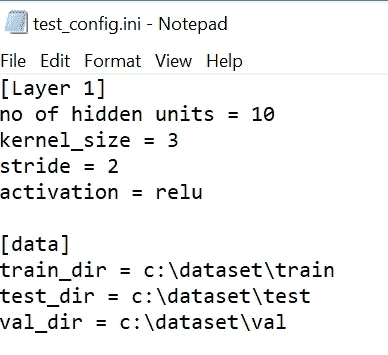

# 使用 configparser 管理配置文件

> 原文：<https://levelup.gitconnected.com/managing-config-file-using-configparser-f2dacea90d95>

## 使用 Python 中的 configparser 读取、写入和更新配置文件的快速指南

***你正在编写一个深度学习程序，想要将一些关键参数存储到一个配置文件中。您希望将配置中的值用作训练模型的参数值，如数据集路径、优化器、学习率、时期数等。***

> configparser 类实现基本的配置结构，该结构具有包含键值对的部分。

可以读取配置文件，也可以写入或更新新的配置设置。

## 创建 ini 文件来存储配置设置

您可以使用任何文本编辑器来创建 ini 文件。我用过记事本。

*   配置文件由**【节】**和其后的**键值对组成。**使用“=”或“:”将**值与键分开**
*   **节名区分大小写，**但**键不区分大小写。**
*   **键可能包含也可能不包含值**。如果键的值不存在，那么请确保包含“:”或“=”，否则会出现错误。
*   **键和值在**前后可以有空格，因为它们在读取配置文件时会被删除。
*   **键值可以通过适当的缩进分布在多行**中。如果跨多行的键的值没有正确缩进，那么我们会得到一个错误。


样本 ini 文件

## 从 ini 文件中读取配置数据

要读取配置文件，您需要导入 **configparser** 库。下面的代码读取配置文件，打印所有部分以及每个部分中的键值对。

```
**import configparser****filename=r'test_config.ini'
config = configparser.ConfigParser()**
**config.read(filename)****for sect in config.sections():
    print("\nSection: ",sect)
    for k,v in config.items(sect):
        print("Key: ",k," Value: ",v)**
```


## 从配置文件中读取键的单个值。

在训练模型时，您可能需要从配置文件中提取单个键值，或者提取一个节中所有键值。

**提取训练部分中优化器关键字的值**

```
**print(config['training']['optimizer'])**
```

**提取训练部分中的 epochs 键的值，并将其转换为 int**

```
**print(int(config['training']['epochs']))**
```

**从配置文件中提取所有部分**

配置文件的各个部分将作为列表返回。

```
**print(list(config.sections()))**
```


**从配置文件的特定部分提取所有密钥**

我们正在提取培训部分的所有密钥。

```
**print(list(config['training'].keys()))**
```


**从配置文件的特定部分提取所有值**

我们正在提取培训部分中所有键的所有值。

```
**print(list(config['training'].values()))**
```


## 更新区段中关键字的值

更新现有部分中的键值等同于覆盖这些值。

```
**filename=r'test_config.ini'
config = configparser.ConfigParser()
config.read(filename)****# the section checkpoint uppdate the value for model_file_name**
**config['Trained Model Details']={'model_file_name' :'classfication_epoch100.h5'}
with open(filename, 'w') as configfile:
    config.write(configfile)**
```

用值“**分类 _ epoch 100 . H5”**更新段“**训练模型细节**，并删除“**检查点**的键。


## 将附加条目写入配置文件。

将配置条目写入文件有两种不同的方法。

1.  **用节名**创建一个键值对字典

```
#Adding additional entries into Config file
# creating the dictionary for section and key-value pairs **config['Layer 1']={
    'no of hidden units':8,
    'kernel_size':3,
    'stride':2,
    'activation':'relu'
}**# writing to configuration file **with open(filename, 'w') as configfile:
    config.write(configfile)**
```

这段代码将附加到现有的配置文件中，如下所示。


如果您创建 configparser 的实例，那么它会覆盖当前条目，如下所示。

```
#Overwriting over existsing entries into Config file
**filename=r'test_config.ini'
config = configparser.ConfigParser()
config['Layer 1']={
    'no of hidden units':10,
    'kernel_size':3,
    'stride':2,
    'activation':'relu'
}
with open(filename, 'w') as configfile:
    config.write(configfile**)
```


另一种方法是使用 ***read_dict()*** ，它在 dictionary 对象中有一个配置设置，其中键是节名，不同的键-值对是字典的值。

```
**config.read_dict({'data':{'train_dir' : r'c:\dataset\train',
                          'test_dir': r'c:\dataset\test',
                          'val_dir': r'c:\dataset\val'
                          }
                 })
with open(filename, 'w') as configfile:
    config.write(configfile)**
```

上面的代码没有向我们的配置文件添加另一个部分。



## 值的基本插值

插值是指在返回配置文件中的键值之前对它们进行预处理。

基本插值的语法 **: %(key_name)**

下面的代码创建了一个配置节“ **Paths** ”，其中包含两个键“ **home_dir，**”和“ **model_dir”。**键“模型 _ 目录”的**值将通过使用插值**替换“主目录”来创建。

```
**config['Paths']={
    'home_dir' : r'C:\model',
    'model_dir': '%(home_dir)s\dataset'}****with open(filename, 'w') as configfile:
    config.write(configfile)****print(config["Paths"]['model_dir'])**
```


插值后模型 _ 方向的值


## 扩展插值

扩展插值是在返回键值之前，对配置文件不同部分的键值进行预处理和替换。

扩展插值的语法 **:${section:key}**

下面的代码使用了"**路径**部分的关键字" **home_dir** "的扩展插值

```
**config['Data_Path']={'train_dir' : '${Paths:home_dir}\\train',
                     'test_dir':'${Paths:home_dir}s\\test',
                     'val_dir':'${Paths:home_dir}s\\val'
                    }
with open(filename, 'w') as configfile:
    config.write(configfile)**
```

为了读取扩展插值，我们需要将配置文件的插值设置为***extendedintepolation***()进行动态替换

```
**config._interpolation = configparser.ExtendedInterpolation()
config.read('test_config.ini')
print(config["Data_Path"]['train_dir'])**
```


## 结论:

configparser 库提供了一种使用节中的键值对管理配置设置的简单方法

## 参考资料:

[https://docs . python . org/3/library/config parser . html # config parser。配置解析器](https://docs.python.org/3/library/configparser.html#configparser.ConfigParser)