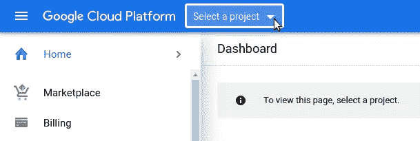
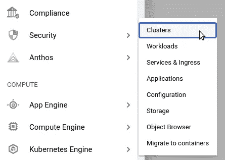
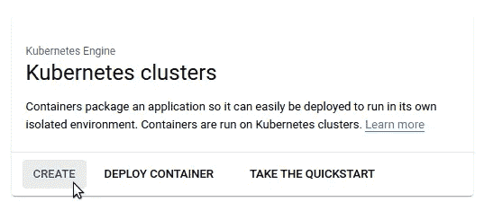
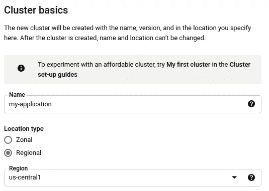
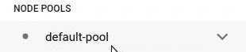
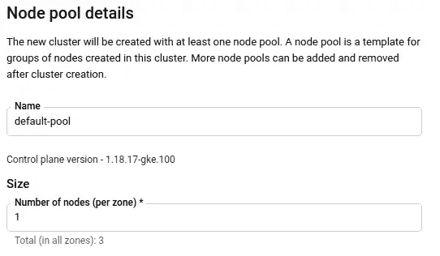
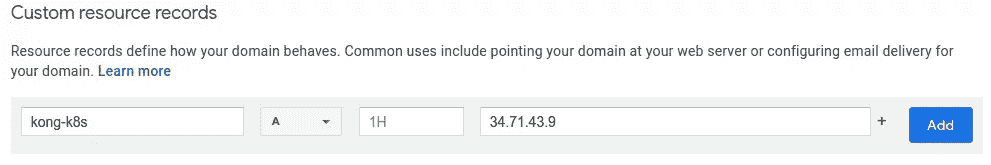
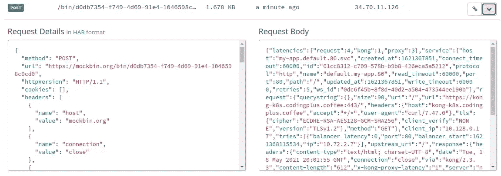
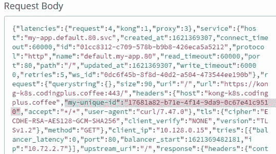

# 使用 Kubernetes 入口控制器管理 Docker 应用程序

> 原文：<https://levelup.gitconnected.com/managing-docker-apps-with-kubernetes-ingress-controller-d20eef243940>


照片由[Olga subah](https://unsplash.com/@create4eyes?utm_source=unsplash&utm_medium=referral&utm_content=creditCopyText)在 [Unsplash](https://unsplash.com/s/photos/port?utm_source=unsplash&utm_medium=referral&utm_content=creditCopyText) 拍摄

## 在本教程中，学习如何使用 Kubernetes 部署 Dockerized 应用程序，使用入口控制器来公开容器的端口以供外部访问。

回想一下您的开发团队何时切换到 Dockerized 容器。曾经需要虚拟机上多种服务的应用程序转变为由多个整洁的 Docker 容器组成的应用程序。虽然结果是一个精简的系统，过渡可能是令人生畏的。

现在，是时候进行另一次变革性的飞跃了:从一组容器转移到使用 Kubernetes 的副本集的高可用性、协调部署。这似乎是一个巨大的转变，但您可以通过使用开源入口控制器来简化您的任务，并提供可以根据您的需要定制的插件，从而减少道路上的颠簸。

在本教程中，我们将从一个由三个容器组成的 Dockerized 应用程序开始:一个 web 服务器、一个数据库和一个键值存储。我们将介绍如何使用 Kubernetes (K8s)部署这个应用程序，使用 Kong 的 Kubernetes Ingress 控制器([文档](https://docs.konghq.com/kubernetes-ingress-controller/))来公开容器的端口以供外部访问。最后，我们将熟悉如何用入口控制器设置一些[孔插件](https://docs.konghq.com/hub/)。

# 核心概念

在我们开始之前，让我们简要地看一下我们的演练的一些核心概念。

# 码头工人

[Docker](https://www.docker.com/) 通常用于平台即服务(PaaS)产品，通过将应用的各个部分隔离到容器中来进行应用开发。每个容器都是一个标准化的软件单元，可以独立运行。

例如，一个特定版本的 PostgreSQL 数据库可以完全在它自己的 Docker 容器中运行。该容器是标准的，可以在任何开发人员的机器上运行。不再有这样的问题，“为什么查询在我的机器上有效，而在你的机器上无效？您的环境设置是什么？”当您在 Docker 容器中运行应用程序服务时，您可以确保每个人都在相同的环境中运行相同的应用程序。

# 库伯内特斯(K8s)

应用程序很快从单个 Docker 容器发展到多个容器一起工作的组合。人们可以使用类似于 [Docker Compose](https://docs.docker.com/compose/) 的应用程序来部署多容器应用程序。

但是，下一步是将同一应用程序的多个副本协调为一个集群，将负载分布在集群内的副本节点上，并在单个应用程序节点出现故障时提供备用节点。今天这种编排和管理的事实标准是 Kubernetes。许多云服务提供商——包括 AWS、Azure 和谷歌云——都提供 Kubernetes。

# Kong Kubernetes 入口控制器

[入口](https://kubernetes.io/docs/concepts/services-networking/ingress/)是 K8s 的关键部分，管理外部对 Kubernetes 集群内部服务的访问。在一个集群中，web 服务器容器可能会与数据库容器对话，但是如果外部世界不能与 web 服务器对话，那又有什么好处呢？在 K8s 中，与外界的通信需要一个[入口控制器](https://kubernetes.io/docs/concepts/services-networking/ingress-controllers/)。开源的 Kong Kubernetes Ingress 控制器围绕 [Kong Gateway](https://konghq.com/kong/) 和 Kong 的各种插件来扮演这个关键角色。

# 基本使用案例

在我们的基本用例中，我们有一个由 web 服务器(NGINX)、数据库(PostgreSQL)和键值存储(Redis)组成的应用程序。这个应用程序通常作为三个 Docker 容器运行。我们需要将这个应用程序转移到 K8s，但是我们需要设置一个入口，以便从 K8s 集群外部的*访问我们的服务。*

# 我们的小型项目方法

对于我们的小型项目演练，我们将采用这种方法:

1.  使用[Google Kubernetes Engine(GKE)](https://cloud.google.com/kubernetes-engine)创建一个简单、低成本的 K8s 集群。
2.  使用 kubectl 来配置集群，以部署我们的多容器应用程序。
3.  配置和集成 [Kong Kubernetes 入口控制器](https://konghq.com/solutions/kubernetes-ingress/)，使我们能够从外部访问我们的应用服务。
4.  添加一个用于支持的 cert-manager，以及用于外部日志和请求路由的 Kong 插件。

# 你需要什么

为了和我们一起完成这个演练，你需要一个谷歌云平台账户，它有一个初始的[免费层和一个初始使用信用](https://cloud.google.com/free)。

在您的本地机器上，您将需要在安装了以下工具的情况下舒适地使用命令行:

*   [kubectl](https://kubernetes.io/docs/tasks/tools/) —用于在 K8s 集群上运行配置命令
*   [Google Cloud SDK](https://cloud.google.com/sdk/docs/install) —用于连接到您的 GKE 集群，使其成为您的 kubectl 环境

您准备好深入容器和集群了吗？开始了。

# 步骤 1:创建 GKE 集群

假设您已经设置了 Google Cloud Platform 帐户，导航到控制台，并通过左上方的项目列表下拉菜单创建一个新项目:



为项目选择一个名称(例如:`k8s-with-kong`)并创建它。在该项目中，浏览左侧菜单边栏，找到“Kubernetes Engine → Clusters”



在出现的页面上，点击“启用”按钮，在您的项目中使用 GKE。这个过程可能需要一到两分钟，谷歌开始为您的项目做好一切。之后，您会发现自己在 GKE 的集群页面上。点击“创建”



选择配置“标准”集群。为您的集群设置一个名称，以及一个区域。



接下来，在左侧菜单栏中，找到“节点池”并单击“默认池:”



对于节点池，将大小设置为`1`。

我们将保持集群的资源使用量较小，因为这只是一个演示迷你项目。



点击页面底部的“创建”。


您的 K8s 群集将需要几分钟的时间来启动。

# 使用 gcloud 为 kubectl 配置集群访问

随着我们的 GKE 集群的启动和运行，我们希望通过本地机器上的`kubectl`来设置对集群的访问。为此，我们遵循这个 [GKE 文档页面](https://cloud.google.com/kubernetes-engine/docs/how-to/cluster-access-for-kubectl)上的简单步骤。

```
~$ gcloud init
# Follow the prompts to login to your Google Cloud account.

# Choose your cloud project (in our example: k8s-with-kong)

Do you want to configure a default Compute Region and Zone? (Y/n)? n
```

接下来，我们将生成一个`kubeconfig`条目，对我们的 GKE 集群运行我们的`kubectl`命令。对于此步骤，您将需要在创建集群时指定的集群名称和区域:

```
~$ gcloud container clusters get-credentials my-application --region=us-central1
Fetching cluster endpoint and auth data.
kubeconfig entry generated for my-application.
```

这样，我们可以开始通过`kubectl`运行命令来配置我们的部署。

# 步骤 2:通过 kubectl 部署应用程序

为了部署我们的应用程序，我们需要创建一个`deployment.yml`文件和一个`service.yml`文件。`deployment.yml`文件应该是这样的:

```
apiVersion: apps/v1
kind: Deployment
metadata:
  name: my-app
  labels:
    app: my-app
spec:
  replicas: 1
  selector:
    matchLabels:
      app: my-app
  template:
    metadata:
      labels:
        app: my-app
    spec:
      containers:
        - name: server
          image: nginx:1.19-alpine
          imagePullPolicy: Always
          ports:
            - containerPort: 80
        - name: postgres
          image: postgres:13.2-alpine
          imagePullPolicy: Always
          env:
            - name: POSTGRES_PASSWORD
              value: postgrespassword
          ports:
            - containerPort: 5432
        - name: redis
          image: redis:6.2-alpine
          imagePullPolicy: Always
          ports:
            - containerPort: 6379
          command: ["redis-server"]
          args: ["--requirepass", "redispassword"]
```

我们的部署将运行我们的应用程序的单个副本，它由三个容器组成。我们有一个`nginx`网络服务器，我们称之为`server`。服务器感兴趣的容器端口是端口`80`。

接下来，我们有一个运行在名为`postgres`的容器中的 PostgreSQL 数据库。这个数据库容器映像的默认用户是`postgres`。我们还会将该用户的密码设置为`postgres`。数据库容器的端口是`5432`。

最后，我们有 Redis 键值存储，它将在容器上公开端口`6379`。在 Redis 服务器启动时，我们将密码设置为`redis`。

部署配置就绪后，让我们将其应用到集群中:

```
~/project$ kubectl apply -f deployment.yml
deployment.apps/my-app created
```

几分钟后，您可以验证您的部署是否已启动:

```
~/project$ kubectl get deployment my-app
NAME     READY   UP-TO-DATE   AVAILABLE   AGE
my-app   1/1     1            1           3m15s

~/project$ kubectl get pods
NAME                      READY   STATUS    RESTARTS   AGE
my-app-55db7c65f5-qjxs8   3/3     Running   0          4m16

~/project$ kubectl logs my-app-55db7c65f5-qjxs8 server
...
Enabled listen on IPv6 in /etc/nginx/conf.d/default.conf
/docker-entrypoint.sh: Configuration complete; ready for start up

~/project$ kubectl logs my-app-55db7c65f5-qjxs8 postgres
... database system is ready to accept connections

~/project$ kubectl logs my-app-55db7c65f5-qjxs8 redis
... Ready to accept connections
```

接下来，我们需要配置`service.yml`，以便集群容器上的端口可以从集群外部访问。

```
apiVersion: v1
kind: Service
metadata:
  name: my-app
  labels:
    app: my-app
spec:
  selector:
    app: my-app
  ports:
  - name: server
    port: 80
    targetPort: 80
  - name: postgres
    protocol: TCP
    port: 5432
    targetPort: 5432
  - name: redis
    protocol: TCP
    port: 6379
    targetPort: 6379
```

在这里，我们配置了一个 [K8s 服务](https://kubernetes.io/docs/concepts/services-networking/service/)，将 pod 上的传入端口映射到 pod 中各个容器上的目标端口。为简单起见，我们将对`port`和`targetPort`使用相同的值。如果我们可以获得对 K8s pod 上的端口`80`的请求，该请求将被发送到服务器容器(我们的`nginx`容器)的端口`80`。类似地，对端口`5432`的请求将被映射到我们`postgres`容器上的端口`5432`，而对端口`6379`的请求将被映射到我们`redis`容器上的端口`6379`。

让我们用这个新的服务配置来更新我们的集群:

```
~/project$ kubectl apply -f service.yml
service/my-app created
```

稍后，我们可以检查我们的配置是否就绪:

```
~/project$ kubectl describe service my-app
Name:              my-app
Namespace:         default
Labels:            app=my-app
Annotations:       cloud.google.com/neg: {"ingress":true}
Selector:          app=my-app
Type:              ClusterIP
IP Families:       <none>
IP:                10.72.128.227
IPs:               <none>
Port:              server  80/TCP
TargetPort:        80/TCP
Endpoints:         10.72.0.130:80
Port:              postgres  5432/TCP
TargetPort:        5432/TCP
Endpoints:         10.72.0.130:5432
Port:              redis  6379/TCP
TargetPort:        6379/TCP
Endpoints:         10.72.0.130:6379
Session Affinity:  None
Events:            <none>
```

这一切都很好，但是您可能会注意到，通过查看端点 IP 地址，虽然我们的端口都是公开和映射的，但我们仍然在私有网络中工作。我们需要将整个 K8s 集群暴露给外界。为此，我们需要一个入口控制器。进入孔。

# 步骤 3:配置 Kong 的 Kubernetes 入口控制器

配置 Kong 的入口控制器相当简单。让我们一步一步来。

# 将 Kong Kubernetes 入口控制器部署到 GKE

根据 [Kong 关于 Kong 入口控制器和 GKE](https://docs.konghq.com/kubernetes-ingress-controller/1.3.x/deployment/gke/) 的文档页面，我们首先需要创建一个`ClusterRoleBinding`来对我们即将进行的一些 GKE 集群配置进行适当的管理访问。用以下内容创建一个名为`gke-role-binding.yml`的文件:

```
apiVersion: rbac.authorization.k8s.io/v1
kind: ClusterRoleBinding
metadata:
  name: cluster-admin-user
roleRef:
  apiGroup: rbac.authorization.k8s.io
  kind: ClusterRole
  name: cluster-admin
subjects:
  - kind: User
    name: [YOUR GOOGLE CLOUD ACCOUNT EMAIL ADDRESS]
    namespace: kube-system
```

让我们应用这个角色绑定:

```
~/project$ kubectl apply -f gke-role-binding.yml
clusterrolebinding.rbac.authorization.k8s.io/cluster-admin-user created
```

接下来，我们部署入口控制器，使用部署和服务配置文件，该文件是 Kong 定制编写的，并在此处[提供](https://bit.ly/k4k8s)。

```
~/project$ kubectl apply -f https://bit.ly/k4k8s
namespace/kong created

...

service/kong-proxy created
service/kong-validation-webhook created
deployment.apps/ingress-kong created
```

检查入口控制器是否已部署。对`kong-proxy EXTERNAL_IP`进行设置可能需要一分钟时间:

```
~/project$ kubectl get services -n kong
NAME                  TYPE          CLUSTER-IP     EXTERNAL-IP    PORT(S)                     AGE
kong-proxy            LoadBalancer  10.72.130.214  34.71.43.9     80:32594/TCP,443:30982/TCP  71s
kong-validation-webhook  ClusterIP  10.72.130.92   <none>         443/TCP                     70s
```

然后，我们设置一个环境变量`PROXY_IP`，来保存与 Kong 代理相关联的 IP 地址。

```
~/project$ export PROXY_IP=$(kubectl get -o \
jsonpath="{.status.loadBalancer.ingress[0].ip}" \
service -n kong kong-proxy)

~/project$ echo $PROXY_IP
34.71.43.9   # Your IP address will differ

~/project$ curl -i $PROXY_IP
HTTP/1.1 404 Not Found
Date: Tue, 18 May 2021 04:51:48 GMT
Content-Type: application/json; charset=utf-8
Connection: keep-alive
Content-Length: 48
X-Kong-Response-Latency: 1
Server: kong/2.3.3

{"message":"no Route matched with those values"}
```

非常好。我们的 Kong Kubernetes 入口控制器已部署，可在`PROXY_IP`到达。只需要为正确的请求路由进行配置。

# 添加入口以将 HTTP 请求映射到 Web 服务器

接下来，让我们配置 Kong Kubernetes 入口控制器来监听到根`/`路径的 HTTP 请求，然后将这些请求映射到我们的 K8s 服务的端口`80`(将该请求映射到 NGINX `server`容器的端口`80`)。我们将创建一个名为`http-ingress.yml`的文件:

```
apiVersion: networking.k8s.io/v1
kind: Ingress
metadata:
  name: my-app
  annotations:
    konghq.com/strip-path: "true"
    kubernetes.io/ingress.class: kong
spec:
  rules:
  - http:
      paths:
      - path: /
        pathType: Prefix
        backend:
          service:
            name: my-app
            port:
              number: 80
```

我们应用入口配置:

```
~/project$ kubectl apply -f http-ingress.yml
ingress.networking.k8s.io/my-app created
```

现在，我们执行一个`curl`请求。结果如下:

```
~/project$ curl $PROXY_IP
<!DOCTYPE html>
<html>
<head>
<title>Welcome to nginx!</title>
...
```

有用！我们已经成功地配置了 Kong Kubernetes 入口控制器来接收 HTTP 请求，并通过 K8s 服务将它们映射到 NGINX 容器上。

如果我们想通过 TCP 连接而不是 HTTP 请求与容器和端口对话，该怎么办？为此，我们将使用[孔的自定义 TCP press](https://docs.konghq.com/kubernetes-ingress-controller/1.2.x/guides/using-tcpingress/)。

# 添加 TCPIngress 以映射连接请求

默认情况下，通过 Kong Kubernetes 入口控制器设置的 Kong 代理服务监听端口`80`和`443`。这就是为什么我们能够配置我们的入口来将 HTTP 请求映射到我们的 NGINX 服务器，因为 HTTP 请求默认情况下会到达端口`80`。

对于我们的用例，我们需要 Kong 在几个额外的端口上监听 TCP 流量，这些端口将用于 Postgres 和 Redis 连接。之前，我们通过应用 Kong 提供的自定义配置[部署了 Kong Kubernetes 入口控制器。现在，我们想对该配置应用两个补丁，以满足我们特定的 TCP 流需求。](https://bit.ly/k4k8s)

首先，创建一个名为`patch-kong-deployment.yml`的文件，包含以下内容:

```
spec:
  template:
    spec:
      containers:
        - name: proxy
          env:
            - name: KONG_STREAM_LISTEN
              value: "0.0.0.0:11111, 0.0.0.0:22222"
          ports:
            - containerPort: 11111
              name: postgres-listen
              protocol: TCP
            - containerPort: 22222
              name: redis-listen
              protocol: TCP
```

在这里，我们配置 Kong 的 TCP 流来监听端口`11111`(我们将用于 postgres 连接)和`22222`(我们将用于 Redis 连接)。接下来，创建一个名为`patch-kong-service.yml`的文件，包含以下内容:

```
spec:
  ports:
    - name: postgres-listen
      port: 11111
      protocol: TCP
      targetPort: 11111
    - name: redis-listen
      port: 22222
      protocol: TCP
      targetPort: 22222
```

此补丁修改了 Kong Kubernetes Ingress 控制器相关的 K8s 服务，暴露了我们需要的端口。现在，我们应用这两个补丁:

```
~/project$ kubectl patch deploy -n kong ingress-kong \
--patch-file=patch-kong-deployment.yml
deployment.apps/ingress-kong patched

~/project$ kubectl patch service -n kong kong-proxy \
--patch-file=patch-kong-service.yml
service/kong-proxy patched
```

现在我们已经为 Kong 打好了补丁，让它在正确的端口上监听 TCP 连接，让我们配置我们的 TCPIngress 资源。创建一个名为`tcp-ingress.yml`的文件:

```
apiVersion: configuration.konghq.com/v1beta1
kind: TCPIngress
metadata:
  name: my-app
  annotations:
    kubernetes.io/ingress.class: kong
spec:
  rules:
  - port: 11111
    backend:
      serviceName: my-app
      servicePort: 5432
  - port: 22222
    backend:
      serviceName: my-app
      servicePort: 6379
```

该配置监听端口`11111`上的 TCP 流量。它在端口`5432`将流量转发给我们的 K8s 服务。您可能还记得，该服务将端口`5432`的流量映射到端口`5432`的`postgres`容器。类似地，我们的 TCPIngress 将端口`22222`上的流量转发到我们服务的端口`6379`，该流量随后到达端口`6379`上的`redis`容器。

让我们应用这个配置:

```
~/project$ kubectl apply -f tcp-ingress.yml
tcpingress.configuration.konghq.com/my-app created
```

那应该是所有的了。现在，我们来测试一下。

```
~/project$ psql -h $PROXY_IP -p 11111 -U postgres
Password for user postgres: postgrespassword
psql (13.2 (Ubuntu 13.2-1.pgdg16.04+1))
Type "help" for help.

postgres=#
```

我们能够连接到`postgres`容器！现在，让我们试试 Redis:

```
~/project$ redis-cli -h $PROXY_IP -p 22222 -a redispassword
34.71.43.9:22222>
```

我们进去了。我们已经成功地配置了 Kong Kubernetes 入口控制器，将我们的 HTTP 请求映射到 web 服务器，并将我们的 TCP 连接映射到数据库和键值存储。在这一点上，你应该有相当的基础，为自己的业务需求量身定制孔 Kubernetes 入口控制器。

在我们结束我们的演练之前，让我们通过将一些插件与我们的入口控制器集成来做一点试验。

# 步骤 4:将插件与入口控制器集成

# 证书管理和 HTTPS

我们将从配置入口控制器来使用`cert-manager`开始，它管理 SSL 证书的部署。这将使我们的 NGINX 网络服务器可以通过 HTTPS 访问。

## 将`cert-manager`安装到 GKE 仪表组上

为了安装`cert-manager`，我们遵循 [Kubernetes 文档页面](https://cert-manager.io/docs/installation/kubernetes/)上概述的步骤。文档步骤提到，如果您使用 GKE，则为集群管理访问创建一个 ClusterRoleBinding。但是，我们在本演练的前面已经这样做了。

接下来，我们使用 cert-manager 将`CustomResourceDefinition`安装到我们的集群，然后我们验证安装:

```
~/project$ kubectl apply -f \
https://github.com/jetstack/cert-manager/releases/download/v1.3.1/cert-manager.yaml

~/project$ kubectl get pods --namespace cert-manager
NAME                                      READY  STATUS   RESTARTS  AGE
cert-manager-7c5c945df9-5rvj5             1/1    Running  0          1m
cert-manager-cainjector-7c67689588-n7db6  1/1    Running  0          1m
cert-manager-webhook-5759dc48f-cfwd6      1/1    Running  0          1m
```

## 设置域名指向`kong-proxy` IP

您会记得，我们将我们的`kong-proxy` IP 地址存储为`PROXY_IP`。假设您拥有对某个域名的控制权，添加一个将您的域名解析为`PROXY_IP`的 DNS 记录。对于这个例子，我向我的域(`codingplus.coffee`)添加了一个 A 记录，它将子域`kong-k8s.codingplus.coffee`解析为我的`kong-proxy` IP 地址。



正确解析子域后，我们需要修改 http-ingress.yml 文件，为 http 请求指定一个主机，而不仅仅是使用一个 IP 地址。当然，您将使用您已经配置的域名:

```
apiVersion: networking.k8s.io/v1beta1
kind: Ingress
metadata:
  name: my-app
  annotations:
    konghq.com/strip-path: "true"
    kubernetes.io/ingress.class: kong
spec:
  rules:
  - http:
      paths:
      - path: /
        backend:
          serviceName: my-app
          servicePort: 80
    host: kong-k8s.codingplus.coffee
```

让我们应用更新的`http-ingress.yml`文件:

```
~/project$ kubectl apply -f http-ingress.yml
ingress.networking.k8s.io/my-app configured
```

现在，我们使用我们的域名的 curl 请求到达 NGINX 服务器:

```
~/project$ curl http://kong-k8s.codingplus.coffee
<!DOCTYPE html>
<html>
<head>
<title>Welcome to nginx!</title>
...
```

## 请求 SSL 证书

接下来，我们为 cert-manager 创建一个 ClusterIssuer 资源。创建一个名为`cluster-issuer.yml`的文件，包含以下内容(替换为您自己的电子邮件地址):

```
apiVersion: cert-manager.io/v1alpha2
kind: ClusterIssuer
metadata:
  name: letsencrypt-prod
  namespace: cert-manager
spec:
  acme:
    email: [YOUR EMAIL ADDRESS]
    privateKeySecretRef:
      name: letsencrypt-prod
    server: https://acme-v02.api.letsencrypt.org/directory
    solvers:
    - http01:
        ingress:
          class: kong
```

创建此资源:

```
~/project$ kubectl apply -f cluster-issuer.yml
clusterissuer.cert-manager.io/letsencrypt-prod created
```

最后，我们想再次更新`http-ingress.yml`以提供一个证书并使用它:

```
apiVersion: networking.k8s.io/v1beta1
kind: Ingress
metadata:
  name: my-app
  annotations:
    konghq.com/strip-path: "true"
    kubernetes.io/ingress.class: kong
    kubernetes.io/tls-acme: "true"
    cert-manager.io/cluster-issuer: letsencrypt-prod
spec:
  rules:
  - http:
      paths:
      - path: /
        backend:
          serviceName: my-app
          servicePort: 80
    host: kong-k8s.codingplus.coffee
  tls:
  - secretName: my-ssl-cert-secret
    hosts:
    - kong-k8s.codingplus.coffee
```

让我们应用更新的`http-ingress.yml`清单:

```
~/project$ kubectl get certificates
NAME                 READY   SECRET               AGE
my-ssl-cert-secret   True    my-ssl-cert-secret   24s
```

我们的证书已准备好。现在，我们可以使用 HTTPS 发送请求:

```
~/project$ curl https://kong-k8s.codingplus.coffee
<!DOCTYPE html>
<html>
<head>
<title>Welcome to nginx!</title>
...
```

# 步骤 5:添加插件

# 集成孔的 HTTP 日志插件

接下来，让我们配置我们的入口控制器使用一个 Kong 插件。我们将使用 [HTTP 日志插件](https://docs.konghq.com/hub/kong-inc/http-log/)，它记录对单独的 HTTP 服务器的请求和响应。

## 创建一个 Mockbin 来接收日志数据

我们将使用 [Mockbin](https://mockbin.org/) ，它给我们一个端点来告诉我们的插件发送它的数据。在 Mockbin，通过简单的步骤创建一个新的 bin。你最终会得到一个唯一的链接。

## 创建 HTTP 日志插件资源

用以下内容创建一个名为`http-log-plugin.yml`的文件。确保使用您自己的 Mockbin 端点 URL:

```
apiVersion: configuration.konghq.com/v1
kind: KongPlugin
metadata:
  name: http-log-plugin
plugin: http-log
config:
  http_endpoint: https://mockbin.org/bin/ENTER-YOUR-OWN-BIN-ID-HERE
  method: POST
```

使用此清单文件创建插件:

```
~/project$ kubectl apply -f http-log-plugin.yml
kongplugin.configuration.konghq.com/add-http-log-plugin created
```

## 更新入口清单

接下来，我们将再次更新`http-ingress.yml`，确保我们的入口控制器知道使用我们的新插件，因为它处理对 Nginx 服务器的 HTTP 请求:

```
apiVersion: networking.k8s.io/v1beta1
kind: Ingress
metadata:
  name: my-app
  annotations:
    konghq.com/strip-path: "true"
    kubernetes.io/ingress.class: kong
    kubernetes.io/tls-acme: "true"
    cert-manager.io/cluster-issuer: letsencrypt-prod
    konghq.com/plugins: "http-log-plugin<strong>"</strong>
...
```

应用更新的文件:

```
~/project$ kubectl apply -f http-ingress.yml
ingress.networking.k8s.io/my-app configured
```

## 发送请求并检查 Mockbin

现在我们已经添加了插件，我们可以向 web 服务器发送另一个请求:

```
~/project$ curl [https://kong-k8s.codingplus.coffee](https://kong-k8s.codingplus.coffee)
```

我们可以在 Mockbin 查看我们 bin 的请求历史。我们看到我们最近的[请求被发布到了 Mockbin](https://mockbin.org/bin/d0db7354-f749-4d69-91e4-1046598c0cd0/log#entry-2) 上，同时在 Mockbin 请求体中还有关于我们请求的数据:



看起来我们的 HTTP 日志插件已经启动并运行了！

# 集成孔的关联 ID 插件

最后，我们将集成一个 Kong 插件: [Correlation ID](https://docs.konghq.com/hub/kong-inc/correlation-id/) 。这个插件为每个请求的标题附加一个唯一的值(通常是一个 UUID)。首先，我们创建关联 ID 插件资源。创建一个名为`correlation-id-plugin.yml`的文件:

```
apiVersion: configuration.konghq.com/v1
kind: KongPlugin
metadata:
  name: correlation-id-plugin
plugin: correlation-id
config:
  header_name: my-unique-id
  generator: uuid
  echo_downstream: false
```

在我们的插件配置中，我们给所有请求添加了一个名为`my-unique-id`的标题。它将包含一个 UUID。安装插件:

```
~/project$ kubectl apply -f correlation-id-plugin.yml
kongplugin.configuration.konghq.com/add-correlation-id-plugin configured
```

接下来，我们将插件和 HTTP 日志插件一起添加到我们的`http-ingress.yml`清单中:

```
apiVersion: networking.k8s.io/v1beta1
kind: Ingress
metadata:
  name: my-app
  annotations:
    konghq.com/strip-path: "true"
    kubernetes.io/ingress.class: kong
    kubernetes.io/tls-acme: "true"
    cert-manager.io/cluster-issuer: letsencrypt-prod
    konghq.com/plugins: "http-log-plugin,correlation-id-plugin"
...
```

将更改应用到入口控制器:

```
~/project$ kubectl apply -f http-ingress.yml
ingress.networking.k8s.io/my-app configured
```

配置好插件后，我们发送另一个 curl 请求:

```
~/project$ curl [https://kong-k8s.codingplus.coffee](https://kong-k8s.codingplus.coffee)
```

同样，我们检查我们的 [Mockbin 历史以获得最新的请求](https://mockbin.org/bin/d0db7354-f749-4d69-91e4-1046598c0cd0/log#entry-5)。这一次，当我们仔细查看标题时，我们看到了`my-unique-id`，它来自我们的关联 ID 插件。



成功！我们的关联 ID 插件正在工作！

# 结论

在本演练中，我们已经介绍了很多内容。我们从一个由三个 Docker 容器组成的简单应用程序开始。一步一步地，我们用 Kubernetes 部署了我们的容器，并且我们部署了开源的 Kong Kubernetes 入口控制器来管理对我们集群的容器的外部访问。最后，我们通过集成 cert-manager for 支持和一些 Kong 插件进一步定制了我们的入口控制器。

这样，在 Kong 的 Kubernetes Ingress 控制器的帮助下，您现在就有了将 Dockerized 应用程序部署到 Kubernetes 的全面基础。您已经准备好根据自己的业务应用程序需求定制您的部署。

【本文原载[此处](https://konghq.com/blog/docker-kubernetes-ingress-controller/)。]