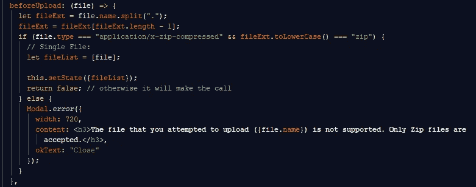
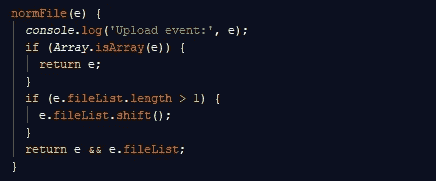

# 在 React 与 Ant Design 中管理文件上传

> 原文：<https://levelup.gitconnected.com/managing-file-uploads-with-ant-design-6d78e592f2c4>


在最近的一个项目中，我必须为 React 应用程序创建一个表单组件，其中一个表单项需要允许用户上传文件。Ant Design 的[上传](https://ant.design/components/upload/)组件使得这个过程变得非常容易，因为你需要的大部分前端文件管理都内置在其中。

`Upload`不依赖于 Ant Design 的`Form`组件。你可以在模态中使用它，也可以单独使用它。对于我的情况，一位同事建议我说，`Form`组件可能比带有输入的模型更好，因为我将不得不更少地依赖本地状态。我不得不说`Form`组件相当健壮。

稍后我会更深入地介绍我是如何使用[表单组件](https://ant.design/components/form/)的，但是虽然`Form`组件很健壮，但是`Upload`组件在 React 应用中工作所需要的只是[安装 ant 设计依赖项](https://www.npmjs.com/package/antd)并从中导入`Upload`。安装完依赖项后，在组件顶部包含这两行:

```
import "antd/dist/antd.css";import {Upload} from "antd";
```

如果你打算用 Webpack 加载样式，请查看这个 StackOverflow [问答](https://stackoverflow.com/questions/52634183/react-ant-design-styles-not-loading)。有关 Ant Design 入门的更多信息，请单击此处的。一旦所有东西都被导入，我们就可以开始使用它了。


`Form.Item`组件允许我们使用`Form`组件提供的`props`来更好地处理表单的输入。它提供的道具之一就是`getFieldDecorator`。

`getFieldDecorator` 允许对我们的表单进行双向绑定。这使我们能够在不使用本地状态的情况下管理输入。通过在`getFieldDecorator`、*、*中包装我们的`Upload`组件，我们可以将参数传递给我们的输入以改进表单处理。如上图所示，我们用它来传递一个`initialValue`参数(与默认值同义)以及一个`valuePropName` 参数(用于区分表单项中的数据)。我传递给`getFieldDecorator` 的最后一个参数是`getValueFromEvent`。

这是一个将参数作为函数的参数，可用于分析用户上传文件时触发的事件中的数据。我们将使用它来确定什么信息被传递给我们的`Upload`组件，并根据我们的需要操纵它(比如限制一次可以上传的文件数量)。在`getFieldDecorator`中，您还可以使用其他参数，如规则(即，使输入成为必需，如果输入未被填充则添加消息，分配可接受的数据类型等)，以及其他表单输入验证器和自定义功能。

现在，回到`Upload`组件。

`Upload`组件具有类似于类型为“file”的 HTML 输入元素的属性，例如`name`和`accept`。在我的情况下，只接受压缩文件。

在一个`Upload`组件中，你通常需要有一个动作。该操作包括上传 URL，允许我们查看您的文件将被发送到哪里。因为我将文件和表单中的其他数据一起传递到数据库中的一个特定端点，所以不需要这个动作。为了避开动作需求，我正在实现`customRequest`。

这个函数什么也不做。

说真的。它只是一个动作占位符，所以我不会得到一个上传错误。这是我的`customRequest`，恰如其分地命名为 **dummyRequest** 。


就是这样。它的工作只是欺骗`Upload`组件，让它认为包含了一个动作。`customRequest`***不仅仅是用来欺骗`Upload`组件，但是对于我们的例子来说，欺骗是我们唯一需要使用的。***

******

***现在我们文件的数据可以传递给`Form`而不会抛出动作错误。***

***还记得我们的`getValueFromEvent` 道具和我们传递给它的函数吗？在这里我们不仅可以看到`fileList`(所选文件对象的数组)，还可以看到当前所选文件的数据。下面是我们将其记录到控制台时的样子:***

****

**如您所见，第一个值是一个对象——当前正在上传的文件。这个对象包含一些属性。**

**我们要看的第一个属性是`originalFileObj`，它是包含文件数据的实际文件对象。这个对象中的一些属性非常简单，比如文件`name`、文件`type`、`size`(用字节表示)，以及修改信息。其他不太明显的属性，`uid`和`webkitRelativePath`现在我们不太关心。但是如果您感兴趣，可以查看 MDN web 文档的[文件](https://developer.mozilla.org/en-US/docs/Web/API/File)部分。**

**我们的事件对象的第一个值中的一些其他属性也可以在`originalFileObj`中找到，但是这里有一些不是:**

****百分比**:上传完成的百分比。**

****状态**:文件是否上传或完成。**

****响应**:我们从上传请求中得到的响应。**

****错误**:如果上传过程中出现错误。**

**另一种查看文件数据的方式是使用`beforeUpload`道具。这个属性是一个钩子函数，在文件上传之前执行。如果您计划使用组件状态而不是表单的数据绑定，这很好。下面是一个`beforeUpload`函数的例子:**

****

**如果您记录这些数据，您会看到:**

****

**该对象类似于由我们的`normFile` 函数捕获的上传事件中的第一个值，但不包括状态、响应、错误或百分比。这些是在事件中找到的属性。**

**记住:一个事件通常包含比事件捕获的输入数据更多的信息。客观地说，为了获得在 HTML 文本输入框中键入字母的结果，您需要使用`event.target.value`。这是因为事件本身包含的不仅仅是输入数据。你可以在这里了解更多关于事件接口[的信息。](https://developer.mozilla.org/en-US/docs/Web/API/Event)**

**你还和我在一起吗？**

****

**现在，回到我们在`normFile`中的事件对象。**

**事件对象中的第二个值是`fileList`。该对象包含一个 file 对象数组。这些文件对象代表已经上传的文件，属于`Upload`组件。`fileList` 是`Upload`组件用来区分数据的属性名。**

**所有这些都是在表单数据的文件选择事件(更改)中捕获的数据。虽然这里没有使用，但是您也可以将`onChange` 事件处理程序与`Upload`组件一起使用。**

**`normFile` 函数除了能够检查上传事件中发现的数据之外，还有另一个重要的功能。见下文。**

****

**文件上传的全部目的是让用户能够上传包含与由`Form`提交创建的对象实例相关的数据的文件。这允许用户用初始数据实例化一个对象，而不是创建一个具有空属性的对象，以后只需手动添加文件中的数据。根据数据量的不同，很难说这样可以节省多少时间。**

**这和`normFile`有什么关系？好吧，如果数据集是从一个来源的数据建模的，允许用户一次上传多个文件可能会导致组合、重复或完全不正确的数据。想象一下，试图通过上传文件而不是依赖数据输入来使事情变得简单，但是您意外地(或有意地)选择了多于您需要的文件。现在你被一个无用的杂乱文件怪物困住了。**

****

**好吧，我太夸张了。实际上，如果文件列表太长，端点可以通过抛出一个一般错误或一些参数错误来处理这个问题。也有一次上传多个文件的真实用例(想想电子邮件附件、带有多张图片的 Instagram 帖子等。).但对我来说，这只会制造冲突，所以需要解决。**

**为了解决这个问题，我们可以从端点使用错误处理，让用户尝试重新上传正确的文件。或者，我们可以在提交数据之前将文件列表的长度限制为一个文件。它的操作方式与要求输入的方式相同。这样，如果需要数据，或者需要满足特定的要求，就可以提前处理数据，而不是让端点抛出一个错误，说“嘿，笨蛋，你需要这样做……”。**

****

**在`normFile`函数中，我们可以检查`fileList`的长度，如果它大于 1，我们可以通过`fileList.shift()`删除第一个索引处的项。你也可以只写`fileList[1]`来获取最近上传的文件。为什么我们要省略第一个索引处的文件？好了，让我们看看`fileList` 尝试上传第二个文件后的情况。**

****

**如你所见，我们有两个对象。但是看看他们每个人的状态和回应。第一个索引`fileList`处的对象状态为“完成”，响应为“正常”。第二个对象的状态为“上传”,响应未定义。这告诉我们什么？**

**第一个索引处的对象是前一个文件。它已经被上传了(因此状态为“done”)，并且实际上有一个响应(意味着请求被解析并返回一个响应来表明这一点)。我们的第二个对象字面上说它仍在“上传”,意思是它在进程中。而回应呢？嗯，没有。因为请求正在进行中。**

**根据您的喜好，您可以选择删除最近添加的文件，而只是默认使用以前的文件。但这需要某种通知，这样用户就知道“嘿，你试图上传一个文件，但你不能上传多个，所以我们默认为较早的一个。”但是，如果用户知道他们上传了一个不正确的文件，并想简单地重新上传一个新的文件呢？他们可以删除之前上传的文件。或者，我们可以让它变得简单一点。当他们上传一个新文件时，它会覆盖旧文件。这就是我在这里决定要做的，也是为什么我要在数组的第一个索引(shift)处移除 file 对象。**

****

**现在，您可以高效地处理文件上传。通过捕获文件对象，您可以将此信息发送到存储数据的任何地方。**

**[*在此处将您的免费媒体会员升级为付费会员*](https://matt-croak.medium.com/membership) *，每月只需 5 美元，您就可以收到各种出版物上数千名作家的无限量无广告故事。这是一个附属链接，你的会员资格的一部分帮助我为我创造的内容获得奖励。谢谢大家！***

## **参考**

**[](https://ant.design/docs/react/getting-started) [## 蚂蚁设计——一种用户界面设计语言

### 一种企业级 UI 设计语言和基于 React 的实现，具有一组高质量的 React 组件，一个…

蚂蚁设计](https://ant.design/docs/react/getting-started) [](https://www.npmjs.com/package/antd) [## antd

### 一种企业级 UI 设计语言和基于 React 的实现

www.npmjs.com](https://www.npmjs.com/package/antd) [](https://stackoverflow.com/questions/52634183/react-ant-design-styles-not-loading) [## 反应和设计风格不加载

### 感谢贡献一个堆栈溢出的答案！请务必回答问题。提供详细信息并分享…

stackoverflow.com](https://stackoverflow.com/questions/52634183/react-ant-design-styles-not-loading)  [## 蚂蚁设计——一种用户界面设计语言

### 一种企业级 UI 设计语言和基于 React 的实现，具有一组高质量的 React 组件，一个…

蚂蚁设计](https://ant.design/components/upload/)  [## 蚂蚁设计——一种用户界面设计语言

### 一种企业级 UI 设计语言和基于 React 的实现，具有一组高质量的 React 组件，一个…

蚂蚁设计](https://ant.design/components/form/) [](https://developer.mozilla.org/en-US/docs/Web/API/File) [## 文件

### 文件接口提供关于文件的信息，并允许网页中的 JavaScript 访问其内容。

developer.mozilla.org](https://developer.mozilla.org/en-US/docs/Web/API/File) [](https://developer.mozilla.org/en-US/docs/Web/API/Event) [## 事件

### 事件接口表示发生在 DOM 中的事件。

developer.mozilla.org](https://developer.mozilla.org/en-US/docs/Web/API/Event)**