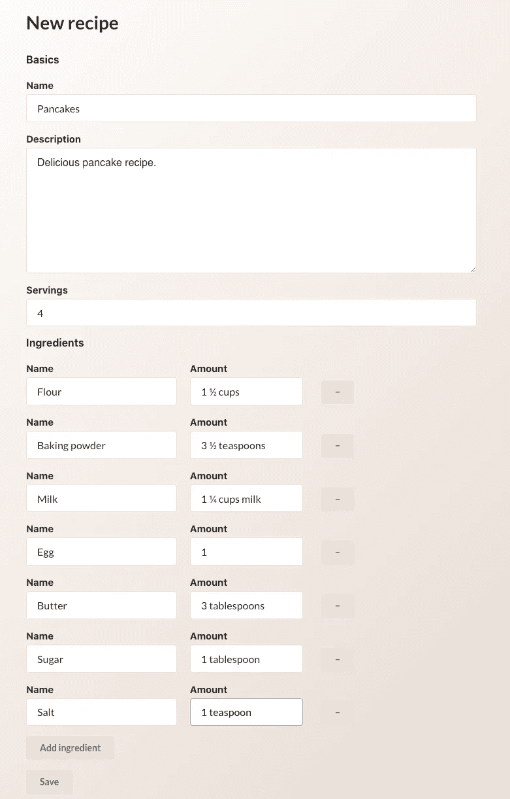
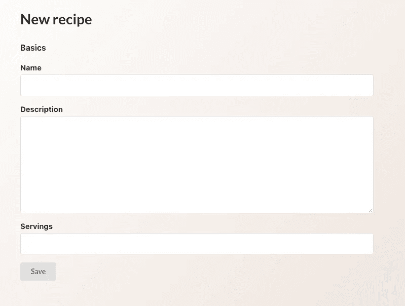
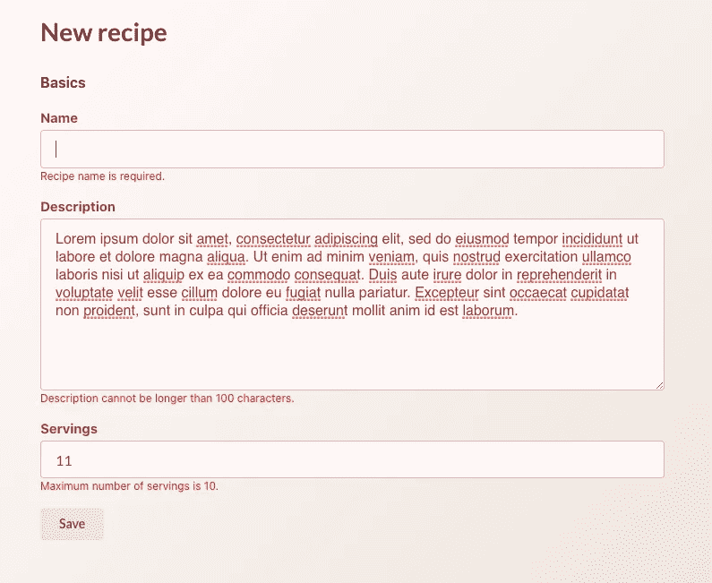

# 用 React 钩子表单管理表单

> 原文：<https://levelup.gitconnected.com/managing-forms-with-react-hook-form-ae771dcf343d>

众所周知，在 React 中使用表单非常困难，尤其是当涉及到动态字段时。有许多库可以简化整个过程。其中一个库是 [React Hook Form](https://react-hook-form.com/) 。顾名思义，React Hook Form 没有一堆表单组件，而是公开了各种帮助控制表单行为的钩子，将各个组件的实现细节留给了用户。这种方法有几个优点，主要是用户不受限于任何特定的 UI 框架或预定义的表单组件。

在这篇文章中，我们将构建一个简单的食谱表单，允许输入基本的细节和动态的配料列表。最终结果将如下所示:



UI 方面，它看起来不太花哨，因为主要焦点是使用 React 钩子形式。除此之外，我们将使用[语义 UI React](https://react.semantic-ui.com/) ，一个 UI 组件库和[情感/风格](https://emotion.sh/docs/@emotion/styled)，来调整这些组件的风格。

作为第一步，让我们安装所有必需的依赖项:

```
npm i @emotion/core @emotion/styled semantic-ui-react semantic-ui-css react-hook-form
```

现在我们可以在一个名为`Form.js`的新文件中设置表单组件。

此外，记得在自定义`index.css`样式上方的`index.js`中添加`import "semantic-ui-css/semantic.min.css";`。

# 表单基础

完成所有这些设置后，我们终于可以开始处理表单本身了。我们将从**基础知识**部分开始，这部分将有关于食谱的一般信息。为了帮助将表单字段分组为不同的部分，让我们添加一个定制组件，称为`FieldSet`，它是原生 HTML `fieldset`之上的一个小抽象。

对于表单本身，我们将使用语义 UI React 中的`Form`组件，它也附带了一些方便的子组件，比如`Form.Field`。对于这个简单的食谱表单，我们只有几个基本字段，比如食谱名称、描述和份数。让我们将它们添加到表单中。

在这里，我们添加了带有标签的食谱字段，这导致了下面的一个简单的表单。注意表单元素上`name`属性的使用，因为它们很快就会变得很方便。我们还使用了`htmlFor`和`id`属性的组合来提高字段的可访问性。



现在是时候使用 React Hook Form 来管理表单的状态了。该库的卖点之一是它使得状态管理更加容易，而不需要添加一堆`setState`钩子。我们需要做的就是使用`name`和`ref`属性的组合来注册表单状态的字段。

我们从导入并调用`useForm` hook 开始，它返回几个有用的助手。在这种情况下，我们使用`register`通过名称将一个表单字段分配给状态的相应属性。这就是为什么在这里向字段添加名称很重要。我们还需要在`handleSubmit`回调中包装我们的提交函数。现在，如果我们在表单字段中输入配方详情并按下`Save`，我们应该会在控制台中看到以下对象:

```
{
  name: "Pancakes",
  description: "Super delicious pancake recipe",
  amount: "10" 
}
```

这就是开始使用 React Hook 表单所需的所有设置。然而，它的功能并没有到此为止，接下来我们将看到一些可以添加到表单中的增强功能。

# 表单验证和错误处理

我们从`useForm`得到的`register`值实际上是一个接受验证参数作为对象的函数。有几种可用的验证规则:

*   需要
*   部
*   最大
*   最小长度
*   maxLength
*   模式
*   使生效

为了使配方名称成为必填字段，我们需要做的就是用`required` prop 调用 register:

此外，`useForm`返回`errors`对象，该对象将所有出现的错误映射到字段名。因此，在缺少配方名称的情况下，`errors`会有一个类型为`required`的`name`对象。同样值得注意的是，除了用布尔值指定验证规则，我们还可以向它传递一个字符串，该字符串将用作错误消息:

或者，`message`属性可用于此。稍后可通过`errors.name.message`访问错误信息。我们还将字段错误作为布尔值传递给`Form.Field`以切换错误状态。

现在我们可以将表单验证和错误结合起来，为用户显示有用的消息。

如果我们试图提交包含无效数据的表单，我们会得到方便的字段验证消息。



也可以通过`validate`规则对字段应用自定义验证规则。它可以是一个函数，也可以是具有不同验证规则的函数对象。例如，我们可以验证字段值是否相等，如下所示:

# 处理数字输入

在当前表单中，我们使用数字输入字段来输入服务。然而，由于 HTML 输入元素的工作方式，当提交表单时，该值将是表单数据中的一个字符串。在某些情况下，这可能不是我们想要的，例如。如果数据应该是后端的数字。一个简单的解决方法是在提交时将金额转换成数字，但是这并不是最佳方法，尤其是在我们有很多这样的字段的情况下。更好的解决方案是用类型转换逻辑将数字输入抽象到一个单独的组件中。这样，当提交表单时，数据就有了我们需要的类型。为了将这个组件连接到表单，React Hook Form 提供了`Controller`——一个用于处理受控外部组件的包装器。

首先，让我们创建这样一个组件，命名为`NumberInput`。

之后，我们可以用这个新组件替换当前的`amount`字段。

代替`register`，我们使用从`useForm`得到的`control`对象，为了验证我们使用`rules`道具。我们仍然需要给`Controller`添加`name`属性来注册它。然后我们通过`render` prop 传递输入组件。现在，菜谱服务的数据将像以前一样保存到表单中，同时使用外部组件。

# 动态字段

没有配料的食谱是不完整的。但是，我们不能在表单中添加固定的成分字段，因为它们的数量会根据食谱而变化。通常我们需要自己的定制逻辑来处理动态字段，然而 React Hook Form 附带了一个定制的钩子来处理动态输入。它接受表单的控件对象和字段名称，返回几个用于处理动态输入的实用程序。让我们通过将配料字段添加到我们的食谱表单来看看它是如何工作的。

第一步是导入`useFieldArray`并用我们从表单钩子中得到的`control`调用它，并向它传递字段名。`useFieldArray`返回了几个管理动态字段的实用程序，我们将在其中使用`append,` `remove`和字段本身的数组。实用函数的完整列表可在库的[文档站点](https://react-hook-form.com/api#useFieldArray)获得。由于我们没有配料的默认值，该字段最初为空。我们可以通过使用`append`函数开始填充它，并为空字段提供默认值。注意，字段的呈现是通过它们在数组中的索引来完成的，所以字段名称采用格式`fieldArrayName[fieldIndex][fieldName]`很重要。我们还可以通过将字段的索引传递给`delete`函数来删除字段。现在，在添加了一些成分字段并填写了它们的值后，当我们提交表单时，所有这些值都将保存在表单的`ingredients`字段中。

这基本上就是用 React Hook Form 构建一个功能完整且易于管理的表单所需要的全部内容。这个库有更多的特性，没有在这篇文章中介绍，所以请确保查看[文档](https://react-hook-form.com/get-started)以获得更多的例子。

*原载于*[*https://claritydev.net*](https://claritydev.net/blog/managing-forms-with-react-hook-form/)*。*