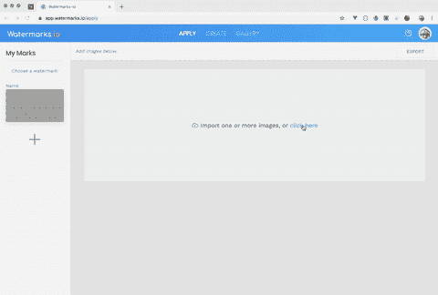

# 在浏览器中管理图像上传:Base64 与 ObjectURLs

> 原文：<https://levelup.gitconnected.com/managing-image-uploads-in-your-browser-base64-vs-objecturls-part-1-cec5ee9af7be>

图像统治着互联网，每天有超过 20 亿张照片被传到网上。因为图像是网络体验中不可或缺的一部分，所以浏览器和 HTML 有一些“内置”工具来有效地处理图像。我将介绍在浏览器中导入、管理和显示图像的最佳方式。

这是我的项目中的一个例子， [watermarks.io](https://app.watermarks.io/#/design) 。试试看。



从我的网站样本，[水印。io](https://app.watermarks.io) 。在 300 毫秒内保存 20mb 的照片

让我们把手弄脏，学习如何像上面的例子一样快速导入。

*第 1 部分:*将介绍导入和存储图像数据的方法。

*第 2 部分:*将介绍异步多图像导入(即将推出)

***TL；*** *博士一路垫底:)*

# 基础知识—导入图像

我将尽可能简单地解释这一点，因为为了理解和构建更健壮的导入解决方案，基础知识是必要的。

您的浏览器可以通过`File`界面访问计算机的本地文件系统。每个`File`都存储在一个`FileList`对象中，该对象由与`<input type="file>`元素交互的用户填充。`FileList`中的`File`对象只是对本地文件系统中文件的引用。

请记住，`File`对象只是对您计算机上实际文件的引用，因此要在浏览器中使用该文件的实际数据，我们需要使用`FileReader()`来“导入”它。

下面我们来看一个例子。

所有浏览器导入(任何文件类型)都必须通过一个`<input>`元素导入，在我们的例子中是一个`type="file"`属性。您可以添加`accept="image/*"`属性，通知您的 Mac Finder 或 Windows 资源管理器仅显示图像作为导入选项。当用户选择要添加的文件时，`<input>`的`onchange`方法被触发，我们的函数`importFileandPreview()`运行。

```
<input type="file" onchange="importFileandPreview()"><br>

```

下面，我们向由`reader`表示的`FileReader()`添加一个事件监听器。

您可以使用 DOM 选择器`document.querySelector('input[type=file]').files[0];`抓取用户上传的文件(w/ JS)

一旦你有了对那个文件的引用，`myFile`你将使用`**readAsDataUrl()**`方法把它传递给`FileReader`。**该方法将读取用户上传的文件内容，并将获取的数据存储为 Base64 DataUrl。**我们将在本文的下一节重点讨论什么是数据 Url。

一旦`readAsDataURL`方法读取完我们本地文件的内容，它就会被“转换”成一个 DataUrl，存储在内存中供我们的 JS 使用。在大多数情况下，一旦`File`被读取为`DataUrl`，图像元素的`src`被设置为`DataUrl`以显示或预览文件。

```
var reader  = new FileReader();
var myFile  = document.querySelector('input[type=file]').files[0];reader.addEventListener("load", function () {
    // do something with reader.result
    console.log(file.name)
  }, false);

  reader.readAsDataURL(myFile);
}
```

***注意*** *:我的例子不是为了复制粘贴，如果你想要可运行的代码，使用完整的 CodePen 例子*

尝试导入图像

# Base64 (DataURL)与 ObjectURL

在上面的导入中，我们导入了一个二进制`File`对象，并将其表示为浏览器可以轻松解释的 Base64 编码字符串(DataURL)。需要注意的一点是，Base64 编码的图像比原始文件大 33%。

> 请注意，Base64 编码的图像比原始文件大 33%。

如果你正在处理大量高质量的图片，你的浏览器(和 JS)将很快因 DataURL 的增加而不堪重负。假设您有一个 20mb 的图像导入到浏览器中。如果它被编码为 DataURL，那么它就是一个 26.6mb *的字符串，现在通过您的 Web 应用程序进行管理。你对它做的任何操作，都意味着你在移动一个巨大的字符串，这对性能和内存管理都是不利的。

在浏览器中处理多个大图像的更好方法是使用 ObjectURL 的。

ObjectURL 创建一个 URL(即引用)到一个对象(类型为`File`或`Blob`)。在图像的情况下，ObjectURL 创建一个对*原始* `File`对象的 URL 引用。最棒的是，``元素可以直接使用 ObjectURL 来显示图像。

> `File`物体不能直接用于显示图像。然而，ObjectURL 可以直接表示一个`File`对象，并且可以用作一个``元素的 src。

*   *回想一下，当用户导入一个图像时，它最初是一个* `*File*` *对象。浏览器不能直接显示* `*File*` *对象，这就是为什么需要将其编码为 DataURL 或表示为 ObjectURL。*

导入图像并将其表示为 ObjectURL 的设置与本文开头的示例非常相似:

这里的神奇之处在于`**window.URL.createObjectURL(file);**`它创建了一个 ObjectUrl，您可以在应用程序的任何地方将它用作`src`元素。最重要的是，可以很容易地将这个小字符串从一个小部件传递到另一个小部件，传递到一个 HTML 画布，或者用于服务器上传。

比较从这支笔到第一支 DataUrl 笔的`src`属性长度！ObjectURLs 要轻得多，建议用于大文件和多次导入。

# TL；博士；医生

浏览器喜欢图像，有几种方法可以显示本地文件系统图像。文件/图像不能直接来自浏览器，因此需要“导入”或编码才能在浏览器中查看。有两种方法可以做到这一点:

1.  您可以显示一个**数据 URL** 。DataUrl 是原始图像的 Base64 编码字符串，非常大。所有数据都包含在 Base64 字符串中，这导致它们的总大小膨胀了约 33%。这些巨大的字符串存储在 JS 内存中，对性能不利，尤其是在应用程序中或向服务器移动图像数据时。
2.  您可以使用 **ObjectURL** 的。从非常简单的意义上来说，ObjectURL 是浏览器创建的对本地文件系统中文件的“本地”URL 引用。这些 URL 访问的是文件的二进制数据，所以图像数据本身并没有膨胀。ObjectURL 可以很容易地在您的 WebApp 中传递，传递到 HTML 画布，或者用于服务器上传。ObjectURL 是正确的选择！只要确保撤销网址，如果你用/显示一个图像。

在 [app.watermarks.io](https://app.watermarks.io/) 中随意尝试图片上传，并在上传后检查`src`属性。它们是干净整洁的 ObjectURL，速度非常快。

*接下来，我将在第二部分介绍异步多映像导入*

干杯！