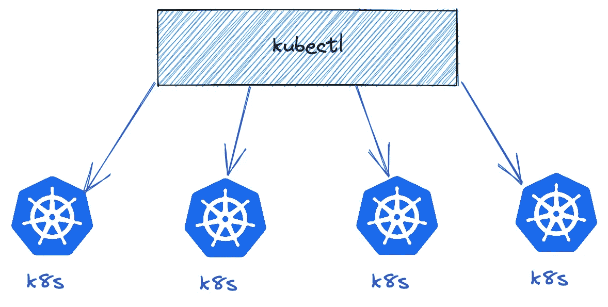
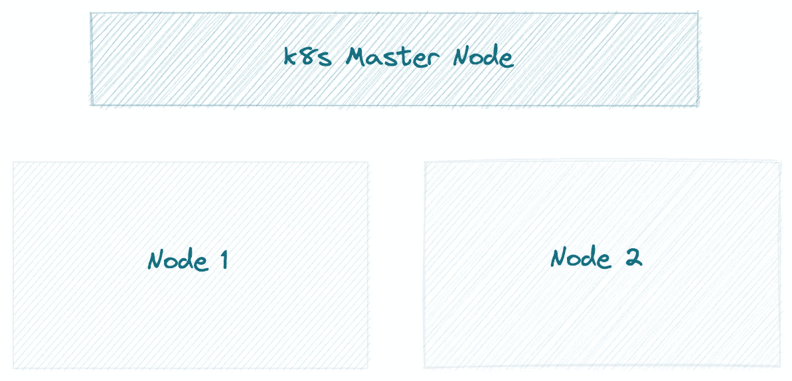
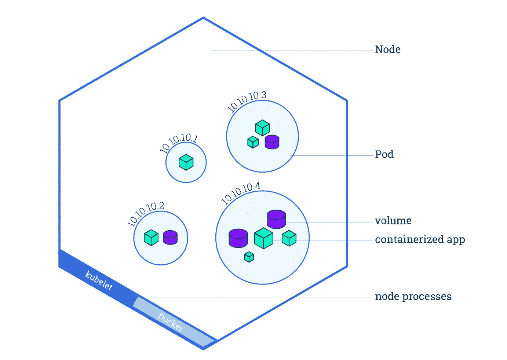
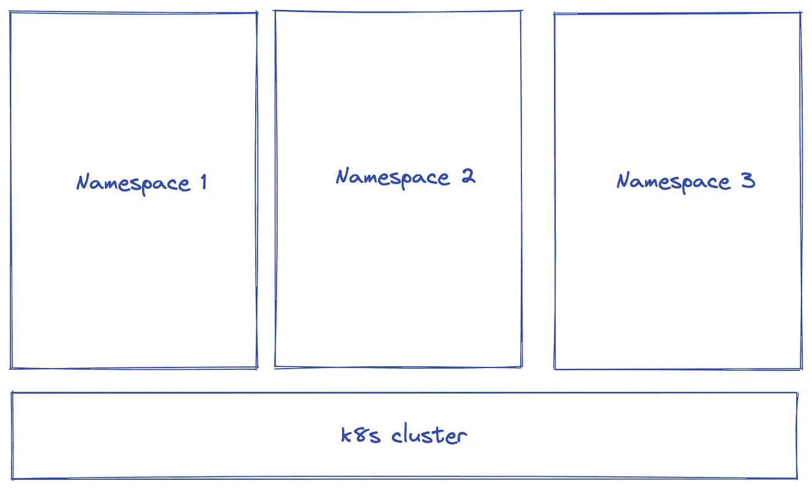
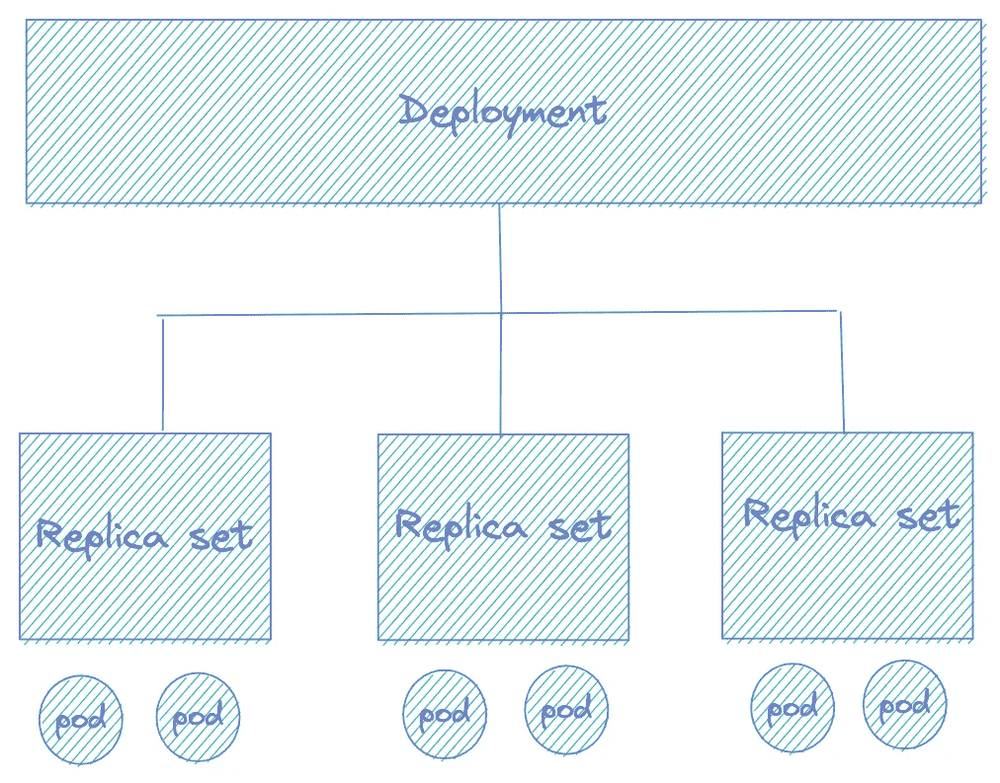
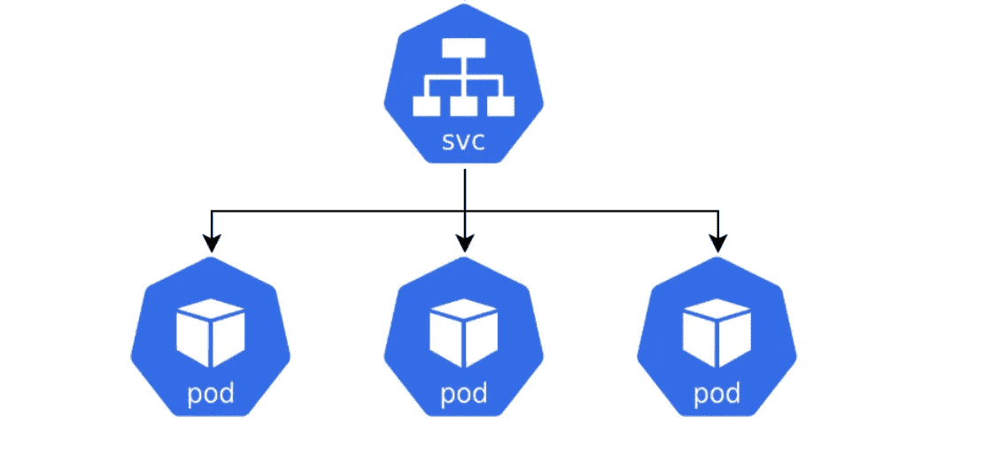

# 使用 Kubectl 管理 Kubernetes 备忘单

> 原文：<https://levelup.gitconnected.com/managing-kubernetes-using-kubectl-cheat-sheet-19e39f206fe8>

kubectl 是一个非常棒的命令行工具，它允许您与 Kubernetes 集群进行通信。

这篇文章分享了每个 k8s 开发者应该知道的最常用的命令。

## 上下文—用于访问多个集群

k8s 上下文

*   kubectl 配置获取上下文
*   kubectl 配置当前上下文
*   kubectl 配置使用上下文<name></name>
*   kubectl 配置集-上下文<name></name>
*   库贝克配置删除-上下文<name></name>

## 节点—虚拟机或物理机

k8s 节点

*   kubectl 获取节点
*   kubectl 得到 no -o 宽
*   kubectl get no -o yaml
*   kubectl 描述没有
*   从一个节点中驱逐你所有的豆荚
*   kubectl 顶级节点#按其资源利用率排序

## Pods 一个或多个紧密耦合的容器的集合

k8s 吊舱

*   kubectl 获取豆荚
*   kubectl get pods-o wide-namespace<namespace></namespace>
*   kubectl 获取 pods 显示-标签
*   kubectl get pods -l app=<name></name>
*   kubectl get pod <pod_name>-o yaml</pod_name>
*   kubectl 获取 pods - field-selector 状态
*   kubectl 删除窗格<pod_name></pod_name>

## 命名空间—在单个群集中隔离资源组

k8s 命名空间

*   kubectl 获取 ns
*   ku bectl config set-context-current-namespace =<namespace></namespace>
*   kubectl 删除名称空间<namespace></namespace>

## 部署—驱动副本集

k8s 部署

*   kubectl 获取部署
*   kubectl 描述部署<deployment_name></deployment_name>
*   kubectl 删除部署/<deployment_name></deployment_name>
*   kubectl apply -f <deployment>。yaml</deployment>
*   kubectl 日志部署/ <deployment_name>-c<container_name></container_name></deployment_name>

## 服务——一组逻辑单元和访问它们的策略

k8s 服务

*   kubectl 获取服务
*   kubectl 描述 svc
*   kubectl 获得 svc -o 范围
*   kubectl 获取 svc 显示-标签

## 其他命令

*   kubectl apply -f XXX.yaml
*   库贝克应用-f ./
*   ku bectl diff-f ./my-manifest . YAML
*   kubectl rollout 撤销部署/前端-修订=2
*   kubectl scale —副本=3 rs/foo

 [## kubectl 备忘单

### 这个页面包含一个常用 kubectl 命令和标志的列表。Kubectl 自动完成 BASH 源代码> ~/。bashrc #…

kubernetes.io](https://kubernetes.io/docs/reference/kubectl/cheatsheet/) 

# 分级编码

感谢您成为我们社区的一员！更多内容见[升级编码出版物](https://levelup.gitconnected.com/)。
跟随:[推特](https://twitter.com/gitconnected)，[领英](https://www.linkedin.com/company/gitconnected)，[通迅](https://newsletter.levelup.dev/)
**升一级正在转型理工大招聘➡️** [**加入我们的人才集体**](https://jobs.levelup.dev/talent/welcome?referral=true)