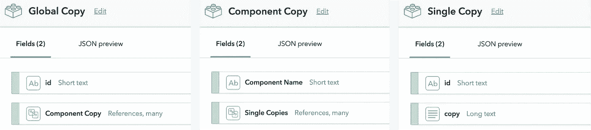
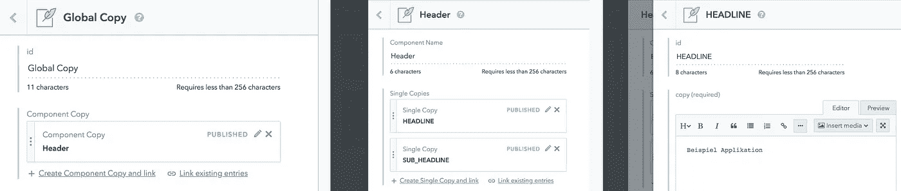

# 用反应和满足来管理缩微拷贝

> 原文：<https://levelup.gitconnected.com/managing-microcopy-with-react-and-contentful-acae948141ea>

> 这篇博文现在在我的个人博客上。

让我们摆脱文字变化✍️开发票

每个网站都有。微型文本——这些小文本让网站变得生动，可以让浏览用户点击更多或者离开页面。它是标题、错误信息或联系表单中的小提示。

由[布鲁诺·马丁斯](https://unsplash.com/photos/OhJmwB4XWLE?utm_source=unsplash&utm_medium=referral&utm_content=creditCopyText)在 [Unsplash](https://unsplash.com/?utm_source=unsplash&utm_medium=referral&utm_content=creditCopyText) 上拍摄的照片

但是编写网站代码的开发人员(通常)并不是擅长编写 microcopy 的人。是来自公共关系、业务、产品或设计部门的同事——没有开发人员知识或权限进行代码更改的人。这意味着文本中几个音节的简单变化需要作者和开发者之间的沟通——在最坏的情况下，还需要以 JIRA 或特雷罗的开发票的形式进行优先排序。

问题:我们如何在代码之外管理 microcopy，让没有开发人员权限的人可以轻松地修改文本？

**解决方案**:一个前端应用程序从一个无头 CMS 中提取 microcopy。在这个例子中，我将使用 **React 和**[**Contentful**](https://www.contentful.com/)**。**

# 步骤 1:在 Contentful 中建立内容模型

存储副本最简单的方法是一个键和值对。但是随着添加的元素越来越多，这个翻译键和实际文本的列表会变得难以维护。由于 React 将 UI 分离成组件，我们可以基于这些组件对 microcopy 进行聚类，并保持对存储文本的良好概述。

在 Contentful 中设置了一个新空间后，我创建了内容类型 ***全局副本*** ，它引用了几个 ***组件副本。*** 内容类型 ***组件副本*** 保存了组件的名称和几个 ***单个副本。*** 然后内容类型 ***单份拷贝*** 包括拷贝 id 和拷贝文本的字段。

Contentful 中的内容类型

# 第二步:添加内容

作为一个例子，我现在创建一个 ***全局副本*** 条目，其中一个 ***组件副本*** 条目被称为*头*。然后我添加两个 ***单副本*** 条目，id 为该组件的 *HEADLINE* 和 *SUB_HEADLINE t* 。让我们为每个条目点击发布。

# 步骤 3:在 React 应用程序中获取缩微副本

在这个例子中，我使用 [create-react-app](https://github.com/facebook/create-react-app) 初始化一个新的 React 应用程序。然后我用`yarn add contentful`安装[满意的](https://www.npmjs.com/package/contentful)。这个节点模块提供了对 Contentful Delivery API 的简单访问，通过它我们可以将内容放入 React 应用程序中。

我们需要三个文件:主文件 *App.js* ，一个包含带有 Contentful 的副本处理的文件( *copyHandling.js* )和一个使用 microcopy 的示例组件( *Header.js* )。

在 *App.js* 中，全局副本存储在状态中，副本的获取在 componentDidMount 方法中触发。一旦 async *getAllCopy* 方法成功返回副本，状态被更新，并且在 *render* 方法中， *Header* 组件接收该组件的副本作为道具。

在 *copyHandling.js* 中，来自 Contentful 客户端的 *getEntries* 方法用于通过内容交付 API 获取全局条目。

参数`include: 2`确保在这个调用中不仅解析了全局条目，而且还返回了组件和单一副本条目(向下两层链接)。

然后，来自 Contentful 的响应在 *getAllCopy* 函数中被转换成以下形式的对象:

标题组件通过其 props 接收特定于该组件的缩微副本，并显示带有副本 id 的副本。

如果你想在多种语言中处理副本，这个例子也可以使用。在 Contentful 中，您可以添加另一个区域设置，并为每个内容类型启用字段本地化。然后，您将参数`locale: *`添加到 *getEntries* 方法中，不仅提取默认设置，还提取所有地区。您也可以在状态中保存当前选择的语言，并立即更改该语言。

这个例子也可以扩展到与 **redux** 一起使用。则全局副本对象不存储在应用状态中，而是存储在 redux 存储中。显示 microcopy 的每个组件都通过 mapStateToProps 函数提取相关的副本。

## 更多资源:

*   [Github 上这篇博文的代码链接](https://github.com/kristinbaumann/react-contentful-microcopy)
*   我最初的[推特](https://twitter.com/kristin_baumann/status/1043408627204276227)关于这个话题的想法来自[斯蒂芬·朱迪斯](https://twitter.com/stefanjudis)
*   [关于如何编写 microcopy 的精彩文章](https://uxplanet.org/microcopy-tiny-words-with-a-huge-ux-impact-90140acc6e42)
*   关于[动态缩微副本](https://www.contentful.com/r/knowledgebase/dynamic-microcopy/)的内容

*感谢您阅读本文！请留下问题或反馈，关注我的*[*Twitter*](https://twitter.com/kristin_baumann)*获取更多 JavaScript 和 React 相关帖子。*

 [## 学习 React -最佳 React 教程(2019) | gitconnected

### 前 45 名 React 教程。课程由开发人员提交并投票，使您能够找到最佳反应…

gitconnected.com](https://gitconnected.com/learn/react)