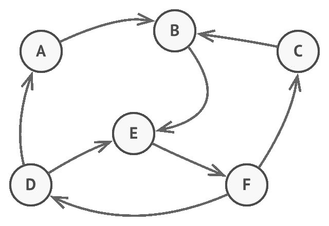

# 在 Android 中管理状态

> 原文：<https://levelup.gitconnected.com/managing-state-in-android-f4d042646521>

状态管理可能是 Android 开发中最复杂的挑战之一。状态管理的复杂性背后的原因与 Android 架构紧密相关，为了提出解决方案，需要理解一些基本的 Android 设计决策。

# 以演示为中心

自从 2011 年我在 Android 开发者网站上读到第一篇文档以来，例子总是集中在活动中。该活动被描述为每个 Android 应用程序的基本起点。在 [Google I/O 2018](http://It is really funny to see Reto Meier talking about) 中，烈斗·梅尔概述了谷歌多年来提出的关于如何使用活动管理状态的不同方法。

活动的问题总是在于它的生命周期。让**配置改变**销毁活动的决定使得管理状态变得非常困难，特别是当工作线程被触发以获取数据时。同样，在活动中集中发展的想法，基本上意味着在**展示**中集中发展，而不是集中在**领域**中，那里应该是大部分逻辑。

## 内存泄漏

销毁活动意味着销毁活动实例，并使其符合垃圾收集的条件。问题是我们倾向于保留对活动的引用，特别是那些我们用来获取数据的工作线程，这最终会产生**内存泄漏**。当一个活动线程引用一个对象(在本例中是我们的活动)时，[垃圾收集器](https://docs.oracle.com/javase/9/gctuning/introduction-garbage-collection-tuning.htm#JSGCT-GUID-8A443184-7E07-4B71-9777-4F12947C8184)不能收集它。因为活动引用了视图层次结构，所以所有视图也保存在内存中。

工作线程可以使用[弱引用](https://docs.oracle.com/javase/7/docs/api/java/lang/ref/WeakReference.html)来保存活动实例，或者可以在 onDestroy 中清除强引用以避免内存泄漏。此外，可以使用[onRetainNonConfigurationInstance](https://developer.android.com/reference/android/app/Activity#onRetainNonConfigurationInstance())保存对工作线程的引用，并在使用[getlastonconfigurationinstance](https://developer.android.com/reference/android/app/Activity.html#getLastNonConfigurationInstance())重新创建活动时进行检索。这种策略还要求工作线程将结果缓存在内存中，一旦设置了新的引用，就将结果返回给活动，以防它在活动重新创建期间结束。太复杂了，不是吗？

当配置发生变化时，应该销毁活动的视图层次结构，而不是它的实例。但是按照设计，活动生命周期只有 **onCreate** 和 **onDestroy** 回调，视图层次结构和活动实例本身没有区别。

## 碎片

Fragments 试图通过引入 onCreateView 和 onDestroyView 以及使用 [setRetainInstance](https://developer.android.com/reference/android/app/Fragment#setRetainInstance(boolean)) 方法来解决这个问题。有了片段，视图生命周期和片段生命周期之间就有了清晰的分离。然而，当片段被销毁时，我们会遇到与活动相同的问题。

# 转向以领域为中心

Google 曾多次尝试解决上述线程和状态问题。从 Activity[onRetainNonConfigurationInstance](https://developer.android.com/reference/android/app/Activity#onRetainNonConfigurationInstance())，Fragment[setRetainInstance](https://developer.android.com/reference/androidx/fragment/app/Fragment.html#setRetainInstance(boolean))， [Loaders](https://developer.android.com/guide/components/loaders) 到 Jetpack [ViewModel](https://developer.android.com/topic/libraries/architecture/viewmodel) 。不要误解我，所有这些解决方案“工作”，他们只是很难理解和容易出错。

本质上，所有这些方法都是试图继续关注**演示**。所有这些解决方案最终都造成了意外的复杂性，而不是让开发人员了解 Android 应用程序的生命周期。

## Android 生命周期

所有五个 Android 组件: [BroadcastReceiver](https://developer.android.com/reference/android/content/BroadcastReceiver) 、 [Service](https://developer.android.com/reference/android/app/Service?hl=en) 、 [Activity](https://developer.android.com/reference/android/app/Activity?hl=en) 、 [ContentProvider](https://developer.android.com/reference/android/content/ContentProvider?hl=en) 和 [Application](https://developer.android.com/reference/android/app/Application?hl=en) 都有自己的生命周期。我将把重点放在活动和应用程序生命周期上，因为通过理解它们的区别，我们可以解决我们一直在谈论的问题。

> Application onCreate 方法是 Android 应用程序的入口点。OnCreate 是操作系统向应用程序发出信号的方式，表明其流程已准备就绪，可以开始处理业务逻辑了。

虽然活动将在流程的整个生命周期中被创建和销毁，但应用程序 onCreate 只被调用一次。更重要的是，应用程序实例在流程中是唯一的，因此与应用程序实例相关联的对象实例不受 GUI 流程的影响(例如，导航或配置更改)。

通过理解应用程序相对于其他组件的特殊生命周期，可以将协调线程和业务逻辑的对象与应用程序生命周期相关联。这种方法使得线程和业务逻辑与活动(GUI)生命周期无关。

## 封装状态

一旦我们理解了应用程序对象与活动生命周期无关，我们就可以将**状态**和**状态管理**封装在一个对象中，并将其与应用程序实例相关联。我所说的状态是指描述应用程序当前状态的对象。我所说的状态管理是指从一种状态到另一种状态的转换。我们可以将状态和状态管理封装在一个对象中，并将其称为一个**状态机**。

例如，电子商务应用程序有一个显示用户订单的屏幕。对于那个应用程序，我们可以有一个带有 **loadOrders** 方法的 **OrderStateMachine** 类。还可以创建描述**订单**的数据类。在这种情况下，OrderStateMachine 负责状态管理，列表< Order >代表状态。

控制流将从一个 GUI 事件的活动或片段开始，例如点击一个名为 See Orders 的按钮。该事件处理程序将调用 OrderStateMachine loadOrders 方法并导航到 OrderListActivity(或片段)以显示订单。loadOrders 不是基于 OrderListActivity 生命周期调用的，而是基于 GUI 中的一个显式事件。否则，当配置发生变化时，或者基于导航，我们将最终调用 loadOrders。使用 onCreate 回调来触发用例是一种常见的方法，但是它会导致副作用，需要在我们的领域中根据表示细节进行更改。

最后，OrderListActivity 将使用 **OrderStateMachine** 注册一个回调，以呈现列表<订单>状态。这种方法很有意思，因为我们状态的任何变化都会反映在 OrderListActivity 中，即使是基于推送通知或不同活动或片段中的用户操作来执行。由于所有的更改都是由 **OrderStateMachine** 控制的，所以它们发生在哪里以及为什么发生并不重要。

为了向活动或片段提供 OrderStateMachine 实例，可以使用**依赖注入**框架，或者应用实例可以作为依赖管理器工作。例如，我们可以有一个 **ECommerceApplication** ，它包含 Application 的子类，并有一个 getOrderStateMachine 方法，因此通过应用程序上下文的简单转换，活动可以获得 OrderStateMachine 实例。

## 分割域

在我们的例子中，除了 OrderStateMachine 之外，我们还有一个 UserStateMachine 来控制登录/注销。我们如何在不同的状态机类中分割我们的域应该由封装和顺序性来决定。

另一个方面是错误和加载状态。为了简单起见，在前面的例子中我省略了那些状态，但是它们可以封装在一个 State <t>类中，该类可以是**空闲**、**加载**、**错误**或**加载**。在我们的 OrderStateMachine 中，我们会有一个 State<List<Order>>，当调用 loadOrders 时，它会首先发出 Loading 和 afterwords Loaded 或 Error。</t>

假设我们有第二个取消订单的用例。在这种情况下，OrderStateMachine 将有一个 cancelOrder 方法，但注意应该调用第一个 loadOrders。用例是连续的，因为在装载订单之前不可能取消订单。事实上，OrderStateMachine 将一直处于错误状态，直到订单加载成功。

当我们比较 UserStateMachine 注销方法和 OrderStateMachine cancelOrder 方法时，情况并非如此。用户可以点击取消订单按钮，并在操作完成前点击注销按钮。这种竞争情况是自然的，没有预期的顺序，因此用例可以在两个状态机之间分开。此外，当订单取消失败并且 OrderStateMachine 转换到错误状态时，我们仍然希望用户能够注销。

## 内存中状态

大多数应用程序依赖于存储在持久层(共享首选项、SQLite 或文件系统)中的数据，或者由服务器通过 Web 服务公开的数据。这是应用程序的重要部分，通常被称为**数据**层。

虽然**数据**层很重要，其实现细节会对应用程序的性能产生很大影响，但是**域**不应该知道它们。开发者决定为 Shared Preferences 更改 SQLite 或为 GraphQL 更改 REST 的事实不应该影响到**域**。为了抽象**数据**实现细节，可以使用一个接口(例如 UserGateway)，该接口可以使用 SQLite 或 HTTP 来实现。

应用程序中的一个常见错误是将数据库的角色集中化，并将其用作不同类之间的通信渠道。如果 UserStateMachine 和 OrderStateMachine 需要共享数据，它们应该通过显式关系(例如回调)来实现。使用内存中的数据，如果数据过期，则由**域**负责与**数据**层交互以进行更新。例如，如果 OrderStateMachine 依赖于用户数据，它不应该与 UserGateway 对话，而是依赖于 UserStateMachine 回调。这样 OrderStateMachine 就不会受到 UserGateway 更改的影响，这些更改只由 UserStateMachine 处理。

这些概念与微服务概念非常相似，其中每个服务都有自己的数据库，通信是通过 HTTP 或事件系统完成的。目标是让服务，或者在我们的例子中，状态机彼此解耦，并且不知道彼此的实现细节。

## 共享状态

有时，用例的触发并不直接与 GUI 事件或外部事件(如推送通知)相关，而是与应用程序中不同状态机的转换相关。例如 UserStateMachine 登录用例，可能触发装载订单用例。

在这种情况下，OrderStateMachine 可以简单地向 UserStateMachine 注册一个回调，当用户状态通信时，用户登录，可以触发加载命令。这种方法很有趣，因为用例之间的关系与**表示**(例如，从登录屏幕导航到订单屏幕)或**数据**层没有关联。在描述用例的**域**中有一个明确的关系，数据和表示细节的变化不会影响它。

这使得我们可以在本地 JVM 中测试用例，而不考虑 GUI、数据库或 Web 服务，甚至不考虑 Android SDK(我在这个[帖子](https://engineering.talkdesk.com/android-testing-strategy-73269539c13d)中对此进行了深入的描述)。

# 结论

如果整个应用程序是用状态机建模的，那么应用程序的 Android 层就变得简单了。此外，整个业务逻辑封装在状态机及其关系中，允许应用程序中的用户关键路径与 GUI、数据库或 Web 服务隔离开来进行测试。最后，这种方法维护了一个清晰的可伸缩的架构，并分离了表示层、域层和数据层。

# 参考

*   杰克·沃顿用 RxJava 管理状态
*   [Marcelo Benites 的 Android 测试策略](https://engineering.talkdesk.com/android-testing-strategy-73269539c13d)
*   [Marcelo Benites 的状态机 GitHub 示例](https://github.com/marcelorbenites/android-testing-strategy/tree/master/app/src/main/java/com/droidcon)