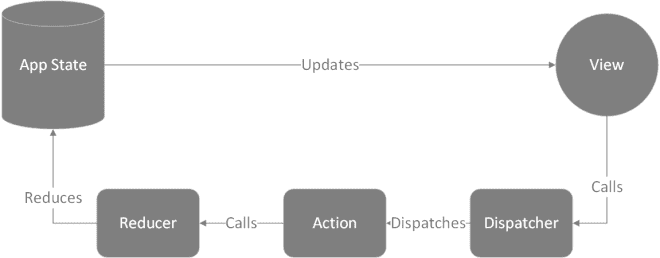
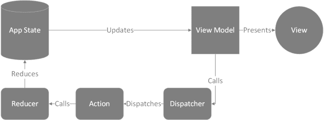
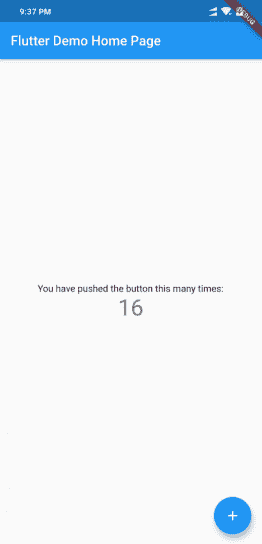

# 使用 Redux 管理颤振状态

> 原文：<https://levelup.gitconnected.com/managing-state-in-flutter-using-redux-7eeb686c108c>

Flutter 允许我们单独管理小部件的状态。然而，随着应用程序复杂性的增加，以及允许不同的小部件访问彼此状态的需求的增加，需要将应用程序的状态存储在一个普通的容器中。Redux 完全符合这一特殊需求。这篇文章解释了 Redux 如何与 Flutter 一起使用。

Redux 模式通常与 React 一起使用，可以在这种情况下使用。这使我们能够在整个应用程序中获得单一的真实来源。但是在我们学习使用 Redux 和 Flutter 之前，了解 Redux 的工作原理是有帮助的。

# Redux 架构

[Redux 有四大组成部分](https://redux.js.org/basics/data-flow):

1.  国家
2.  行动
3.  分配器
4.  还原剂



状态是存储应用程序状态(所有数据)的地方。Redux 库通常为我们提供所谓的提供者，帮助我们将状态绑定到视图。然而，修改存储并不简单(这很好),这有助于我们获得单向的数据流。

为了修改存储，dispatcher(由 Redux 提供)必须触发一个动作。这个动作有一个类型和我们想要用来修改存储的数据。一旦动作被触发，reducer 就制作一个存储的副本，用新数据更新副本，并返回新的状态。然后，用新数据更新视图。

通过将这个 Redux 模式合并到一个 Flutter 应用程序中，我们可以确保我们有一个公共的应用程序状态，可以通过触发动作来改变。尽管我说状态是突变的，但请注意 Redux 存储在设计上是不可变的，每次触发一个动作时，都会返回一个新状态，旧状态保持不变。

# 安装 Redux

有两个 flutter 包 [redux](https://pub.dev/packages/redux) 和 [flutter_redux](https://pub.dev/packages/flutter_redux) 帮助我们使用 redux 搭配 Flutter，应该先安装。因此，在`pubspec.yaml`文件中，在 dependencies 下面列出这两个包。

```
dependencies: flutter: sdk: flutter flutter_redux: ^0.5.3 redux: ^3.0.0
```

现在，您需要运行`flutter pub get`来安装这些包。一旦完成，我们就可以开始在我们的 Flutter 应用程序中使用 Redux 了。为了演示这一点，我将使用由`flutter create`命令创建的默认演示应用程序。

默认应用程序有一个计数器，可以通过按下浮动操作按钮来增加。计数器包含在`MyHomePage`小部件的状态中。让我们尝试将它移动到 Redux 存储中，并通过调度操作来增加它。

# 创建模型

在创建商店之前，我们需要创建一个柜台模型。为此，创建一个名为 model 的 dart 文件，并创建一个名为`Counter`的类。这个类将有一个名为`counter`的属性，顾名思义，它将存储计数器。创建一个接受整数作为参数的构造函数，并将其赋给`counter`属性。这可以在 Dart 中很容易地完成，方法是传递属性的名称——我们希望将传递的参数赋给它——前面加上`this.`作为参数。现在，我们有了一个柜台模型。

```
class Counter{ int counter; Counter(this.counter); }
```

# 创建一个国家

接下来，让我们创建应用程序的状态。创建一个名为 state 的 Dart 文件，并创建一个名为`AppState`的类。这个类的一个实例将保存我们应用程序的状态。现在，我们需要将计数器存储在应用程序的状态中。因此，将`Counter`模型导入状态文件，并创建一个名为`counter`的`Counter`类型的属性。然后，创建一个接受一个`Counter`对象作为参数的构造函数，并将其分配给`counter`属性。

为了初始化应用程序的状态，建议创建一个命名的构造函数，将`counter`的值设置为零。

```
import 'package:sample/model.dart'; class AppState { final Counter counter; AppState(this.counter); AppState.initial():counter=new Counter(0); }
```

# 创建操作

现在我们已经创建了我们的`AppState`类，让我们创建一个动作来修改状态。创建一个名为`action.dart`的新文件，并创建一个名为`IncrementAction`的新类。该操作将携带 reducer 用来修改状态的数据。因为我们想增加计数器，我们需要在这个类中有一个`counter`属性。因此，创建一个名为`counter`的整数属性，并使用构造函数初始化它。

```
class IncrementAction{ final int count; IncrementAction(this.count); }
```

# 创建一个减速器

接下来，我们需要创建一个返回更新状态的 reducer。因此，创建一个名为`reducer.dart`的新文件，并创建一个函数来返回我们的`AppState`类的一个实例。这个函数接受状态对象和被触发动作的对象作为参数。当一个动作被触发时，Redux 调用这个 reducer 函数，并将应用程序的当前状态和被触发的动作的一个实例作为参数传递。

我们可以用 action 对象中的数据修改传递的 state 对象，用修改后的 state 对象创建一个新的`AppState`实例，并返回它。但是这个 reducer 函数会在每次触发一个动作时被调用。不同的动作携带不同的数据，应该以不同的方式修改状态。那么，我们如何根据触发的动作执行不同的功能呢？由于每个动作都是一个动作类的实例，我们可以检查动作对象的数据类型，然后决定后续的动作过程。

我们可以通过使用`is`语法来检查 Dart 中变量的类型。因此，我们可以编写一个条件语句来查看某个动作是否属于某种类型，并执行必要的动作。

```
AppState appStateReducer (AppState state, dynamic action){ if(action is IncrementAction){ return new AppState(new Counter(action.count)); } return state; }
```

如上所示，我们可以编写一个 reducer 函数来检查所触发的动作是否是我们的动作类 IncrementAction 的实例，并返回一个用更新后的`counter`对象初始化的新的`AppState`实例。

# 视图模型

现在，我们已经创建了一个动作、一个 app 状态和一个 reducer。剩下要做的就是创建一个按钮点击事件来触发这个动作。但是在我们这样做之前，我们需要创建一个视图模型。



视图模型并不复杂。它在我们的应用程序的状态和应用程序的用户界面之间充当表示层。现在，我们希望在应用程序状态下存储数据的方式不一定是我们希望显示的方式。例如，我们可以将用户的名和姓存储在州的不同变量中。但是当显示用户名时，我们可能希望同时显示名字和姓氏。我们可以使用视图模型对数据进行这样的修饰。换句话说，我们使用视图模型来帮助状态和 UI 相互交互。它只是作为一个过滤器。

# 创建视图模型

让我们继续创建一个名为`viewModel.dart`的新文件，并创建一个名为`ViewModel`的类。现在，我们希望我们的 UI 做两件事:显示计数器值和触发我们的`IncrementAction`动作。因此，我们的视图模型应该包括一个存储计数器值的变量和一个触发动作的方法。

所以，让我们创建一个名为`counter`的整数和一个名为`onIncrement`的方法。让我们也创建一个构造函数来初始化这两个。

接下来，我们需要创建一个工厂构造函数来返回一个`ViewModel`类的实例。工厂构造函数确保如果`ViewModel`类的实例已经存在，那么返回该实例，而不是创建并返回它的新实例。

这个构造函数应该接受一个存储对象作为参数。然后，我们将实例化`ViewModel`类并返回它。但在此之前，我们需要获取计数器的值，并实现一个函数来触发`IncrementAction`动作。

我们可以从作为参数传递的 store 对象中获取计数器值。应用程序的状态存储在名为 state 的属性中。因此，我们可以通过使用`store.state.counter.counter`来访问计数器值。状态有一个类型为`Counter`的计数器属性，它有一个名为 counter 的整数属性。

然后创建一个分派操作的方法。dispatch 方法附加到 store 对象上，可以通过`store.dispatch()`访问。为了分派一个动作，我们需要创建一个 action 类的对象，并将其作为参数传递给 dispatch 方法。您可能还记得，这个 action 类还携带必要的数据。在我们的例子中，我们的 action 类中有一个名为 counter 的属性，它将携带计数器的更新值。

# 从我们的视图模型中递增计数器

因此，我们可以通过用新的计数器值实例化我们的 action 类来更改计数器值。因为我们试图增加我们的计数器值，我们可以从存储中获取计数器的现有值，将它增加 1，并将其作为参数传递给我们的 action 类构造函数。我们可以将返回的对象传递给 dispatch 方法。

您必须导入 redux 包、动作和状态文件。

```
import 'package:redux/redux.dart'; import 'package:sample/actions.dart'; import 'package:sample/state.dart'; class ViewModel{ int count; final Function () onIncrement; ViewModel(this.count,this.onIncrement); factory ViewModel.create(Store<AppState> store){ _onIncrement(){ print("Incrementing"); print(store.state.counter.counter.toString()); store.dispatch(new IncrementAction(store.state.counter.counter+1)); } return ViewModel(store.state.counter.counter,_onIncrement); } }
```

# 创建一个商店对象，并将其传递到 Flutter 小部件树中

我们差不多完成了。现在，我们需要创建一个 store 对象，并将其传递给我们的小部件树。然后，我们可以使用商店连接器在小部件中访问我们的商店。

首先，让我们创建一个`store`对象。我们可以通过实例化 redux 包提供的 store 类来做到这一点。当创建 store 对象时，我们需要将状态属性的类型(我们的状态对象的类)指定为一般类型参数。然后，传递 reducer 函数和初始状态作为参数。我们可以通过调用 state 类的初始构造函数来获得初始状态。

现在我们有了一个 store 对象，我们需要将它向下传递给小部件树。flutter redux 包为我们提供了一个`StoreProvider`,它会将我们的商店对象传递到小部件树中。我们需要做的就是用`StoreProvider`包装我们的根小部件。将`MaterialApp`作为子对象，并将我们的`store`对象赋给`store`参数。

```
class MyApp extends StatelessWidget { // This widget is the root of your application. @override Widget build(BuildContext context) { final Store<AppState> store = new Store<AppState>(appStateReducer, initialState: AppState.initial()); return StoreProvider<AppState>( store: store, child: MaterialApp( title: 'Flutter Demo', theme: ThemeData( // This is the theme of your application. // // Try running your application with "flutter run". You'll see the // application has a blue toolbar. Then, without quitting the app, try // changing the primarySwatch below to Colors.green and then invoke // "hot reload" (press "r" in the console where you ran "flutter run", // or simply save your changes to "hot reload" in a Flutter IDE). // Notice that the counter didn't reset back to zero; the application // is not restarted. primarySwatch: Colors.blue, ), home: MyHomePage(title: 'Flutter Demo Home Page'), )); } }
```

# 从 Flutter 小部件访问 Redux 商店

现在，我们可以使用`StoreConnector`在应用程序的任何地方访问商店对象。首先，让我们显示计数器值。

在`_MyHomePageState`小部件中，让我们将`StoreConnector`小部件分配给 body 参数。指定`AppState`类和`ViewModel`类作为通用参数。这个`StoreConnector`小部件有两个属性:`connector`和`builder`。`connector`接受一个函数，该函数接受一个存储对象作为参数，并返回一个视图模型对象。我们可以通过使用工厂构造函数来创建一个`ViewModel`对象。`builder`参数接受一个函数，该函数接受一个`BuildContext`对象和一个`ViewModel`对象作为参数，并返回一个小部件。

我们可以使用`viewModel`参数来显示计数器值。记住，`viewModel`对象有一个名为`counter`的属性，用于存储计数器值。我们可以使用`viewModel.counter.toString()`显示计数器值。

要调度一个动作，我们可以使用`viewModel.onIncrement()`方法。将其分配给浮动动作按钮的`onPressed`参数。

```
class _MyHomePageState extends State<MyHomePage> { int _counter = 0; void _incrementCounter() { setState(() { _counter++; }); } @override Widget build(BuildContext context) { return Scaffold( appBar: AppBar( title: Text(widget.title), ), body: StoreConnector<AppState, ViewModel>( converter: (Store<AppState> store) => ViewModel.create(store), builder: (BuildContext context, ViewModel viewModel) => Center( mainAxisAlignment: MainAxisAlignment.center, children: <Widget>[ Text( 'You have pushed the button this many times:', ), Text( viewModel.count.toString(), style: Theme.of(context).textTheme.display1, ), ], ), )), floatingActionButton: StoreConnector<AppState, ViewModel>( converter:(Store<AppState> store)=>ViewModel.create(store), builder:(BuildContext context, ViewModel viewModel)=> FloatingActionButton( onPressed: ()=>viewModel.onIncrement(), tooltip: 'Increment', child: Icon(Icons.add), ), // This trailing comma makes auto-formatting nicer for build methods. )); } }
```



当你点击浮动动作按钮时，它调用`viewModel`对象的`onIncrement`方法。该方法将计数器值递增 1，并将其传递给`IncrementAction`类构造函数。这将调用 reducer 并将状态和创建的对象作为参数传递给`IncrementAction`类。然后 reducer 从 action 对象中获取新的计数器值，并用新的计数器值创建一个`Counter`对象。然后，这个对象被传递到`AppState`构造函数中，以创建一个新的状态对象，该对象由 reducer 函数返回。当返回新的状态对象时，`viewModel`的 counter 属性得到更新，视图也用新的计数器值更新。

在那里！我们已经将使用 Redux 构建的状态连接到 Futter 应用程序的视图。现在，我们有了单一的事实来源，不需要担心在组件之间传递数据。

完整的源代码可以在这里找到:[https://github.com/thivi/FlutterReduxSample](https://github.com/thivi/FlutterReduxSample)

*原载于 2019 年 9 月 30 日*[*【https://www.thearmchaircritic.org*](https://www.thearmchaircritic.org/tech-journals/managing-state-in-flutter-using-redux)*。*