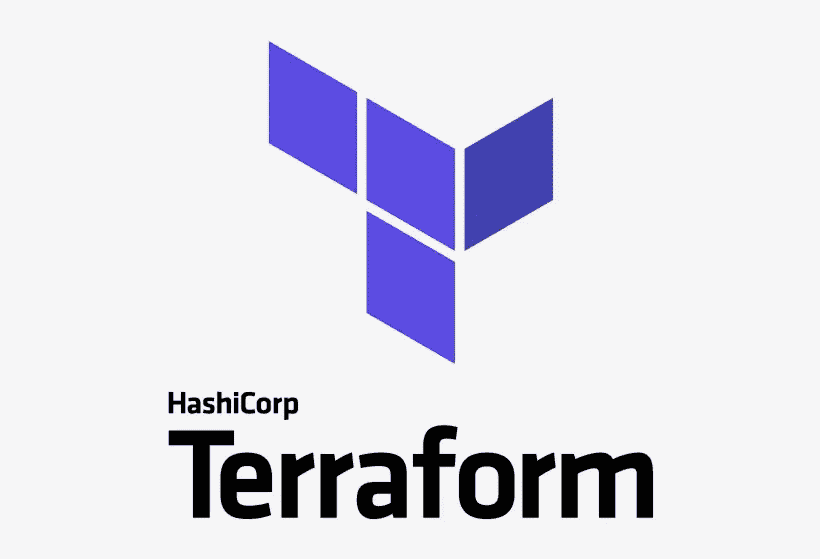

# 大规模管理地形

> 原文：<https://levelup.gitconnected.com/managing-terraform-at-scale-d71d6b7a0357>

## 管理地形状态和模块的技术

[HashiCorp Terraform](https://www.terraform.io) 标志

T erraform 是开发基础设施代码(IaC)的一个很好的工具。但是也有一些问题，特别是 Terraform 状态的管理和可重用的 Terraform 模块。幸运的是，只要稍加思考和努力，这些挑战是可以克服的。

# 管理地形状态

默认情况下，Terraform 状态存储在 Terraform 模块目录中的本地文件系统上。如果你只是玩玩，那就太好了。但是，如果你想确保你的状态是持久的，或者如果你想让其他任何人都可以使用你的状态，你需要使用一个不同的后端，比如 Terraform Cloud 或 S3(如果你在 AWS 中)。

假设您正在使用一个 S3 桶作为您的后端。那个桶必须以某种方式被创造出来。如果你用 Terraform 创建这个桶，并且你想用它作为你的后端，那么你就有一个先有鸡还是先有蛋的问题。这不是一个无法解决的问题。您可以使用 Terraform 和本地状态创建 bucket，然后更改后端状态配置以指向 bucket。但是，现在有了一个不同的问题，如果您将状态存储在 Terraform state 管理的对象中，您需要注意对该对象所做的任何更改，以免导致不可恢复的状态情况。

## 不同环境的状态

撇开[相对次要的]状态存储问题不谈，如何为不同的环境设置 Terraform 呢？您的第一个倾向可能是使用 Terraform 工作空间。然而，如果安全是一个问题，这不是一个很好的选择。

> 组织通常希望在服务于不同开发阶段(例如，试运行与生产)或不同内部团队的同一基础架构的多个部署之间建立强有力的隔离。在这种情况下，用于每个部署的后端通常属于该部署，具有不同的凭证和访问控制。对于这种情况，命名工作区不是合适的隔离机制。
> 
> - [哈希公司](https://www.terraform.io/docs/language/state/workspaces.html#when-to-use-multiple-workspaces)

Terraform 将其状态文件存储为纯文本。您的基础架构组件的名称、Terraform 使用的任何密码以及 Terraform 管理的基础架构的所有配置详细信息都存储在纯文本状态文件中。工作区只是存储在同一后端位置的不同状态文件。因此，如果您不希望有权访问开发环境状态的人也有权访问生产环境状态，那么您就不希望使用 Terraform 工作区来跨环境管理状态。

更好的方法是使用部分后端配置。部分后端配置要求您只将后端的类型存储在根 Terraform 模块的本地文件中。剩下的后端配置可以在命令行上通过 *terraform init* 提供。这允许您在不编辑文件的情况下更改后端存储位置。而且，如果您不想一致地输入那些剩余的参数，您可以将它们存储在某种类型的参数存储中(例如 AWS 参数存储),并在需要时获取它们。

正如您可能想象的那样，如果使用部分后端配置，那么通过构建自动化工具自动提供基础设施将变得非常简单，因为许多这样的工具支持不同的可配置概要文件。后端配置文件配置可以与环境保持一致，与后端配置相关联，并在命令行上用 *terraform init* 命令注入。

## 分割状态

状态管理是 Terraform 的一个经常考虑的问题。然而，拥有易于管理的基础设施和弹性状态的愿望有时是相互矛盾的。

以具有复制功能的 S3 桶为例。源存储区在区域 A 中调配，目标存储区在区域 b 中。目标存储区的存在只是为了确保源存储区的数据可恢复性。如果某个区域发生了中断事件，导致源存储桶关闭，您可能希望管理从源存储桶分离的目标存储桶的状态。这意味着两个不同的根模块具有两种不同的状态:一个用于源桶，一个用于目的桶。然而，一个地区的停电事件不会是一个常见的情况。此外，由于有两个独立的 Terraform 配置，复制的 S3 存储桶的管理复杂性加倍，以应对这种可能性。在两个区域都可用的常见情况下，更希望将源存储桶和目标存储桶作为单个配置来管理(即，一个 *terraform apply* 命令来供应两者)。

如果不是有两个不同的根模块和两个不同的状态，而是只有一个根模块和一个状态，会怎么样？这个模块将把源桶和目的桶耦合在一起。这两个存储桶将被一起提供，它们的生命周期也将被一起管理(更新、删除等)。)但是，现在有一个问题，如果一个地区确实发生了断电事件。没有简单的方法来恢复目标存储桶的状态，并将其从聚合状态中分离出来进行管理…除非状态也被复制到区域 B，并且每个存储桶都是使用单独的模块定义的。

为了阐明这种方法，有一个模块用于目标存储桶，有一个模块用于源存储桶，还有一个根模块将源存储桶和目标存储桶合并成一个模块。当区域断电事件发生时，从根模块的状态中提取与幸存区域相关联的模块状态。然后，定义 bucket 的子模块可以用作根模块。更深入的细节可以在下面参考资料部分链接的 post*terra form State*的灾难恢复中找到。

# 管理 Terraform 模块

Terraform 模块已在上文中提及。但是，什么是地形模块呢？简单地说，Terraform 模块是一个可重用的 Terraform 配置。根模块是一种特殊类型的地形模块，可以直接初始化、应用、规划和删除。

有几条规则将 Terraform 根模块与其他 Terraform 模块区分开来。但是，一般来说，没有理由为什么 Terraform 模块不能是 Terraform 根模块。下面将主要根据来源于 Terraform 根模块或其他 Terraform 模块的 Terraform 模块来讨论 Terraform 模块。

## 发布和使用 Terraform 模块

Terraform 模块可以发布到 Terraform 注册表、网络驱动器、S3 桶、Git 回购、GCS 桶和 HTTP URLs。模块源在使用模块的地形配置中指定。该模块作为 *terraform init* 命令的一部分被验证和获取(或直接通过 *terraform get* )。

在 Terraform 强加的配置中指定模块源的要求有一些非常重要的含义，包括:

*   更新版本需要更改代码
*   更改模块版本可能需要在 Terraform 配置中的多个位置进行更新
*   同一模块的不同版本可以出现在同一配置中

** *注:术语“模块”、“地形模块”、“配置”和“地形配置”可互换使用。*

不用说，这些都是相当大的问题。Terraform 开发人员通过将 Terraform 模块依赖关系的已发布源代码外部化来解决这些问题。实现这一点的一种机制是通过使用 Terrafile，它通过将发布的源代码翻译成单个本地模块源代码，将模块的发布源代码外部化。这里的优点是本地模块源没有版本，Terrafile(在 Terraform 配置的外部)处理指定版本的获取。这与其他语言中的依赖管理没有太大的不同(例如 Python 中的资源或 Java 中的 Maven/Gradle)。事实上，甚至有一个 Terraform Maven 插件，允许使用 Maven 和 Maven 存储库来发布、版本化和获取 Terraform 模块。

使用 Terrafile 的缺点是没有发现功能。因此，它可能仍然是一个寻宝游戏来寻找 Terraform 模块的依赖关系。这是使用 Terraform 注册表或 Terraform 和 Maven 的一个好处。Maven 确实有内置发现，可以使用。此外，Maven 还支持原型，这对于生成项目框架来说非常方便。而且，如果您已经在使用 Maven，那么添加带有自动化[Java/Groovy/Kotlin/JVM]测试支持的 Terraform 项目可能会很有吸引力。

# TL；速度三角形定位法(dead reckoning)

*   不同环境的地形状态应该存储在不同的后端位置。
*   使用一致的后台类型，允许部分后端配置。
*   使用部分后端配置允许后端位置是动态的。
*   Terraform 模块和状态应根据其管理方式进行划分。
*   为了简单起见，通常一起使用的模块可以聚合在一起，然后在不常见的情况下可以分解。
*   Terraform 为模块重用设置了相当大的障碍；最值得注意的是，发布的模块源及其版本包含在 Terraform 配置中。
*   Terraform 外部的依赖管理解决方案是可用的，包括 Terrafile 和 Terraform Maven 插件。

# 资源

*   [地形状态](https://www.terraform.io/docs/language/state/index.html)
*   [地形后端](https://www.terraform.io/docs/language/settings/backends/index.html)
*   [地形工作区](https://www.terraform.io/docs/language/state/workspaces.html)
*   [地形部分后端配置](https://www.terraform.io/docs/language/settings/backends/configuration.html#partial-configuration)
*   [地形命令:初始化](https://www.terraform.io/docs/cli/commands/init.html)
*   [AWS 系统管理器参数存储](https://docs.aws.amazon.com/systems-manager/latest/userguide/systems-manager-parameter-store.html)
*   [地形状态下的灾难恢复](https://www.bluflametech.com/blog/recover-tf-state/)
*   [地形模块](https://www.terraform.io/docs/language/modules/index.html)
*   [地形命令:获取](https://www.terraform.io/docs/cli/commands/get.html)
*   [Terraform 设计模式:Terrafile](https://bensnape.com/2016/01/14/terraform-design-patterns-the-terrafile/)
*   [Terraform Maven 插件](https://github.com/deliveredtechnologies/terraform-maven)
*   [美芬原型](https://maven.apache.org/guides/introduction/introduction-to-archetypes.html)