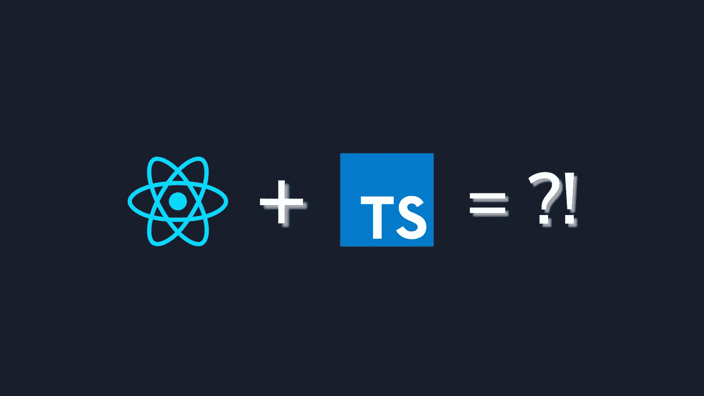
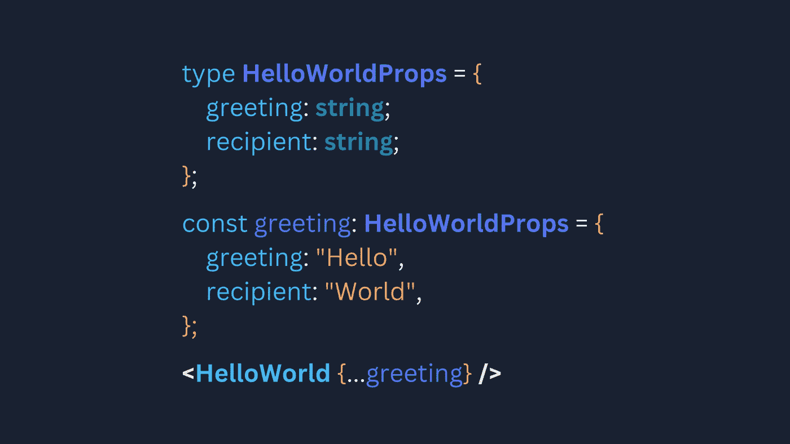

# 以正确的方式管理 React Typescript 中的类型

> 原文：<https://levelup.gitconnected.com/managing-types-in-react-typescript-the-right-way-fa1ecc50a2bf>



在 React Typescript 中管理类型

# 介绍

作为开发人员，我们喜欢干净、可维护的代码。当使用 Typescript 编写 React 时，我们经常处理分布在多个文件中的类型。如果你痴迷于干净的代码，这就有很多不足之处。这里有几件事可以让你的 React 代码更干净、更易读。



反应类型基础

# 基础知识

编写代码时，扎实的基础很重要。以下是编写类型脚本代码时要记住的一些基本习惯。

## 命名规格

Typescript 允许您忽略约定，按照自己的方式编写代码。使用惯例是因为它们有帮助，正如俗话所说“入乡随俗…”

下面是编写干净易读的代码时应该遵循的一些约定:

*   使用 **PascalCase** 作为类型名。
*   不要对接口使用 **I** 前缀。(从静态类型语言中复制的东西)
*   私有财产使用 **_** 前缀。
*   对组件属性类型使用**一致的命名**(例如，type**CustomComponentProps**)

## 组件和类型

遵循 React 基于组件的编码风格，我们将组件分成多个不同的文件。使用 typescript 时，将道具类型与组件一起导出总是一个好主意。

工具提示组件

在 **tooltip.tsx** 文件中，您可以看到 TooltipProps 类型与组件一起被导出。当您的组件从父组件的状态中获取道具时，这尤其有用。

另一个有用的习惯是用定制属性扩展你的基本 HTML 组件属性(使用 **React)。ComponentPropsWithoutRef** )。尤其是在创建基本 HTML 标签的风格化版本时。

## 名称空间

随着项目规模的增加，类型的数量也会增加。很有可能会出现名称冲突。[名称空间](https://www.typescriptlang.org/docs/handbook/namespaces.html)就是这个问题的解决方案。命名空间不仅可以避免多重类型声明，还可以为你的项目提供一个组织结构。有效地使用名称空间可以使您的代码库变得干净。下面是一个名称空间**验证**的例子。

```
namespace **Validation** {
  export interface **StringValidator** {
    isAcceptable(s: **string**): **boolean**;
  }const lettersRegexp = /^[A-Za-z]+$/;
  const numberRegexp = /^[0-9]+$/;export class **LettersOnlyValidator** implements **StringValidator** {
    isAcceptable(s: **string**) {
      return lettersRegexp.test(s);
    }
  }export class **ZipCodeValidator** implements **StringValidator** {
    isAcceptable(s: **string**) {
      return s.length === 5 && numberRegexp.test(s);
    }
  }
}
```

## 关键字 of，类型 of

我们熟悉 JavaScript 中的**类型的**操作符。JavaScript 中的 typeof 运算符有助于获取字符串格式的变量类型。但是 typeof 运算符不能给出对象的确切类型。例如:

```
type **X** = {a: **number**; b: **boolean**;};
const x: **X** = {a: 1, b: false};/* Here the **typeof** operator will only give the type of x as **object** instead of the type **X** */
console.log(typeof x);
```

Typescript 只是一个开发工具，它可以使用 **typeof** 操作符来获得变量的确切类型定义。例如:

```
type **X** = {a: **number**; b: **boolean**;};
const x: **X** = {a: 1, b: false};// Here type **Y** will evaluate to type **X** = {a: **number**; b: **boolean**;}
type **Y** = typeof x;
```

typeof 运算符有助于直接从传递的值中推断类型。可以使用 typeof 来推断类型，而不是在需要时导入每个类型。

运算符的**键由 typescript 引入。它以联合的形式给出对象类型的属性。例如:**

```
type **X** = {a: **number**; b: **boolean**;};
const x: **X** = {a: 1, b: false};// **Y** = 'a' | 'b'
type **Y** = keyof **X**;
const y: **Y** = 'a';/* Without explicitly specifying y as type **Y** TS will infer its type as **string** and will throw an error about indexing type **X** using **string** */
console.log(x[y]);
```

您将经常组合使用 typeof 和 keyof 运算符，typeof 用于获取对象的类型，keyof 用于对其进行索引。

# 项目范围类型*(@类型)*

[**@types**](https://www.typescriptlang.org/tsconfig#types) 是 typescript 中的一个特殊目录。声明文件( ***.d.ts** 文件，例如 **index.d.ts** )被项目的 **tsconfig** 自动识别为根类型文件。这些文件中定义的类型可以用作项目中的全局类型。

有时会经常需要某些类型定义。@types 就是这个的答案。您可以使用@types 来覆盖或扩展您的类型定义。下面是一个 **@types/index.d.ts** 的例子:

反应类型的 **@types/index.d.ts**

在这个例子中，你可以看到类型**可选**被定义，以及一个新的**命名空间 Api** 被声明。 **React 名称空间**中的类型也被扩展为包含 **React。ClassicFunctionalComponent** (或其简称 **React。CFC** )。

**枚举是**@类型**的一个例外**。typescript 中定义的类型不是 JavaScript 包的一部分，但是枚举是编译的。在 **@types** 中定义**枚举**将使它们在项目范围内全局可访问，但是它们可能会在构建中抛出错误。最好在 ***中单独定义和导出枚举。ts/tsx** 文件。

# 实用程序类型

Typescript 提供了几种实用工具类型，帮助您转换类型定义。我常用的一些实用程序类型有:

*   **部分<类型>** 构造类型，该类型的所有属性都设置为可选。

```
type **X** = {a: **number**;}
// **Y** = **Partial<X>** = {a?: **number**;} or {a: **number** | **undefined**;}
type **Y** = **Partial<X>**
```

*   **必需的<类型>** 构造类型，该类型的所有属性都设置为必需的。

```
type **X** = {a?: **number**;}
// **Y** = **Required<X>** = {a: **number**;}
type **Y** = **Required<X>**
```

*   **记录<键，>类型**构造一个对象类型，其属性键为**键**类型，属性值为**类型**类型。

```
// **X** = {[key: **string**]: **number**;}
type **X** = **Record<string, number>**
```

*   **省略<类型，移除**键**后**键>从**类型**构造一个类型(字符串文字或字符串的并集)。

```
type **X** = {a: **number**; b: **boolean**; c: **string**;}
// **Y** = {b: **boolean**; c: **string**;}
type **Y** = **Omit<X,** 'a'**>**
// **Z** = {c: **string**;}
type **Z** = **Omit<X,** 'a' | 'b'**>**
```

typescript 中有更多的 [**实用程序类型**](https://www.typescriptlang.org/docs/handbook/utility-types.html) ，这些将帮助您避免为每个单独的或可派生的类型重写类型定义。

您还可以编写定制的实用程序类型，比如在 **@types/index.d.ts** 文件中提供的可选类型。可选类型用于使类型中只有选定的属性是可选的。

# 无商标消费品

[**泛型**](https://www.typescriptlang.org/docs/handbook/2/generics.html) 允许开发者编写可重用的类型安全代码/组件。在像 C#和 Java 这样的静态类型语言的世界里，泛型通常用于编写可重用的代码。Typescript 从这些语言中吸取了许多东西，包括泛型。

泛型将类型作为输入，并使用它们来派生变量或函数的类型。其中一个例子是实用程序类型 **Partial < T >** ，它以类型 **T** 为输入，给出了一个新的类型。泛型可以接受多个类型作为输入，也可以有默认类型。下面是一个带有函数的泛型的例子。

```
/* **Type** is passed to the function either **explicitly** or **implicitly */**
function identity<**Type**>(arg: **Type**): **Type** {
  return arg;
}/* **Explicitly**: **Type** is assigned type **string** explicitly and the function takes **string** argument arg */
identity<**string**>("Hello");/* **Implicitly**: **Type** implicitly takes type **string** based on the type of argument arg */
identity("World")
```

使用泛型使您的代码可重用，而无需编写多个类型定义。


包装它

# 包扎

在开始时，将 typescript 与 react 一起使用似乎是额外的工作。在没有结构的情况下添加类型来反应 JSX 可能会使您的代码变脏。遵循前面提到的习惯、指导方针和惯例，我已经能够让我的代码更干净、更容易管理。希望你(读者)也能从中获得一些有用的提示。

# 参考✍️

*   **打字约定****——**[https://ts.dev/style/#identifiers](https://ts.dev/style/#identifiers)
*   **ESLint 命名规则****—**[https://github . com/typescript-ESLint/typescript-ESLint/blob/main/packages/ESLint-plugin/docs/rules/naming-conventi on . MD](https://github.com/typescript-eslint/typescript-eslint/blob/main/packages/eslint-plugin/docs/rules/naming-convention.md)
*   **名称空间—**[https://www . typescriptlang . org/docs/handbook/Namespaces . html](https://www.typescriptlang.org/docs/handbook/namespaces.html)
*   **@ typescript 中的类型—**[https://www.typescriptlang.org/tsconfig#types](https://www.typescriptlang.org/tsconfig#types)
*   **公用事业类型—**[https://www . typescriptlang . org/docs/handbook/Utility-types . html](https://www.typescriptlang.org/docs/handbook/utility-types.html)
*   **仿制药—**[https://www . typescriptlang . org/docs/handbook/2/Generics . html](https://www.typescriptlang.org/docs/handbook/2/generics.html)
*   **打字手册—**[https://www.typescriptlang.org/docs/handbook/intro.html](https://www.typescriptlang.org/docs/handbook/intro.html)
*   **React typescript cheat sheet—**[https://React-typescript-cheat sheet . net lify . app/docs/advanced/patterns _ by _ use case/](https://react-typescript-cheatsheet.netlify.app/docs/advanced/patterns_by_usecase/)

> **附注**这里提到的信息是我理解的**可能不完全准确。如果你想要更多的细节，你可以检查[打字稿文档](https://www.typescriptlang.org/docs/handbook/intro.html)或者参考资料部分。**