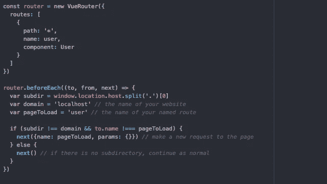
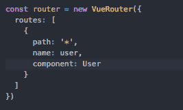
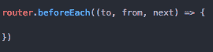
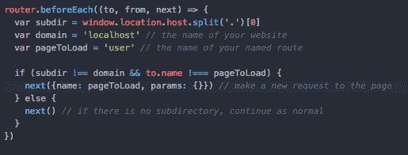

# 用 Vue 路由器管理通配符子域

> 原文：<https://levelup.gitconnected.com/managing-wildcard-subdomains-with-vue-router-9fd74518f2f5>

# 处理子域

在很多情况下，web 应用程序需要使用通配符子域——最常见的例子是当用户拥有自己的子域时的应用程序(例如*mysite.wordpress.com*)。但是，vue-router 没有内置这一功能，需要我们来实现。这将通过使用 vue-router 的两个特性来实现，这两个特性很容易在它的文档中找到:命名路由和`router.beforeEach()`功能。

有两种方法可以识别 vue-route，它的路径和它的名字。虽然路径是每个路由的必需部分，但名称是可选的，但它将允许我们区分初始路由器请求和使用子路由器重定向的请求。在完整的应用程序中，这应该是最后一个路由，因为它还会捕获所有通配符条目。很简单。

创建命名路由后，更具挑战性的步骤是根据子域找到链接它们的方法。为此，我们将不得不使用 Vue 路由器的 [beforeEach](https://router.vuejs.org/guide/advanced/navigation-guards.html#global-guards) 方法。`beforeEach`方法是允许路由器重定向或取消请求的导航保护措施之一。顾名思义，这个方法是在路由器搜索路由数组之前调用的，这将允许我们在加载任何东西之前进行所有的子域检查和路由。

首先，在路由器的`index.js`中，添加以下代码来定义`beforeEach`导航保护。这些都包含在文档中，所以如果你觉得更容易的话，可以随意使用。我不会被冒犯的。

然后，通过解析传递给路由器的 URL，我们可以确定是否存在子域。因为下面的代码使用了`.split`来获取子域，如果没有子域，就会设置为等于你的域名。这里有一些清晰的例子。

*   *example.mysite.com*—子域将等同于“示例”
*   *mysite.com*—子域将等于“我的网站”

if 语句有两个检查。首先，它检查是否没有我前面提到的子域。其次，它检查请求是否指向已经是正确页面的路由。这第二个检查非常重要，因为如果没有它，这个循环将会无限地调用自己并破坏你的代码。现在，这个代码块中的关键行是接下来的两个调用。`next()`是允许路由器继续搜索正确路由所需的功能。根据文档…

*   。下一步({路径:路径}或{名称:名称})-重定向到新位置，中止当前导航，并开始新的导航
*   next()-不带任何参数，移动到管道中的下一个挂钩

> 注意:本教程是为所有用户子域使用相同页面组件的应用程序设计的。如果需要多个组件，只需在。下一个()调用。

现在，我将讨论如何在你的计算机上进行本地测试，以及如何处理 Google 域中的通配符子域。

# 测试本地和谷歌域名

大多数情况下，当实现预先确定的静态子域时，您可以简单地将 CNAME 添加到您的 DNS 中，并非常容易地重新路由所有内容，但使用通配符时，它会变得不太直观，因为不可能明确地将每个可能的子域添加到您的 DNS 中。对于谷歌域名，只需添加一个 CNAME，但要引用*，这表示一个通配符。我假设其他提供商也有类似的流程。

让子域在本地工作更令人困惑，因为你的系统自然地在`localhost`开始项目，这不允许子域或重新路由。为了解决这个问题，安装 [dnsmasq](http://www.thekelleys.org.uk/dnsmasq/doc.html) ，一个允许你控制本地域名系统的小工具。有一篇优秀的 Medium [文章](https://medium.com/@kharysharpe/automatic-local-domains-setting-up-dnsmasq-for-macos-high-sierra-using-homebrew-caf767157e43)作者[卡瑞·夏普](https://medium.com/u/3c106ae5c576?source=post_page-----9fd74518f2f5--------------------------------)可以带你完成配置本地 DNS 的过程。

希望这个小指南有所帮助。祝你好运！

 [## 学习 Vue.js -最佳 Vue.js 教程(2019) | gitconnected

### 排名前 26 的 Vue.js 教程。课程由开发者提交并投票，让你找到最好的 Vue.js…

gitconnected.com](https://gitconnected.com/learn/vue-js)