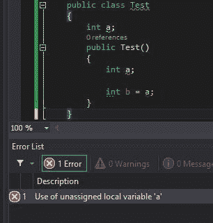
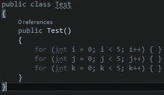

# 强制局部变量初始化

> 原文：<https://levelup.gitconnected.com/mandatory-local-variable-initialization-b50a7e2a9ea0>

韦恩·达尔伯格在 [Unsplash](https://unsplash.com/) 上拍摄的照片

你有没有想过为什么实例字段不需要初始化并默认为 0，false，null 等，而局部变量在使用前必须初始化？

事实证明，微软这样做是有充分理由的。它防止了错误，并且您获得了更好的内存重用。

# 防止 bug

默认情况下，局部变量就像实例字段一样，在后台初始化为 0。所以他们可以允许你使用未初始化的变量。然而，研究表明，使用未初始化的局部变量可能是一个错误。

他们决定不强制实例字段的初始化，因为编译器检查实例字段是否已经初始化要困难得多。

阅读 Eric Lippert 的这篇[回答](https://stackoverflow.com/a/30820127/2063755)获得详细解释。

# 内存重用

这样做的另一个好处是编译器可以重用内存槽。

如果有 3 个像这样的 for 循环:

一旦`i`超出范围，`j`可以使用变量`i`使用的同一个内存槽，然后当`j`超出范围，`k`就可以使用那个内存槽。

因为每个局部变量都必须被初始化，所以同一个内存槽可以被重用，而不必担心那里当前有什么值。