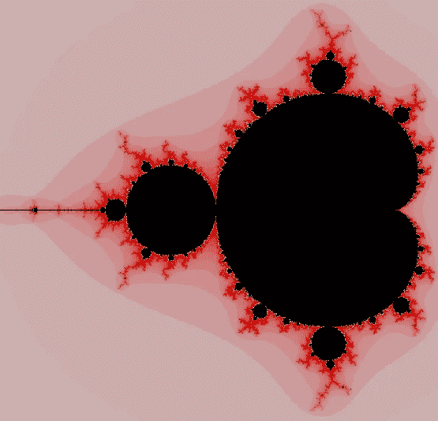
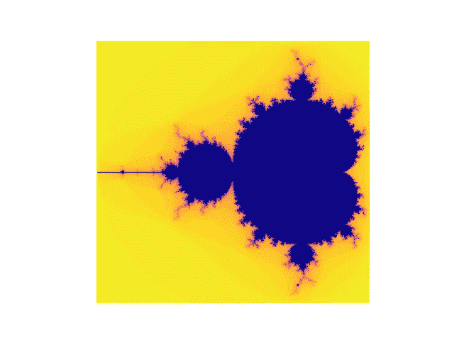

# 使用 Python 的 Mandelbrot 集合

> 原文：<https://levelup.gitconnected.com/mandelbrot-set-with-python-983e9fc47f56>

*[*曼德尔布罗集合*](https://mathworld.wolfram.com/MandelbrotSet.html) *标志着集合中的点在* [*复平面*](https://mathworld.wolfram.com/ComplexPlane.html)[*这样，对应的*](https://mathworld.wolfram.com/JuliaSet.html)*集合* [*是*](https://mathworld.wolfram.com/ConnectedSet.html) *和 [*不可计算*](https://mathworld.wolfram.com/ComputableNumber.html) *。Mandelbrot 集合是由递推关系得到的集合，Z_(n) = Z _(n-1) + c，其中，Z_(0) = c .其中 c 为复数"* — Wolfram Mathworld。**

**

*曼德尔布罗集合*

*Mandelbrot 集合中的颜色表示复数向无穷大发散的迭代次数(我们可以在这里使用某个阈值来代替无穷大)。一般来说，黑色代表收敛到零的数字(这里我们可以使用一些最大迭代限制，如果数字不大于阈值，我们假设它收敛到零)和*这都在 Mandelbrot 集合(不是真的)*。*

# ***让我们编码***

*上面的代码用于查找一个复数在 max_steps 下是否发散，如果发散，那么什么时候发散。*

*第 4 行:将图像坐标映射到 x 的范围[-2，0.47]和 y 的范围[-1.12，1.12]中的实数值(各边的边距为 0.01)，这将用于生成复数。因为已知集合以“*为界，所以集合最左边的范围以 x = -2 处的尖峰结束，右边向外延伸到大约 x = 0.47。顶部和底部分别在大约 y = 1.12 处*——[分形](https://www.fractalus.com/kerry/articles/area/mandelbrot-area.html)。*

*第 5 行:创建一个形状为 N*N 的 Numpy 数组，用来存储 Mandelbrot 集合的像素值。*

*第 6–8 行:我们使用两个循环遍历所有像素坐标，并计算该坐标的像素值(实际上是迭代值)。*

*第 9–10 行:将像素值放入图像中。我使用 *"img[y][x]=255-it"* ，因为更多的迭代意味着走向黑色*。(*我不知道为什么图像会旋转-90 度，但是我使用*“img[y][x]= 255-it”而不是使用“img[x][y]= 255-it”)*将其旋转了 90 度，并返回图像“img”。*

*就这样，我们有了脚本，现在让我们制作一些图像。*

```
*n=1000
img = plotter(n, thresh=4, max_steps=50)
plt.imshow(img, cmap="plasma")
plt.axis("off")
plt.show()*
```

*上面的代码创建了一个图像。*

**

*对于图像中更多的像素增加 N，对于更多的细节增加 max_steps，不要改变 thresh 值，否则你将做多余的工作(为什么？).*

*尝试将 plt.imshow 方法中的颜色映射(cmap)参数从[更改到这里的](https://matplotlib.org/3.1.0/tutorials/colors/colormaps.html)，以获得不同的颜色效果。*

# ***参考文献***

*[复数之美](http://The beauty of complex numbers)由扎克开始。*

*[Mandelbrot 集合](https://mathworld.wolfram.com/MandelbrotSet.html)，Wolfram Alfa MathWorld。*

*[曼德尔布罗集合](https://www.fractalus.com/kerry/articles/area/mandelbrot-area.html)面积的统计调查，分形。*