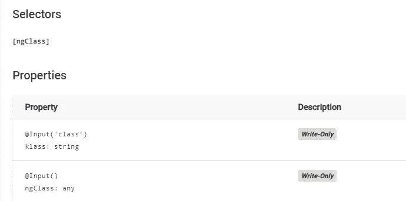

# 在 Angular 中操作 CSS 类

> 原文：<https://levelup.gitconnected.com/manipulate-css-classes-in-angular-119cc20fe50b>

## 有角的

使用`ngClass`指令以 4 种不同方式在 Angular 中添加一个`class`的端到端示例。

照片由[阿德南·艾哈迈德](https://unsplash.com/@ednanejaz?utm_source=unsplash&utm_medium=referral&utm_content=creditCopyText)在 [Unsplash](https://unsplash.com/s/photos/coffee-cup?utm_source=unsplash&utm_medium=referral&utm_content=creditCopyText) 上拍摄

这篇文章收集了我们现在在 Angular 中操作一个类的所有方法。

1.  使用带有类型**字符串**的 **ngClass** 属性
2.  使用类型为**数组**的 **ngClass** 属性
3.  对类型为**的对象**使用 **ngClass** 属性
4.  使用带有类型**字符串**的**类**属性

*更多类似的内容，请查看*[*https://betterfullstack.com*](https://betterfullstack.com)

`ngClass`指令允许你为一个 DOM 元素动态设置 CSS 类。

下面是 [ngClass](https://angular.io/api/common/NgClass) 指令属性:

Angular 中的 NgClass 指令属性

# 使用类型为**字符串**的 **ngClass** 属性

这个方法添加了一个类，就像我们在标准 HTML 中做的一样。然而，唯一的区别是我们可以从 TypeScript 组件中获取类。

使用 ngClass 属性将类作为字符串添加

# 使用带有类型**数组**的 **ngClass** 属性

我们还使用数组输入添加了一个类。因此，我们可以通过使用数组方法从 TypeScript 组件中引入类。

使用 ngClass 属性将类添加为数组

# 对类型为**的对象**使用 **ngClass** 属性

如果每个样式的类都有条件地应用于元素，我们可以将一个对象传递给`ngClass`。

在下面的例子中，当`useMediumFont`的值为`true`时，将添加`--font-m`，当`useGreenColor`为`true`时，将添加`--color-g`。

将类添加为具有 ngClass 属性的对象

# 使用带有类型**字符串**的**类**属性

`The ngClass`指令还提供了一个`class`属性来给 HTML 添加一个类。

在`useMediumFont`和`useGreenColor`是`true`的情况下，这两个类都将被添加到`class`属性中。

将类作为具有类属性的字符串添加

我们也可以使用 HTML 中的`class`属性和`class`属性。

将 html 类属性和 ngClass 指令中的类属性组合在一起

# 结论

这篇文章包含了在 Angular 框架中使用类需要知道的所有事情。

我希望这篇文章对你有用！可以跟着我上[媒](https://medium.com/@transonhoang?source=post_page---------------------------)。我也在[推特](https://twitter.com/transonhoang)上。欢迎在下面的评论中留下任何问题。我很乐意帮忙！

 [## 故事-更好的全栈

### 关于 JavaScript、Python 和 Wordpress 的有用文章，有助于开发人员减少开发时间并提高…

betterfullstack.com](https://betterfullstack.com/stories/)