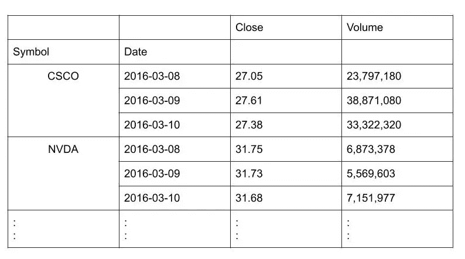
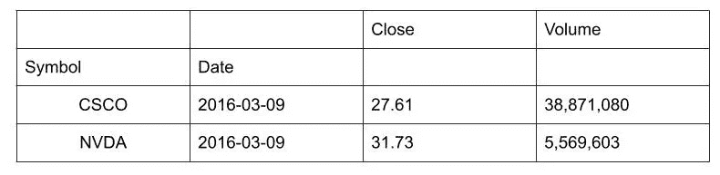
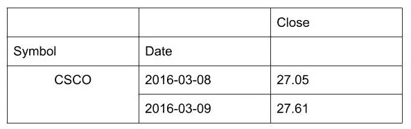

# 用 Python 处理数据帧|第 1 部分(切片、过滤和索引)

> 原文：<https://levelup.gitconnected.com/manipulating-dataframes-with-python-part-1-slicing-filtering-and-indexing-486c6411ba8>


卢克·切瑟在 [Unsplash](https://unsplash.com?utm_source=medium&utm_medium=referral) 上的照片

当处理任何数据集时，数据帧是 python 中可用的主要工具选项。在这篇文章和随后关于这个主题的文章中，我将讨论 DataFrame 的所有可用选项，以便更好地了解您的数据。

*这些帖子将成为如何开始使用 DataFrame 的指南。这些主题本身就值得为它们中的每一个写一篇文章。不过，我会给出对它们的基本理解，如果你想更深入地挖掘，我会附上关于这些主题的深入教程的链接。*

在用 Python 操作数据帧的第 1 部分中，我们将介绍一些基本技术，即

1.  [切片](#0482)
2.  [过滤](#7f36)
3.  [分度](#8f76)

# 切片数据帧

切片是指我们想要获取数据的一部分，并了解它的全部内容。就像你拿一片芒果，同样一片数据。切片既可以跨列进行，也可以跨行进行。有两种方法可以做到——

使用 df.loc() → loc 需要行索引和列的标签名进行切片。

使用 df.iloc() → iloc 需要行和列的数字索引值。

数据帧切片非常类似于我们在 Python 中看到的列表。切片的快速总结写在下面。

```
#returns series of "col_name" of x to y row index -> part of #col_name from x to y-1 index
df['col_name'][x:y]#slicing using loc -> here row_indexes are labels#returns series of data containing rows and columns sequentially #from col1 to coln and row1 to rown
df.loc['row1_index':'rown_index', 'col1':'coln']#returns the value from row col pair in dataframe
df.loc['row_index', 'col']#slicing using iloc -> here row indexes are numbers
#returns the series of data from row_num_start to row_num_end-1
df.iloc[[row_num_start, row_num_end]]#returns the dataframe from row_num_start to row_num_end-1 and #from col_num_start to col_num_end-1
df.iloc[[row_num_start, row_num_end], [col_num_start, col_num_end]]#returns the value from the row col pair in dataframe
df.iloc[row_index, col_index]
```

更深入的细节可以从这里的[参考](https://pandas.pydata.org/pandas-docs/stable/reference/api/pandas.DataFrame.loc.html)。

# 过滤数据帧

假设您想要基于某些边界线来分析数据，或者您想要找到某一列的特定值的所有数据的趋势。对于这种情况，我们根据我们的需求过滤掉数据。

过滤可以通过多种方式完成，可以基于类别标签或数值，也可以是两者的组合。你只需要问自己问题，好奇去发现数据到底想说什么。这个特定值对数据有什么影响？有没有一种方法可以修改值，使数据变得更清晰？诸如此类。

下面我列举了一些过滤数据的例子。

```
#creating boolean series
```df.col_val>60 is the filter for selecting only the rows which have value greater than 60, filters can also be combined using |, & and ! operators ```
df.loc[df.col_cal>60]#selecting columns with all non-zeros 
df.loc[:, df.all()]#selecting columns with any non-zeros 
df.loc[:, df.any()]#selecting columns with any NaNs
df.loc[:, df.isnull().any()]#selecting columns with no NaN values
df.loc[:, df.isnull().all()]#dropping rows with any NaNs 
df.dropna(how = 'any')#filtering a column based on another 
df.eggs[df.salt>55]#modyfying a column based on another
df.eggs[df.salt>55] += 5#convert to dozens(12) unit
df.floordiv(12)
df.apply(lambda x: x//12)
```

有关更多示例和过滤方式，请参考本文。

# 索引对象和标签数据

让我们从理解索引以及它们与数据帧的关系开始。

索引是标签序列，它们是不可变的(像字典键或元组)，并且在数据类型上是同构的(像 Numpy 数组)。

数列是带索引的 1D 数组。

数据帧是以系列为列的 2D 数组(可以把它们想象成包含字段、记录和索引的 SQL 表)。

现在我们对什么是指数和数列有了一个大致的概念，让我们深入实际的东西。

接下来要讨论的索引主题-

1.创建系列 v/s 创建索引

2.修改索引值

3.分级索引

4.花式索引

5.排序索引

## 1.创建系列 v/s 创建索引

数据帧是多个系列的整体组合。pandas 系列是一个有序的一维数据数组，带有索引。一个系列中的所有数据都属于同一数据类型。数据帧中的一列是熊猫系列。索引是引用数据帧中任何一行的重要部分。下面是如何用 Python 创建一个系列和一个索引。

```
#Creating a Series
import pandas as pd
prices = [10.70, 10.86, 10.74, 8.48]
shares = pd.Series(prices)
print(shares)*0    10.70 
1    10.86 
2    10.74 
3     8.48 
dtype: float64*#Creating an Index
import pandas as pd
days = ['Mon', 'Tue', 'Wed', 'Thur']
prices = [10.70, 10.86, 10.74, 8.48]
shares = pd.Series(prices, index=days)
print(shares)Mon     10.70 
Tue     10.86 
Wed     10.74 
Thur     8.48 
dtype: float64
```

默认情况下，索引是从 0 到 n-1 的数值，其中 n 是总行数。索引可以是日期-时间字段、单级列表或多级列表。

## 2.修改索引值

因为索引条目是不可变的，所以它们不能被直接修改。如果您想要更改索引中的任何值，您必须设置另一个系列。

```
shares.index[2] = 'Wednesday' #Wrong
TypeError: Index does not support mutable operations#right way -> overriding all at once
shares.index = ['Monday', 'Tuesday', Wednesday', 'Thursday']#Assigning Index Values
unemployment.index = unemployment['zip'] #where zip is a column in unemployment
```

## 3.分级索引(多重索引)

将索引设置为两列或更多列的组合

```
stocks = stocks.set_index([‘symbol’, ‘Date’]) 
#where [‘symbol’, ‘Date’] is ordered list of column lables
```



多索引数据帧

```
print(stocks.index)
Multiplex(levels = [['CSCO', 'NVDA'], ['2016-03-08', '2019-03-09', '2016-03-10']], labels = [0, 0, 0, 1, 1, 1],[0, 1, 2, 0, 1, 2], names = ['Symbol', 'Date'])
```

标签值基于各个级别的索引。这里，CSCO 和 NVDA 分别被赋值为 0、1，2016 年 3 月 8 日、2016 年 3 月 9 日、2016 年 3 月 10 日分别被赋值为 0、1、2。

## 4.花式索引

这只是在层次索引上放置了一个顶层过滤。当您只想获取索引的某些值的数据时。

**最外层分度**

基于最外层索引值进行过滤

```
stocks.loc[(['CSCO', 'NVDA'], '2016-03-09'), :]
```



最外层索引

**最里面的索引**

基于最内部的索引值进行过滤

```
stocks.loc[('CSCO', [2016-03-08, 2016-03-09]), 'Close']
```



最内部索引

## 5.排序索引

该排序在存储器中创建新的数据帧，对该数据帧的所有索引进行排序。如果 inplace 参数为 False，则返回按标签排序的新数据帧，否则更新原始数据帧并返回 None。

```
stocks = stocks.sort_index()
print(stocks)
```


基于索引的排序数据帧(升序)

> 要了解更多关于数据框架分析方法的知识，请阅读本文的下一部分[这里](http://ankita2108prasad.medium.com/manipulating-dataframes-with-python-part-2-pivoting-stacking-and-melting-99e4aa7f5507)。

*我们连线上*[*LinkedIn*](https://www.linkedin.com/in/ankita-prasad-5a0156137/)*。你也可以通过 ankita2108prasad@gmail.com 联系我。*