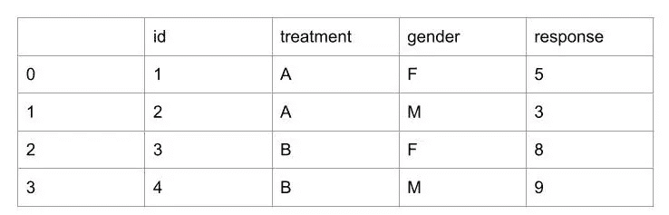
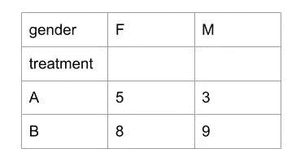
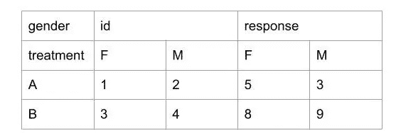
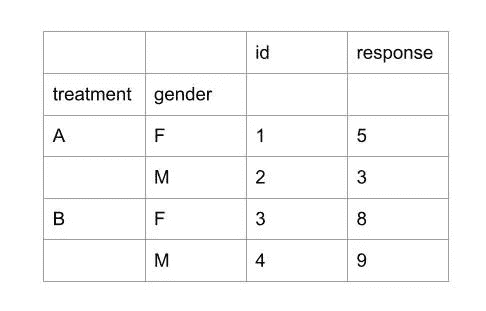
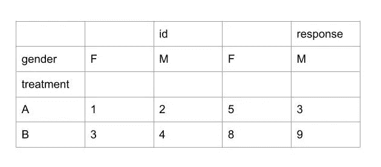
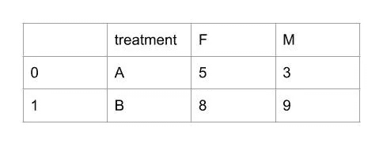
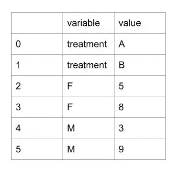
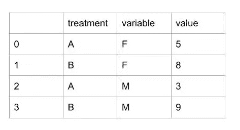

# 用 Python 处理数据帧|第 2 部分(旋转、堆叠和融合)

> 原文：<https://levelup.gitconnected.com/manipulating-dataframes-with-python-part-2-pivoting-stacking-and-melting-99e4aa7f5507>


卢克·切瑟在 [Unsplash](https://unsplash.com?utm_source=medium&utm_medium=referral) 上的照片

这是我上一篇文章的延续。在深入这些话题之前，你必须先阅读这篇文章。这是到它的[链接](/manipulating-dataframes-with-python-part-1-slicing-filtering-and-indexing-486c6411ba8)。

在使用 Python 操作数据帧的第 2 部分中，我们将介绍以下一些技术:

1.  [旋转数据框](#82f1)
2.  [堆叠和拆分数据帧](#b7d8)
3.  [熔化数据帧](#2d08)

*这些帖子将成为如何开始使用 DataFrame 的指南。这些主题本身就值得为它们中的每一个写一篇文章。不过，我会给出对它们的基本理解，如果你想更深入地挖掘，我会附上关于这些主题的深入教程的链接。*

# 旋转数据框架

当您希望根据某些列排列索引的数据集，或者分离特定列的值，或者两者兼有时，就需要这样做。

让我们在给出的例子的基础上更好地理解这一点:

假设我们有一个如下的试算表



初始表

pivot 方法基于三个参数。

索引—设置新数据帧的索引。

列-根据列值划分行。

值-告知用于填充值的列。



旋转工作台 1

```
trials.pivot(index=’treatment’, columns=’gender’, values=’response’)
```

该语句产生如左图所示的数据帧。

如果我们不设置 values 列，形成的表将如下所示。它将根据传入的列划分所有列中的值。



旋转工作台 2

```
trials.pivot(index=’treatment’, columns=’gender’)
```

> 要编制索引的列不应包含重复条目。

# 堆叠和取消堆叠数据帧

堆叠是基于一列或多列对数据帧进行分组的一种形式。拆分与堆叠相反，前者得到的数据帧与堆叠前相同。

堆叠过程如下:



堆叠数据帧

```
trials.stack(['treatment', 'gender'])
```

它将给定的列标签设置为数据帧的索引。

您还可以传递“dropna=True”来删除缺少的值。

为了拆分数据帧，我们提供列名作为函数的级别参数。它定义了要拆分的列。



非堆叠数据帧

```
trials.unstack(level = gender)
```

您还可以将数字传递到定义要拆分的列的级别。-1 表示最后一个堆叠的列，0 表示第一个堆叠的列，依此类推。[这里指的是](https://pandas.pydata.org/pandas-docs/stable/reference/api/pandas.DataFrame.unstack.html#pandas.DataFrame.unstack)

# 熔化数据帧

融化熊猫数据帧将表格从宽格式变成长格式，只保留两列。一个是变量名，另一个是值。

让我们以下面的数据框架“new_trails”作为参考



熔化数据帧初始表



熔化的数据帧 1

```
import pandas as pd
pd.melt(new_trails)
```

这将把所有列作为变量水平堆叠，并把它们的值放在一起。我们还可以指定 id 变量和其他参数来修改熔化行为。



熔化的数据帧 2

```
pd.melt(new_trials, id_vars=['treatment'])
```

在 id_vars 中指定列会将它们设置为标识符变量。同样，您也可以设置其他参数来熔化数据帧。这在[这篇文章](https://www.geeksforgeeks.org/python-pandas-melt/#:~:text=melt()%20function%20is%20useful,identifier%20columns%2C%20variable%20and%20value.)中解释得很好。

这个故事的下一部分将很快发表，链接将添加到本文中。快乐学习到那时。保持联系:)

*我们连线上*[*LinkedIn*](https://www.linkedin.com/in/ankita-prasad-5a0156137/)*。你也可以通过 ankita2108prasad@gmail.com 联系我。*