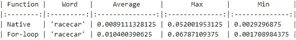
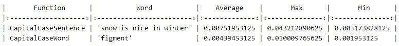
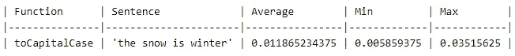

# JavaScript 字符串的操作

> 原文：<https://levelup.gitconnected.com/manipulation-of-javascript-strings-a185299c5be5>


JavaScript 在处理字符串和所有其他数据类型时有一些非常好的功能。让我们来看看一些使用本机功能的基本 JavaScript 操作，好吗？

# 确定回文

> 一个单词、短语或序列，向前和向后读起来一样，例如*夫人*或*护士管理*。—谷歌搜索牛津词典

回文是一个可以颠倒的单词，同时保留其最初的字符位置。比如‘赛车’反过来还是‘赛车’。所以，如果我们要写一个快速而肮脏的函数来检查一个单词是否是回文，我们会怎么做呢？也许类似于下面的内容。

```
function **isPalindromic(**word**) {
  let** palindrome = ''

  **for (let** i **=** word.**length**; i **>=** 0**; --**i**)** **{**
    palindrome **+=** word.**charAt(**i**)**
  **}** **return** palindrome **===** word
**}**
```

上面的函数将非常简单地运行一个 for 循环，迭代给定单词的长度。它从最后一个字符开始，向后工作，在每次迭代中，它将获取该索引处的字符，并将其附加到`palindrome` holder 值。一旦 for 循环完成，我们可以简单地在原始单词和新的构造函数 holder 值之间进行比较。

但是等等…我之前提到的那些原生函数呢？让我们带他们出去兜一圈。下面的代码片段以类似的方式工作，但是更容易阅读，也更简洁。

它本质上是将给定的单词拆分成一个字符数组，颠倒这些字符的顺序，然后将它们重新组合成一个字符串。该字符串可以立即与给定的单词进行比较！

```
**function isPalindromic(**word**) {**
  **return** word.**split('')**
    .**reverse()**
    .**join('') === word**
}
```

## 这个表现如何？

所以我决定运行一个定时测试，以满足我和你的好奇心，我了解到，平均来说，使用本机功能比它的笨拙的对应物 for-loop 快得可以忽略不计。



使用相同的单词作为基础，结果并不特别令人惊讶，但是平均来说，本机功能似乎稍微快一些。

我倾向于使用本机功能而不是 for 循环，因为它更容易阅读和推理，更简洁和易于管理。它也将需要较少的调试，因为有更少的移动部件。

# 如果我们把单词变成大写字母会怎么样？

大写是指给定句子中的每个单词都以大写字母开头。用一个词来做这件事是比较直截了当的。如下图所示。

```
**const capitalCaseWord =** word **=>** word**.charAt(**0**)**
    **.toUpperCase()**
    **.concat(**word**.substring(**1**))**
```

所以我们在这里要做的就是把单词的第一个字母大写，然后把去掉第一个字母的单词和我们刚刚大写的字母连接起来。因此，我们现在有了一个以大写字母开头的单词。

我们如何改变一个句子，使每个单词都以大写字母开头？我们可以从上面的函数开始。

```
**const capitalCaseSentence =** sentence **=>** sentence**.split(**' '**)**
    .**map(**capitalCaseWord**)**
    **.join(**' '**)**
```

在上面的代码片段中，我们只是用空格分割字符串，从而将它转换成一个数组；我们使用数组原型上的原生`.map`功能来生成一个新数组，通过运行上面已经定义的`capitalCaseWord`函数来改变给定句子中的每个单词。最后，我们简单地再次加入空格。我们现在有两个函数来把句子变成大写字母！

## 这个表现如何？

然而，所有这些过程都非常快。这将取决于你的硬件，但即使如此，这些进程的速度仍然令人难以置信。显而易见，在单个单词上执行会在计算上更轻和更快。



以这种方式使用函数是有益的。能够构建小粒度的代码块，在需要的地方插入它们，以完成任务。相当方便！

# 骆驼案呢？

Camel case 是一种普遍接受的变量/类/函数名格式。但是出于好奇，我们如何着手把一个句子改成`camelCase`？

```
**const capitalCaseWord =** **(**word, index**)** **=> {
  if (index === 0) {
    return word
  }** **return word.charAt(0)
    .toUpperCase()
    .concat(word.substring(1))
}****const toCamelCase =** sentence **=>** sentence**.split(**' '**)**
    **.map(**capitalCaseWord**)**
    **.join(**''**)**
```

所以在上面的代码片段中，我们借用了上面例子中的代码，稍微修改了一下以适应我们的需要，现在无论你提供什么句子，都应该是`returnedInCamelCase`！`capitalCaseWord`函数现在接受索引，该索引表示迭代中的哪个单词被传递给它。我们不想大写第一个单词，所以我们简单地返回这个单词。否则，该功能将像以前一样工作。

让我们看看运行这个函数的性能，好吗？



结果还不错。这真是太快了… JavaScript 总是在不断优化，这些函数可能会比传统的 for 循环方法更好，如果不是更稳定的话。然而，这是假设他们的力量是用于好的方面。


# 最后一个结论！

总之，使用 JavaScript 的原生字符串功能有很多好处。平均来说，执行时间可能会更快，代码更易读，更容易推理，而且相当简洁！

这里有一些参考资料，如果您想了解更多或者想开始在自己的代码库中实现这些原生函数(如果您还没有这样做的话),它们可能会激发您的兴趣！

[MDN 字符串](https://developer.mozilla.org/en-US/docs/Web/JavaScript/Reference/Global_Objects/String)
[MDN 数组](https://developer.mozilla.org/en-US/docs/Web/JavaScript/Reference/Global_Objects/Array)

感谢你的阅读，我希望你喜欢并学到了一些东西。如果你碰巧有任何反馈、批评或贡献，请随意写在下面的评论区。

再见韦德森。