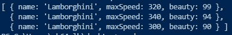

# 地图⇄滤波⇄减少

> 原文：<https://levelup.gitconnected.com/map-filter-reduce-da6bba6ea2eb>

## for 循环很乱！


照片由[Tine ivani](https://unsplash.com/@tine999?utm_source=medium&utm_medium=referral)在 [Unsplash](https://unsplash.com?utm_source=medium&utm_medium=referral) 上拍摄

> [分享到 LinkedIn 上！](https://www.linkedin.com/sharing/share-offsite/?url=https%3A%2F%2Fwww.linkedin.com%2Fpulse%2Fmapfilterreduce-ashay-mandwarya%2F%3Fpublished%3Dt)

`for`循环是混乱的，这就是我们引入这三个高阶函数的原因🗺️ `map`，🥅 `filter`，✂️ `reduce`。所有这三个函数都是`Array`原型的一部分，并对数组的内容进行操作。

但是在进入函数之前，让我们先明确一下什么是高阶函数和函数式编程。


[罗马魔术师](https://unsplash.com/@roman_lazygeek?utm_source=medium&utm_medium=referral)在 [Unsplash](https://unsplash.com?utm_source=medium&utm_medium=referral) 上拍摄的照片

## 函数式编程？

函数式编程是一种编程范式——一种构建计算机程序的结构和元素的风格——将计算视为数学函数的评估，并避免改变状态和可变数据— [维基百科](https://en.wikipedia.org/wiki/Functional_programming)

## 高阶函数

高阶函数是将其他函数作为参数或从另一个函数返回一个函数的函数。

# Array.prototype.map() || map() ||🗺️

`**map()**`方法创建一个新数组，其结果是对调用数组中的每个元素调用一个提供的函数——MDN


照片由[捕捉人心。](https://unsplash.com/@dead____artist?utm_source=medium&utm_medium=referral)上[下](https://unsplash.com?utm_source=medium&utm_medium=referral)


```
var arr = [5, 7, 4, 12];
let map = arr.map(x => x * 7);
console.log(map);
```

上面的代码接受数组中的每个元素，乘以 7，然后放入一个新的数组中(由`map`在内部完成)。

下面的操作和上面的一样，但是有一个`for`循环。


```
var arr = [5, 7, 4, 12];
var newArr = [];
var i = 0;
for(i=0;i<arr.length;i++) 
{
  newArr.push(arr[i]*7)
}
console.log(newArr);
```

使用了 for 循环一半的代码行，使我们的代码更加简洁。

`map`对数组中的每个元素执行提供的`callback`函数，并根据结果构建一个新的数组。`callback`只对数组包含值的索引调用。

`map`构建一个新的数组，从不改变/变异旧的数组。

我们来解剖一下:

**参数:**`map`函数取的参数是一个回调函数，它依次取参数`currentValue`、`index`，原来的`array`。

*   **当前值** →映射到回调函数处理的当前元素。
*   **index |** *可选* →数组中正在处理的当前元素的索引。
*   **数组|** *可选* →调用`map`的原点数组。

**Return:** `map`返回一个新数组，数组中的值由回调函数处理。

# array . prototype . filter()| | filter()| |🥅

`**filter()**`方法创建一个新数组，其中所有元素都通过了由所提供的函数 MDN 实现的测试


照片由[韦德·奥斯汀·埃利斯](https://unsplash.com/@wadeaustinellis?utm_source=medium&utm_medium=referral)在 [Unsplash](https://unsplash.com?utm_source=medium&utm_medium=referral) 上拍摄


```
const cars  = ['Mclaren','Lamborghini','Ferrari','Porsche','Mercedes','Corvette'];const car = cars.filter(e => e.length > 7);
console.log(car);
```

上面的代码接收数组中的每个元素，检查元素长度是否大于 7，并将其放入一个新的数组中(由`filter` 内部完成)。

功能相同，但有一个`for`回路。


```
const cars = ['Mclaren','Lamborghini','Ferrari','Porsche','Mercedes','Corvette'];const car=[]for(let i=0;i<cars.length;i++)
{
  if(cars[i].length>7)
    car.push(cars[i]);
}
console.log(car);
```

从 3 行到 8 行。

`filter`对数组中的每个元素调用提供的`callback`函数，并根据结果构造一个新的数组。`callback`仅返回满足条件的值，换句话说，返回导致回调评估为真的值。`callback`只对数组中包含值的索引调用。

`filter`构建一个新数组，从不改变/变异旧数组，它只是迭代旧数组。

我们来解剖一下:

**参数:**`filter`函数取的参数是一个回调函数，它依次取参数`currentValue` **、** `index`、**、**和原来的`array` **。**

*   **当前值** →由`filter`处理的当前元素。
*   **index |** *可选* →数组中正在处理的当前元素的索引。
*   **数组|** *可选* →调用`filter`的原始数组。

**Return:** `filter`返回一个新数组，数组中的`true`值由回调函数处理。

# array . prototype . reduce()| | reduce()| |✂️

`**reduce()**`方法对数组的每个成员执行**缩减器**函数(您提供的),产生一个输出值——MDN


[毛绒设计工作室](https://unsplash.com/@plushdesignstudio?utm_source=medium&utm_medium=referral)在 [Unsplash](https://unsplash.com?utm_source=medium&utm_medium=referral) 上拍摄的照片


```
const arr = [3, 4, 2, 9];
const reduce=(accumulator, currentValue)=>accumulator+currentValue;
console.log(arr.reduce(reduce));
console.log(arr.reduce(reduce, 7));
```

在上面的代码中，我们创建了一个 reduce 函数，它将作为回调传递给`reduce()`函数。该函数返回数组中所有元素的和。`accumulator`存储每次迭代后元素的总和，而`currentValue`表示当前正在处理的值。累加器的默认值为 0，也可由用户定义，如第二个`console.log`中的 7。累加器作为最终结果返回。

一个`for`循环的相同功能。


```
const arr = [3, 4, 2, 9];
let a=0;
for(let i=0;i<arr.length;i++)
{
  a+=arr[i];
}
console.log(a);
```

我们从 3 行增加到 7 行。

`reduce`对数组中的每个元素调用提供的`callback`函数，并且只对数组包含值的索引调用。

`callback`有 4 个参数:

*   `accumulator`
*   `currentValue`
*   `currentIndex`
*   `array`

在处理第一个值之前第一次调用`callback`时，`currentValue`将是数组中的第一个元素，而`accumulator`将具有数组中第一个元素的值或用户在`reduce`函数中指定的值。

如果累加器被提供一个值，那么`reduce`将从索引 1 开始`callback`并跳过第一个索引，因为`accumulator`已经具有第一个索引的值。如果初始值由`callback`提供，它将从第一个索引开始。

第一次调用回调时，`accumulator`和`currentValue`可以是两个值中的一个。如果在对`reduce()`的调用中提供了`initialValue`，那么`accumulator`将等于`initialValue`，而`currentValue`将等于数组中的第一个值。如果没有提供`initialValue`，那么`accumulator`将等于数组中的第一个值，而`currentValue`将等于第二个值。

如果数组为空并且没有给`accumulator`初始值，则抛出`TypeError`。

提供初始值通常更安全，因为没有`initialValue`有三种可能的输出，如下例所示。

我们来解剖一下:

**参数:**`reduce`函数取的参数是一个回调函数，也是可选的(但推荐)`initialValue`。回调依次带参数`accumulator`、`currentValue`、`index`和原`array`。

*   **累加器** —累加器累加回调的返回值。它是上次调用回调时返回的累积值，或者是`initialValue`(如果提供了的话)。
*   **当前值** — 由`reduce`处理的是当前元素。
*   **index |** *可选—* 数组中正在处理的当前元素的索引。
*   **array |** *可选—* 调用`reduce`的数组。

**Return:** `reduce`返回每个元素处理后剩下的值(`accumulator`的最终值)。

# 链接。map()，。reduce()和。过滤器()||🗺️🥅✂️

正如我们所见，`reduce`、`filter`和`map`本身就非常强大，但是最棒的是它们都在数组上工作，因此可以链接在一起。


凯瑟琳·切斯在 [Unsplash](https://unsplash.com?utm_source=medium&utm_medium=referral) 上的照片

让我们举个例子:


```
var cars = [{
name: "Lamborghini",
maxSpeed:320,
beauty:99
},{
name: "Lamborghini",
maxSpeed:340,
beauty:99
},{
name: "Ferrari",
maxSpeed:310,
beauty:99
},{
name: "Porsche",
maxSpeed:330,
beauty:99
},{
name: "Lamborghini",
maxSpeed:300,
beauty:99
}];
```

以上是我们将要处理的数据。我们必须找出所有兰博基尼的总分。

这是一行程序:


结果:1243

对于一个`for`循环，我们不得不创建 3 个循环，这将是相当混乱的。

代码的工作方式如下:

*   `filter`过滤器找到名字为**兰博基尼的所有汽车。**



*   `map` 贴图对过滤器返回的数组进行处理，并对美景和 top_speed 属性进行汇总。


*   `reduce` 该函数获取地图返回的数组，并对所有值求和，返回所有兰博基尼的总和。1243

# 结论

我希望我让这些函数更容易理解。将所有 3 个函数链接在一起会使这成为一个庞然大物，因为我们在编写长度小且易于调试的干净代码时会得到我们的结果。

拍手& [跟着](https://medium.com/@ashaymurceilago)走。


谷歌