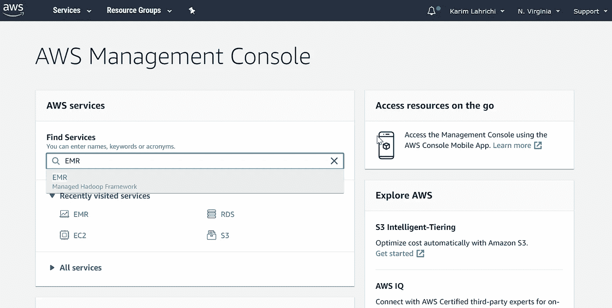
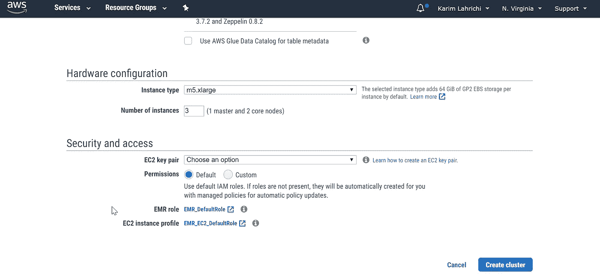
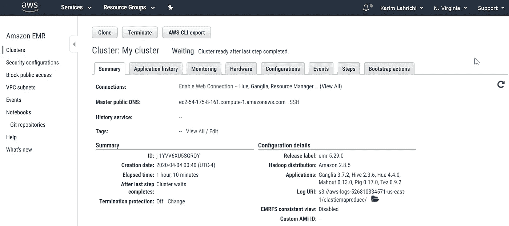
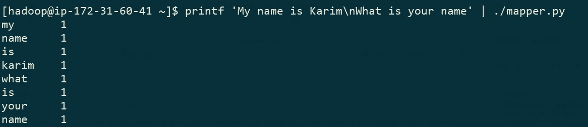
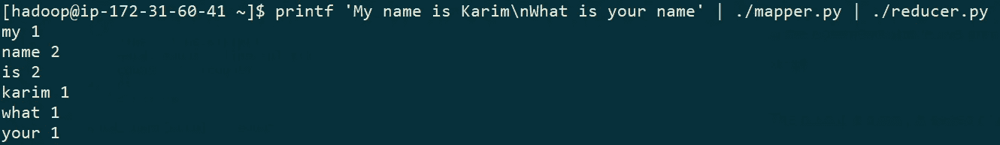
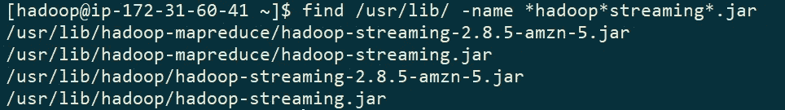
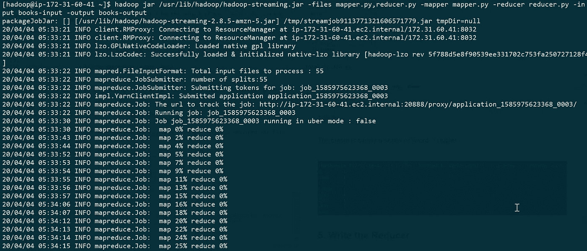
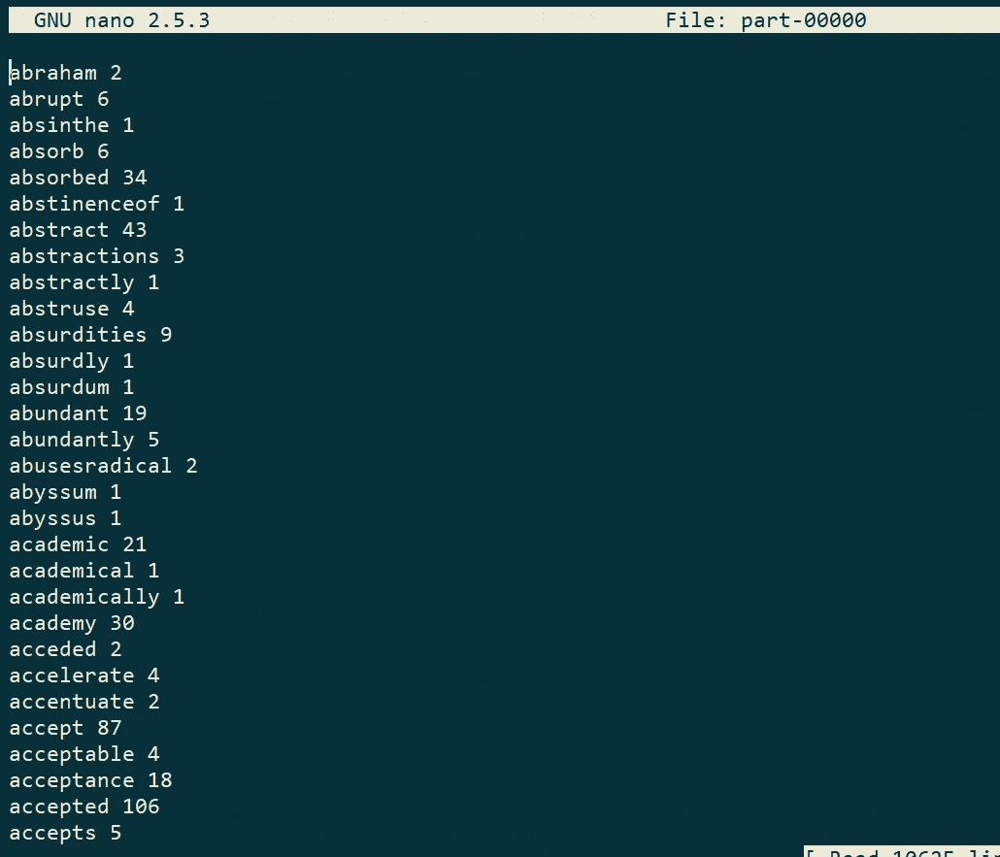

# 在 AWS EMR 上使用 Python 和 Hadoop 实现 Map-Reduce

> 原文：<https://levelup.gitconnected.com/map-reduce-with-python-hadoop-on-aws-emr-341bdd07b804>


*让我们在 AWS EMR 上做一些基本的****Map-Reduce****，用典型的字数示例，但是使用 Python 和 Hadoop 流。*

老实说，Hadoop 现在作为一个框架已经过时了……但 Map-Reduce 没有，因为 Map-Reduce 是一种范式——或者说是一种通过将问题分成多个可以并行处理的子问题来解决问题的方法(这是 **Map** 步骤)。一旦子问题得到解决，我们就可以收集和汇总答案(这就是 **Reduce** 步骤)。

作为 Hadoop 框架的一个核心组件，Map-Reduce 现在仍然适用，并且可能会一直适用，所以理解它并进行一些实践是很有好处的。

# 1.启动 EMR 集群

非常简单:只需在 AWS 管理控制台搜索栏中键入 *EMR* ，然后在下一页中点击 *Create Cluster* :



点击*创建集群*后，您将被带到一个页面，在这里您可以定制您的集群。向下滚动到页面底部，直到看到*硬件配置*:



在那里，您可以更改集群将使用的实例的类型，以及实例的数量。出于测试目的，您可以使用一个 *m4.large* 实例类型，并保留默认的 3 个实例。

最后，确保使用 EC2 密钥对。

就这些了。点击*创建集群*，几分钟后你的集群就准备好了。

# 2.SSH 到主节点

首先，您需要 ssh 到您的主节点。

一旦您的集群准备就绪，您将看到如下内容:



从那里，您将能够获取您的主节点的公共 DNS，并且您将使用 SSH 进入它，使用如下命令(使用 *hadoop* 作为用户名):

```
ssh -i path\to\your\privatekey.pem hadoop@master-public-dns
```

现在，您应该以 *hadoop* 用户的身份登录到主节点。

# 3.下载一些数据

我们将从 gutenberg.org 下载一堆书。

首先让我们创建一个目录来保存书籍:

```
mkdir books-input
```

然后我们编写一个简短的脚本来下载几十本带有`vim download_books.sh`或`nano download_books.sh`的书:

```
#!/bin/bash for i in {1340..1400} 
do 
    wget "http://www.gutenberg.org/files/$i/$i.txt" 
done
```

保存脚本，然后确保它是可执行的:`chmod +x download_books.sh`。我们现在可以开始下载这些书了(有些书在。txt 格式，那也行):

```
./download_books.sh
```

下载完成后，您可以使用以下命令列出文件夹中的文件:

```
ls -lh books-input
```

您可以检查文件夹的总大小(在本例中为 25MB):

```
du -sh books-input
```

我们将用 python 编写映射器和缩减器，它们都将从`stdin`获取输入，并将输出写入`stdout`。

# 4.编写映射器

映射器将读取每本书的每一行，将它们拆分成单词，并输出每个单词的元组(word，1)。这些元组的第二个元素(`1`)实际上没有那么必要，但是*映射*步骤的一般思想是输出一系列键-值对。然后对这些值对进行排序(或者用 Hadoop 术语称之为*混洗*，以便在 *Reduce* 步骤之前，所有与给定键相关的值都在同一个节点中结束。

这是映射器的代码:

```
#!/usr/bin/env python3 import sys 
import string for line in sys.stdin: 
    line = line.strip() 
    words = line.split() 
    for w in words: 
        table = w.maketrans('', '', string.punctuation)
        w = w.translate(table).lower() 
        print(w, '\t', 1)
```

关于这段代码的一些备注:
-第一行说我们希望这个文件可以用 python3
执行-我们删除了单词中的标点符号，把它们都变成了小写

假设这段代码在一个名为`mapper.py`的文件中，用`chmod +x mapper.py`使这个文件可执行。然后，您可以在本地测试它，如下所示:

```
printf 'My name is Karim\nWhat is your name' | ./mapper.py
```

在上面的命令中，我们打印了两行并通过管道将其作为映射器脚本的输入。

输出只是一系列(单词，1)元组:



现在我们需要计算每个单词的总数。下面是*减少*步骤的代码(保存在`reducer.py`脚本中):

```
#!/usr/bin/env python3
from collections import defaultdict
import sysword_count = defaultdict(int)for line in sys.stdin:
    try:
        line = line.strip()
        word, count = line.split()
        count = int(count)
    except:
        continueword_count[word] += countfor word, count in word_count.items():
    print(word, count)
```

这里我们使用非常方便的`defaultdict`来增加每个单词的计数。记住，这个脚本的输入将是我们的`mapper.py`脚本的输出。同样，确保这个文件是可执行的。

在本地测试您的映射器+缩减器:

```
printf 'My name is Karim\nWhat is your name' | ./mapper.py | ./reducer.py
```



是时候让 Hadoop 做自己的事了。首先，我们需要把数据(书籍)放在 HDFS:

```
hdfs dfs -mkdir books-input hdfs dfs -put books-input/*.txt books-input
```

因为我们想要使用 Hadoop streaming，所以让我们首先找到所需的 jar 文件:

```
find /usr/lib/ -name *hadoop*streaming*.jar
```



我们要找的是`/usr/lib/hadoop/hadoop-streaming.jar`。

所以我们开始吧:

```
hadoop jar /usr/lib/hadoop/hadoop-streaming.jar -files mapper.py,reducer.py -mapper mapper.py -reducer reducer.py -in put books-input -output books-output
```



会有一堆*地图*岗位首发，接着是几个*岗位减少*。浏览所有的书大约需要一分钟。

输出现在应该位于 HDFS 文件夹中的 books-output。您可以使用以下命令将其复制回主节点:

```
hdfs dfs -get books-output/*
```

这将把一些`part-0000x`文件放在主节点上的用户文件夹中，然后您可以打开并检查这些文件(例如用 nano)。您应该会看到不同单词的列表，以及该单词在所有书籍中的数量:



结论:我们对几本书的数据(大约 25MB)进行了简单的字数统计。尽管这还不能称之为大数据，但是如果我们想在一万本书上运行它，这个过程是完全一样的。
下一步:使用 S3 存储我们的输入、输出、映射器和缩减器；以及从控制台(与命令行相反)向正在运行的集群提交 MapReduce 流作业。