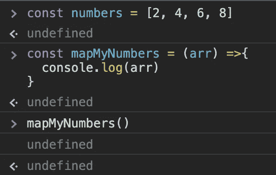
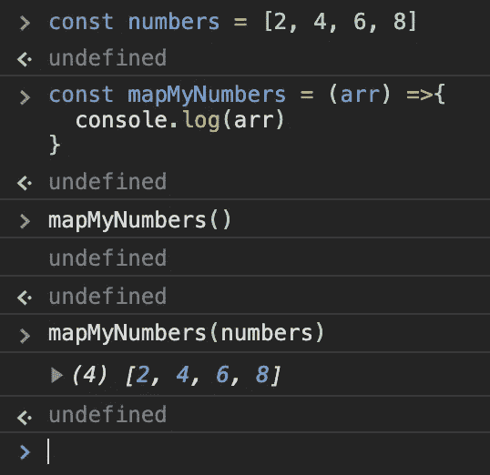
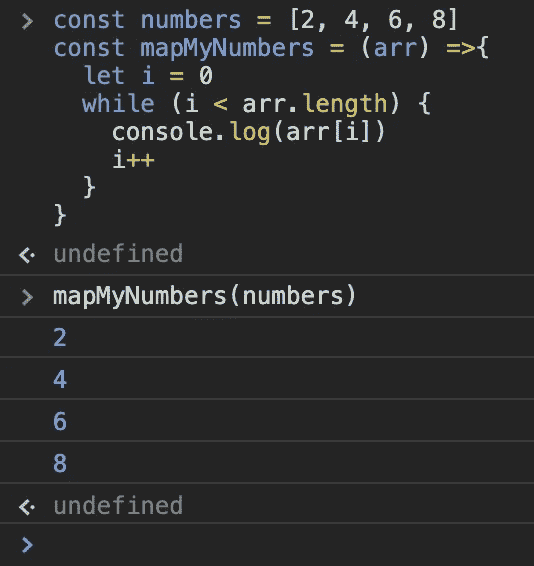
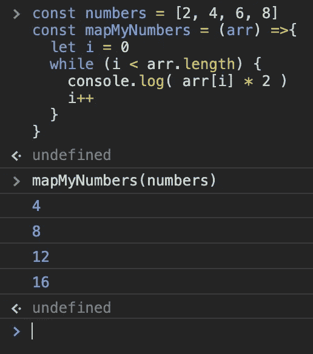
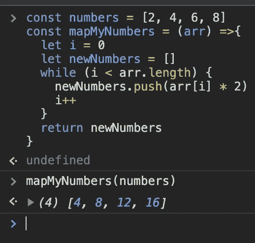
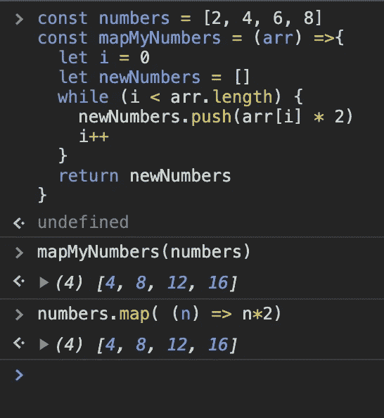

# 规划出来

> 原文：<https://levelup.gitconnected.com/mapping-it-out-71b7939c3a6d>

## **地图枚举器如何工作**


不管你用哪种语言编程，你最终会用到的一个基本函数或方法就是“映射”函数。如果您对“映射”不熟悉，这里有一个 JavaScript 中的语法示例:

```
const numbers = [2, 4, 6, 8]const newNubmers = numbers.map(num => {
  return num * 2
}console.log(newNumbers)
//expected output: [4, 8, 12, 16]
```

这里发生的事情是，我们遍历数组中的每个索引，并对其执行一些操作。在这种情况下，我们将每个数字乘以 2。在这篇博文的剩余部分，我将分解“映射”枚举器，它是如何工作的，以及如何从头构建一个。

# 什么是地图枚举器？

映射枚举器是一个在数组上调用的函数，当被调用时，它将遍历该数组，对该数组中的每个实例执行一些操作，并向我们返回一个包含新信息的新数组。

因此，要从头开始重新创建地图，我们需要执行几个步骤。首先，我们需要找到一种方法来遍历数组。一旦我们知道了使用什么类型的循环，我们就需要计算出我们的循环将运行多少次。然后，我们需要对数组中的每一项执行一些操作。接下来，一旦操作完成，我们需要将结果添加到一个新数组中。一旦完成，我们必须最终返回新的数组。

## 什么是循环？

上面我提到了我们如何遍历数组中的每个索引。如果你熟悉编程，那么当你读到这句话时，你的脑海中很可能会出现“循环”这个词。如果你不熟悉，这里有一个简单的解释。在任何编程语言中，循环都是一系列的命令，这些命令将被执行，直到满足某个条件。

在 JavaScript 中，有几种类型的循环。如[w3schools.com](https://www.w3schools.com/js/js_loop_for.asp)所述:

*   `for` -多次循环通过一个代码块
*   `for/in` -遍历对象的属性
*   `for/of` -遍历一个可迭代对象的值
*   `while` -当指定的条件为真时，循环通过代码块
*   `do/while` -当指定的条件为真时，也循环通过一个代码块

在我们的例子中，我们将使用“while”循环或“do/while”循环。这样做的原因是，我们将有一个“指定的条件”在这种情况下，我们的数组的长度。这两个循环的主要区别在于，当运行代码时和检查条件时是相反的，因此，即使要满足的条件为假，do/while 循环也总是至少运行一次。以下是两者的语法:

```
//while loopwhile (condtion) {
  // code to be executed
}// do/while loop
do {
  //code to be executed
}
while (condtion)
```

因为我们只希望我们的循环在我们的条件开始为真时运行，所以我们将使用“while 循环”而不是“do/while”循环

## 我们的情况如何？

为了映射数组中的每个索引，我们必须将索引变量与数组的长度属性进行比较。这样，不管数组有多长，只要索引变量小于数组的长度，我们的代码就会运行:

```
while (i < arr.length){
  //code to be executed
} 
```

现在，我们已经选择了一个循环，并找出了我们的条件，我们现在可以创建一个函数，该函数将循环遍历我们的数字数组，并返回每个数字都加倍的数组。

# 构建一个函数来映射数组

既然我们已经选择了我们的循环，弄清楚了我们的条件，并且知道了我们将要执行什么代码，那么就把一个函数放在一起，这个函数可以在一个数字数组上被调用，并通过它映射来执行我们的操作。

```
const numbers = [2, 4, 6, 8]
const mapMyNumbers = () =>{}
```

首先，我们将添加一个名为 arr 的参数，这样这个函数必须通过一个作为参数传递的数组来调用，并且我们可以控制台记录该数组。

```
const numbers = [2, 4, 6, 8]
const mapMyNumbers = (arr) =>{
  console.log(arr)
}
```

如果您打开开发工具并运行“mapMyNumbers()”，您应该会看到类似这样的内容:



这里我们的 console.log 是未定义的。如果不传入参数“numbers”，console.log 中没有任何内容。现在，如果我们在“mapMyNumbers(numbers)”中传递该参数，我们应该会看到:



我们在这里也看到了另一个未定义的，因为我们目前不返回任何东西！

现在我们已经设置了函数需要的参数，我们可以开始用适当的条件设置循环了。为此，我们将创建一个变量 I 作为我们的索引占位符，并将其设置为零，从任何数组的开头开始。然后，我们可以设置我们的条件，使其比较“I”和数组的长度。如果“I”小于我们的“数组长度”,我们将在特定索引处控制台记录该数组中的特定项。最后，在循环结束时，我们将变量“I”加 1。

```
const numbers = [2, 4, 6, 8]
const mapMyNumbers = (arr) =>{
  let i = 0
  while (i < arr.length) {
    console.log(arr[i])
    i++
  }
}
```

如果我们在控制台中再次调用这个函数，我们将会看到:



然而，我们在这里的目标是将我们的项目乘以 2(n * 2 ),并快速更改我们可以控制的代码。

```
const numbers = [2, 4, 6, 8]
const mapMyNumbers = (arr) =>{
  let i = 0
  while (i < arr.length) {
    console.log(arr[i] * 2)
    i++
  }
}
```

我们的结果显示:



现在我们有了条件、操作和循环，是时候将这些对象添加到数组中了。为此，我们将在名为“newNumbers”的循环之前初始化一个空数组，然后将运算结果推入新数组，最后我们将添加一个返回语句，该语句将在循环结束后返回 newNumbers。

```
const numbers = [2, 4, 6, 8]
const mapMyNumbers = (arr) =>{
  let i = 0
  let newNumbers = []
  while (i < arr.length) {
    newNumbers.push(arr[i] * 2)
    i++
  }
  return newNumbers
}
```

一旦我们运行此代码，我们将看到:



为了确保我们的结果与运行映射函数的结果相同，我们也可以运行映射枚举器:



正如我们所见，我们的结果是一样的！

# 结论

至此，我们已经成功地为数组重新创建了映射枚举器。虽然我总是建议使用枚举器来节省代码行，并减少开发人员出现人为错误的机会，但了解一些东西如何工作以及为什么工作总是一个好主意。编码快乐！！！