# 用无代码知识图映射供应链

> 原文：<https://levelup.gitconnected.com/mapping-supply-chains-with-no-code-knowledge-graphs-d47972087c82>

## **介绍气候行动供应链知识图**

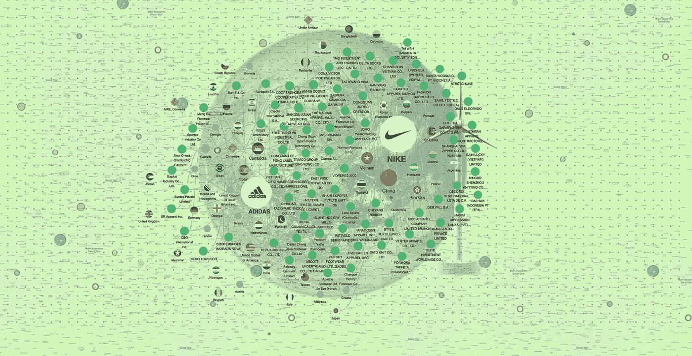

虽然环境、社会和公司治理的披露仍然是自愿的和非标准化的，但是公司将很快被迫告诉投资者[他们的“碳足迹](https://fortune.com/2021/07/28/sec-chair-public-companies-disclose-carbon-footprints/)”。

供应链是问题的症结所在…

## 90%的公司碳足迹位于供应链中，通常由第三方供应商产生。

截至 2021 年，已经有超过[130 万亿美元的公共和私人投资](https://fortune.com/2021/11/03/net-zero-finance-coalition-cop26-mark-carney/)承诺帮助遏制气候变化，但投资者和气候行动利益相关者需要供应链数据来做出更明智的决定。

例如，耐克的目标是到 2025 年使用 100%的可再生能源，但其承诺仅适用于**其自己的办公室、商店和工厂……**，而该品牌 80%的碳足迹来自其材料和制造的**采购** 。

## 如果 125 家跨国公司的供应商将其可再生能源增加 20%,就可以减少超过 1000 亿公吨的排放(相当于巴西和墨西哥排放量的总和)。(据 CDP。)

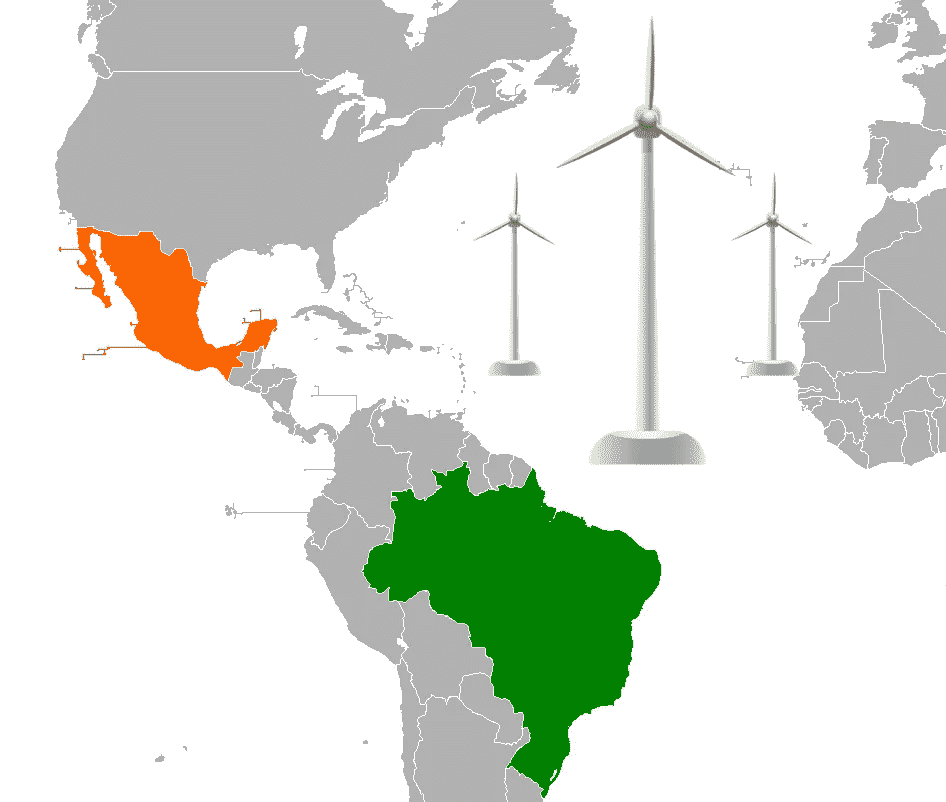

有了[气候行动供应链知识图](https://www.kgbase.com/data/mlopata/open-supply-chain-knowledge-graph-for-climate-action/ctx-MsflvzcY4zLCePmhl88/overview)，利益相关者现在可以提供关于领先公司供应链的信息，这些公司的****未被其环境承诺覆盖**** ，但在其碳足迹中发挥着重要作用。

**该数据是分析与参与制造过程的公司和国家相关的环境风险的缺失环节。**

[**气候行动供应链知识图**](https://www.kgbase.com/data/mlopata/open-supply-chain-knowledge-graph-for-climate-action/ctx-MsflvzcY4zLCePmhl88/overview) **是一个开放式数据集，旨在改善国家和公司层面在可再生能源采用和本地制造业可持续发展报告方面的合作。**

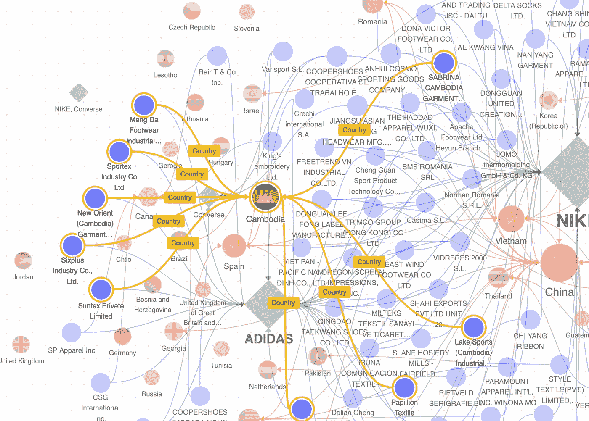

据 CDP 称，供应商的气候变化风险可能会在未来 5 年内让投资者和公司损失超过 9060 亿美元。

# **构建无代码供应链知识图**

许多公司已经发布了年度可持续发展报告，但由于缺乏标准化的报告，分析它们对环境的影响仍然是一个挑战。

有了像 [Kgbase](http://www.kgbase.com/) 这样的无代码知识图工具，气候行动利益相关者现在可以在供应链数据上进行合作。

还记得耐克吗？2021 年，耐克和阿迪达斯首次以机器可读格式发布了他们的[年度工厂名单](https://www.adidas-group.com/en/sustainability/managing-sustainability/human-rights/supply-chain-structure/)。

多亏了 Kgbase 独特的一套工具(协作、知识图可视化、数据聚合、映射和分析)，我才能够统一公司的数据，开发出一个 [**气候行动供应链知识图。**](https://www.kgbase.com/data/mlopata/open-supply-chain-knowledge-graph-for-climate-action/ctx-MsflvzcY4zLCePmhl88/overview)

以下是我如何用 Kgbase 创建这个数据计划的——以及你如何创建一个关于你关心的任何主题的项目。

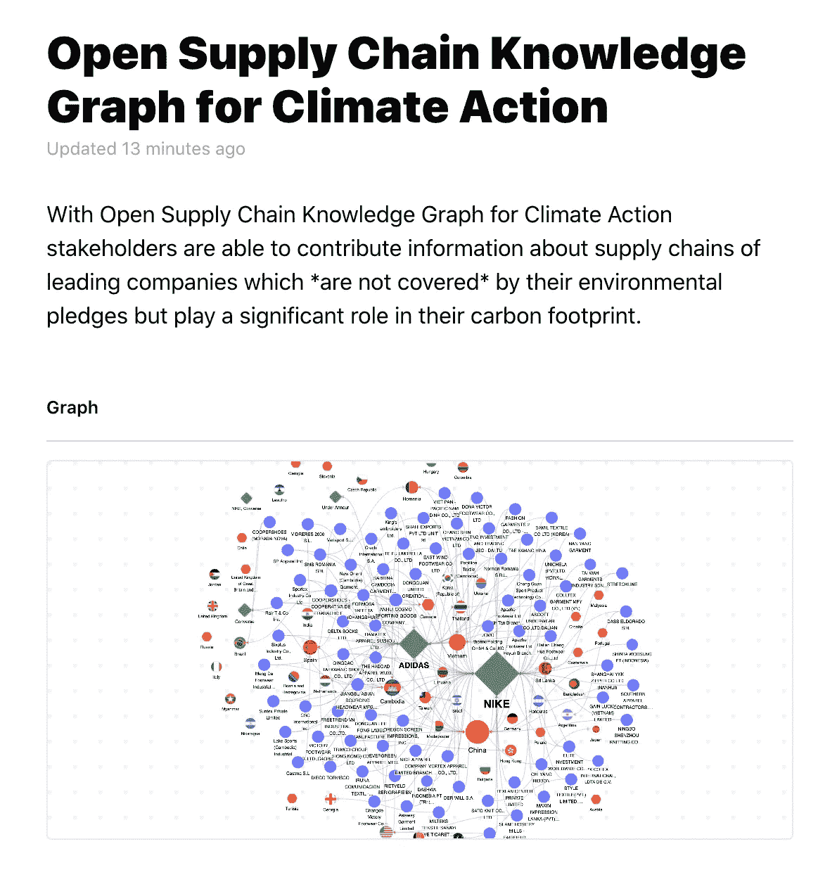

## **创建统一模板**

尽管阿迪达斯和耐克的工厂列表包括非常相似的数据输入，但它们的报告格式各不相同，需要在分析和绘制之前进行大量的清理和组织工作。

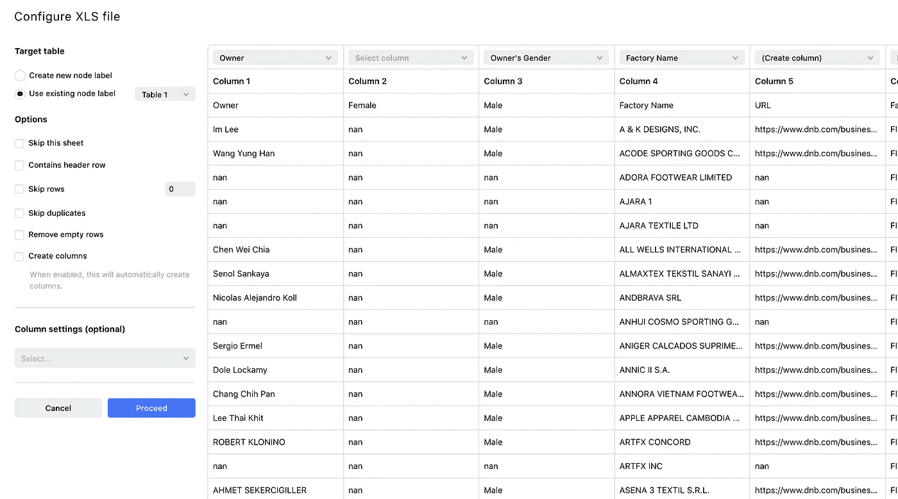

两家公司都向公众发布了碳中和承诺，但他们的供应链报告不包含 GHG 排放数据或外部供应商的可再生能源目标，或供应商领导力的性别数据。

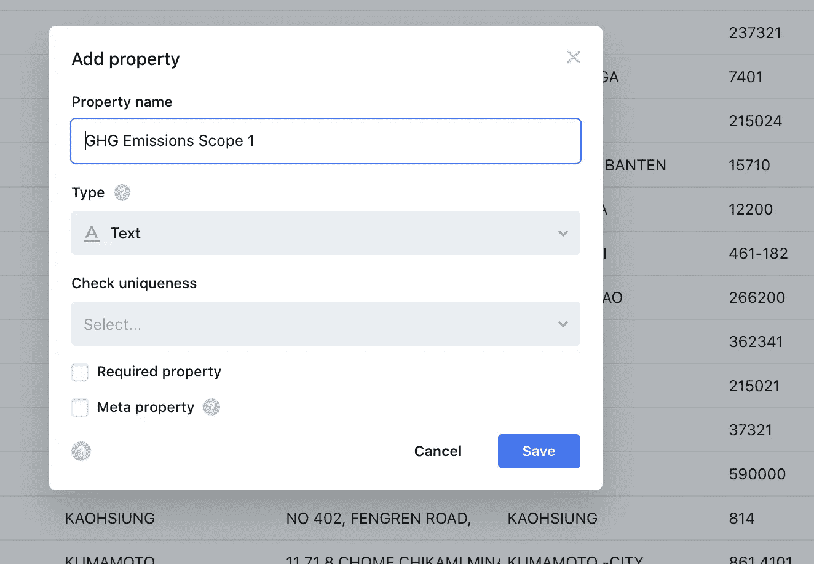

使用 Kgbase，您可以为此类报告创建公共和私有模板，并为协作、审核和批准定义数据输入。

## **导入&地图相关数据**

准备好模板后，就可以将数据导入到项目中了。

Kgbase 提供了大量的集成、文件格式选项和数据库来为您和其他贡献者简化这一过程。

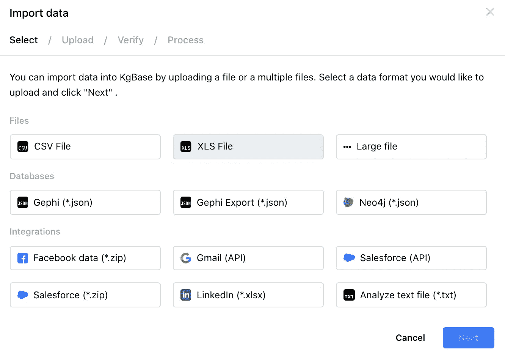

## **创建实体间的关系**

知识图的独特属性使得能够分析实体之间的关系。

在这个项目中，我能够在国家、品牌和工厂之间建立联系，以确定哪些国家在可再生能源解决方案方面的行动能够对消除环境风险产生最大影响。

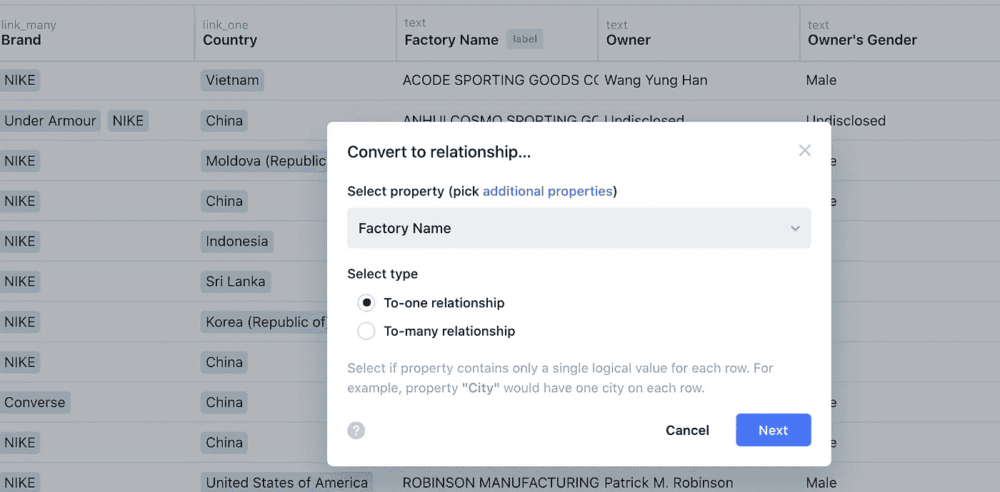

## **构建复杂的查询来分析图表**

通过使用 Kgbase 构建复杂的查询，您可以回答这个问题以及许多其他关于供应链数据的问题。

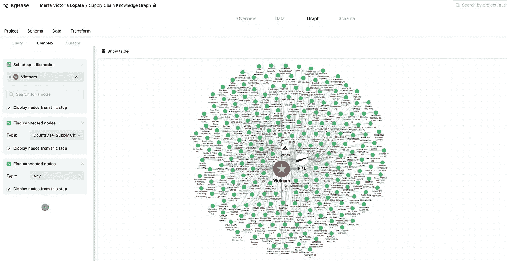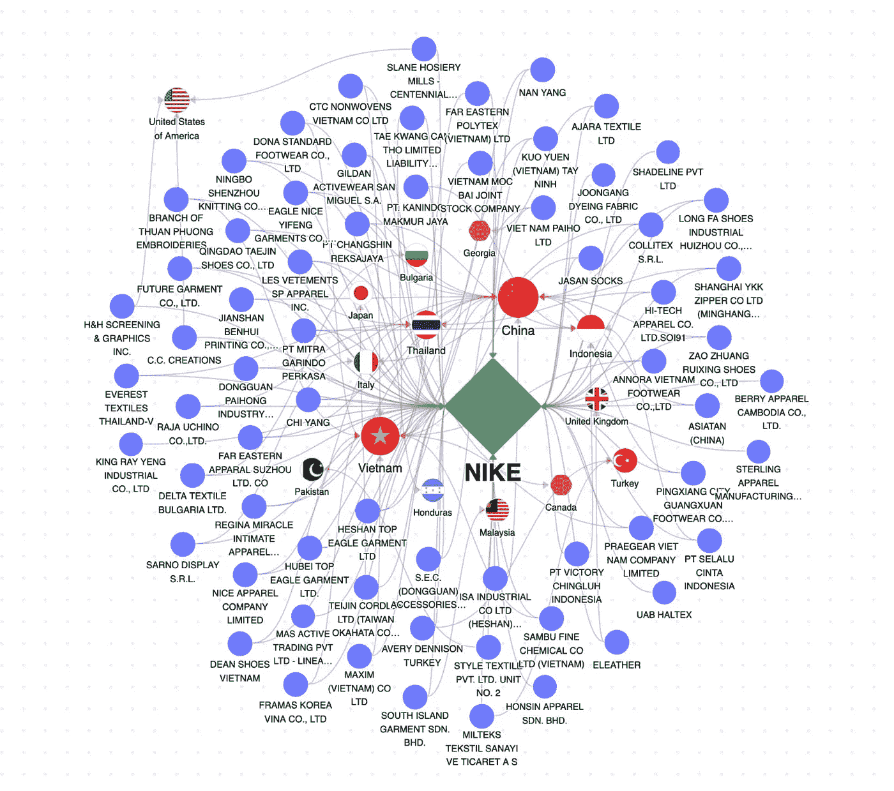

耐克供应链中的一些高影响力国家包括越南、洪都拉斯、马来西亚、土耳其、印度尼西亚、保加利亚、中国、日本和泰国。

**生成通用商业标识符，以跟踪供应链中的供应商**

在分析阿迪达斯、耐克和安德玛的供应链时，我发现这三家公司，尽管在可持续发展工作和 ESG 分数方面的政策和参与程度不同，但都有相同的外部供应商。

例如:**安徽体育用品有限公司**

像这样的小型私人公司在测绘过程中经常被忽略。

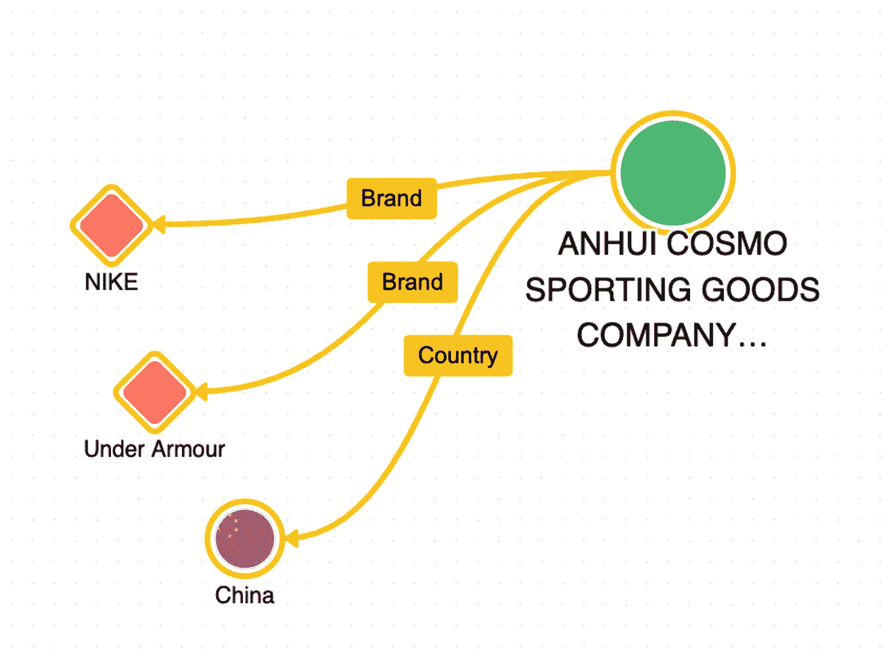

使用 Kgbase，您可以生成通用业务 id 来跟踪不同公司供应链中的工厂，并丰富数据。

UBIDs 在金融、数据科学和商业领域有许多应用，可以生成并添加到公司数据库[中。](https://ubid.kgbase.com/)

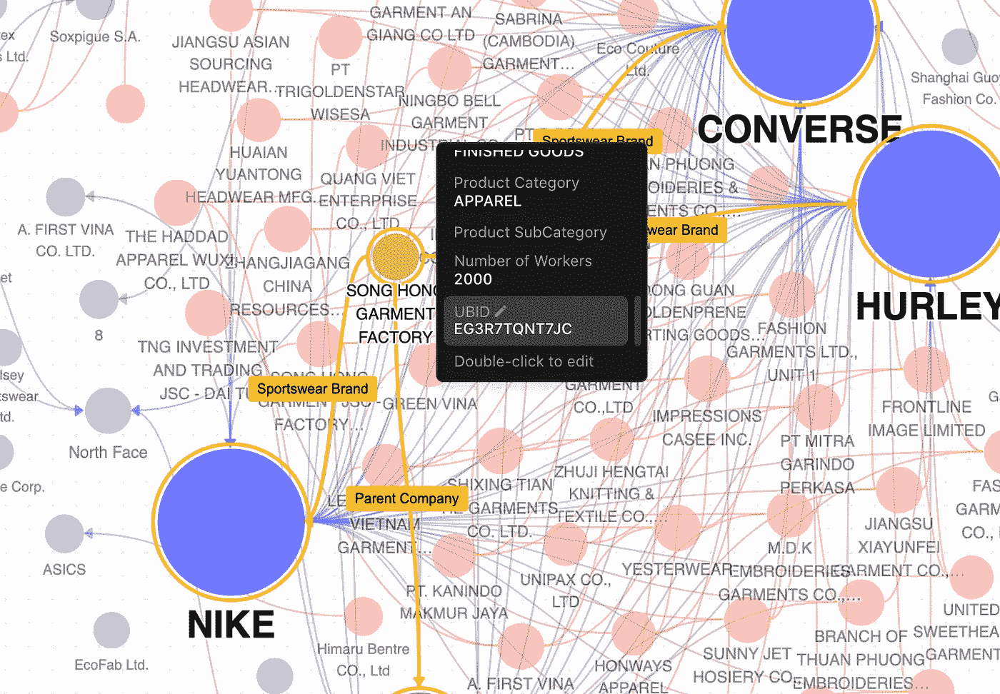

# 关于知识图表

知识图有助于建立语义网络，这些语义网络在知识表示中是有用的，知识表示有助于建立不同概念之间的关系以及它们在视觉上是如何互连的。

这种互联性有助于从可用数据中获得新的见解，从而在分析任务中产生新的发现和不同的观点，并为预测管道提供有价值的信息。

知识库，或知识图谱库，是一个协作性的、健壮的数据库，具有版本控制、分析和可视化功能。