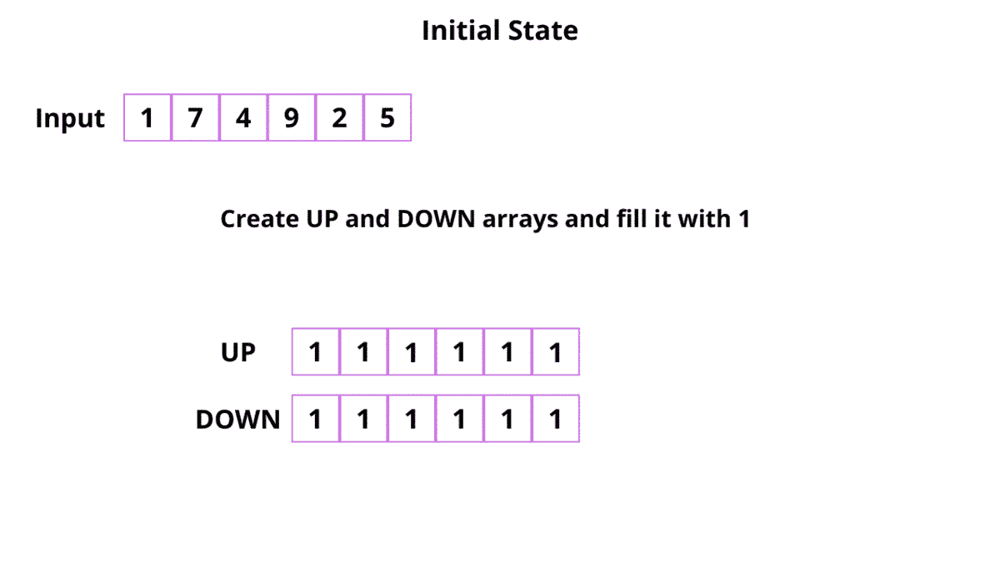

# 2021 年三月电码挑战—第 18 天:摆动序列

> 原文：<https://levelup.gitconnected.com/march-leetcoding-challenge-2021-day-18-wiggle-subsequence-3c408287325b>

今天，我们将解决三月电码挑战的第 18 个问题。


# 问题陈述

给定一个整数数组`nums`，返回*长度最长的* ***摆动序列*** 。

**摆动序列**是一个序列，其中连续数字之间的差严格地在正负之间交替。第一个差异(如果存在的话)可能是正的，也可能是负的。少于两个元素的序列通常是摆动序列。

*   例如，`[1, 7, 4, 9, 2, 5]`是一个**摆动序列**，因为差异`(6, -3, 5, -7, 3)`是正负交替的。
*   相反，`[1, 4, 7, 2, 5]`和`[1, 7, 4, 5, 5]`不是摆动序列，第一个是因为它的前两个差是正的，第二个是因为它的最后一个差是零。

一个**子序列**通过从原始序列中删除一些元素(最终也是零)而获得，剩下的元素保持其原始顺序。

**例 1:**

```
**Input:** nums = [1,7,4,9,2,5]
**Output:** 6
**Explanation:** The entire sequence is a wiggle sequence.
```

**例 2:**

```
**Input:** nums = [1,17,5,10,13,15,10,5,16,8]
**Output:** 7
**Explanation:** There are several subsequences that achieve this length. One is [1,17,10,13,10,16,8].
```

**例 3:**

```
**Input:** nums = [1,2,3,4,5,6,7,8,9]
**Output:** 2
```

# 解决办法

对于这个问题，我们必须找到最长的摆动子序列。摆动子序列意味着连续元素之间的差异在正负之间交替。

为了解决这个问题，我们将使用动态规划。我们将通过两种方法，一种是使用`O(n²)`，另一种是使用`O(n)`。

**方法 1:** 我们将使用两个数组`up` 和`down`。`up` 数组是指结束元素为上升摆动的最长摆动子序列的长度。类似地，`down` 数组指的是最长摆动子序列的长度，其中结束元素是下降摆动。

当我们在指数`i`处发现一个上升的波动时，我们将更新`up[i]`。但是有一个问题。我们必须考虑前面的摆动子序列，它以下降摆动结束(因为我们需要确保子序列总体上是摆动的)。在`down[i]`的情况下，我们遵循相同的方法。

代码如下。

这里我们使用了两个循环。为了检查索引`i`处的最长摆动子序列，我们检查从 0 到`i-1`的每个元素。

时间复杂度:`O(n²)`，n 是数组的长度

空间复杂度:`O(n)`，n 是数组的长度

**方法 2:** 使用这种方法，我们只使用一个循环和两个名为 up 和 down 的数组。这里，我们有三个案例。

*   当`nums[i]>nums[i-1]`时:表示它向上摆动。所以它前面的元素必须是向下的。因此，`up[i] = down[i-1]+1`和`down[i]`将与`down[i-1]`相同。
*   当`nums[i]<nums[i-1]`时:表示向下摆动，其之前的元素必须在向上位置。因此`down[i] = 1+up[i-1]`和`up[i]`将与`up[i-1]`相同。
*   如果是`nums[i]=nums[i-1]`，那么`up[i]`将会是`up[i-1]`而`down[i]`将会是`down[i-1]`。



代码如下。

时间复杂度:`O(n)`，n 是数组的长度

空间复杂度:`O(n)`，n 是数组的长度

代码可以在这里找到

[](https://github.com/sksaikia/LeetCode/tree/main/src/MarchLeetcodeChallenge2021) [## sksaikia/LeetCode

### 在 GitHub 上创建一个帐户，为 sksaikia/LeetCode 开发做贡献。

github.com](https://github.com/sksaikia/LeetCode/tree/main/src/MarchLeetcodeChallenge2021) 

看看我在 2021 年 3 月 LeetCoding 挑战赛上的其他帖子。

1.  [三月吃糖挑战——第一天——分发糖果](https://medium.com/dev-genius/march-leetcoding-challenge-2021-problem-1-distribute-candies-f37f66ea7ee9)
2.  [三月 LeetCoding 挑战赛—第二天—设置不匹配](https://sourav-saikia.medium.com/march-leetcoding-challenge-2021-day-2-set-mismatch-4abd5ee491c9)
3.  [三月电码挑战—第三天—缺少号码](https://sourav-saikia.medium.com/march-leetcoding-challenge-2021-day-3-missing-number-ae8ee45a58cb)
4.  [3 月 LeetCoding 挑战赛—第 4 天—两个链表的交集](https://sourav-saikia.medium.com/march-leetcoding-challenge-2021-day-4-intersection-of-two-linked-lists-a775449b5563)
5.  [三月 LeetCoding 挑战赛—第 5 天—二叉树平均水平](https://link.medium.com/sC9L595opeb)
6.  [三月电子编码挑战—第 6 天—单词的短编码](https://medium.com/leetcode-simplified/march-leetcoding-challenge-2021-day-6-short-encoding-of-words-7fed4bfae557)
7.  [三月电子编码挑战—第 7 天—设计散列表](/leetcode-706-design-hashmap-march-leetcoding-challenge-2021-fdae1a4adbc)
8.  [三月 LeetCoding 挑战—第 8 天—移除回文子序列](https://sourav-saikia.medium.com/march-leetcoding-challenge-2021-day-8-remove-palindromic-subsequences-12b037705722)
9.  [三月 LeetCoding 挑战赛——第 10 天——整数变罗马](https://medium.com/leetcode-simplified/march-leetcoding-challenge-2021-day-10-integer-to-roman-76caa87a0e07)
10.  [三月 LeetCoding 挑战赛——第 12 天——检查一个字符串是否包含所有大小为 K 的二进制代码](https://medium.com/dev-genius/march-leetcoding-challenge-2021-day-12-check-if-a-string-contains-all-binary-codes-of-size-k-48f1fed4d9b9)
11.  [三月 LeetCoding 挑战赛——第 14 天——交换链表中的节点](https://medium.com/leetcode-simplified/march-leetcoding-challenge-2021-day-14-swapping-nodes-in-a-linked-list-a540785c816f)
12.  [三月电子编码挑战—第 15 天—编码和解码 TinyURL](https://medium.com/dev-genius/march-leetcoding-challenge-2021-day-15-encode-and-decode-tinyurl-bfeeba44308e)