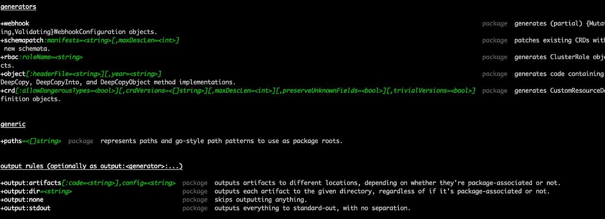
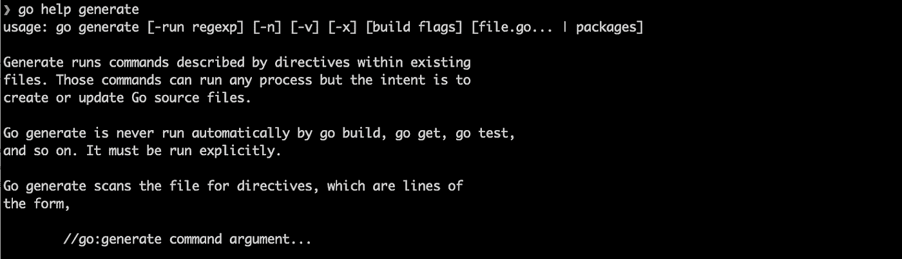
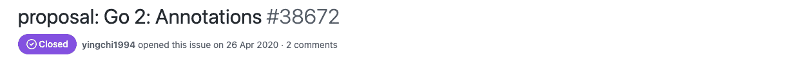

# 围棋中的“标记”

> 原文：<https://levelup.gitconnected.com/markers-in-go-a69af5dc95e6>

## 生成带注释的文件和代码


出自 unsplash，[@米切尔罗](https://unsplash.com/photos/NROHA1B-NYk)

食欲伴随着进食而来，尤其是当面对一桌子让你味蕾发痒的食物时。一旦晚餐开始，你永远不会满足于只吃一口美味。这是我在使用 Kubernetes 操作符和遇到那些不同的标记时的感觉，它们可以帮助避免样板代码和简化代码逻辑。我知道我能学到更多。

看一个开胃酒的例子。下面是我创建的操作符中用于[生成 RBAC](https://github.com/slaise/operator-test/blob/01abdc47d8bfc4fed578b0b2c5ffd57912c97112/kubebuilder-test/controllers/useridentityv3_controller.go#L66) 文件的标记。

```
*//+kubebuilder:rbac:groups=identity.company.org,resources=useridentityv3s,verbs=get;list;watch;create;update;patch;delete**//+kubebuilder:rbac:groups=identity.company.org,resources=useridentityv3s/status,verbs=get;update;patch*
```

运行`[manifests](https://github.com/slaise/operator-test/blob/01abdc47d8bfc4fed578b0b2c5ffd57912c97112/kubebuilder-test/Makefile#L42)`命令后，会在`config/rbac`目录下生成相应的资源 YAML 文件，并打包成相应的操作员映像，然后在部署 CRD 时应用到集群中。

乍一看非常类似于一些 Java 注释特性，对吗？并且可以类似地注入或生成附加代码。作为一名多年的 Java 开发人员，我不禁要进行比较🤷🏻‍♀️.

准备好吃主菜了吗？关注我，了解这个特性在 Kubebuilder 中是如何搭建的，在 Go 中又是如何应用的。说实话，它在 Go 中还没有名字，所以我称它为“Marker”，和 Kubebuilder 文档中的一样。

# 记号笔如何工作

## 控制器-gen 投入使用

Kubebuilder 通过将真正的实现者`controller-gen`包装到 Makefile 中来实现标记。

```
$(CONTROLLER_GEN) $(CRD_OPTIONS) rbac:roleName=manager-role webhook paths="./..." output:crd:artifacts:config=config/crd/bases
```

巨大的 Kubernetes [控制器工具](https://github.com/kubernetes-sigs/controller-tools)的三个命令行工具之一`[controller-gen](https://github.com/kubernetes-sigs/controller-tools/tree/master/cmd/controller-gen)`，只有一个功能:**通过定义**生成相应的文件或代码。为了快速理解它，阅读源代码似乎是唯一的方法，因为文档很差。

`controller-gen`支持 5 台发电机。

*   [CRD](https://github.com/kubernetes-sigs/controller-tools/blob/ab52f76cc7d167925b2d5942f24bf22e30f49a02/pkg/crd/gen.go#L43) ，生成 CRD YAML 格式的资源文件
*   [RBAC](https://github.com/kubernetes-sigs/controller-tools/blob/ab52f76cc7d167925b2d5942f24bf22e30f49a02/pkg/rbac/parser.go#L149) ，生成`ClusterRole`和`ClusterRoleBinding` YAML 文件
*   [对象](https://github.com/kubernetes-sigs/controller-tools/blob/ab52f76cc7d167925b2d5942f24bf22e30f49a02/pkg/deepcopy/gen.go#L54)、**、**生成由 CRD 定义的`deepCopy`代码
*   [Webhook](https://github.com/kubernetes-sigs/controller-tools/blob/ab52f76cc7d167925b2d5942f24bf22e30f49a02/pkg/webhook/parser.go#L284) ，支持生成变异和验证的 webhook YAML
*   [模式](https://github.com/kubernetes-sigs/controller-tools/blob/ab52f76cc7d167925b2d5942f24bf22e30f49a02/pkg/schemapatcher/gen.go#L65)，根据 API 包生成支持 OpenAPI v3 的模式

回头看看 Kubebuilder，你会发现它使用了所有生成器，并将执行命令封装在 Makefile `generate`命令中。

```
$(CONTROLLER_GEN) object:headerFile="hack/boilerplate.go.txt" paths="./..."
```

同时，`controller-gen`还支持 4 种[输出方式](https://github.com/kubernetes-sigs/controller-tools/blob/ab52f76cc7d167925b2d5942f24bf22e30f49a02/cmd/controller-gen/main.go#L63)。

*   **dir** ，输出到一个目录
*   **无**，无输出
*   **stdout** ，输出至标准输出
*   **工件**，输出到其他目录或文件

这也是`manifests`命令中`output`选项的功能。而且除此之外，在使用 Kubebuilder 的时候，应该已经安装了`controller-gen`，所以你可以在命令行查看`help`的信息。



## 解析标记

然后跳出了这样一个问题:如何将注释行解析成一个标记对象？

相应的逻辑在[控制器-工具/pkg/标记器](https://github.com/kubernetes-sigs/controller-tools/tree/ab52f76cc7d167925b2d5942f24bf22e30f49a02/pkg/markers)包中。通读完`Marker`代码后，简单地解释一下:将一行注释解析成一个`[Definition](https://github.com/kubernetes-sigs/controller-tools/blob/ab52f76cc7d167925b2d5942f24bf22e30f49a02/pkg/markers/parse.go#L652)`对象，该对象包含类似`Name`、`Target`、`Fields`、`FieldsNames`等字段。

```
*// Definition is a parsed definition of a marker.* type Definition struct {Solly Ross, 3 years ago: • Marker parsing
   *// Output is the deserialized Go type of the marker.* Output reflect.Type
   *// Name is the marker's name.* Name string
   *// Target indicates which kind of node this marker can be associated with.* Target TargetType
   *// Fields lists out the types of each field that this marker has, by
   // argument name as used in the marker (if the output type isn't a struct,
   // it'll have a single, blank field name).  This only lists exported fields,
   // (as per reflection rules).* Fields map[string]Argument
   *// FieldNames maps argument names (as used in the marker) to struct field name
   // in the output type.* FieldNames map[string]string
   *// Strict indicates that this definition should error out when parsing if
   // not all non-optional fields were seen.* Strict bool
}
```

有趣的是，`Definition`对象的类别(`package`、`type`和`field`)让你想起了什么？有，Java 注释里的`class`、`field`和`method`。🙈

# 围棋中的标记

当我在研究 Kubebuilder 标记背后的逻辑时，我的脑海中出现了一个想法:看看这种便利性，难道不应该有对这一特性的本机支持吗？

仔细想想，我发现自己对这些类似的功能并不陌生，比如我在`go-lint`中关闭一个警报时采用了`var bad_name int // nolint`，或者在屏蔽某个错误时采用了`var bad_name int // nolint:golint,unused`。

此外，Go 还支持两种类型的标记。

*   `go:build`
*   `go:generate`

## 开始:构建

构建标记限制了代码的构建 OS/平台。举个例子，

```
// +build linux darwin
package main
```

同一个文件中可以有多个标签。但是，不要错过构建标记和包定义之间的空行。当然，你可以用`go vet`来避免。

## 开始:生成

`go:generate`标记与`go generate`命令捆绑，通过`help`命令查看官方解释。



`go generate`使您能够在 Go 代码中运行当前系统的已安装程序，尽管它最初是用于创建或更新 Go 源文件。运行下面的命令，当前目录下的所有`go:generate`标记都将被执行。

```
go generate ./...
```

并且`go generate`提供了更多，一个典型的例子是使用 [stringer](https://github.com/golang/tools/blob/master/cmd/stringer/stringer.go) 生成错误信息。

通常我们用一个包含 *int* ( `code`)和 *string* ( `description`)的对象来映射设计 web 程序返回时对应的错误。在 Java 中，我们经常会挑`Enum`，这个比合适的多。但是在 Go 中，我们只能通过`itoa`生成`ErrorCode`，而不能同步保存描述。

示例中的`errorcode.go`包含一个`//go:generate` 标记和 3 个`ErrorCodes`，每个标记定义了下面注释中对应的`Error Message`。

接下来，在命令行上执行`go generate`，生成下面的`errorcode_string.go`。

然后用`fmt.Println(NOT_FOUND)`返回相应的错误信息。

# 围棋不是记号笔的爱好者

`go:generate`在 Go 源代码中出现的多，除此之外别无其他。Go 既没有在标记上投入更多，也没有在更便于定制的方法上投入更多。所以，我们仍然依靠`Kubernetes/controller-tool`中那些复杂的解析器来实现支架功能。

即使 Github 问题中有相关提案，如 [#36669](https://github.com/golang/go/issues/36669) 、 [#38672](https://github.com/golang/go/issues/38672) ，但无论如何都被否决了。



为什么拒绝？我引用@ [ianlancetaylor](https://github.com/ianlancetaylor) 来回答。

> Go 喜欢显式的编程风格。
> 
> Go 认为可读性方面的好处值得额外的代码。

Go 完全有理由拒绝但无法阻止那些有想法的地鼠去实现自己。而且除了之前的`controller-gen`，我还在 Github 上发现了这两个有趣的包。

*   `[Kubernetes/code-generator](https://github.com/kubernetes/code-generator)`，也生成控制器相关的模板代码。
*   `[golangAnnotations](https://github.com/MarcGrol/golangAnnotations)`，支持生成 web 相关模板代码，如`[@RestOperator](http://twitter.com/RestOperator)`。

如果你感兴趣，可以去看看。

# 结束了

作为一种静态语言，Go 与 Java 有着本质的不同。与 Java 注释相比，Go 标记也是如此。Go 标记通常用于生成或验证代码，但在运行时不添加任何逻辑。然而，Java 注释通常可以与拦截器结合使用，增加运行时日志和参数验证。

通过学习上面的例子，我们对标记的内部原理有了更多的了解，这样我们就可以在应对样板文件不足的情况时做好准备。我们是否可以编写一些静态语法检查作为 lint 工具，作为公司内部操作员的最佳实践，这是一个有待讨论的问题。

# 参考

[](https://book.kubebuilder.io/reference/markers.html) [## 用于配置/代码生成的标记

### 我们声援黑人社区。种族主义是不可接受的。这与……的核心价值观相冲突

book.kubebuilder.io](https://book.kubebuilder.io/reference/markers.html) [](https://go.dev/blog/generate) [## 生成代码

### rob Pike 2014 年 12 月 22 日通用计算的一个特性——图灵完备性——是计算机程序可以写…

go.dev](https://go.dev/blog/generate)