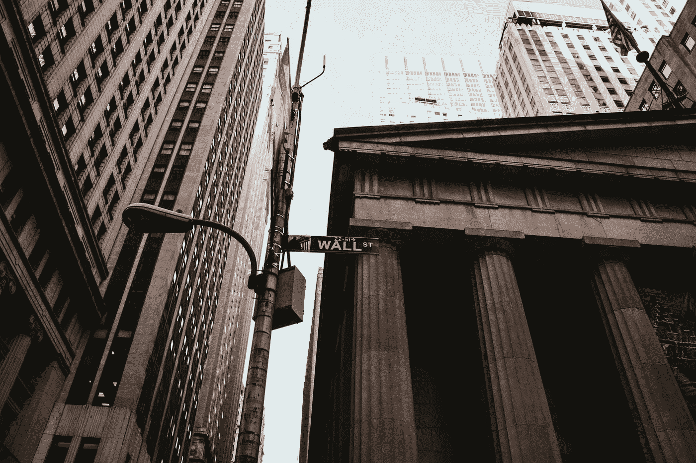
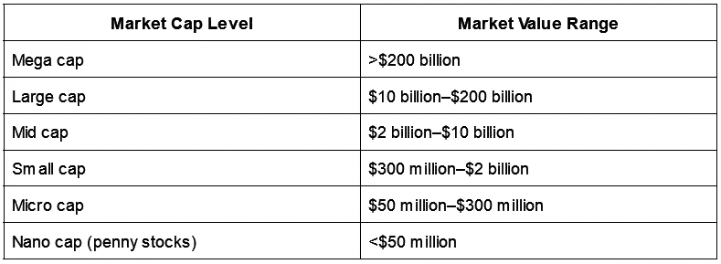

# 市值和资本市场

> 原文：<https://levelup.gitconnected.com/market-capitalisation-and-capital-markets-31e40aa823d1>



照片由 [Unsplash](https://unsplash.com/s/photos/wall-street?utm_source=unsplash&utm_medium=referral&utm_content=creditCopyText) 上的 [Aditya Vyas](https://unsplash.com/@aditya1702?utm_source=unsplash&utm_medium=referral&utm_content=creditCopyText) 拍摄

回到和一个像我一样的业余爱好者一起学习，我只是想引导和帮助其他业余爱好者更容易地学习投资。在今天的文章中，我们将讨论市值和资本市场。

乍一看，这些术语可能听起来令人困惑，但是不要担心，我们将很快探究这些术语。尽管这些术语的概念很简单，但了解它们仍然是件好事，因为学习和拓宽你的知识总是件好事。

如果你对投资感兴趣，并且一直在阅读或观看相关新闻，你可能会听说过这些术语。然而，你可能不明白它们的确切含义。我在这里，试图帮助你更好地理解这两个术语。

所以让我们开始吧！

# 市值

市值俗称*市值*。也许你在阅读或看新闻时听说过这个术语。那是什么？它有什么重要的？为什么总是听到*市值这个*或者*市值那个*？

根据定义，市值是指一家上市公司基于其全部已发行股票的总市值。

总市值？上市公司？流通股？

上市公司是指在像纽约证券交易所这样的证券交易所公开上市的公司，在那里公司的股票可以自由交易。

总市值仅仅意味着公司的价值。

同时，流通股是指投资者或股东已经授权、发行并积极持有的股份总数。

因此，市值简单地说就是一家公司基于其总股票价值的价值。

现在，如果你注意到了，发行在外的股票必须首先被授权，这意味着它们是被授权发行的股票数量。股票发行数量不能超过授权数量。然后它们被分发。

也就是说，还有被称为授权股和流通股的股票。授权股份指的是法律允许公司发行的最大股份数量。它包括已经发行的股票，以及经管理层批准但尚未在包括股票期权在内的交易市场上发行的股票。流通股则包括股东持有的股份，因为它们已经发行。不过，流通股严格来说是指市场上实际可交易的股票数量。

无论如何，随着定义被清除，现在我们如何确定价值呢？计算是怎么做的？

```
Market_Cap = Share_Price x Number_of_shares
```

因此，基本上，要计算市值，只需将其股价乘以其已发行股票总数。

例如:如果一家公司有 1000 万美元的流通股，其每股收盘价为 10 美元，那么其市值将为 1 亿美元。如果其收盘价以某种方式升至 12 美元，市值将达到 1.2 亿美元。如果跌至 5 美元，其市值将达到 5000 万美元。

原来如此。确定公司价值的简单计算。在某些形式的股票估价中，它也被用作一个决定因素。

为什么？这是因为市值决定了公司的规模，它可以决定公司对投资者的潜力。

例如，一个大公司通常会被认为是更安全的，因为他们的寿命和稳定性。另一方面，一家小公司自然会被认为是有风险的，尽管它可能会有疯狂的增长，可以在很短的时间内使投资者的资金增加一倍或两倍。基本上，它也描述了与风险更高但回报更高的年轻公司相比，老公司可能更稳定。

现在，我们如何根据市值来判断一家公司是大是小呢？

传统上，只有三个级别:大盘股、中盘股和小盘股。然而，后来又增加了三个术语:超级电容、微型电容和纳米电容。就我个人而言，我只是在交易中更频繁地听到这些附加条款。也许这是由于我的阅读，但无论如何，划分越多，你的分类就越准确。

没有确切的临界值，但以下是它的摘要(尽管这可能因资源而异):



因此，市值水平通常与公司的相关投资风险相关。因此，你可以把它作为决定投资什么公司的方法之一。你也可以通过投资不同风险水平的不同市值来分散投资。纳米上限的风险最高，而超级上限的风险最大。

# 资本市场

现在你已经了解了市值，让我们继续关于资本市场的话题(是的，这听起来非常类似于市值，但它们并不相同)。

当然，根据定义，资本市场与市值或市值无关。资本市场是资金借出(投资)的人或机构与寻求资金使用的人(如企业、政府、个人)之间交换资金的地方。所以基本上，那些需要筹集资金做某事的人会通过这些市场为投资者发行股票或债券。

然而，市场可以分为两部分:一级市场和二级市场。最常见的资本市场是股票市场和债券市场。

二级市场是大多数人最熟悉的市场。这是一个市场，投资者之间的交易以受监管的方式进行，就像纽约证券交易所或纳斯达克一样。这也意味着发行的股票通常是现有的问题。

例如，如果一家公司上市(IPO)并在纽约证券交易所或纳斯达克等交易所上市，原始投资者的股票买卖活动将在二级市场进行。

另一方面，一级市场在某种意义上是新发行证券直接交易的市场。

例如，如果有一家初创公司通过直接购买投资者的股份或 N%的所有权获得投资，这被视为一级市场下的活动。基本上投资者直接从创始人那里投资。

顺便说一下，如果你想了解更多关于股票、债券、股票、证券或任何其他资产类别或投资工具的信息，你可以在这里阅读更多。

关于资本市场的更多事实:

资本市场通常集中在金融中心，如纽约、伦敦、新加坡和香港。

这些市场可能包括股票市场、债券市场以及货币和外汇市场。

此外，金融市场从根本上不同于资本市场。如前所述，资本市场是公司筹集资金的主要场所，这些资金通常用于公司的运营、发展或其他活动。另一方面，金融市场是所有涉及金融资产的交易发生的市场。

这意味着金融市场涵盖任何资产、证券等。可以这样想象:股票和债券市场是资本市场的子集，资本市场是金融市场的子集。差不多吧。

# 总结

基本上，新资本是在一级市场筹集的，投资者在那里购买发行的股票和债券(例子)。随后，交易员和投资者将在公开市场或二级市场上交易(买卖)这些证券。

然后，当你想通过市场投资一家公司时，你会在投资或交易前做自己的研究。市值可能是你投资的因素之一。例如，如果你喜欢投资更稳定的公司，你也许可以从大型或超大型股类别开始研究。

好了，这篇文章就到这里。如果你觉得这篇文章有帮助，请随意与任何你认为可以从中受益的人分享。

感谢阅读。

如果您计划开立投资账户，您可以使用我的推荐注册免费礼品(截至发稿时):

*   [老虎经纪人](https://www.tigersecurities.com/accounts?invite=DT888)
*   [哞哞](https://j.moomoo.com/007s37)
*   [互动券商](https://ibkr.com/referral/deddy189)
*   [斯塔沙威](https://www.stashaway.sg/referrals/deddytv4e)
*   Syfe(转介代码:SRPT38VH3)