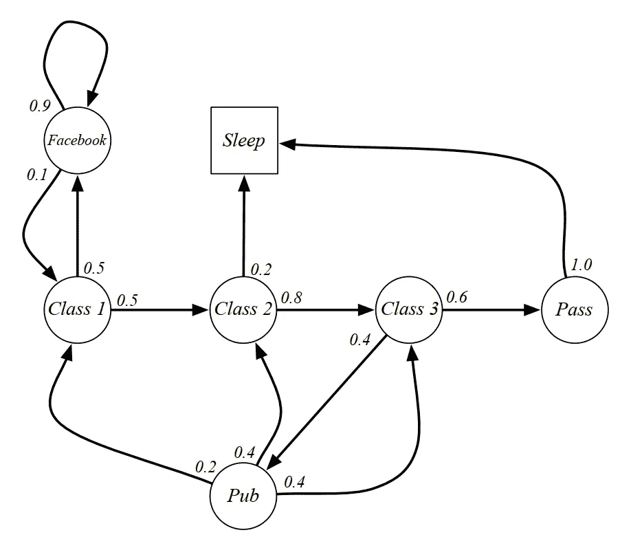
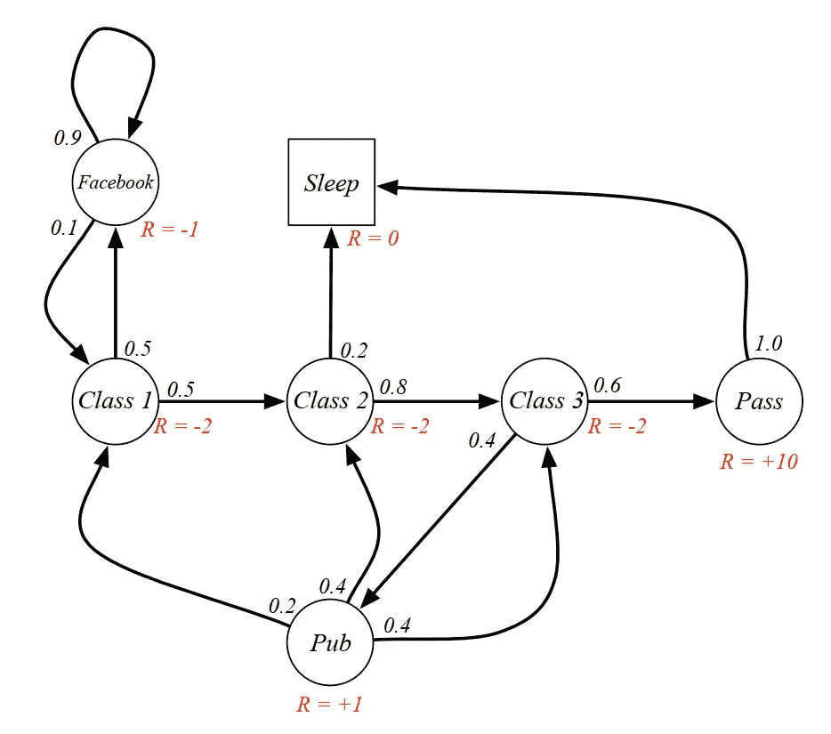
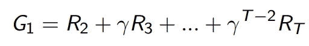
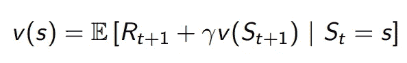
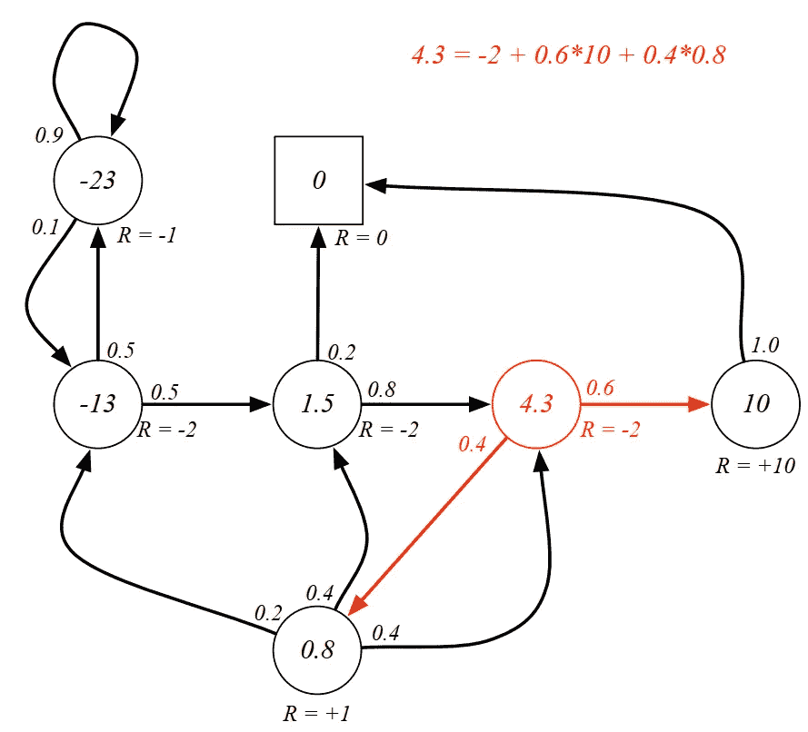
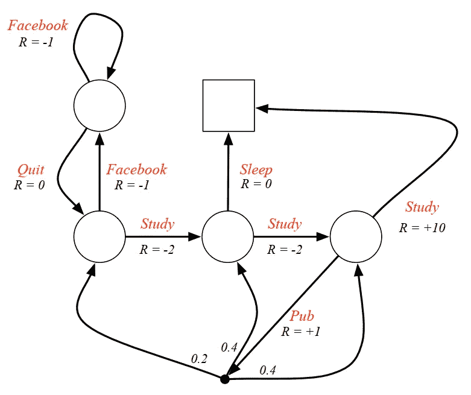
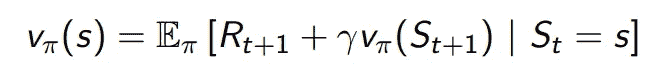
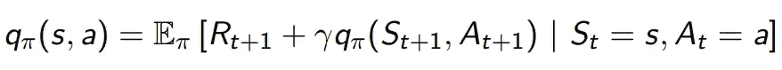
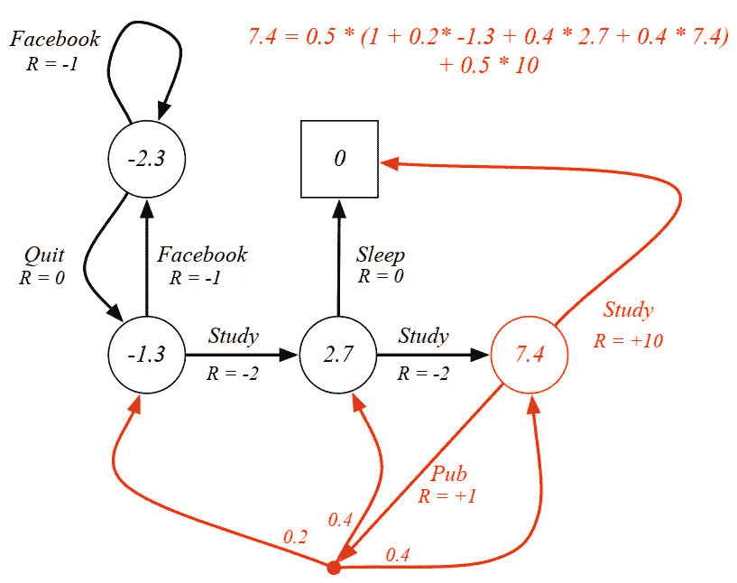
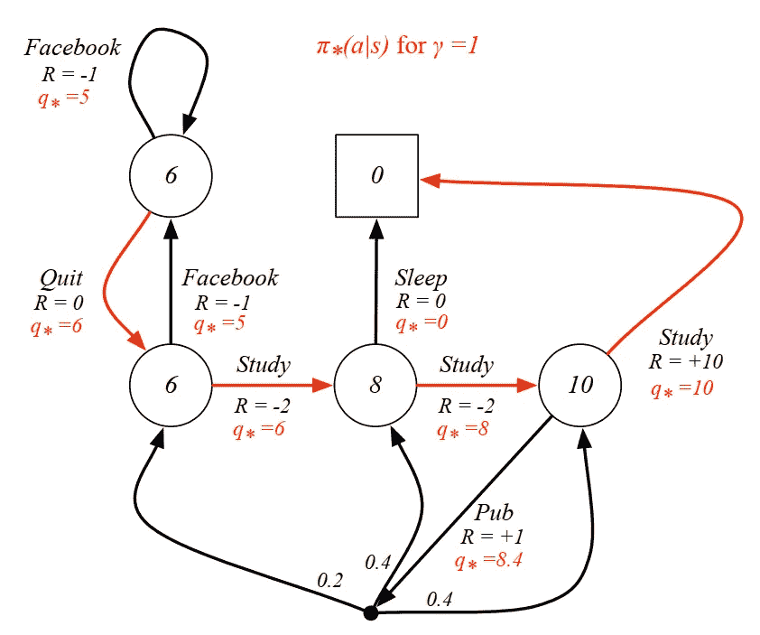

# 简化马尔可夫决策过程

> 原文：<https://levelup.gitconnected.com/markov-decision-processes-simplified-f5f8d37ab70f>

## AWS DeepRacer 系列

## 深入强化学习之前最基本的概念

维多利亚诺·伊斯基耶多在 [Unsplash](https://unsplash.com?utm_source=medium&utm_medium=referral) 上的照片

欢迎来到我在 AWS DeepRacer 系列的第二篇文章！在本文中，我将介绍强化学习的基本方面，即**马尔可夫决策过程**。如果你没有看过我的第一篇文章，建议你去看看，对强化学习有个直观的认识。([强化学习的非正式介绍](https://towardsdatascience.com/casual-intro-to-reinforcement-learning-4a78b57d4686))

我们将从马尔可夫过程，马尔可夫回报过程，最后是马尔可夫决策过程开始。

# 概述

1.  **马尔可夫过程**
2.  **马尔可夫奖励过程**
3.  **马尔可夫决策过程**

# 马尔可夫过程

**马尔可夫决策过程** ( **MDP** ) 代表一个*环境*用于强化学习。这里我们假设*环境*是完全可观测的。这意味着在当前状态下，我们已经掌握了做出决策所需的所有信息。然而，在我们继续讨论 MDP 是什么之前，我们需要知道马尔可夫性质是什么意思。

**马尔可夫性质**陈述给定现在，未来独立于过去。这意味着当前的*状态*从历史中获取了所有相关信息。例如，如果我现在渴了，我想马上喝一杯。当我决定喝酒时，我是昨天还是一周前(过去的*状态*)口渴，对我来说是无关紧要的。现在是我做决定的唯一时间。

> 鉴于现在，未来独立于过去

除了*马尔可夫特性*之外，我们还有一个**状态转移矩阵**，它存储了从每个当前*状态*到每个后继*状态*的所有概率。假设我工作时有两种*状态*:工作(真实工作)和看视频。我在工作的时候，有 70%的机会继续工作，30%的机会看视频。但是，如果我在工作中途看视频，我可能有 90%的机会继续看视频，10%的机会回到实际工作中。也就是说，状态转移矩阵定义了从所有*状态*(工作，观看视频)到所有后续*状态*(工作，观看视频)的转移概率。

了解了*马尔可夫性质*和*状态转移矩阵*之后，让我们继续讨论**马尔可夫过程或马尔可夫链。** *马尔可夫过程*是一种无记忆的随机过程，比如具有马尔可夫性质的状态序列。

我们可以在下图中看到一个*马尔可夫过程*学生活动的例子。有几个*状态，从*类 1* 到*睡眠*为最终状态。每个圆圈中的数字代表转移概率。*

学生马尔可夫过程[图片来自大卫·希尔弗关于 MDP 的演讲]

我们可以从*类 1* 开始到*睡眠:*为止对这个过程进行采样**集**

1.  C1·C2·C3 通过睡眠，
2.  C1 FB FB C1 C2 睡眠，
3.  C1 C2 C3 酒馆 C2 C3 帕斯睡眠，等等。

他们三个从同一个*状态*、*类 1* 开始，到*睡眠*结束。然而，它们经历了一条不同的路径来达到最终的状态。每一次经历就是我们所说的*马尔可夫过程*。

> 具有马尔可夫性质的随机状态序列是一个马尔可夫过程

# 马尔可夫奖励过程

至此，我们终于明白什么是*马尔可夫过程*了。一个*马尔可夫奖励过程* (MRP)是一个*马尔可夫过程*带*奖励*。很简单，对吧？它由*个状态、状态转移概率矩阵* **加上** *个奖励函数*和一个*折扣因子*组成。我们现在可以将我们以前的学生*马尔可夫过程*改为学生 MRP，并增加*奖励*，如下图所示。

学生 MRP[图片来自大卫·希尔弗关于 MDP 的演讲]

为了理解 MRP，我们必须理解*返回*和*值函数*。

**回报**是从现在开始的总折扣*奖励*。*贴现因子*是未来*奖励*的现值，其值介于 0 和 1 之间。当*折扣因子*为接近 0 时，它更喜欢立即*奖励*而不是延迟*奖励*。当它接近 1 时，它认为延迟的*奖励*高于立即的*奖励*。

然而，你可能会问“我们为什么要费心去添加一个折扣因子呢？”。嗯，有几个原因需要它。首先，我们希望通过将贴现因子设置为小于 1 来避免无限收益。第二，直接的回报实际上可能更有价值。第三，人类行为表现出对即时*回报*的偏好，比如选择现在购物而不是为未来储蓄。

使用*奖励* ( **R** )和*折扣因子*(**γ**)可以计算出*回报* ( **G** )，如下所示。

返回[图片来自大卫·西尔弗关于 MDP 的演讲]

从学生 MRP 中，我们可以得到一个样本*退货*，该退货从类别 1 开始，折扣系数为 **0.5** *。样本集是【C1 C2 C3 传】，收益等于-2-2 ***0.5**-2 ***0.25**+10 ***0.125**=-2.25。*

除了*收益*之外，我们还有一个**价值函数**，它是一个状态的预期收益。一个 v *值函数*确定一个*状态*的值，该值指示一个*状态*的期望。使用**贝尔曼方程**，我们可以仅用当前*奖励*和下一个*状态值*来计算当前*状态*值。

价值[图片来自大卫·西尔弗关于 MDP 的演讲]

这意味着我们只需要下一个*状态*来计算一个*状态*的总*值*。换句话说，我们可以有一个递归函数，直到过程结束。

再来看看 *gamma* 等于 **1** 的学生 MRP。下图表示在每个*状态*下具有*值*的学生 MRP。这个值之前已经计算过了，现在我们想用等式来验证 3 类(红圈)中的*值*。

有价值观的学生 MRP 图片来自大卫·西尔弗关于 MDP 的演讲]

从类 3 中我们可以看到，*值*是通过将立即*奖励* (-2)与两个下一个*状态*的期望*值*相加计算出来的。为了计算下一个*状态*的预期*值*，我们可以将转移概率乘以*状态*的值。因此，我们得到**-2**+0.6 ***10**+0.4 ***0.8**，等于 **4.3** 。

> 马尔可夫奖励过程是一个有奖励和价值的马尔可夫过程

# 马尔可夫决策过程

至此，我们已经了解了*马尔可夫奖励过程。*但是，当前*状态*和下一个*状态*之间没有动作。一个**马尔可夫决策过程(MDP)** 是一个有决策的 MRP。现在，我们可以选择几个动作在*状态*之间转换。

让我们看看下图中的学生 MDP。这里的关键区别在于，学生在采取了一个*动作*后，会立即得到*奖励*。在 MRP 上，*状态*有即时*奖励*。这里的另一个区别是一个*动作*也可以引导学生进入不同的*状态*。基于学生 MDP，如果一个学生采取 *Pub 动作*，他可以在*类 1* 、*类 2* 或*类 3* 中结束。

学生 MDP[图片来自大卫·希尔弗关于 MDP 的演讲]

考虑到这些行为，我们现在有了一个**策略，**，它将状态映射到行为。它定义了一个**代理**(在本例中是一个学生)的行为。*策略*是固定的(与时间无关)，它们依赖于*动作*和*状态*而不是时间步长。

基于*策略*，我们有一个**状态值函数**和一个**动作值函数**。*状态值函数*是从当前状态开始，然后遵循一个策略的期望收益。另一方面，*动作值函数*是从当前状态开始，然后**采取** **一个*动作*，**然后遵循*策略*的期望收益。

通过使用贝尔曼方程，我们可以得到如下的*状态值函数* (v)和*动作值函数* (q)的递归形式。

国家价值函数[图片来自大卫·希尔弗关于 MDP 的演讲]

行动价值函数[图片来自大卫·希尔弗关于 MDP 的演讲]

为了让事情更清楚，我们可以在下面的图像中再次查看具有 *gamma* 0.1 的学生 MDP。假设在*三班*(红圈)中，一个学生有一个 50:50 *的政策*。这意味着学生有 50%的机会去学习或去酒吧。我们可以通过对每个动作后的每个预期收益求和来计算状态值。

有价值观的学生 MDP[图片来自大卫·西尔弗关于 MDP 的演讲]

来自*研究*的*期望值*可以通过将*动作概率*与下一个*状态*的*期望值*(0.5 * 10)相乘来计算。相反，*发布动作*有多个分支，导致不同的*状态*。因此，我们可以通过将*动作概率* (0.5)乘以*动作值*从*公布*中计算出*期望值*。通过将即时*奖励*与来自所有可能*状态*的*期望值*相加，可以计算出*行动值*。可以用 1 + 0.2*-1.3 + 0.4*2.7 + 0.4*7.4 来计算。

一个*代理*的目标是最大化它的*值*。因此，我们必须找到导致最大*值*的最优*值* *函数*。在前面的例子中，我们通过对所有可能的*动作*的所有预期*值*求和来计算*值*。现在，我们只关心给出最大*值*的*动作*。在已经知道最优*值函数*之后，我们有最优*策略*并且 MDP 被求解。下图显示了学生 MDP 对于每个*状态*的最优*值*和*策略*。

学生 MDP 与最优政策[图片来自大卫·西尔弗关于 MDP 的演讲]

# 结论

> 总之，马尔可夫决策过程是一个带有行动的马尔可夫回报过程，在这个过程中，主体必须基于最优的价值和策略做出决策。

# 参考

以下是我阅读的一些资料，有助于我对这个话题的理解。

1.  David Silver 关于 RL 的讲座——第 2 讲:马尔可夫决策过程。
2.  [Ayush Sing —强化学习:马尔可夫决策过程(第一部分)](https://towardsdatascience.com/introduction-to-reinforcement-learning-markov-decision-process-44c533ebf8da)

照片由[耐嚼](https://unsplash.com/@chewy?utm_source=medium&utm_medium=referral)在 [Unsplash](https://unsplash.com?utm_source=medium&utm_medium=referral) 上拍摄

# 结束语

感谢您花时间阅读这篇文章！我希望你对 MDP 有更多的了解，作为 RL 的基础。请务必关注我即将发表的关于强化学习和 AWS DeepRacer 细节的文章。我希望你有美好的一天！

# 关于作者

Alif Ilham Madani 是一名有抱负的数据科学和机器学习爱好者，他热衷于从他人那里获得洞察力。他在印尼最顶尖的大学之一[*Institut Teknologi Bandung*](https://www.itb.ac.id/)主修电子工程。

如果你有任何话题要讨论，你可以通过 [LinkedIn](https://www.linkedin.com/in/alif-ilham-madani/) 和 [Twitter](https://twitter.com/_alifim) 与 Alif 联系。