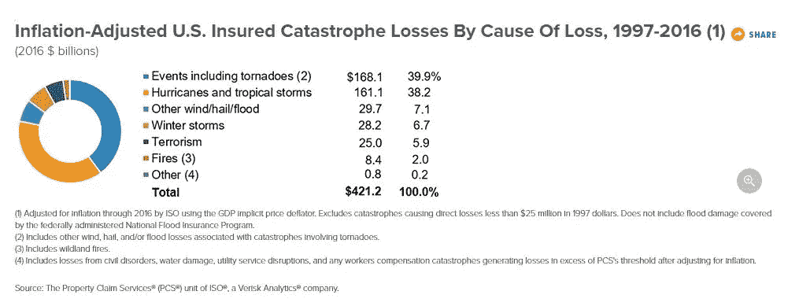
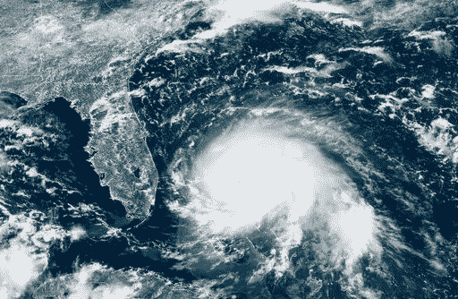
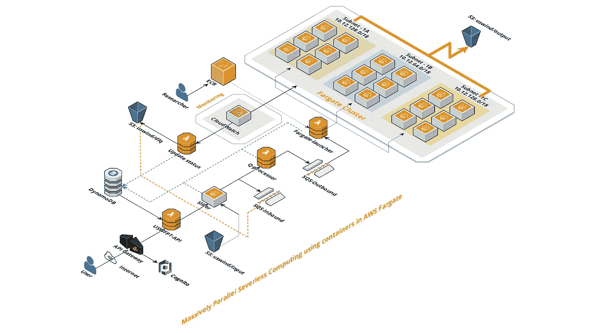
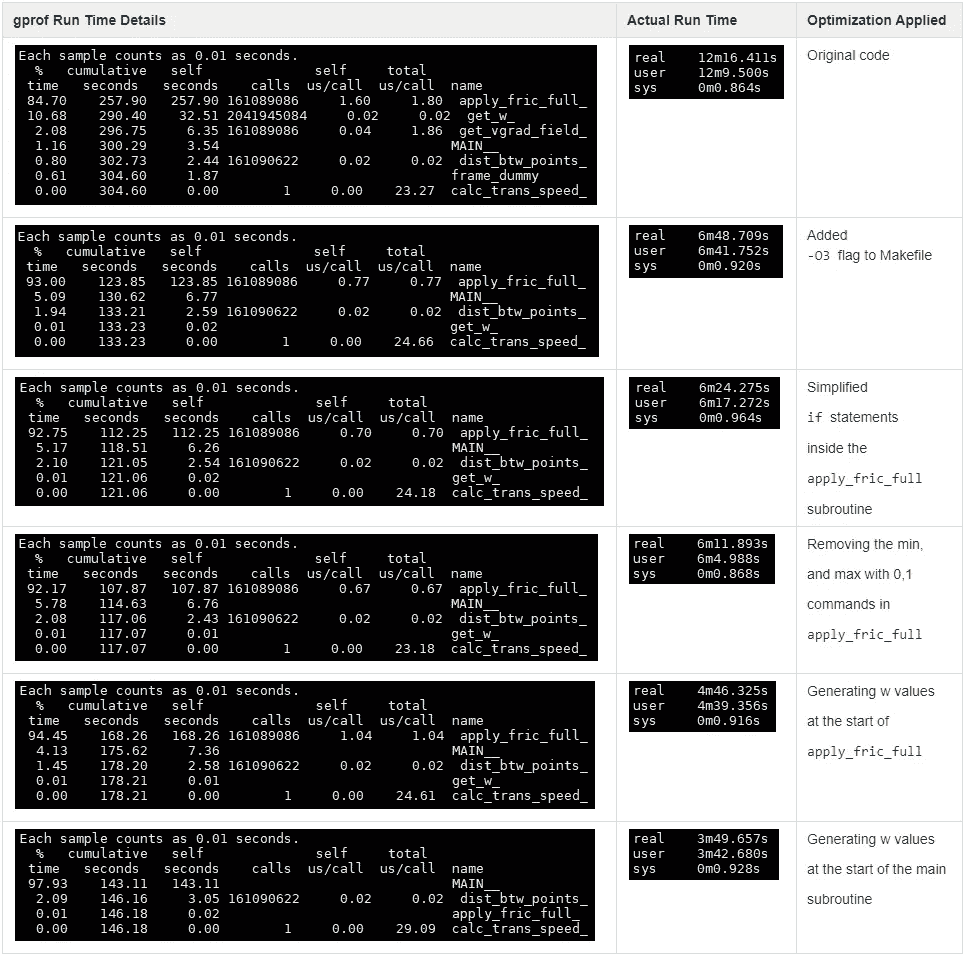
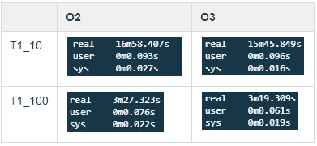
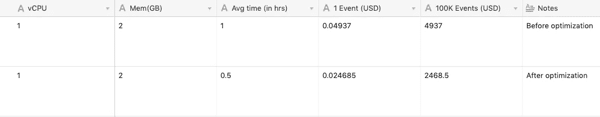

# AWS 中的大规模并行无服务器计算

> 原文：<https://levelup.gitconnected.com/massively-parallel-serverless-computing-in-aws-d99b6090f8b4>

# 摘要

这篇文章是关于实现一个大规模并行科学数据处理系统的设计和挑战，该系统运行大约***【5K】****[集装箱](https://en.wikipedia.org/wiki/OS-level_virtualization)并发计算一个美国东海岸的*飓风风足迹模型*用 **FORTRAN** 。总共约有**个集装箱以容错方式运行了**四天来计算东海岸的美国风足迹(USWFPT)模型，实现了 ***10x*** 的加速。*****

****大多数需要如此大规模并行处理的科学计算通常在超级计算机(OpenMP + FORTRAN)上运行，没有多少人有机会使用这些计算机。这个问题有多种解决方案(缩放 FORTRAN 代码)；这只是在这个规模上成功运作的一个例子。主要思想是在云中为这个问题构建大规模并行解决方案时所遵循的设计原则。****

# ****项目目标****

1.  ****使用用 **FORTRAN 编写的现有代码库。******
2.  ****对代码基础的最小修改****
3.  ****显著减少计算时间。****
4.  ****零基础设施维护****
5.  ****启用 CI/CD(持续集成和持续交付)****

# ****为什么这很重要？****

****美国飓风是全球保险业最昂贵的风险之一。根据保险信息研究所(Insurance Information Institute)的数据，根据财产索赔服务数据([https://www . iii . org/fact-statistics/facts-statistics-US-灾变](https://www.iii.org/fact-statistic/facts-statistics-us-catastrophes))，飓风占 1917 年至 2016 年美国保险灾难损失的近 40%。因此，计算登陆飓风带来的风险非常重要。****

********

*******稍微讲一下飓风*******

****飓风(也称为台风或热带气旋)是一类源于全球热带地区的风暴，在中心低压、平静的“风眼”周围有一个近似轴对称、非常强大的气旋环流。****

****根据风暴的不同，风力影响可以延伸到距离风暴中心约 10 英里(2008 年热带风暴马可-有记录以来最小)，约 200 英里(2017 年飓风伊尔玛)到距离风暴中心 500 英里以上(2012 年飓风桑迪-影响美国最大的飓风)的任何地方。****

********

******这是 GOES-16 卫星图像，由美国国家海洋和大气管理局(NOAA)于 2019 年 9 月 1 日星期日 17:00 UTC 拍摄，显示飓风多利安(右)正在大西洋上空翻腾。飓风多里安周日袭击了巴哈马北部，成为灾难性的 5 级风暴。时速 185 英里的大风掀翻了屋顶，掀翻了电线，数百人躲在学校、教堂和其他避难所。******

# ****突变模型****

****灾难模型可以用来量化登陆飓风带来的风险。这些模型计算了大量热带气旋(*或更多事件)造成的损失。飓风事件造成的损失有三种主要方式(次级风险):*****

1.  *******风**(建筑物的结构性破坏)*****
2.  *******风暴** **汹涌**(沿海洪水)*****
3.  *******降雨**与风暴(内陆洪水)有关*****

*****从建模的角度来看，每个子风险都是单独建模的。这个例子只关注**风的危害**。与风相关的损失估计是基于飓风经过期间任何地点经历的最大阵风(在 10 米高度持续 3 秒的阵风)。事件集事件的所有足迹的完整集合构成了灾难模型的风灾部分。*****

*******USWFPT** 模型目前用 FORTRAN 编写，使用一组软件库和独立于机器的数据格式，支持创建、访问和共享面向数组的科学数据，以计算 ***事件足迹*** 。*****

# ****事件足迹****

****所有具有显著阵风的位置的集合被称为 ***事件足迹*** 。****

****为了创建 ***事件足迹，*** 需要知道风暴的几个物理参数，例如:****

*   ****风暴中心周围的最大风力****
*   ****最大风出现时距中心的距离****
*   ****风暴的规模****
*   ****风暴路径是一系列纬度和经度，对应于风暴在其生命周期中的位置。****
*   ****此外，还需要计算最大阵风的沿海和内陆位置。****

# ****问题是****

****计算一个事件和几个位置并不特别需要计算——尽管它不应该被认为是微不足道的；有许多物理过程需要考虑。****

****当需要为***事件**和覆盖整个美国东海岸的位置网格**500 万网格点**重复计算时， ***挑战*** 就显现出来了。 **FORTRAN** 计算变得过于繁琐和耗时，因为计算 *150K* 事件需要超过两个**月**。*****

# ****一切都始于一个容器。****

> ****千里之行始于足下——老子****

****在我们的例子中，它以*单个* [*容器*](https://en.wikipedia.org/wiki/OS-level_virtualization) 开始。容器是一种操作系统虚拟化的方法，对测试和实验软件应用程序很有吸引力。****

****正如在上面的一个项目目标中提到的，由于各种原因，用 FORTRAN 之外的另一种语言重写代码并不是一个理想的选择，这些原因包括但不限于截止日期、开发人员的工作效率、专有的科学数据格式和库。对于那些以前使用过 FORTRAN 的人来说，您必须意识到 FORTRAN 在处理跨版本兼容性问题上是出了名的棘手。****

****一般来说，由给定版本的 FORTRAN 编译器(版本 8 或更高版本)编译的代码可以与由同一编译器的更高版本编译的代码链接，只要使用更高版本的语言库和工具(如链接器)即可。反之则不然，由较新版本编译的目标代码不支持与较旧版本的库和工具链接。****

****在克服了 docker 容器中的跨版本兼容性问题之后，运行单个事件足迹的计算就成功了。现在，我们需要做的就是运行 *150K* 这些容器，每个容器包含不同的事件足迹。****

****在我们弄清楚如何运行和在哪里同时运行数千个这样的事件之前，如果我们能让这些事件的计算令人尴尬地并行，将会对我们有很大的帮助；我的意思是，存放 FORTRAN 代码的容器对事件足迹的计算与其他事件足迹的计算很少或没有相关性。****

# ****系统结构****

******为什么云？******

****很明显，在这个阶段，我们正在处理*大规模并行计算问题，*我们需要一个集群。传统的本地集群对集群基础架构采用一刀切的方法。然而，云提供了广泛的可能性，并允许优化性能和成本。****

****您可以将整个工作负载定义为代码(基础设施即代码)，并在云中更新它。这使您能够自动化重复的过程或程序。您受益于能够一致地复制基础结构和实现操作过程。这包括自动化作业提交过程和对事件的响应，如作业开始、完成或失败。****

****AWS 和任何其他云提供商一样，提供了为应用程序设计集群的能力。对于每个应用程序的单个集群，不再需要一刀切的模式。当在 AWS 上运行各种应用时，*可以使用各种架构*来满足每个应用的需求。这可以实现最佳性能，同时最大限度地降低成本。****

******云架构******

****最适合运行此类工作负载的云架构是什么？—运行 *150K* 容器的*大规模并行工作负载*，每个容器计算一个事件足迹。****

****让我们通过问一系列问题来更深入地研究一下我们拥有的大规模并行工作负载，并最终确定一个合适的云架构。****

1.  ******我们的工作负载并行得令人尴尬吗？** *是的*，如前所述，我们的工作负载是令人尴尬的并行——计算很少或根本不依赖于其他计算。整个工作量不是迭代的。****
2.  ******我们的工作负载在存储需求方面是否有所不同？** *不，*我们的工作负载在存储要求方面没有什么不同，但受传输、读取和写入数据所需的性能和可靠性的驱动。****
3.  ******我们的工作负载在计算要求方面有所不同吗？** *是的，*我们的工作负载在计算要求方面确实有所不同。有些事件足迹需要几秒钟，有些需要几个小时，因此需要为容器选择合适的内存与计算比率。您可以优化并找到整个工作负载的最佳比率( *2GB RAM:1 个 vCPU* )，或者定制每个工作负载的比率(【1 *GB RAM:1 个 vCPU】，【2GB RAM:1 个 vCPU】*)。****
4.  ****我们的工作负载需要高网络带宽/延迟吗？ *否*，因为我们的工作负载通常不会相互交互，所以工作负载的可行性或性能对网络带宽和容器之间的延迟能力不敏感。因此，集群放置组对于我们的情况来说是不必要的，因为它们削弱了弹性而没有提供性能增益。****

****在分析了上述问题的答案后，适合这种设计的架构是一种松散耦合的云架构*。需要注意的另一点是，在上面的问题列表中，工作负载的可伸缩性明显缺失。可伸缩性是显而易见的，因为我们正在处理一个大规模并行系统。*****

*****松散耦合应用在许多领域都有，包括蒙特卡罗模拟、图像处理、基因组分析和电子设计自动化(EDA)。在松散耦合的工作负载中，丢失一个节点或一个作业通常不会延迟整个计算。丢失的工作可以稍后重新获得或者完全省略。计算中涉及的节点可能在规格和功率上有所不同。*****

*******无服务器*******

*****松散耦合的云之旅通常会带来一个完全无服务器的环境，这意味着您可以专注于您的应用程序，而将服务器配置责任留给托管服务。您可以运行代码，而无需配置或管理服务器。您只需为您消耗的计算时间付费，当您的代码不运行时，则不收费。您上传您的代码或您的容器，系统会处理运行和缩放您的代码所需的一切。*****

*****可伸缩性是无服务器方法的另一个优势。虽然每个任务的规模可能不大，例如，一个计算核心带有一些内存，但该架构可以产生数千个并发节点，从而达到较大的计算吞吐量。*****

*******AWS Fargate*******

*****AWS 中的无服务器是 Lambda 函数的同义词，Lambda 不是 AWS 中唯一的无服务器计算引擎，Lambda 也有其局限性。一个主要的限制是可用的计算时间(15 分钟)。在我们的项目中，每个任务的计算时间是不同的，从几秒到几小时不等，因此选择了 [Fargate](https://aws.amazon.com/fargate/) ，这是一个用于容器的*无服务器*计算引擎。另一个限制是 Lambda 函数中可用的编程语言的选择。Lambda 函数不支持 FORTRAN 代码，我们需要扩展 FORTRAN 代码，最好的方法之一就是使用容器来扩展它。*****

********

****在上述架构中，用户通过由[亚马逊 API 网关](https://aws.amazon.com/api-gateway/)托管并由[亚马逊认知](https://aws.amazon.com/cognito/)保护的 [API](https://en.wikipedia.org/wiki/Application_programming_interface) 调用来触发这些大规模并行工作负载，并且在通过 API 启动运行之前，用户还必须确保输入数据存在于适当的 [S3](https://aws.amazon.com/s3/) 桶(uswind/input)中。****

****API 网关触发一个 Lambda 函数来处理和验证请求，并启动“切片器”服务。****

****顾名思义，“切片器”服务是一个 fargate 任务，负责处理包含大约 150K 个事件的输入文件。这些事件被送入一个入站 [SQS](https://aws.amazon.com/sqs/) 队列。****

****当这些事件开始流入入站 SQS 队列时，就会触发“Q 处理器”lambda 函数。它处理这些单独的事件，然后将这些事件送入另一个出站 SQS 队列。****

****由出站 SQS 队列触发的“fargate-launcher”lambda 函数处理这些请求，并在 AWS 的 fargate 集群中启动这些 fargate 任务。****

****我们现在有一个无状态的系统，可以处理 10、100 甚至 1000 个事件。如果你打算发起 10K 活动，会发生什么？系统崩溃是因为 AWS 有一个设置限制，在任何时间点只能运行 *5K* 并行 Fargate 任务。****

****您可能还想知道为什么要通过两个 SQS 队列和几个 Lambda 函数来运行 Fargate 集群中的任务。这个问题的答案在于 AWS 速率限制 fargate 任务为每秒 1 个任务。他们在每个帐户每个地区的基础上限制 RunTask API 调用。我们计划总共举办 150，000 场比赛，同时举办大约 5，000 场比赛。因此，我们需要实现一个带有指数补偿的重试机制，以避免过多的请求淹没系统。****

****这个硬限制使得系统的设计经历了从无状态系统到有状态系统的范式转变。如果 AWS 没有上述运行 *5K* 并行任务的硬性限制，事情会简单得多。我们本应该以一种受控的方式启动 *150K* 任务/容器并完成，但是现在我们必须跟踪系统的状态。我们需要确切地知道当前有多少任务正在被处理，以及 Fargate 集群中每个任务的状态(成功或失败)。因此在架构中引入了 [DynamoDB](https://aws.amazon.com/dynamodb/) 。****

****所有的 lambda 函数和服务(切片器)现在更新 DynamoDB 来记录系统的当前状态。通过启用 [Cloudwatch](https://aws.amazon.com/cloudwatch/) 来跟踪 Fargate 集群中的任务，并触发“update-status”lambda 函数，该函数通过更新 DynamoDB 来处理状态变化，系统从无状态系统到有状态系统的蜕变现在已经完成。****

****在 fargate 任务中遇到的错误由 Cloudwatch 捕获，并收集在 DLQ(死信队列)桶中。如果需要进行代码更改，研究人员/开发人员需要做的只是将 FORTRAN 代码推送到 DevOps 系统(Azure DevOps)，构建 docker 映像，并将其发布到 ECR。最新的图像被“fargate-launcher”lambda 函数引用，该函数将容器作为 Fargate 集群中的任务运行。****

# ****优化 Fortran 代码****

****在本节中，有两种类型的优化，一种是改进代码本身的算法，另一种(“O3”标志)是指编译器优化。****

****[gprof](https://docs.oracle.com/cd/E19957-01/805-4940/6j4m1u7q6/index.html) (1)命令提供了子程序级别的程序计时的详细事后分析，包括子程序被调用了多少次，谁调用了它，它调用了谁，以及它调用的例程和例程花费了多少时间。****

****其中一个事件的基线测试结果是实际运行时间为 12 分 16 秒。最初的 gprof 报告表明，代码中 500 万个 4 中大约有 450 万个被用于“ *apply_fric_full* ”子例程。****

********

****`The table above shows the **gprof** report and actual run time after each optimization is applied starting with the original profiling report.`****

********

****通过应用优化，活动的总运行时间从 12 分 16 秒减少到 3 分 49 秒，减少了大约 70%。所使用的有效优化技术之一是使用“-O3”标志，这有助于减少大约 50%的运行时间。****

# ****成本分析****

****这里我们分析架构中最昂贵的部分 AWS Fargate 的成本，因为上述架构中的其他资源在成本上相对可以忽略不计。****

********

****定价基于任务所需的 vCPU 和内存资源。这两个维度可以独立配置。****

****使用 Fargate，不需要预先付费，您只需为您使用的资源付费。您需要为容器化应用消耗的 vCPU 和内存资源量付费，四舍五入到最接近的秒。****

# ****结论****

****上述大规模并行性的实现可归因于以下三个因素:****

1.  ****容器:使用容器，我们可以用任何语言在任何合理的时间内运行计算，并控制容器的内存与计算的比率。编程语言的选择非常重要。FORTRAN 已经使用了几十年。在科学和工程社区中，每天都有大量的 FORTRAN 软件在使用。****
2.  ******云**:在云中，可以战略性地选择网络、存储类型、计算类型，甚至部署方法，以优化特定工作负载的性能、成本和可用性，并且我们的架构可以是动态的:根据项目的需求增长和收缩。****
3.  ******架构**:运行大规模并行工作负载或多或少分为两类:松耦合和紧耦合。明智的做法是知道这些类别中哪一个更适合你，并相应地设计架构。上面的项目是一个松散耦合的大规模并行工作负载，通过分析上面“云架构”一节中的工作负载可以证明这一点。****

****过去需要 ***两个月*** 的本地工作负载现在大约需要 ***四天*** 才能完成 15 万个事件。因此，需要设计一个可伸缩的、可靠的、可维护的系统，以因子 ***~10x*** 显著减少计算时间。现在，我们可以自信地说，我们确实在“九霄云外”****

# ****参考****

1.  ****[https://aws.amazon.com/architecture/well-architected/](https://aws.amazon.com/architecture/well-architected/)****
2.  ****[https://aws.amazon.com/fargate/pricing/](https://aws.amazon.com/fargate/pricing/)****
3.  ****[https://docs . Oracle . com/CD/e 19957-01/805-4940/6j 4 m1 u7q 6/index . html](https://docs.oracle.com/cd/E19957-01/805-4940/6j4m1u7q6/index.html)****