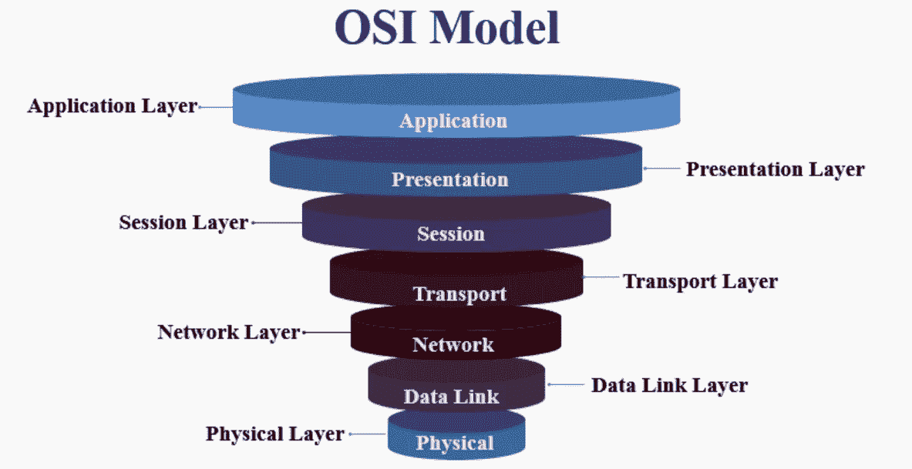

# 主后端工程

> 原文：<https://levelup.gitconnected.com/master-backend-engineering-2b92904ea8ca>

## 权威指南

## 构建后端系统的基本概念

在设计、构建和扩展支持几个旗舰产品的后端系统的漫长旅程中，我从失败中吸取了教训，有时我会想，如果有人告诉我一个值得掌握的概念会怎么样？

在这里，我为一个刚刚开始职业生涯的人写一篇关于概念的非常小的一瞥,通过了解基本原理会有很大的收获。在高层次上了解这些概念是万能的，但只会得到一个，然而了解每个概念的基本原理有助于做出明智的决定和每个概念所涉及的成本。

掌握这些是一步一个脚印的努力，它涉及到许多实验，没有一本书/课程可以教授所有的知识，但我会在最后留下一些链接供额外阅读

# **通信协议**

通信协议允许通信系统的两个或多个实体通过任何种类的物理量变化来传输信息。该协议定义了规则、语法、语义、通信同步以及可能的错误恢复方法。

如果我们看看 OSI 模型中的传输层，它是“网络”层。这里主要使用的协议是 TCP 和 UDP

**TCP:** 这是一种传输协议，用在 IP 之上，确保数据包的可靠传输。TCP 包括解决基于分组的消息传递所产生的问题的机制，例如丢失的分组、乱序的分组、重复的分组和损坏的分组。因为 TCP 是 IP 之上最常用的协议，所以有时也称为 TCP/IP。

UDP: 用户数据报协议(UDP)是一种轻量级的数据传输协议，工作在 IP 之上。UDP 提供了一种机制来检测数据包中的损坏数据，但它并不试图解决数据包中出现的其他问题，如数据包丢失或失序。

虽然 UDP 与 IP 上的其他协议相比简单而快速。它通常用于对时间敏感的应用(如实时视频流)，在这些应用中，速度比准确性更重要。这就是为什么理解这两种协议之间的差异有助于做出正确的选择。这不是关于哪个更好，而是关于你正在构建的应用程序需要什么。

后来将 OSI 模型应用到应用程序中，有几种主要使用的协议，其中 HTTP 协议是流行的，它建立在 TCP 之上，因为我们需要可靠地发送请求和响应。随着 web 的发展，web 和后端层之间的资源调用变得越来越昂贵，一个连接不足以同时发送多个请求。因此，浏览器开始建立越来越多的连接，并且为每个请求建立连接的成本很高，因此，它导致了为流引入 HTTP/2，以便可以在同一连接上发送多个请求。后来，HTTP/2 不得不用 HTTP/3 重写在 UDP 之上，以解决 TCP 的行首问题。

如果您更想了解为什么会有 HTTP/3，并了解它的过去、现在和未来，我推荐一篇来自 Cloudflare 的非常好的文章

在构建 API 时，知道使用任何协议都是有代价的，这一点非常重要，它肯定有助于做出明智的决定。例如，如果应用程序需要实时双向通信(聊天服务器、在线多人游戏)，那么像 WebSockets 这样的协议比其他协议更受欢迎。

最后，对于后端工程师来说，学习通信协议是很重要的，任何协议都值得深入学习。

# **数据库**

这是另一个基本主题，正确的数据建模和选择合适的存储需要很长时间。数据库的核心概念是以持久的方式一致地存储和检索数据。深入研究的第一个重要步骤是理解每个数据库属性是什么。主要有四种性质，简称为酸性质。一个**紧凑、一致、孤立和持久。**

有几种类型的数据库，从了解关系数据库和 NoSQL 数据库开始会有所帮助。了解每个数据库提供什么以及您的应用程序需要什么来选择合适的存储是非常重要的。例如，关系数据库是完全 ACID 的，需要模式，而 MongoDB 是作为基于文档的数据库构建的，具有基本的原子性(文档级)，没有模式。Redis 有一个高性能的缓存，默认牺牲耐久性。

数据库中接下来要学习的是如何使用**索引**，以及如何在表格、文档或图形中组织数据。了解如何实现最佳 I/O 读取。无论一个人在数据库中学到了多少，总会有新的东西，因为这是一个巨大的概念，因此在学习这个主题时，要一步一步来。

# **网络服务器**

Web 服务器非常重要，因为大多数构建的应用程序都是通过 HTTP 中继，经由 web 服务器向公共/私人受众公开的。静态和动态内容都是通过 HTTP 协议提供的。根据您选择的编程语言，有数百种 web 服务器，例如 python 的 Express 或 Django，Java 的 Apache tomcat。

大多数 Web 服务器都支持 HTTP/1.1 和 HTTP/2。HTTP/3 协议。用正确的协议配置 web 服务器同样取决于它要服务的应用程序的类型例如，如果用例期望来自同一个客户机的多个并发请求或者来自许多客户机的较少请求？基于这一点，要么是多路复用 HTTP/2，要么是简单的 HTTP/1.1。

接下来是网络服务器的内部机制，比如单线程和多线程。知道哪一个使用 when 是很好的，因为当应用程序需要一次处理多个请求时，拥有多个线程或进程将有助于应用程序，但是这并不意味着两个请求将被更快地处理。拥有一个进程或线程池对 web 服务器的性能非常有帮助，但是在大多数情况下这并不明显，除非 CPU 有多个内核。

此外，web 服务器可以是 CDN 类型的，其作用类似于缓存，并与原始后端 web 服务器通信以获取内容。API 网关是一个 web 服务器，它验证用户并提供 API 响应。

一些流行的 web 服务器是 Apache Tomcat、Apache httpd 和 NGINX。

# **信息系统**

消息传递有助于通过异步的程序到程序的通信，在网络上从一台计算机向另一台计算机传输数据。消息传递通过分离数据的发送和接收，使应用程序能够连接和扩展。这里有几个重要的概念，比如消息、通道/队列、发送者/生产者、接收者/消费者

> **消息**:计算机之间发送的数据包(消息)
> **通道/队列**:连接程序和传递消息的逻辑路径。
> **发送者/制作者**:通过将消息写入通道来发送消息的程序。
> **接收者/消费者**:通过从通道读取消息来接收消息的程序。

消息传递中有两个重要的概念，

**发送并忘记**发送应用程序将消息发送到消息通道(队列)。一旦该步骤完成，当消息传递系统在后台传输消息时，发送者就忘记了这一点。发送者不必等待消费者接收该消息。

**存储转发**，这里消息传递系统存储消息并传递给接收方。

消息传递系统的核心支持一个称为发布-订阅的特性，其中一个客户端可以发布一条消息，其他客户端可以订阅以使用该内容。如何构建发布和消费的选择取决于消息传递系统。例如，Kafka 使用长轮询模型，而 RabbitMQ 使用推送模型，两者各有利弊。

# **消息格式:标题、有效载荷和页脚**

消息是用于通过网络发送信息的结构。它们因一种协议/技术而异，正如我在上一主题中所描述的，它们也有许多不同的名称(JSON、XML、协议缓冲区),但是消息最重要的不同之处在于它们的内容。

每种协议都使用特殊的格式化方法来确定消息的结构。Web 服务器和浏览器之间的消息不同于连接两个低层以太网设备的消息。基本消息元素包含以下三个基本元素:

> **头**:放在实际数据之前的信息。报头包含控制信息，控制信息用于传达关于消息包含的数据以及如何解释消息的事实。
> **数据**:实际要传输的数据大多数消息都包含某种形式的数据。
> **页脚**:一般包含控制字段。

例如，当客户端向 web 服务器发送消息时，它将消息从语言数据结构序列化为二进制格式，当后端接收到该消息时，它必须将消息从该格式反序列化。例如，javascript 客户端使用 JSON 作为消息格式与 Go 服务器通信，Javascript 的本地 JSON 对象将被转换为 JSON 字节串，Go 后端可以将该字节串反序列化为结构。代表一本字典。了解序列化和反序列化消息格式的相关成本非常重要。

非常好的补充读物:[http://www.tcpipguide.com/contact.htm](http://www.tcpipguide.com/contact.htm)

# **结论**

重要的是不断重读这些基本主题，并理解它们，真正获得该主题的专业知识，并有助于以最简单和最可靠的方式建模复杂系统。

设计/构建应用程序没有唯一正确的方法，关键在于选择一种最适合给定需求的方法，做出成本较低的决策，同时将决策/设计/数据模型…记录在案，这样，如果需要更改系统，您就可以计算出所涉及的工作量以及在此过程中受到影响的系统，以便以最佳方式处理更改。

祝你事业有成。

**补充阅读:**[http://www . tcpip guide . com/free/t _ messageformattingheadersspayloadsandfooters . htm](https://blog.cloudflare.com/http3-the-past-present-and-future/)

【https://www.educba.com/what-is-osi-model/ 