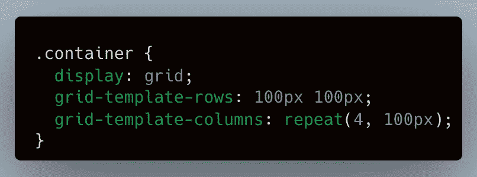
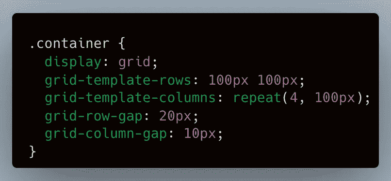
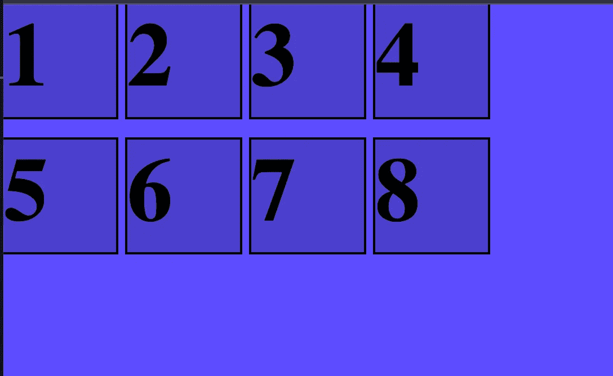
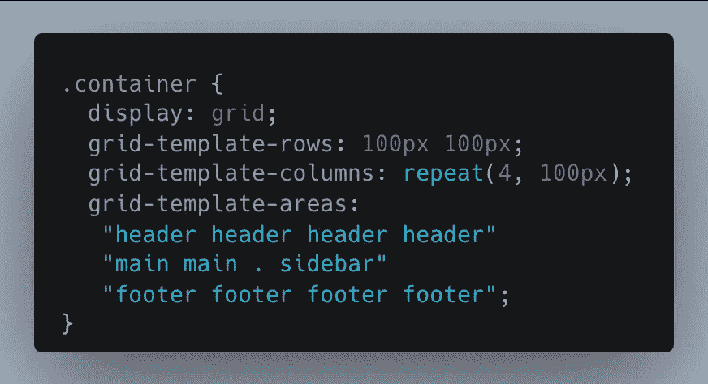
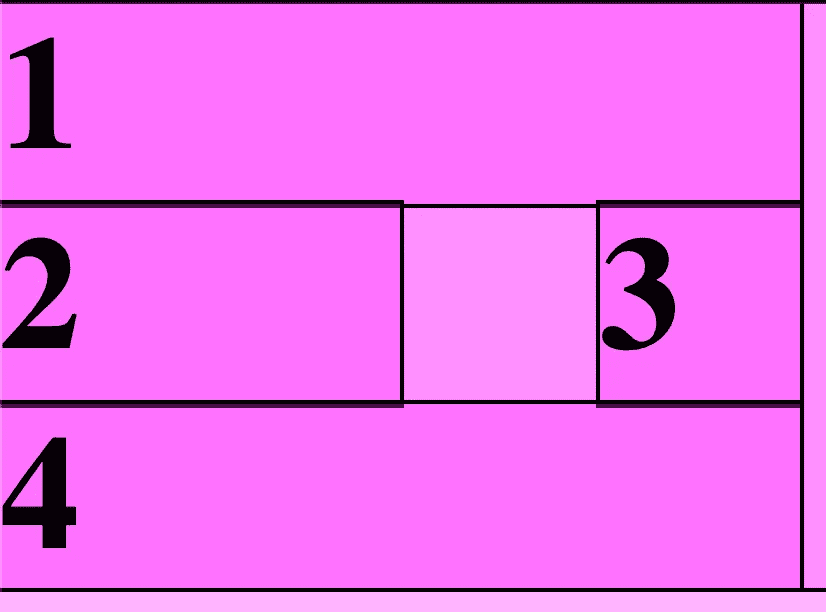
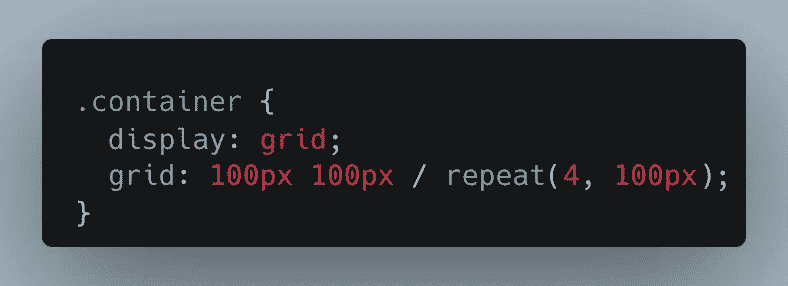
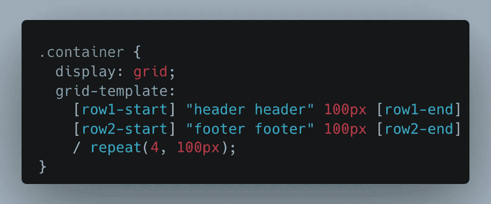
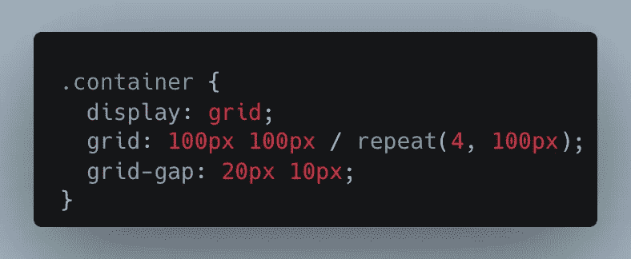
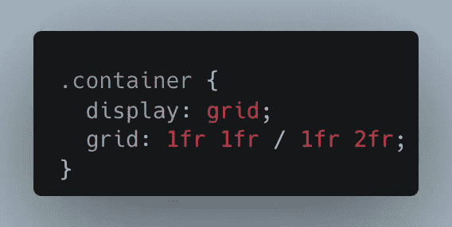

# 主 CSS 网格

> 原文：<https://levelup.gitconnected.com/master-css-grid-f3a9a2a2270f>

在互联网上设计网页已经经历了许多阶段。我们有表格、基本的 div 布局和 Flexbox 但是现在 Grid 可以在任何设备上提供响应性的布局，而不需要你做任何繁重的工作。在本文中，我将为您介绍 CSS Grid 的属性和选择器，让您成为一名大师。

# 概观

CSS Grid 有一些需要熟悉的基本属性或构建块，然后提供了许多不同的方法来使用速记定义相同的样式。我将从基础开始，然后介绍一些速记，然后参考一些在特殊情况下可能会用到的高级特性。

**基本属性**

`display: grid`

要启用网格布局，让您开始的关键属性是设置`display: grid`。确保这个属性出现在包含网格的外部容器中。

`grid-template-rows`

该属性设置默认布局中的行数和高度(基于行)。在上面的例子中，我们有两行，每行都是`100px`高。

`grid-template-columns`

该属性设置默认布局中的列数和列宽(基于行)。在上面的例子中，我们有两列，每列都是`100px`高。

`grid-row-gap`

该属性设置网格中行之间的间隙高度。将这些视为网格行之间的“排水沟”。在上面的例子中，两行之间有`20px`。

`grid-column-gap`

该属性设置网格中各列之间的间隙宽度。也可以把它们想象成网格列之间的“排水沟”。在上面的例子中，我们在两列之间有`10px`。

**备选方案**

`grid-template-areas`

如果你需要一个定制的布局或者更具体的布局你的网格，那么你可以利用`grid-template-areas`给每个网格块一个名字。在单独的 HTML 元素上使用`grid-area`可以在单独的 css 样式中引用这些名称，以允许您可以想象的任何可能性。你可以看到下面的样式，我们有一个横跨页面顶部的页眉，一个横跨页面底部的页脚，然后在主要内容和侧边栏组件之间进行拆分。

**速记**

`grid`

这个属性是`grid-template-rows`和`grid-template-columns`属性的简写，因此您可以在一行中定义它们。注意，首先是行的定义，接着是斜杠，然后是列的定义。

`grid: <rows> / columns;`

`grid-template`

这个属性是`grid-template-rows`和`grid-template-columns`和`grid-template-areas`属性的简写定义。使用`grid-template`您可以首先用名称指定网格模板区域和行，后跟一个斜杠，然后指定列。

`grid-gap`或`gap`

该属性允许您在一行中指定`grid-column-gap`和`grid-row-gap`。注意，首先是行的定义，接着是斜杠，然后是列的定义。

`gap: <rows> / columns;`

**高级属性**

`fr`

该属性被称为“分数单位”，与百分比、像素或其他固定大小和数字在相同的地方使用。`fr`的特别之处在于它会考虑到任何适当的网格间隙，并相应地进行调整。一个`fr`将在一个容器中占据尽可能多的空间，其数量与相对于其他`fr`用途的多少有关。在下面的例子中，我们有两个均匀间隔的行和两列，其中第二列是第一列的两倍。

`grid-auto-flow, grid-auto-columns, grid-auto-rows`

这些属性允许您设置不适合当前网格布局的网格项目的大小和排列。例如，如果您有一个 2x2 的网格，有 2 行和 2 列，但是您添加了另一个元素(可能是动态的)。除非您指定这些属性，否则新元素将占用剩余的空间，这通常不是您想要的。使用这 3 个属性可以让您控制在这些场景中发生的事情，以便您可以适应边缘情况。

# 结论

我希望这个关于网格布局的概述对你非常有帮助，并给你成为网格布局大师的工具。还有一些其他的元素，我没有提到设置网格的整体样式或单个元素的样式，但如果你想做更多的阅读或有一个特定的边缘案例要介绍，这些可以在这里找到。

如果你喜欢这篇文章，考虑[订阅媒体](https://medium.com/@ascourter/membership)！

如果你或你的公司有兴趣找人进行技术面试，那么请在 Twitter ( [@Exosyphon](http://twitter.com/Exosyphon) )上给我发消息，或者访问我的[网站](https://andrewcourter.com/)。如果你喜欢这样的话题，那么你可能也会喜欢我的 Youtube 频道。如果你喜欢 3D 打印的东西，去我的 [Etsy 商店](https://www.etsy.com/listing/1273702925/6-sided-fidget-cube)看看。祝您愉快！

# 分级编码

感谢您成为我们社区的一员！在你离开之前:

*   👏为故事鼓掌，跟着作者走👉
*   📰查看[升级编码出版物](https://levelup.gitconnected.com/?utm_source=pub&utm_medium=post)中的更多内容
*   🔔关注我们:[Twitter](https://twitter.com/gitconnected)|[LinkedIn](https://www.linkedin.com/company/gitconnected)|[时事通讯](https://newsletter.levelup.dev)

🚀👉 [**将像你这样的开发人员安置在顶级初创公司和科技公司**](https://jobs.levelup.dev/talent/welcome?referral=true)