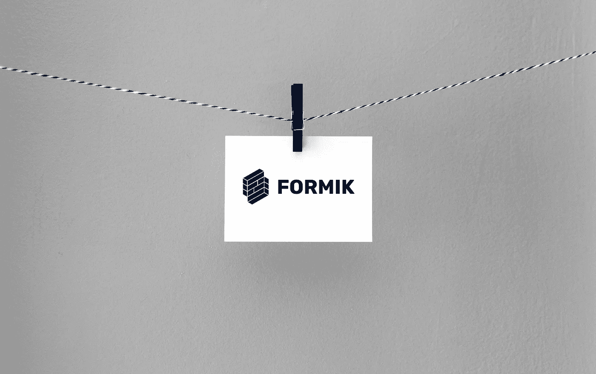
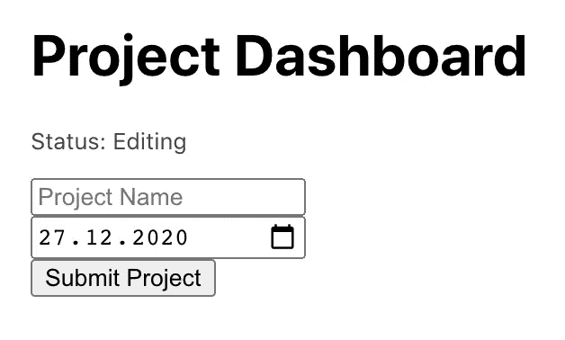
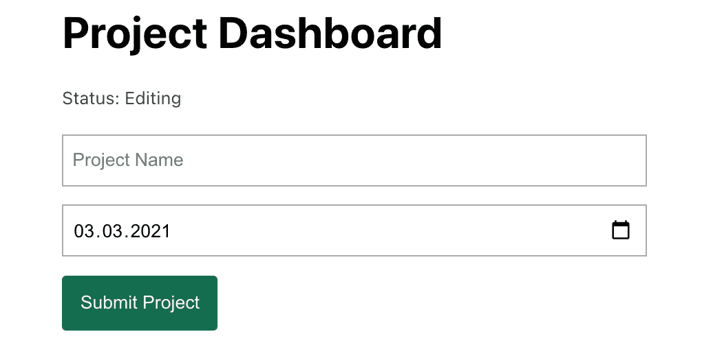
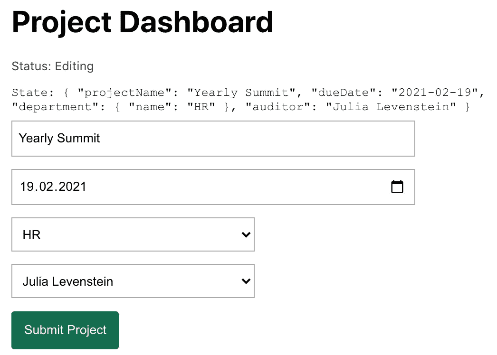
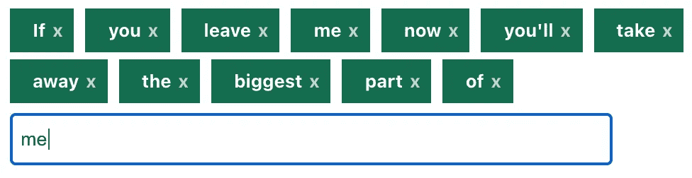

# 使用 Formik 2 和 Typescript 反应中的母版表单

> 原文：<https://levelup.gitconnected.com/master-forms-in-react-with-formik-2-and-typescript-fed3b89f03>

我最近花了很多时间重构一个基于 Formik 的项目。除了升级所有旧的 React 功能，我还享受了 Formik 2 带来的所有好东西。

如果您正在处理表单(大的或小的),并且珍惜自己宝贵的生命时间，我强烈推荐您去看看那个库。

在[凯莉·西克玛](https://unsplash.com/@kellysikkema?utm_source=unsplash&utm_medium=referral&utm_content=creditCopyText)的帮助下 [Unsplash](https://unsplash.com/s/photos/paper?utm_source=unsplash&utm_medium=referral&utm_content=creditCopyText)

# 福米克有什么用？

简而言之，如果您还没有使用过 Formik，它可以帮您完成以下繁琐的任务:

*   与表单组件交互时管理状态
*   嵌套表单
*   提交生命周期
*   错误处理和验证
*   从属字段

两年没有接触过 Formik，我再次意识到它是一个真正令人敬畏的库，可以在 React 中管理表单而不会有通常的头痛。如果你还没有读过 Formik，我强烈建议你[去这里](https://formik.org/docs/overview)看看介绍。

# 那个不太基础的 Formik 类型脚本示例

关于如何设置 Formik 的指南，我建议你查看一下[他们的文档](https://formik.org/docs/overview)。相反，我将直接进入一个更完整的示例，它是完全键入的，并且使用日期字段而不是通常的文本输入:

这是一个更好的“Hello World”示例，它展示了 Formik 如何通过标识表单字段来连接到您的状态。

最重要的是,`onSubmit`函数模拟异步表单提交，您可以看到 Formik 提供的内置支持有多好。这会给我们带来这个漂亮的用户界面:

如果你运行这个例子，你会看到所有的事情都处理得很好，而不需要我们到处写处理程序。到目前为止，一切顺利。

# 如何设置这些字段的样式？

现在这个表单没有太多的设计。当然，您总是可以使用一些全局 CSS 来定位这些字段，但是 Formik 实际上为您提供了一种简单的方法来设置您自己的字段样式。

使用上面的`Field`组件，您实际上可以将一个组件作为道具:

我不是设计师，但这能完成工作:

多满足啊！我们现在有了集中的输入风格，自动的状态处理和一些看起来像真实表单的东西。

# 嵌套的 Formik 表单呢？

我听到了。在现实中，表单很少是作为一个单一的组件构建的，而是随着复杂性的增加而分裂成许多组件。

幸运的是，Formik 也没有让您失望，它提供了三种集成嵌套表单的方法:

*   根据您所在州的形状使用字段命名约定
*   把二传手作为道具传下来
*   我将在下一节讨论这个问题

让我们看看第一个:

简单吧。我们所要做的就是根据我们所在州的属性路径来命名我们的字段，Formik 将自动映射该字段！

如果您希望保持表单组件的自治性或者使用外部库，那么您可能希望查看 Formik 的处理程序:

使用 Formik `props`的`setFieldValue`可以让您轻松干净地处理封装组件。

这就是我们现在的情况:

# useFormikContext 的完全灵活性

您可能会遇到这样的情况，其中一个子窗体变得非常复杂，您需要额外的灵活性。这就是`useFormikContext`发挥作用的地方。

这实际上是从 React 的上下文中获取的整个 Formik 实例。这是一个简单的标签编辑器，它独立存在于我们的表单中，甚至可以用单独的键进行定制:

我们自由的小鸟来了:

显然，你可以走得更远，因为`useFormikContext()`向你开放了所有的生命周期方法和助手。

# 字段数组

我对表单的最后一点看法是:列表。保持表单项目的有序和同步很容易陷入一种“宝贝再见”的境地(看到我做了什么吗？).

我不会在这里发布一个关于字段数组的例子，因为在 Formik 的文档中已经很好地介绍了这个功能。我强烈推荐去看看，它让我的生活变得更轻松。

*大家好，我是弗里德里希！我在工作中是一名经理和开发人员，在家里是一名业余爱好者——厨师、音乐家、数据和语言爱好者。你可以在*[*LinkedIn*](https://bit.ly/3m0DXaT)*上找我。*