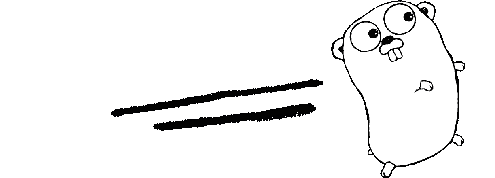

# 带功能的主 Go

> 原文：<https://levelup.gitconnected.com/master-go-with-functions-8bc21c076c07>



蕾妮·弗伦奇([http://reneefrench.blogspot.com](http://reneefrench.blogspot.com))

函数是围棋中的一等公民。他们无处不在。功能可以添加到`struct`类型中。它们可以作为参数在函数内部传递，或者函数甚至可以从另一个函数返回。由于函数在围棋中无处不在，所以为了掌握这门语言，对不同形式的用法有一个更清晰的理解是至关重要的。在本文中，我已经详细介绍了函数的结构及其不同的用例。

**从语法**开始

在任何语言中，函数都由以下实体组成—关键字、函数名、参数列表和返回类型。围棋也有同样的实体——

```
func <func-name>(list of parameters) <comma-separated return types>{
    <body>
    <return stmts>
}
```

下面是一个简单函数的例子，它将两个数相加，并返回相加的值—

上面的函数是这样调用的— `addNumbers(2,3)`。

Go 在向函数传递参数方面有一个有趣的特性。当一组参数的数据类型相同时，可以对它们进行分组，后面跟一个数据类型关键字。例如，上述函数的`first`和`second`参数具有相同的`int`类型。它们可以按以下方式归为一类—

函数也可以是匿名的。这些函数可以从定义点调用，也可以赋给一个变量，以后再用。是的，**函数可以分配给变量**。同样的`addNumbers()`可以这样匿名——

上述声明只能使用一次。我们在声明时传递参数。为了能够重用同一个匿名函数，我们可以将该函数分配给一个变量，如下所示

**高阶函数**

有人可能会怀疑匿名函数的必要性。Go 支持高阶函数 ie。接受其他函数作为参数的函数。匿名函数用于作为参数传递给高阶函数。让我们来看看其中的一个函数。

在上面的例子中，`add`和`multiply`是两个匿名函数，它们接受两个`int`参数并返回相同的`int`类型。`acceptFunctionAndExecute`是一个高阶函数，它接受支持两个`int`参数和类型`int`结果的任何其他函数。我们已经定义了这个高阶函数的行为，将参数`(2,3)`应用于传递的任何函数。一旦我们运行上面的程序，第一个输出将是`5`，第二个将是`6`。

**方法接收者**

这些是附属于`struct`类型的函数。与其他面向对象的语言不同，Go 没有类。最接近类的类型是结构类型。我们可以定义适用于特定结构类型的方法接收器。

除了通常的函数语法之外，方法接收器还具有它们适用的结构类型。考虑下面的例子—

这里，Rectangle 是一个带有两个参数的结构——长度和宽度。要找到矩形的面积，一种可能的方法是创建一个函数，该函数将`Rectangle` struct 作为参数并计算面积。

一种面向对象的方式是在上面的代码片段中编写的`Rectangle`结构上创建一个方法接收器。这样，调用此方法的客户端将无法操作结构中的核心字段。这是面向对象编程中封装的本质。

为了计算矩形的面积，客户端可以如下调用—

**面向包的访问**

许多语言在从一个模块到另一个模块访问实体时都有一组约束。例如，在 Java 中，有预定义的访问说明符——公共的、私有的等等..它们是字段或函数声明的前缀。应用程序中的所有模块都可以访问公共字段。私有字段只能在定义它的类中访问。

在 Go 中，访问限制是通过标识符名称的**大写**实现的。例如，以大写字母开头的函数或变量名在应用程序中随处可见。而以非大写字母开头的变量名只能在定义包中访问。

如果一种编程语言支持函数的各种特性，比如传递函数的参数、将函数赋给变量、从函数调用中返回函数，那么这种编程语言就被称为具有一流的函数。从上面的例子我们看到，Go 支持一级函数。

即使 Go 支持一些面向对象的原则，Go 中真正的强大来自于对函数的掌握。

在这里试试函数的特性—[https://play.golang.org/](https://play.golang.org/)