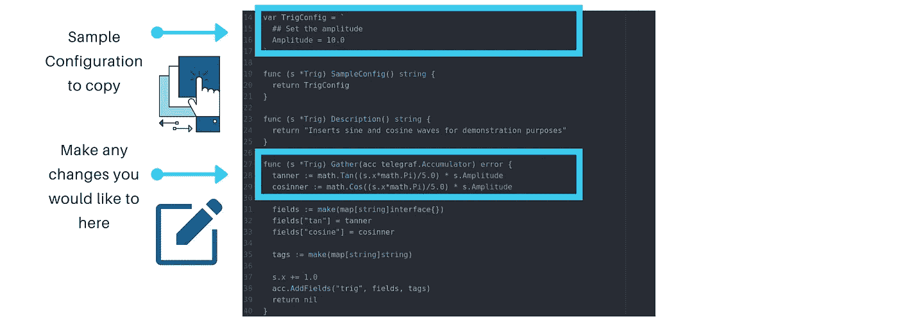
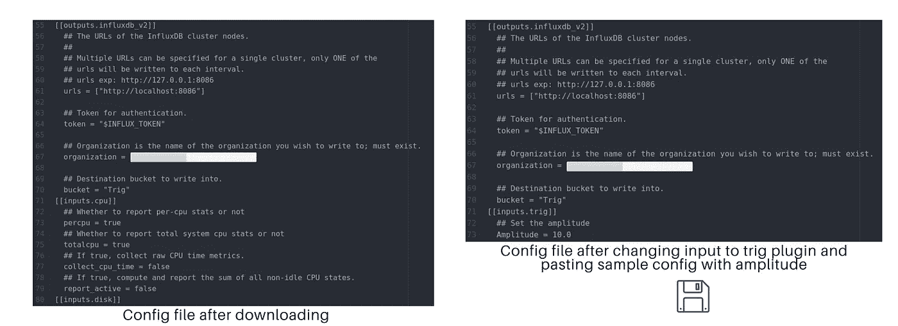
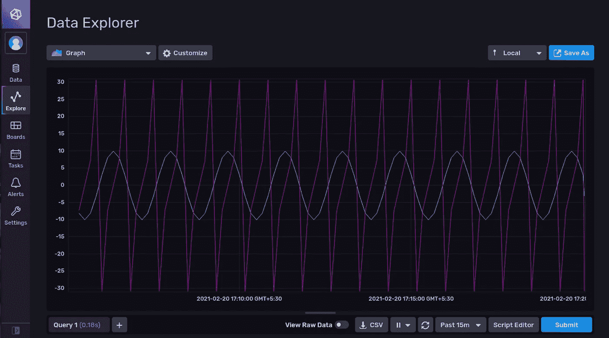

# 主 InfluxDB:设置插件

> 原文：<https://levelup.gitconnected.com/master-influxdb-setting-up-a-plugin-dfb58adcbd15>

如果你还没有读过我介绍时间序列和 InfluxDB 的博客，这里是为了让你更好地了解我们将在本文中讨论的内容:

[](https://fathimamaha25.medium.com/visualising-your-real-life-experiences-with-time-series-data-9641c3f7bfbd) [## 用时间序列数据形象化你的现实生活经历

### 初学者的时间序列

fathimamaha25.medium.com](https://fathimamaha25.medium.com/visualising-your-real-life-experiences-with-time-series-data-9641c3f7bfbd) 

作为初学者，在本文结束时，您将完成在您的系统上设置 Influxdb 的目标，成功运行一个插件来生成三角函数并在 Chronograf 上查看它，就像您在纸上绘制正弦或余弦波与时间的关系一样。


## 安装 InfluxDB:

前往 [influxdb downloads](https://portal.influxdata.com/downloads/) ，选择您的机器并进入您的终端执行命令。我在我的 Ubuntu 20.04 机器上安装了最新版本的 v2.0.4，默认情况下有 Chronograf 和 Telegraf。

```
**$** [https://dl.influxdata.com/influxdb/releases/influxdb2-2.0.4-amd64.deb](https://dl.influxdata.com/influxdb/releases/influxdb2-2.0.4-amd64.deb)
**$** sudo dpkg -i influxdb2-2.0.4-amd64.deb
```

设置完成后，执行此命令检查 Influxd 的状态。如果显示激活，我们就可以开始了！

```
**$** sudo service influxd status
```

在终端上输入这个命令，启动你的流入服务，在你的机器浏览器上进入 http://localhost:8086/

```
**$** influxd
```

如果你需要停止服务，你可以使用这个命令或者用*重启*代替*停止*来完成后者。

```
**$** sudo service influxd stop
```

## 安装 Telegraf:

前往[https://portal.influxdata.com/downloads/](https://portal.influxdata.com/downloads/)，选择你的机器并在你的机器上下载最新版本的 telegraf。

对于 Linux 二进制文件，我执行了:

```
**$** wget https://dl.influxdata.com/telegraf/releases/telegraf-1.17.3_linux_amd64.tar.gz
**$** tar xf telegraf-1.17.3_linux_amd64.tar.gz
```

如果你在这些步骤中遇到任何错误，帮助是无处不在的，我相信这不会花太多时间。

Telegraf 在一个插件系统上工作，我们有输入插件来收集数据，输出插件将数据发送到目的地。Telegraf 就像一个信使，将你送到最终目的地，也就是 InfluxDB。Telegraf 社区已经建立了大约 100 多个插件供我们使用。对这些插件稍加修改，我们就可以在 Influxdb 上查看很多信息。

我们将首先看看如何获得这些插件，然后用三角函数插件绘制一个给定振幅的正切余弦波。

## 获取插件:

在你得到插件之前，确保你已经在你的系统中安装了 Golang 来编写所有的插件。

您只需要在您的 shell 上简单地执行这些命令，您将拥有一个目录，其中包含 telegraf 提供的所有插件:

```
**$** go get github.com/influxdata/telegraf
**$** cd <Path-to-go-directory>/github.com/influxdata/telegraf
**$** make
```

这应该会返回:

```
go mod download
go build -ldflags “ -X main.commit=9814d3d8 -X main.branch=random -X main.goos=linux -X main.goarch=amd64” ./cmd/telegraf
```


好吧！你终于准备好了所有的插件。要列出/查看所有插件，您可以使用 telegraf -h 探索命令。

现在我们已经有了所有的要素，是时候最终即插即用 telegraf 并在 Chronograf 上查看酷炫的可视化效果了。

## 编辑触发器插件:

打开**Go _ directory>guthub.com>influx data>telegraf**中的文件插件，选择 inputs 查看所有输入插件的 Go 文件。打开**trig>trig _ original . go**。如果您想用任何其他函数替换正弦函数，您可以这样做。我会用谭代替辛。



trig_original.go 文件

您还可以看到一个示例配置格式，这是将数据推入流中所必需的。这个插件允许用户改变函数的振幅。现在将示例配置复制到您的剪贴板上。

当您对插件进行任何更改时，要使其生效，您应该执行:

```
**$** cd <Path-to-go-directory>/github.com/influxdata/telegraf
**$** make
```

最后，Chronograf:

打开从第一步开始运行的 influxdb 服务器，通过转到**数据>桶>创建桶，创建一个桶来刷新数据。**

我将把我的命名为“三角”。接下来转到**数据> Telegraf >创建配置。**将配置命名为简单的名称(trig)，确保选择您创建的 bucket 并选择插件“system”进行配置。我们将对其进行编辑，以使用 trig 插件来收集指标。单击完成。

选择您创建的配置旁边的设置说明，并生成令牌。令牌允许您通过插件将数据发送到桶中。转到一个新的 shell，粘贴您使用以下命令创建的令牌:

```
**$** export INFLUX_TOKEN=<TOKEN>
```

您可以点击配置文件并下载它。下载完成后，用文本编辑器打开文件，从 trig 插件中粘贴示例配置，同时删除所有其他输入。要添加任何输入，我们应该指定[[inputs。 <inputname>]，本例中为[[inputs.trig]]。</inputname>



保存文件，现在你可以开始了。打开我们之前导出令牌的 shell，并键入:

```
**$** telegraf --config '<path to config file>/trig.conf' --debug
```

现在，如果没有错误，您就可以让它在您的 shell 上成功运行了。打开 **Chronograf >探索>选择你的桶>点击测量>提交**。



相对于时间振幅值为 10 的正切和余弦波

这就对了。你会在 Chronograf 仪表盘上看到波浪相对于时间的曲线。

希望这篇文章能指导你顺利完成任务。更多关于 TICK Stack 的学习，敬请关注！