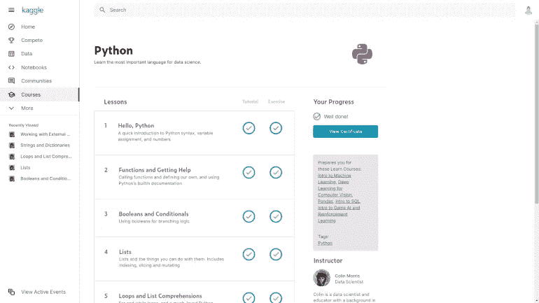
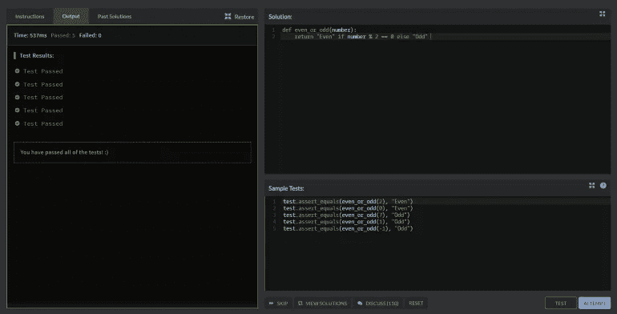
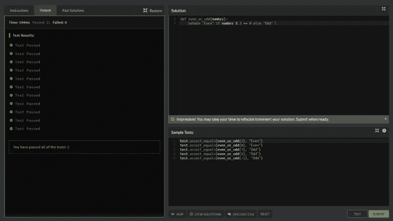
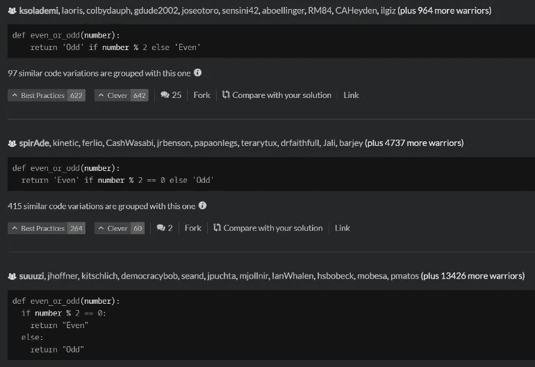
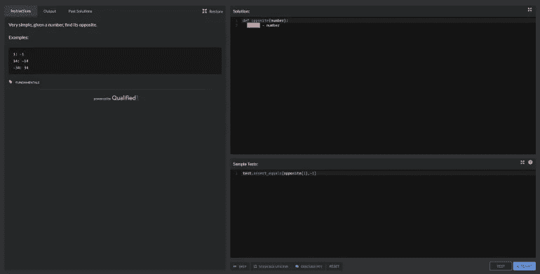
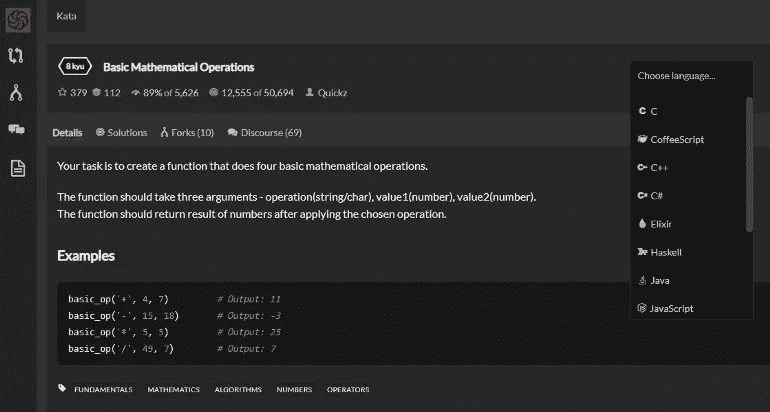

# 如何学习 Python，每天 10 分钟

> 原文：<https://levelup.gitconnected.com/master-python-10-minutes-a-day-5aeab489e227>

## 这是我作为一名数据/人工智能顾问如何跟上时代的方法。

随着围绕数据的炒作，除了 SQL，R 和 Python 也越来越成为抢手的技能。

除了《再转化》的简介之外，我知道很多人都想学习它:开发人员、社区经理，甚至销售人员。

事实上，无论我们现在从事什么工作，我们都被数据所包围。掌握一门“数据”编程语言的基础知识可以为技能和简历带来显著的附加值。

作为一名培训师，我不得不帮助许多人在短时间内精通 Python 语言。他们中的大多数人从来没有编写过代码，甚至没有打开过命令提示符(电影中的“终端”！).

> *如果你对学习 SQL 感兴趣，我做了一篇*[*《SQL 版*](/how-to-learn-sql-10-minutes-a-day-bbe023c01470) *》的文章。*

巨蟒大师，每天 10 分钟(图片由[UX 设计工作室](https://unsplash.com/@weareprocreator?utm_source=medium&utm_medium=referral)提供)

如果你每天花几分钟时间，Python 是很容易学会的！
无论你是一名学生，还是一名再培训生，或者只是想学习一些基础知识，这篇文章都适合你。

## 1.在 2 小时内学习 Python 的基础知识

> 如果你已经对 Python 有了基本的了解，跳到下一章。

首先在[Kaggle.com](https://www.kaggle.com/)上创建一个账号，转到“课程”板块，做完整个 [**Python**](https://www.kaggle.com/learn/python) 模块。

在 Kaggle 上，你可以学习，分享你的工作，甚至可以参加“数据”比赛！🚀

你会知道做数据分析的关键是什么:

*   [语法和变量](https://www.kaggle.com/colinmorris/hello-python)；
*   [功能及如何查找文档](https://www.kaggle.com/colinmorris/functions-and-getting-help)；
*   [布尔和条件](https://www.kaggle.com/colinmorris/booleans-and-conditionals)；
*   [列出了](https://www.kaggle.com/colinmorris/lists)；
*   [循环和列表理解](https://www.kaggle.com/colinmorris/loops-and-list-comprehensions)；
*   [字符串和字典](https://www.kaggle.com/colinmorris/strings-and-dictionaries)；
*   [添加和使用外部库](https://www.kaggle.com/colinmorris/working-with-external-libraries)；

如果你验证了每个系列的练习，你将会收到一张[证书](https://www.kaggle.com/learn/certification/mickaelandrieu/python)，你可以把它放在 LinkedIn 或其他地方。

## 如何在 Python 中进步并保持最新？

作为一名培训师和顾问，我必须了解许多最新的技术/技能/生态系统:

*   PHP/Symfony/Node.js
*   [网页质量](https://checklists.opquast.com/)，网页标准
*   HTML/CSS/JS(引导程序，Vue)
*   系统和服务器管理(Bash、Apache、安全概念)
*   用于测试、性能、监控、静态代码分析的工具
*   数据收集、操作和处理工具(Excel、Google Sheets)
*   专业数据可视化和处理工具(Tableau、Data Studio、Power BI)
*   Python 数据操作库(Matplotlib，Numpy，Pandas，Plotly)
*   机器学习(分类、回归、NLP 基础)

> 2021 年和 2022 年，我对学生或专业人士进行了这些技术的培训。

> 但是一个正常构成的人不可能保持在所有这些技术的顶端🤨；你是个骗子！

## 如何快速学习，如何不遗忘？

人类的大脑是非凡的；它只需要有规律地重新激活小的记忆，就可以将大量的知识“记忆”起来。

如果相反，当你不刷新你的知识时，你的大脑会消除它认为无用的东西。

最有效的方法是以解谜的形式定期进行小规模训练(以保持动力并创造记忆):你必须做[形](https://en.wikipedia.org/wiki/Kata#Outside_martial_arts)！

## 我的 Python 中的形列表

做这些小练习，不需要电脑上安装 Python 你只需要一个互联网连接和一个免费的 Codewars.com 平台账户。

一旦你注册了，并且选择了 Python，平台会向你推荐初级的第一个形。经常会出现类似“编写 Python 函数 even_or_odd(number)，如果数字是偶数，则回答 **True** ，如果是奇数，则回答 **False** ”的情况。

然后你可以通过点击“测试”来尝试一个小系列的测试:

一旦代码看起来正确，点击“测试”。

如果所有的验证测试都通过了，那么我们可以通过点击“尝试”，然后“提交”向社区提交我们的解决方案，并获得一些荣誉(和级别)。

> “测试”和“尝试”之间的区别在于，“尝试”将使您的代码通过一组更具挑战性的有效性测试。

提交您的解决方案或单击“查看解决方案”按钮，以访问社区提出的所有有效解决方案:

通过阅读别人设计的代码和评论，你会学到很多东西！

一旦你在网站上注册，以下是按类别分类的要做的动作列表:

*   [Python 基础](https://www.codewars.com/collections/python-fundamentals-10)(初学者)；
*   [用 Python 进行数据统计](https://www.codewars.com/collections/data-and-statistics-in-python)；
*   [用 Python 进行数学运算](https://www.codewars.com/collections/mathematical-operations-in-python)；
*   [用 Python 进行大脑训练](https://www.codewars.com/collections/improve-your-logic-skills-with-python)(适合技术面试！) ;

一个 Kata 包含一个主题、一个编写 Python 代码的编辑器和要验证的测试条件！

## 提高技能的完美时间表

下面是一个有效的时间表的例子，我和我的学生在短期培训(3 到 5 个月的强化培训)中验证了这个例子:

**第 1 个月**:周一至周六每天 1 " *基础*"形

**月 2**:2*基础*周一至周四每天的形(在[中尝试&重复](https://www.sneci.com/blog/the-kata-method-improvement-adaptation-for-better-results/)“模式)+1*肌肉你的大脑*或*数学运算*一周内要做的形

**第 3 个月** : 2 统计数据和特定数据的形式(仅当您也需要在这些方面进行改进时)

> 如果你已经精通另一种编程语言，而且乍一看用 Python 实现很困难，要知道 Codewars 上的 Kata 通常可以在几种编程语言中使用。

形的编程语言选择器

你可以先用你喜欢的语言做形，然后用 Python，比较结果:这种方法将帮助你理解编程语言之间在基本概念(数组、函数、变量等)上的差异。).

> 对于纯逻辑练习用处不大。

如果你对这个训练时间表有任何问题，或者其他关于如何快速接受训练的建议，请随时在评论中与我分享，或者[关注我](https://medium.com/@mickael-andrieu/)，我会在发布新文章时通知你！

 [## 通过我的推荐链接加入 Medium-mickal Andrieu

### 作为一个媒体会员，你的会员费的一部分会给你阅读的作家，你可以完全接触到每一个故事…

mickael-andrieu.medium.com](https://mickael-andrieu.medium.com/membership)