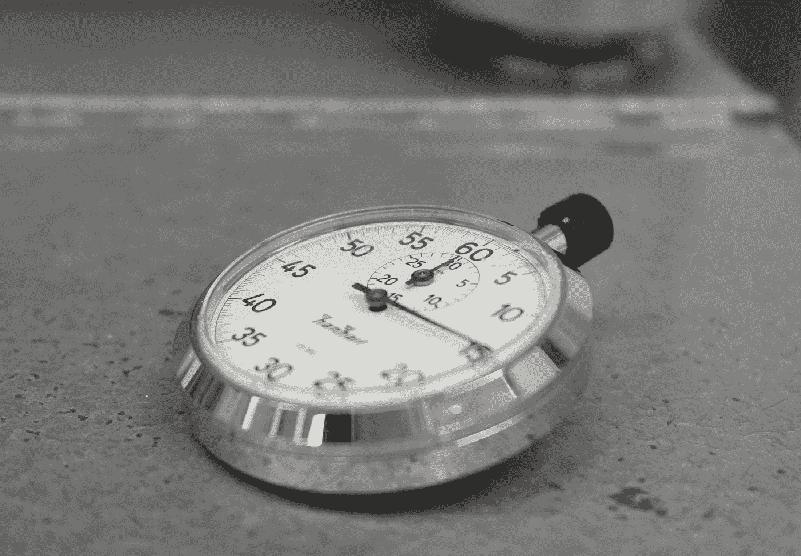

# RxJs 大师:为你的可观察流计时

> 原文：<https://levelup.gitconnected.com/master-rxjs-timing-your-pipes-5d018e0e54dd>

琳达·佩雷斯·约翰森在 [Unsplash](https://unsplash.com?utm_source=medium&utm_medium=referral) 上拍摄的照片

因此，您已经创建了一组具有有限生命周期的可观察流，并且您希望输出它们在完成之前的活动时间。这对于测试和演示管道功能都很有用。当然，你可以用水龙头编辑你的管道，把时间储存在外部变量中。，**但是我们想用聪明的 RxJs 管道优雅地解决这个问题。**那么我们如何做到这一点呢？

今天，我将向您展示一个可用于此目的的自定义操作符。使用它时，我们创建一个新的流，它通过管道传输一个源流，并在完成时发出源管道处于活动状态的持续时间(从您添加订阅时开始)。像往常一样，让我们先看代码，然后再看解释:

用于确定管道处于活动状态的总时间的 pipeTimer

它的工作原理其实很简单。首先，因为我们关心的只是可观测的流活跃了多长时间，所以我们根本不想输出源的排放。我们使用`ignoreElements`来完全过滤掉这些排放。

> 注意，我们也使用`Observable<any>`作为`UnaryFunction`类型声明中的输入。这通常是不鼓励的，但是由于我们根本不关心可观测源的发射类型，这是少数几个`Observable<any>`完全适合**的情况之一。**

其次，我们希望在初始化时创建一个时间戳。我们使用`startWith(Date.now())`来创建这个时间戳。`startWith`将在流初始化时执行，并将创建第一个发射，无论其参数是什么。换句话说，我们立即发出当前时间戳，因为我们的参数是`Date.now()`。

此外，在源代码完成之前，我们并不真正关心输出什么。`last`存储前一次发射，直到源可观测完成，然后发射该值。在这种情况下，**将永远只存在一个发射；从** `**startWith()**` **发出的时间戳。因此，我们存储初始时间戳，直到源可观察对象完成，然后让它通过。**

最后，我们使用`map`比较完成时的时间戳和初始时间戳，我们输出时间差。由于这些是 Javascript 时间戳，时间差将以毫秒为单位。

通过仅组合四个操作符，我们创建了一个自定义操作符，可用于确定源可观察流处于活动状态的时间。我们以下列方式使用它:

`pipeTimer`的用法示例

**注意，这个操作符当然只会对实际上完成的可观察流起作用，**所以在你试图得到一个无限持续的可观察流的持续时间的情况下要注意这一点。除此之外，这是所有你需要的时间流！

简单而简短；这描述了我们的解决方案和本文。希望它能对你的管道工程有所帮助，并一如既往地指引你走向成功！